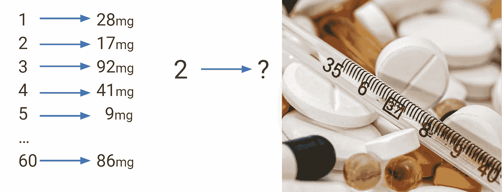
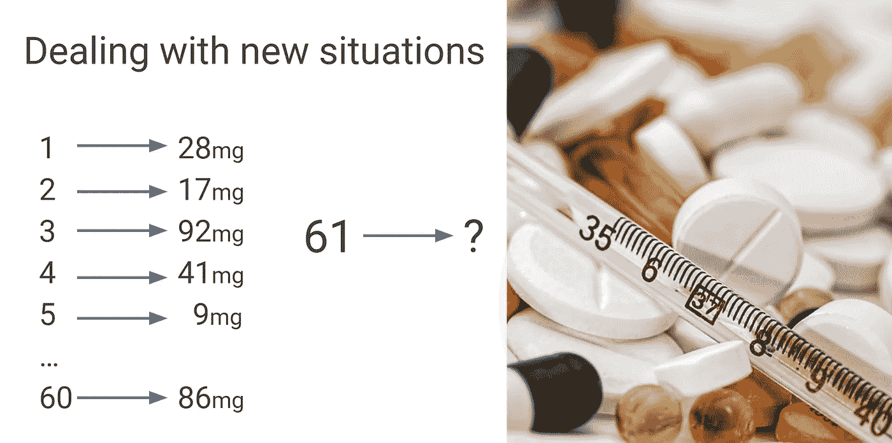

# 何时不使用机器学习或人工智能

> 原文：<https://towardsdatascience.com/when-not-to-use-machine-learning-or-ai-8185650f6a29?source=collection_archive---------8----------------------->

## 一厢情愿、不稳定和寻找模式的冒险

想象一下，你刚刚设法从临床试验中得到一个数据集。激动人心！为了帮助你进入角色，我编了一些数据给你看:


假设这些[数据点](http://bit.ly/quaesita_hist)绘制出了**治疗日** ( [*输入"特征*](http://bit.ly/quaesita_slkid) *"* )和某个奇迹治愈的**正确剂量**(以毫克为单位)( [*输出"预测*](http://bit.ly/quaesita_slkid) *"* )之间的关系，患者应该在 60 天的疗程中接受该剂量。

```
#The data:
(1,28)  (2,17)  (3,92)  (4,41)  (5,9)   (6,87)  (7,54) (8,3)   (9,78)  (10,67) (11,1)  (12,67) (13,78) (14,3) (15,55) (16,86) (17,8)  (18,42) (19,92) (20,17) (21,29) (22,94) (23,28) (24,18) (25,93) (26,40) (27,9)  (28,87) (29,53) (30,3)  (31,79) (32,66) (33,1)  (34,68) (35,77) (36,3)  (37,56) (38,86) (39,8)  (40,43) (41,92) (42,16) (43,30) (44,94) (45,27) (46,19) (47,93) (48,39) (49,10) (50,88) (51,53) (52,4)  (53,80) (54,65) (55,1)  (56,69) (57,77) (58,3)  (59,57) (60,86) ...
```

现在想象你正在治疗一个病人，这是第二天。你建议我们用多少剂量？



我真的希望你回答了*【17 毫克】*，因为这绝对不是一个骗人的问题。第四天怎么样？ *41mg* ？没错。

现在，你如何构建软件来输出第 1-5 天的正确剂量？你会尝试用[机器学习](http://bit.ly/quaesita_simplest) (ML)吗？换句话说，你会尝试在这些数据中找到模式，并尝试将它们转化为从输入到输出的配方( [*【模型】*](http://bit.ly/quaesita_slkid) )。

如果你更喜欢视频版本，我来给你讲这个例子。

不，你当然不会！你可以让你的软件做你正在做的事情:在表格中查找答案。这样，你将在 60 天内 100%的时间里得到正确的答案。这里不需要模式，也不需要机器学习。

那么，什么样的情况需要机器学习呢？



现在呢？今天是第 61 天。这里的正确答案是什么？

嗯，我们从来没有见过第 61 天的数据，所以我们没有办法在这里找到答案。我们能做什么？我们运气不好吗？机器学习能帮助我们吗？

那得看情况。

如果没有连接输入和输出的模式，那就算了。在这种情况下，没有什么可以帮助我们…除了实际的[魔法](http://bit.ly/quaesita_first)，它并不存在(以防你认为机器学习就是它)。现在放弃吧！

## 我们必须找到一个有用的模式

但是如果有*就是*一个模式而*如果*(那就是一个大如果！)我们可以找到它，然后我们可以尝试将它应用到第 61 天，尝试预测/猜测正确的答案。也许机器学习可以帮助我们。

## 模式必须一般化

问题是在我们的数据中仅仅有一个模式是不够的。那就太方便了。该模式还必须与 60 天后的情况相关。如果第 61 天的条件完全不同，那么模式就不能概括 T1 了，那该怎么办？据你所知，也许在第 61 天，所有的病人都完全治愈或死亡，或服用不相容的药物。那么这个模式对你没有好处。

## 不稳定的宇宙

让它深入人心。如果你的数据不是了解未来世界的有用窗口——也许是因为疫情改变了所有的规则——那么你昨天的信息有多好也没用。如果你生活在宇宙中一个不稳定的角落，你将很难证明我们所说的[](https://en.wikipedia.org/wiki/Ergodicity)**和* [*平稳性* *假设*](https://bit.ly/stationaritya) *。*这些大致可以翻译成*“我相信规则没有改变。”**

*我说的不是旁观者眼中的那种不稳定(就像当平均价格因为你忘了调整通货膨胀而随时间漂移)。处理轻微的非平稳性(当规则是时间的可预测函数时)是*时间序列分析*的全部内容。*

*我说的是那种你无能为力的剧烈的不稳定性，因为你的系统规则从根本上是不同的，你无法预测从一个时期到下一个时期。如果你过去的数据突然完全不适用于你的*不稳定的*未来，你就不能面无表情地用昨天来预测明天。*

**

*图片:[来源](https://pixabay.com/photos/fire-explosion-danger-hot-flame-1030751/)*

## *也许你很幸运*

*但是如果*是*一种模式*并且*如果这种模式与我们发现自己所处的新情况相关，那么我们就成功了。我们可以去找到旧数据中的模式，根据它制定一个食谱，然后使用这个食谱在第 61 天甚至更长的时间里取得成功！*

> *发现模式并使用它们是机器学习的全部内容。*

## *何时使用机器学习*

*在[应用](http://bit.ly/quaesita_fail)机器学习(和[人工智能](http://bit.ly/quaesita_ai))中，你不需要背诵你以前看过的记忆例子——你不需要 ML 来做这个，只需要查找它们！—你是来学习的。*

> *只是重复老答案？ML 可以做的更好！它在新的例子上成功了。*

*你的任务？构建一个[成功推广的解决方案](http://bit.ly/quaesita_sydd)(或者终止你的项目)。*(“成功”是什么意思？我有一篇* [*全篇为你指导*](http://bit.ly/quaesita_dmguide) *关于那个话题。)**

**

*不是猫。[来源](https://pixabay.com/photos/ara-yellow-macaw-parrot-bird-100880/)*

*换句话说，如果您的解决方案不能处理从未见过的**新**示例，那么它就没有用。不是打破静止宇宙所有规则的引人注目的新例子，而是对已知主题的轻微扭曲。*

> *我们不是来像鹦鹉一样死记硬背的。我们是来概括新情况的。这就是机器学习的力量和魅力。*

*如果你之前(第 61 天)没看过这个 ***确切的*** 输入值组合，那么正确的输出答案是什么？好吧，也许我们可以把旧模式变成一个能做出合理猜测的食谱。*

*例如，如果你从成千上万张动物照片中训练了一个[猫/非猫](http://bit.ly/quaesita_tiger)分类器，你可以让它告诉你一张全新的照片中是否有猫，但你不应该让它告诉你一幅画是否是立体派风格的。*

## *机器学习适合你吗？*

*如果你厌倦了听我称它为[事物标签](http://bit.ly/quaesita_simplest)和[编写代码的替代方法](http://bit.ly/quaesita_ethics)，让我试着换一种说法。*

> *机器学习是一种使重复决策自动化的方法，包括从算法上寻找数据中的模式，并使用这些模式来制定正确处理全新数据的方法。*

*为了知道机器学习是否适合你，我有三个指南你可能会喜欢:*

*   *[**你的 ML/AI 项目没戏吗？**](http://bit.ly/quaesita_realitycheck)22 项现实检查(列表)*
*   *[**寻找 ML/AI 用例的建议**](http://bit.ly/quaesita_island)*
*   *[**ML/AI 入门？从这里开始！**](http://bit.ly/quaesita_dmguide)*

## *那么，有什么有用的模式吗？*

*还在好奇第 61 天？原来在我为这个例子制作的玩具数据中有一个模式。我知道这个，因为是我放在那里的。我甚至可以向你保证，它概括了你能想到的最大数量的一天，因为在这个极度不稳定的时代，我发现用数据工作是一种奢侈的安慰。*

```
*#The data:
(1,28)  (2,17)  (3,92)  (4,41)  (5,9)   (6,87)  (7,54) (8,3)   (9,78)  (10,67) (11,1)  (12,67) (13,78) (14,3) (15,55) (16,86) (17,8)  (18,42) (19,92) (20,17) (21,29) (22,94) (23,28) (24,18) (25,93) (26,40) (27,9)  (28,87) (29,53) (30,3)  (31,79) (32,66) (33,1)  (34,68) (35,77) (36,3)  (37,56) (38,86) (39,8)  (40,43) (41,92) (42,16) (43,30) (44,94) (45,27) (46,19) (47,93) (48,39) (49,10) (50,88) (51,53) (52,4)  (53,80) (54,65) (55,1)  (56,69) (57,77) (58,3)  (59,57) (60,86) ...*
```

*对于那些喜欢挑战的人来说，为什么不试试看你最喜欢的机器学习[算法](http://bit.ly/quaesita_emperor)能否找到模式，并将其转化为有用的食谱？(回答在本页底部。)*

*我还怀疑可能会有更多的人通过分析方法而不是使用机器学习来获得它(参见[这个](http://bit.ly/quaesita_history2)来了解区别，加上我刚刚给你的线索)，但 GLHF 除外。愿最佳方案胜出！*

*如果你热衷于尝试 ML，不要忘记按照正确的顺序做事——这里有一个逐步的指南来帮助你。*

# *感谢阅读！*

*如果你渴望阅读更多我的作品，这篇文章中的大部分链接会带你去我的其他思考。你也可以在这里[享受音频版本](http://bit.ly/quaesita_dipod)和我的统计视频播放列表[在这里](http://bit.ly/statthinking)。*

# *脚注*

*如果你想知道第 61 天的答案，试着运行我用来生成数据的 R 函数(你可以粘贴它并在线运行[这里](http://bit.ly/tryRui))。*

```
*# Here's the R code I used to generate the data:
doseFun <- Vectorize(function(x) {r <- round(93 * cos(x) ^ 2 + sqrt(exp(x/100))); return(r)})# Output the result for day 61:
print(doseFun(61))# Plot the deterministic function:
plot(x = 1:60, y = doseFun(1:60))*
```

*因为我的函数被证明是确定性的，你可以通过[分析](http://bit.ly/quaesita_hero)(绘制图表并目测它以注意重复的模式)得到正确的答案，这里你并不真正需要机器学习，尽管它可以工作。这不是最有效的做事方式。*

*关于确定性设置中的简单机器学习方法的示例，请参见下面我的视频:*

# *警告！*

*我希望我让你接触那个玩具数据集没有弊大于利。危险在于你养成了一个非常坏的习惯:没有正确地分割你的数据和测试你的系统 T21。*

*你们当中那些在提交解决方案之前拆分数据并验证解决方案的人应该得到额外的表扬。你的谨慎会对你有好处的！*

*那些在整个数据集上绘图/训练的人可能已经逃脱了… *这次*。你没有被这个卡通化的例子迷惑的唯一原因是，真正的潜在模型是一个简单的模式，可以很容易地从数据中提取出来。这些在实践中很少见，因为你的同事可能在几十年前就发现了所有这些唾手可得的果实。如果你像对待这个玩具一样对待真实世界的数据，你会受到伤害。你可以在我的文章 [*如何成为一个人工智能白痴*](http://bit.ly/quaesita_idiot) 中找到更多信息。*

# *感谢阅读！人工智能课程怎么样？*

*如果你在这里玩得开心，并且你正在寻找一个为初学者和专家设计的有趣的应用人工智能课程，这里有一个我为你制作的娱乐课程:*

*在这里欣赏整个课程播放列表:[bit.ly/machinefriend](http://bit.ly/machinefriend)*

# *与凯西·科兹尔科夫联系*

*让我们做朋友吧！你可以在 [Twitter](https://twitter.com/quaesita) 、 [YouTube](https://www.youtube.com/channel/UCbOX--VOebPe-MMRkatFRxw) 、 [Substack](http://decision.substack.com) 和 [LinkedIn](https://www.linkedin.com/in/kozyrkov/) 上找到我。有兴趣让我在你的活动上发言吗？使用[表格](http://bit.ly/makecassietalk)取得联系。*