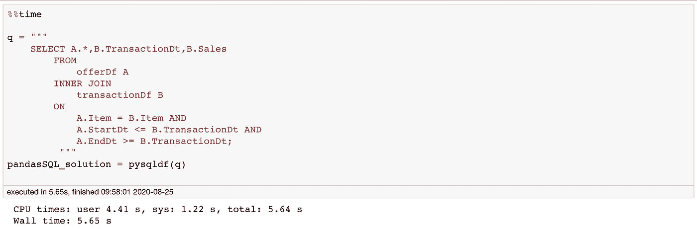

# 当熊猫还不够

> 原文：<https://towardsdatascience.com/when-pandas-is-not-enough-use-pandasql-d762b9b84b38?source=collection_archive---------17----------------------->


照片由[库纳尔·卡拉](https://unsplash.com/@kunal_au?utm_source=medium&utm_medium=referral)在 [Unsplash](https://unsplash.com?utm_source=medium&utm_medium=referral) 上拍摄

## [蟒蛇短裤](https://towardsdatascience.com/tagged/python-shorts)

## 非对等加入熊猫和 PandaSQL

Pandas 是最近最好的数据操作库之一。它可以让你切片和切块，分组，连接和做任何任意的数据转换。你可以看看这篇[文章](/minimal-pandas-subset-for-data-scientists-6355059629ae)，它讲述了如何使用 Pandas 以一种简单明了的方式处理大多数数据操作。

但是即使熊猫一般来说有多棒，有时候你还是想再多要一点。假设您来自一个 SQL 背景，其中相同的操作太容易了。或者你想有更多可读的代码。或者您只想对您的数据框运行特殊的 SQL 查询。或者，也许你来自 R，想要一个`sqldf.`的替代品

例如，Pandas 没有替代方法的操作之一是非等价连接，这在 SQL 中非常琐碎。

在这一系列名为 [**Python Shorts**](https://towardsdatascience.com/tagged/python-shorts) 的帖子中，我将解释 Python 提供的一些简单但非常有用的构造，一些基本的技巧，以及我在数据科学工作中经常遇到的一些用例。

***这篇文章本质上是关于对熊猫数据框架使用 SQL。***

# 但是，什么是非等价连接，我为什么需要它们？

假设您必须连接两个数据框。一个向我们展示了我们对某些商品进行促销的时期。第二个是我们的交易数据框架。我想知道由促销推动的销售额，即在促销期间某一商品的销售额。

我们可以通过在`item`列上做一个连接以及一个连接条件(`TransactionDt≥StartDt`和`TransactionDt≤EndDt`)来做到这一点。由于现在我们的连接条件也有大于号和小于号，这样的连接称为非等价连接。在继续前进之前，一定要想好你将如何在熊猫身上做这样的事情。


# 熊猫解决方案

那么在熊猫身上你会怎么做呢？是的，基于熊猫的解决方案是存在的，尽管我觉得它不够易读。

让我们从生成一些随机数据开始。

```
offerDf,transactionDf = generate_data(n=100000)
```

不需要担心上面的随机数据生成代码。只要知道我们的随机数据是什么样的:


一旦有了数据，我们就可以通过合并列`item`上的数据，然后根据所需的条件进行过滤，来进行非等价连接。

```
merged_df = pd.merge(offerDf,transactionDf,on='Item')pandas_solution = merged_df[(merged_df['TransactionDt']>=merged_df['StartDt']) & 
          (merged_df['TransactionDt']<=merged_df['EndDt'])]
```

正如我们所希望的，结果如下:


# PandaSQL 解决方案

Pandas 解决方案很好，它做了我们想要的事情，但是我们也可以使用 PandaSQL 以一种可读性更好的方式来完成同样的事情。

什么是 [PandaSQL](https://github.com/yhat/pandasql) ？

PandaSQL 为我们提供了一种在 Pandas 数据帧上写 SQL 的方法。因此，如果您已经编写了一些 SQL 查询，使用 pandaSQL 可能比将它们转换成 pandas 语法更有意义。要开始使用 PandaSQL，我们只需简单地安装它:

```
pip install -U pandasql
```

一旦我们安装了 pandaSQL，我们就可以通过创建一个`pysqldf`函数来使用它，该函数将一个查询作为输入，并运行该查询来返回一个 Pandas DF。不要担心语法；它大致保持不变。

```
from pandasql import sqldf
pysqldf = lambda q: sqldf(q, globals())
```

我们现在可以使用这个函数在我们的 Pandas 数据框上运行任何 SQL 查询。下面是非等价连接，我们希望以可读性更好的 SQL 格式进行。

```
q = """
    SELECT A.*,B.TransactionDt,B.Sales
        FROM
            offerDf A
        INNER JOIN
            transactionDf B
        ON 
            A.Item = B.Item AND
            A.StartDt <= B.TransactionDt AND
            A.EndDt >= B.TransactionDt;
    """
pandaSQL_solution = pysqldf(q)
```

结果是我们预期的熊猫数据帧。与以前不同，索引已经为我们重置。


# 警告:

虽然 PandaSQL 函数允许我们在 pandas 数据框上运行 SQL 查询，并且在某些情况下是一个很好的工具，但它的性能不如纯 Pandas 语法。



当我们用可读性更好的 PandaSQL 对熊猫计时时，我们发现 PandaSQL 花费的时间大约是本地熊猫的 10 倍。

# 结论

在 [Python Shorts](https://towardsdatascience.com/tagged/python-shorts) 系列的这篇文章中，我们了解了 pandaSQL，它允许我们在数据帧上使用 SQL 查询。我们还研究了如何使用本地 pandas 和 pandaSQL 进行非对等连接。

虽然 PandaSQL 库的性能不如 native pandas，但当我们想要进行特别分析时，它是我们数据分析工具箱的一个很好的补充，对于那些更喜欢使用 SQL 查询的人来说也是如此。

为了更仔细地查看这篇文章的代码，请访问我的 [GitHub](https://github.com/MLWhiz/data_science_blogs/tree/master/pandasql) 库，在那里你可以找到这篇文章的代码以及我所有的文章。

## 继续学习

如果你想了解更多关于 Python 3 的知识，我想从密歇根大学调出一门关于学习[中级 Python](https://bit.ly/2XshreA) 的优秀课程。一定要去看看。

将来我也会写更多初学者友好的帖子。在[](https://medium.com/@rahul_agarwal)**关注我或者订阅我的 [**博客**](http://eepurl.com/dbQnuX) 了解他们。一如既往，我欢迎反馈和建设性的批评，可以通过 Twitter [@mlwhiz](https://twitter.com/MLWhiz) 联系。**

**此外，一个小小的免责声明——这篇文章中可能会有一些相关资源的附属链接，因为分享知识从来都不是一个坏主意。**