# 当量子场遇到引力:Unruh 效应

> 原文：<https://towardsdatascience.com/when-quantum-fields-meet-gravity-the-unruh-effect-69d03783d6bb?source=collection_archive---------13----------------------->

## 加速度和温度之间的关系

图片由 [PIRO4D](https://pixabay.com/fr/users/PIRO4D-2707530/?utm_source=link-attribution&utm_medium=referral&utm_campaign=image&utm_content=1946806) 来自 [Pixabay](https://pixabay.com/fr/?utm_source=link-attribution&utm_medium=referral&utm_campaign=image&utm_content=1946806)

根据物理学家 [Stephen Fulling](https://en.wikipedia.org/wiki/Stephen_A._Fulling) 、 [Paul Davies](https://en.wikipedia.org/wiki/Paul_Davies) 和 [W. G. Unruh](https://en.wikipedia.org/wiki/W._G._Unruh) 描述的 [Unruh 效应](https://en.wikipedia.org/wiki/Unruh_effect)，对于一个加速的观察者来说，真空看起来是有温度的。换句话说，如果一个观察者在一个加速的参照系中，他会探测到粒子，而在一个非加速的参照系中，他不会。

本文将密切关注 Mukhanov 和 Winitzki 的著作。

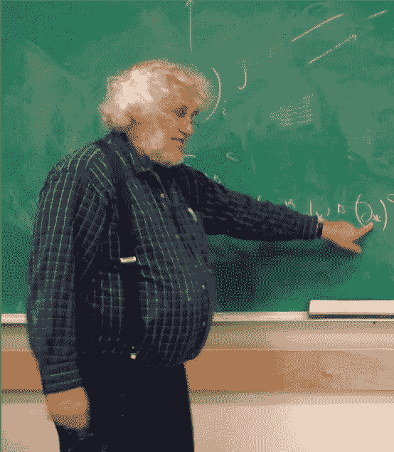

图 1 **:** 加拿大物理学家 W. G. Unruh，Unruh 效应的共同发现者([来源](https://en.wikipedia.org/wiki/W._G._Unruh))。

# 匀速运动

让我们考虑一个观察者，比如宇宙飞船里的宇航员，在闵可夫斯基时空中以恒定加速度运动。[度规张量](https://en.wikipedia.org/wiki/Metric_tensor_(general_relativity))***η****在二维中的对应矩阵表示为:*

*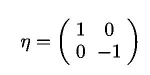*

*方程 1:闵可夫斯基时空的度规张量 ***η*** *的矩阵表示。**

*对应的[线元素](https://en.wikipedia.org/wiki/Line_element)为:*

*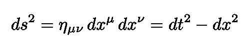*

*方程 2:二维的闵可夫斯基线元素。*

*使用适当的时间 *τ* 对观察者的运动进行参数化，我们获得以下两个条件(第二个通过对第一个进行微分获得):*

*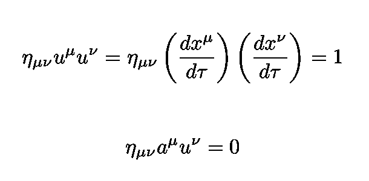*

*等式 3:根据第一个条件(顶部)，2-速度被归一化。第二个条件(底部)是通过对第一个条件进行微分得到的，它表明 2-加速度和速度是正交的。*

## *加速观察者的视界*

*一个加速的观察者(受到一个恒定的力)以双曲线运动(马上就要展示)。如下图所示，如果有足够的领先优势，加速的观察者可以跑得比光线更快。因此，他有一个以地平线为界的隐藏区域。这和黑洞类似，也有一个看不见的区域，以边界为视界。*

*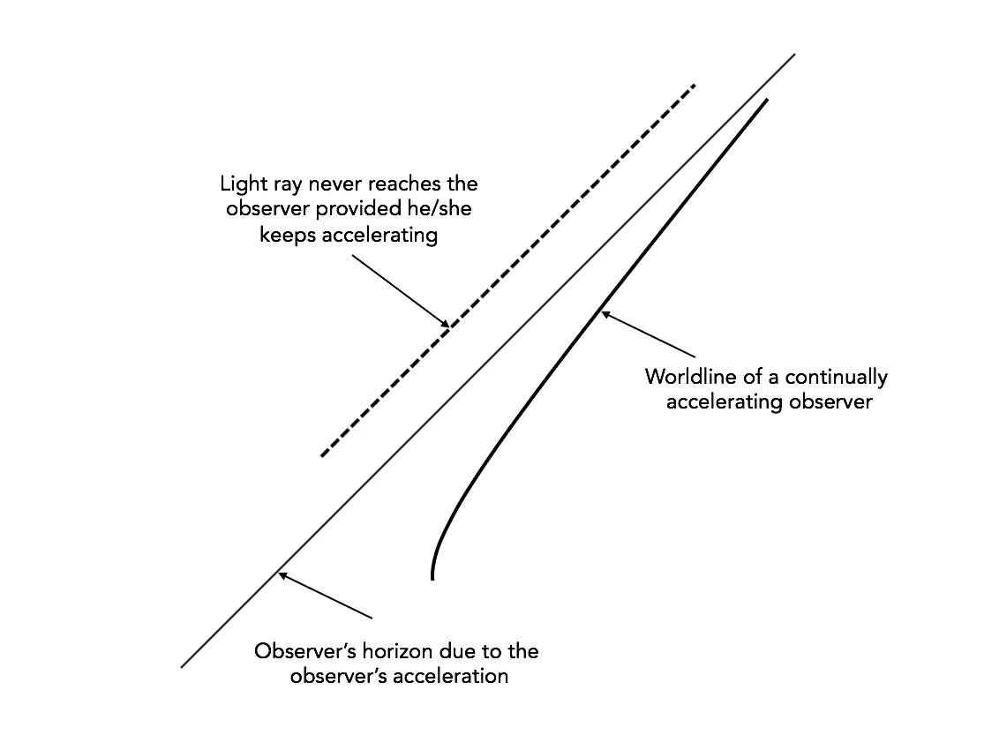*

*图 2:草图显示，如果有足够的领先，加速的观察者可以跑得比光线快。*

*如下时空图所示，在 *t* < 0 离开原点 *x* =0 的光子 A 追上了观察者。然而，在*t*0 处穿过原点的光子 B 没有穿过原点。*

**

*图 3:显示两个光子 A 和 b 的时空图，前者追上了观察者。后者从来不会([来源](https://books.google.com.br/books?id=Kh4xDwAAQBAJ&dq=griffiths+electrodynamics&hl=en&sa=X&ved=0ahUKEwiDpcXd16DoAhU-J7kGHer1Da8Q6AEIKTAA))。*

*因为在一个瞬间移动的惯性系中([一个连接到观察者](https://en.wikipedia.org/wiki/Proper_frame)的参考系)，观察者是静止的，我们有:*

**

*等式 4:在瞬时运动的惯性系中，观察者处于静止状态，2-速度等于 **u** =(1，0)。*

*请注意，从等式。3:*

**

*其中 *a* 是常数。这在任何惯性系中都成立，因此我们有:*

*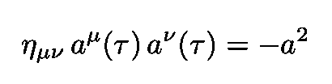*

*等式 5:恒定加速度的条件，在任何惯性参考系中都有效。*

*我们在这里的目标是表明，与非加速观察者相比，加速观察者将检测到粒子的存在。为了证实这一点，选择一个新的坐标来覆盖闵可夫斯基时空是很方便的。这些坐标被称为[光锥坐标](https://en.wikipedia.org/wiki/Light-cone_coordinates)。*

## *光锥坐标*

*这些坐标根据原始( *t* ， *x* )定义为:*

*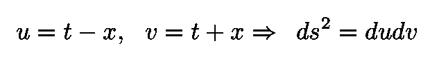*

*等式 6:光锥坐标的定义。*

*闵可夫斯基时空中对应的度规张量的矩阵表示为 *:**

*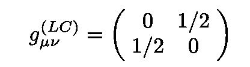*

*等式 7:在*闵可夫斯基时空中光锥坐标的度量张量的矩阵表示。**

*用 Eq 代替 ***η*** 。情商 7。3 和情商。5 我们得到:*

*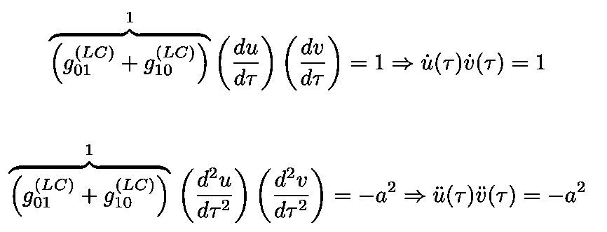*

*等式 8:光锥坐标的一阶和二阶导数所遵循的条件。*

*这些都可以轻松解决。经过几次代数运算(包括重新缩放和坐标原点的移动),我们得到:*

*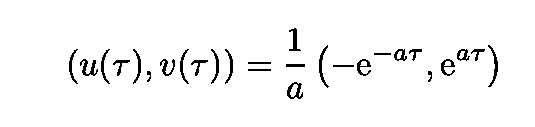*

*方程 9:方程 9 中方程组的解。8、描述一个加速观察者的轨迹。*

*来自 Eq。6 我们获得:*

*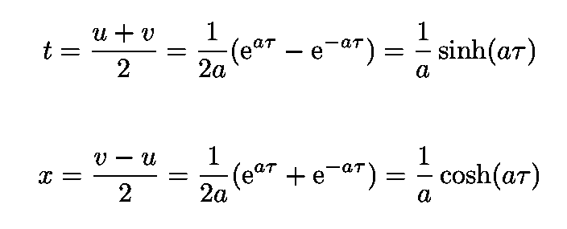*

*方程 10:描述加速观察者在(t，x)坐标中的轨迹的方程。*

*现在请注意:*

*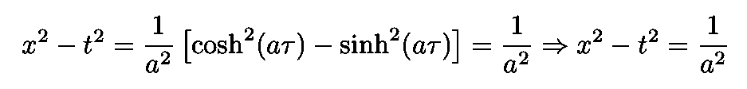*

*等式 11:在坐标(t，x)中，加速观察者的世界线是一条双曲线。*

*因此，我们得出结论，在 *t* - *x* 坐标系中，加速观察者的世界线是一条双曲线:*

*   *观察者，最初在 x → ∞，移动到静止在 *x* =1/ *a，*以*的方式减速。**
*   *然后他加速回到 x → ∞。*

*注意，当 x → ∞时，他的轨迹接近光锥。*

*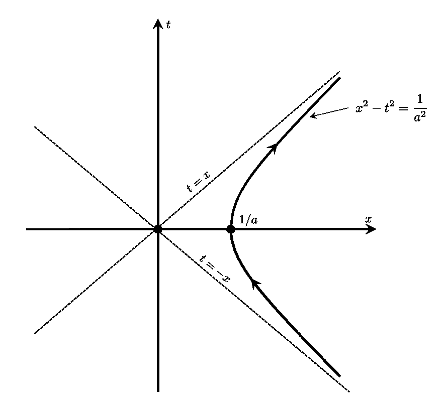*

*图 4:在 *t* - *x* 坐标系中，加速观察者的世界线是一条双曲线。观察者，最初在 x → ∞，减速直到停止在 *x* =1/ *a.* 停止后，他加速回到 x → ∞(注意当 x → ∞，他的轨迹接近光锥，由虚线表示)。*

# *移动框架*

*现在让我们为我们的加速观察者找到一个运动坐标系。继 Mukhanov 和 Winitzki 之后，我们将寻找一个参考框架，其中:*

*   *当空间分量 *ξ* =0 时，观察者处于静止状态*
*   *时间坐标 *ξ* ⁰= *τ，*观察者的适当时间(沿着他自己世界线的时间)*

*此外，共动标架中的度规保形平坦是很方便的(当我们把量子力学包括进来时，这一点就变得很清楚了)。根据定义，保形图是一种局部保持角度的数学函数，而不必保持长度。*

*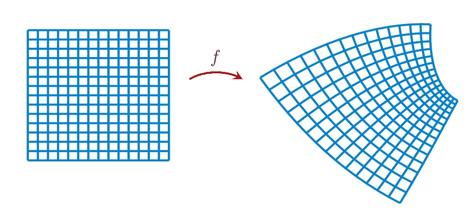*

*图 5:保形图的例子。在矩形网格(左)和 f 下的图像(右)中，成对的线以 90°相交([源](https://en.wikipedia.org/wiki/Conformal_map))。*

*在共形平坦流形中，它的每个点都有一个邻域，可以用共形变换映射到平坦空间。因此，运动框架中的线元素具有以下形式:*

*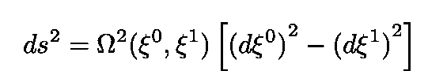*

*等式 12:运动参照系中的线元素。*

*其中ω仍未确定。为了找到ω(*ξ*⁰， *ξ* )的表达式，我们首先定义运动参考系的光锥坐标:*

*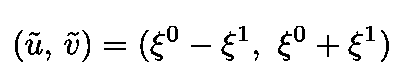*

*方程式 13:共动参考系的光锥坐标。*

*我们可以用几行文字说明(见[穆哈诺夫和 Winitzki](https://books.google.com.br/books?id=vmwHoxf2958C&printsec=frontcover&dq=winitzki+mukhanov&hl=en&sa=X&ved=0ahUKEwi4uuWKmZvoAhWsHLkGHUX-DgcQ6AEIKTAA#v=onepage&q=winitzki%20mukhanov&f=false) )，为了避免在 *ds* 上出现移动光锥坐标的二次微分，我们必须有以下变量相关性:*

*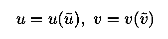*

*等式 14:原始光锥坐标和移动参照系的光锥坐标之间的关系。*

*在几个更简单的步骤中，方程中函数的实际形式。14 可以快速导出。他们读到:*

*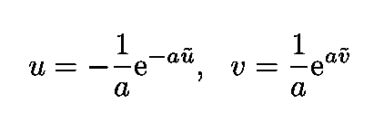*

*等式 14:原始光锥坐标和共运动参考系的光锥坐标的显式表达式。*

*我们现在可以用上面得到的结果来明确写出方程中的线元素。12:*

*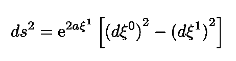*

*方程 15:运动参照系中的线元素，ω(*ξ*⁰， *ξ* )显式写出。*

*这被称为[林德勒时空](https://en.wikipedia.org/wiki/Rindler_coordinates)，除了它只覆盖了闵可夫斯基时空的四分之一(因此[是不完整的](https://en.wikipedia.org/wiki/Gravitational_singularity))之外，它等价于闵可夫斯基时空(没有曲率)。下图显示了 Rindler 加速观察器的示例。*

*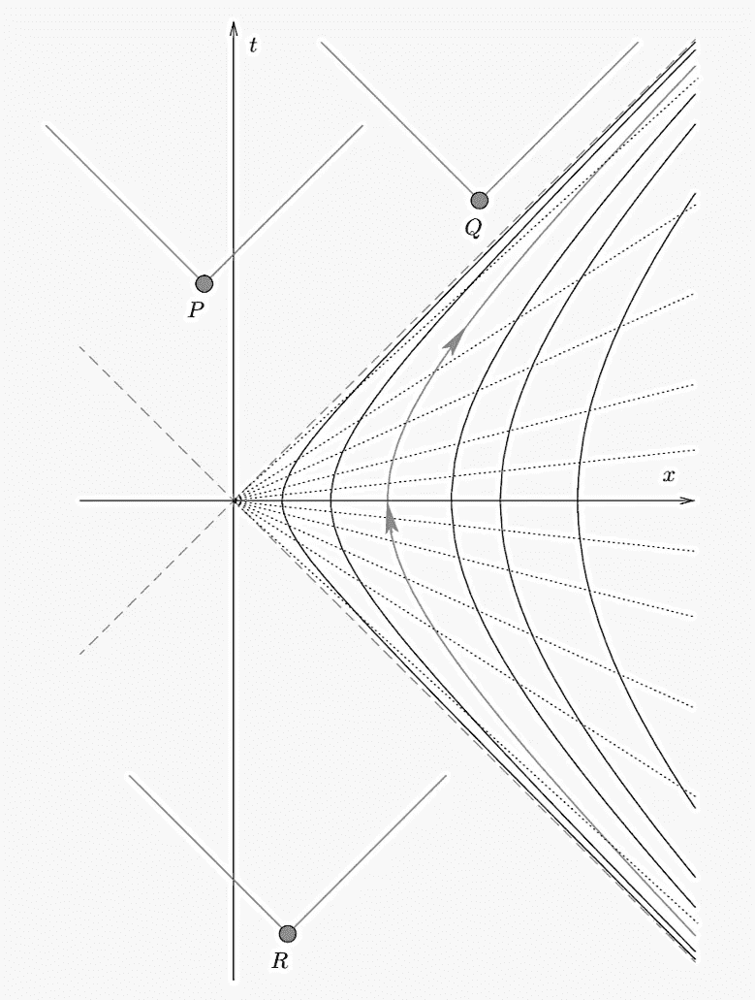*

*图 6:二维时空中的 Rindler 坐标。由虚线界定的区域是 Rindler 楔，并且它是共移动光锥坐标的有效域。世界线(实心双曲线)代表具有常数 *ξ* 的匀加速观察者，而虚线具有常数 *ξ* ⁰.该图还显示了坐标系未涵盖的三个事件。来自 P 和 Q 的信号永远不会到达观察者，而来自加速观察者的信息永远不会到达 R ( [来源](https://books.google.com.br/books?id=vmwHoxf2958C&printsec=frontcover&dq=winitzki+mukhanov&hl=en&sa=X&ved=0ahUKEwi4uuWKmZvoAhWsHLkGHUX-DgcQ6AEIKTAA#v=onepage&q=winitzki%20mukhanov&f=false))。*

*坐标 x 和 t 可以用 *ξ* s 变量表示:*

*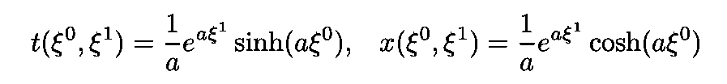*

*等式 16:用 *ξ* s 变量表示的原始坐标 x 和 t。*

# *量子场简介*

*让我们考虑 1+1 时空中的无质量纯量场。行动*

*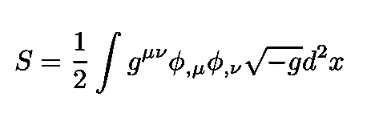*

*方程式 17:1+1 时空中无质量纯量场的作用。*

*是共形不变的:*

*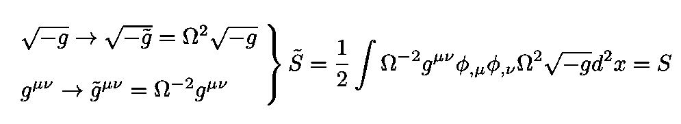*

*等式 18:等式中的作用的共形不变性。17*

*( *g* 这里是度量**gT5)*其中解释了 *S* 在惯性系和加速系中的相似性:****

**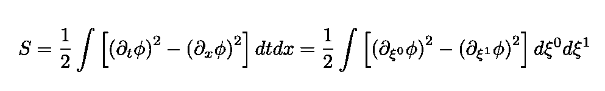**

**方程 19:共形不变性解释了惯性坐标系和加速运动坐标系中的动作之间的相似性。**

**写情商。6 和 Eq。13 在光锥坐标中，我们可以很容易地确定场方程并求解(详见 [Mukhanov 和 Winitzki](https://books.google.com.br/books?id=vmwHoxf2958C&printsec=frontcover&dq=winitzki+mukhanov&hl=en&sa=X&ved=0ahUKEwi4uuWKmZvoAhWsHLkGHUX-DgcQ6AEIKTAA#v=onepage&q=winitzki%20mukhanov&f=false) )。场方程的解是右移和左移模式的和:**

**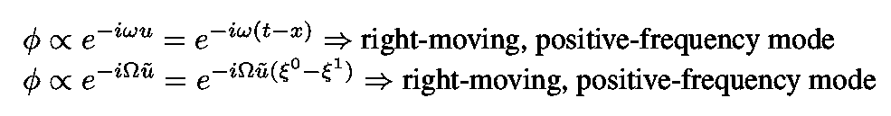**

**等式 20:分别对应于闵可夫斯基坐标时间 t 和固有时间τ = *ξ* ⁰.的右移正频模式**

**解的这一性质与方程。14 意味着相反的运动模式不会相互影响，因此可以单独处理。继 Mukhanov 和 Winitzki 之后，为了避免混乱，我从现在开始只写右移模式。**

**直到现在，这种分析都是经典的，不涉及量子力学。我们现在将量子化这个理论。**

**在林德勒楔形体内，坐标框架重叠，我们可以遵循标准的规范程序来量子化理论，并扩展量子场算符 *ϕ:***

**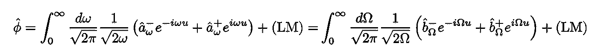**

**方程式 21:量子场论的标准模式展开。**

**其中(LM)表示左移模式。运营商**

**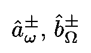**

**等式 22:在展开式等式 21 中使用的创建和湮灭算子**

**遵守标准的交换关系，为了简明起见，我将省略它。注意有两种真空状态，即:**

**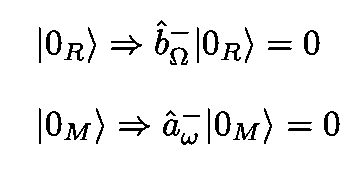**

**方程式 23:林德勒真空和闵可夫斯基真空。**

**“正确的”真空取决于正在进行的实验。例如，**从加速(或 Rindler)观测者的角度来看，闵可夫斯基真空是一种包含粒子的状态**。换句话说，如果量子场处于闵可夫斯基真空状态，林德勒观测者的探测器就会记录到无质量粒子的存在。相反，如果量子场在林德勒真空中，它就不会。**

## **a 和 b 算子之间的关系**

**方程中算子之间的变换。22 个被称为 [Bogolyubov 变换](https://en.wikipedia.org/wiki/Bogoliubov_transformation)，以苏联数学家和理论物理学家 [Nikolay Bogolyubov](https://en.wikipedia.org/wiki/Nikolay_Bogolyubov) 的名字命名。**

**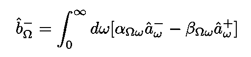**

**等式 24:与 a 和 b 算子相关的 Bogolyubov 变换。**

**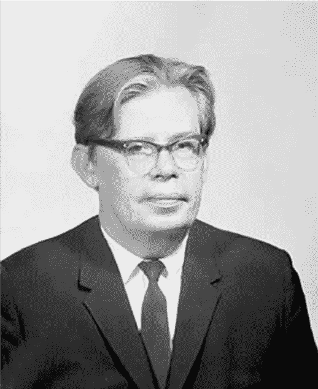**

**图 7:苏联数学家和物理学家 Nikolay Bogolyubov，同名变换的开发者([来源](https://en.wikipedia.org/wiki/Nikolay_Bogolyubov))。**

**堵 Eq。24 进 Eq。21 和执行一些简单的操作，一个到达方程的系数的表达式。24:**

**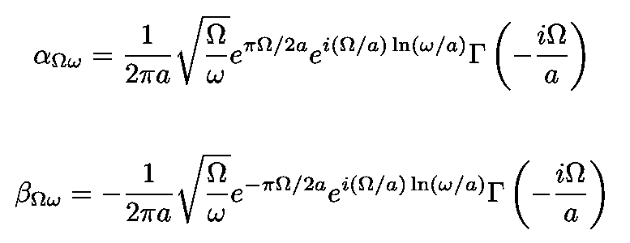**

**等式 25:等式中 a 和 b 算子的系数。24.**

# **Unruh 温度**

**我们最终得出以下结果:**

*   **由加速观测器测量的频率为ω的粒子的平均密度**
*   **所谓 [Unruh 温度](https://en.wikipedia.org/wiki/Unruh_effect)，就是闵可夫斯基真空中加速探测器测得的无质量粒子所服从的[玻色-爱因斯坦分布](https://en.wikipedia.org/wiki/Bose%E2%80%93Einstein_statistics)的温度。**

**平均密度由下式给出:**

****

**方程 26:加速观测器测得的频率为ω的粒子平均密度服从玻色-爱因斯坦分布。**

**温度等于所谓的 [Unruh 温度](https://en.wikipedia.org/wiki/Unruh_effect#Calculations):**

**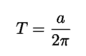**

**等式 27:由加速观测器测量的粒子热浴的温度。**

**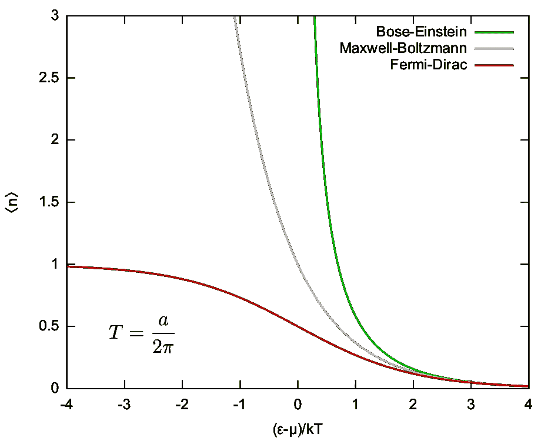**

**图 8:三个统计量的基态平均占有率的比较。玻色-爱因斯坦分布是红线([来源](https://en.wikipedia.org/wiki/Bose%E2%80%93Einstein_statistics))。**

## **物理解释**

**人们可以这样解释 Unruh 效应。量子真空的波动与加速观测者携带的探测器相互作用。这种相互作用激发了探测器，就好像它在一个热浴池中，温度由等式给出。27.请注意，这种波动的能量是由产生加速度的任何机制产生的，例如，加速运载加速观察者的宇宙飞船的推进引擎。**

**我的 [Github](https://github.com/marcotav) 和个人网站 [www.marcotavora.me](https://marcotavora.me/) 有一些其他有趣的材料，既有关于物理的，也有关于数学、机器学习、深度学习和金融等其他主题的。看看吧！**