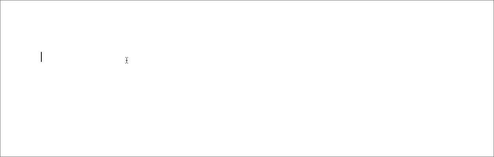
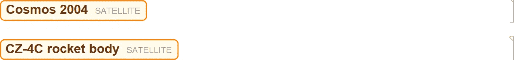
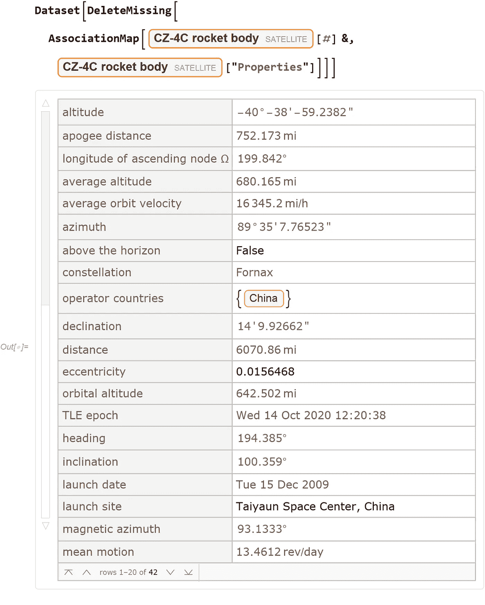
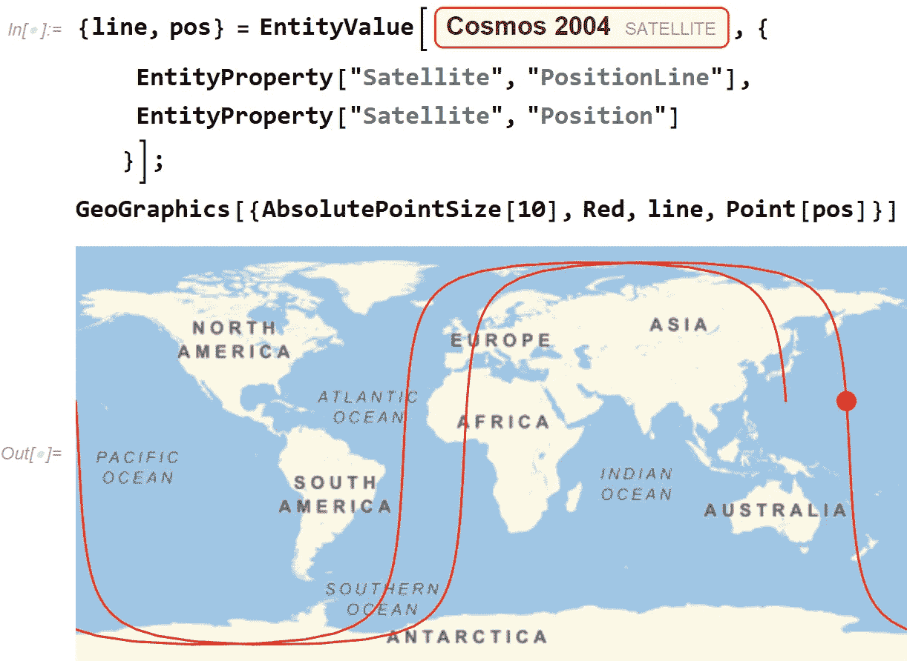
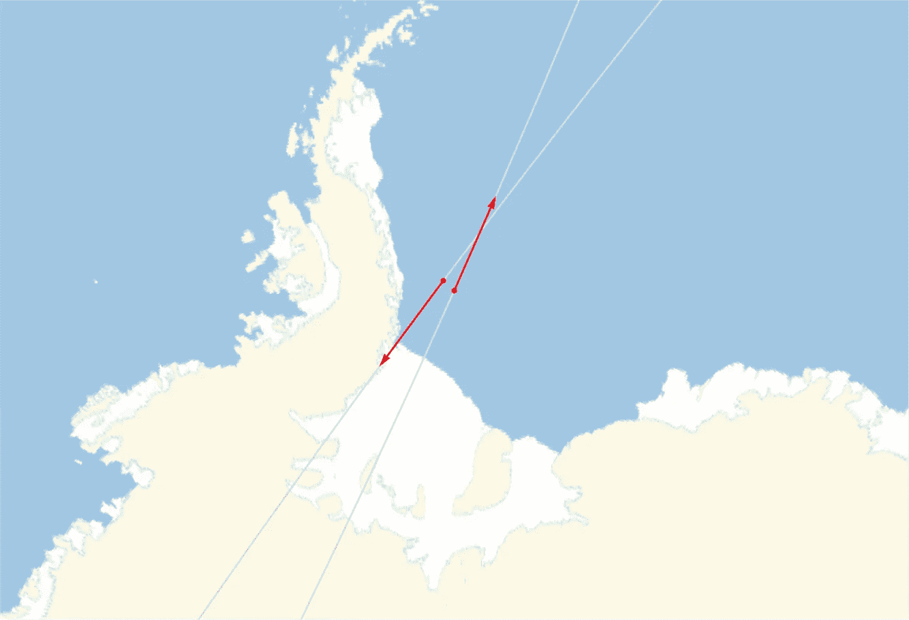
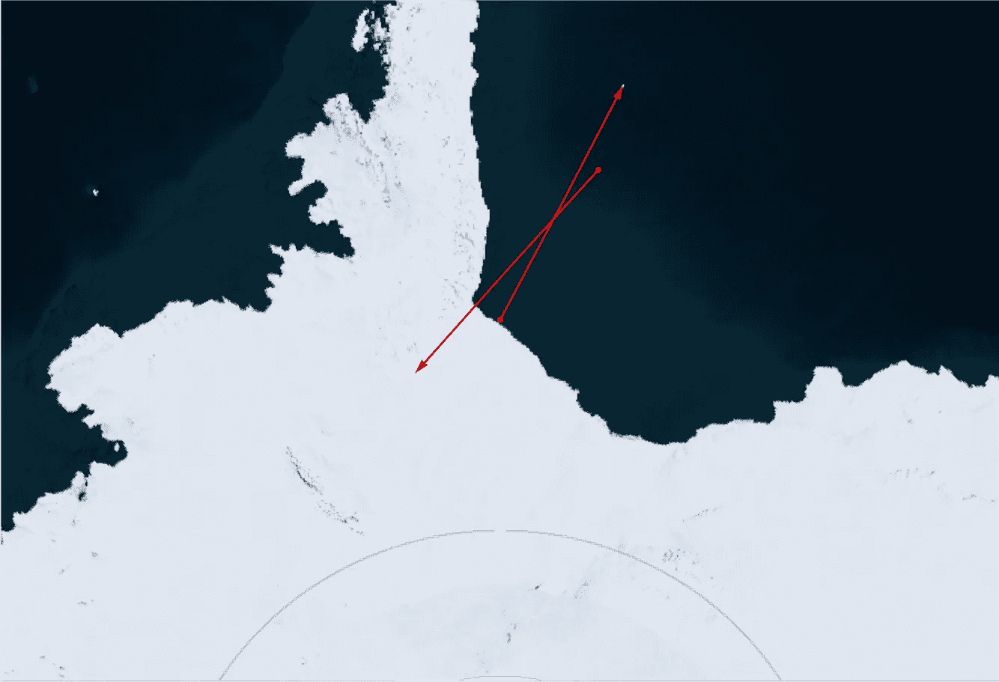
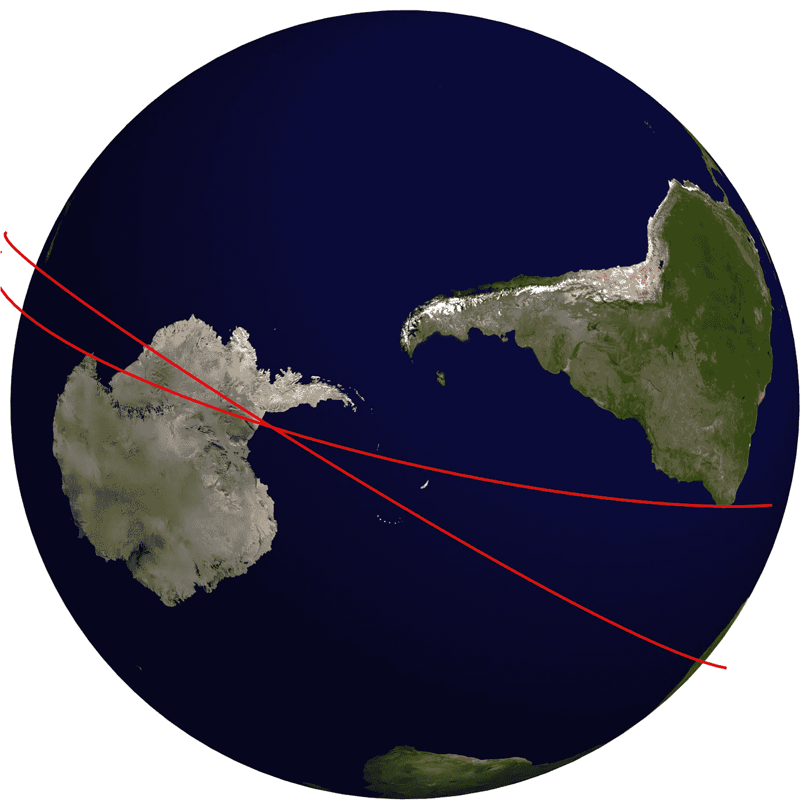

# 当卫星相撞时…

> 原文：<https://towardsdatascience.com/when-satellites-collide-843bc45f09f1?source=collection_archive---------54----------------------->

## 用 Wolfram 语言编写的计算思维故事

美国宇航局在 [Unsplash](https://unsplash.com/s/photos/satellite?utm_source=unsplash&utm_medium=referral&utm_content=creditCopyText) 拍摄的照片

空间很大，真的很大。然而，地球周围的空间变得越来越拥挤。每次发射新的宇宙飞船，都会有一些小碎片落在周围的轨道上。美国太空监视网络估计，地球上漂浮着超过 1 亿个 1 厘米以下的碎片，大约 90 万个 1-10 厘米的碎片，大约 3.4 万个大于 10 厘米的碎片。

每隔一段时间，两个更大的部分就会靠得很近。例如，目前存在一种风险，即在世界协调时 10 月 16 日 00:56，两个总质量为 2，800 千克的物体将发生碰撞:

为了获得这里发生的细节，我打开了一个新的 [Wolfram 笔记本会议](https://www.wolfram.com/featureset/notebooks/)。为了获得有问题的卫星，我使用了[自然语言界面](https://www.wolfram.com/language/elementary-introduction/2nd-ed/35-natural-language-understanding.html)并键入推文中给出的“ [satellite 19826](https://www.wolframalpha.com/input/?i=satellite+19826) ”。这参考了 [Wolfram 知识库](https://www.wolframalpha.com/knowledgebase/)(也由例如 [Wolfram|Alpha](https://www.wolframalpha.com/) 使用)并给了我卫星实体:

(所有后续图片由作者提供)

对“卫星 36123”重复相同的过程，得到了我感兴趣的两个实体:

所有实体都有一定数量的可以查询的属性。例如，以下是“CZ-4C 火箭体”物体的一些已知特性:

使用这些属性，我们可以绘制“CZ-4C 火箭体”的当前位置和轨迹:

再多一点代码，我们就可以画出这两个物体在 2020 年 10 月 16 日的预期位置:

**更新**:新发布的轨迹预测碰撞概率更高。新轨迹图像:

Jeff Bryant 在 Wolfram 社区帖子中描述了如何创建该地图的细节。完整的代码也可以在[这个在线笔记本](https://www.wolframcloud.com/obj/arnoudb/Published/collision-01.nb)中找到。

如果“宇宙 2004”和“CZ-4C 火箭体”相撞，它们将产生一大团较小的物体，增加地球附近的空间碎片数量。目前还没有经济有效的方法来清除这些碎片。目前的重点是减少新引入的碎片数量。

有关最新更新，请关注以下 Twitter 帖子:

最后更新，似乎没有碰撞:

