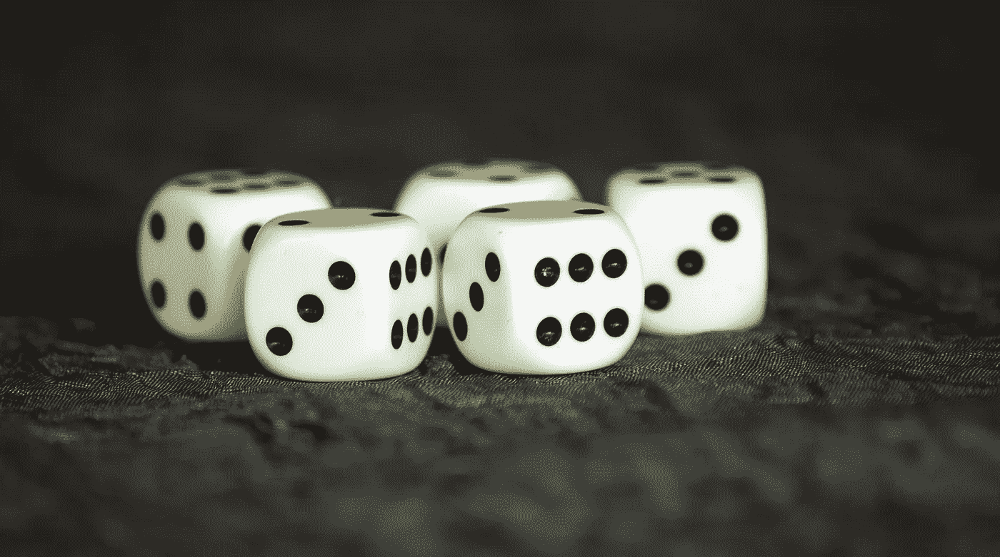
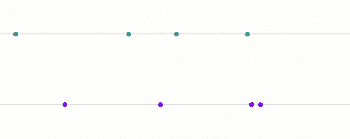
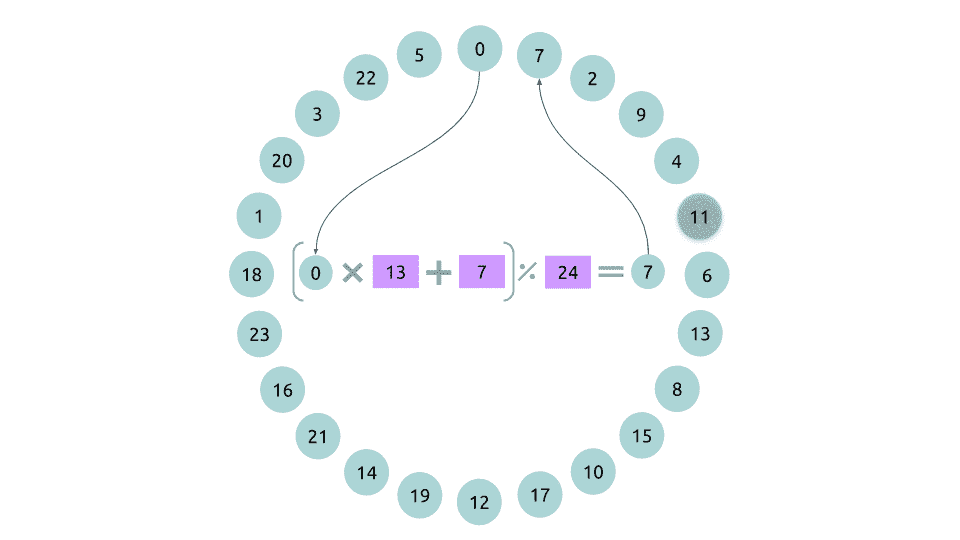
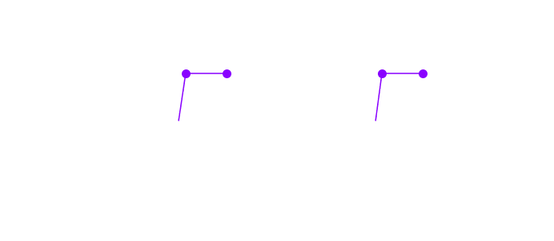
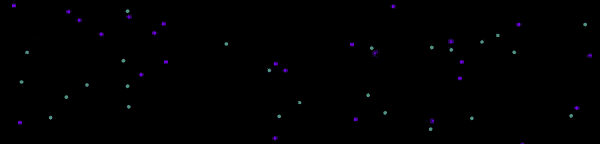

# 当科学和哲学遇到随机性、决定论和混沌时

> 原文：<https://towardsdatascience.com/when-science-and-philosophy-meet-randomness-determinism-and-chaos-abdb825c3114?source=collection_archive---------11----------------------->

## 随机性背后的理论是什么？那真的存在吗？

来源: [Pxhere](https://pxhere.com/en/photo/670084)

有时是恐惧**的来源**，有时是梦想**的来源**。随机性在每个人的心中都是情绪的来源。作为一名程序员，这让我着迷。如果你曾经在赌场碰过运气，那是因为你可能会因此而兴奋不已。不幸的随机性也会让你哭泣，或者让你度过一生中最艰难的时光。

> “这个世界是由机遇主宰的。随机性每天都困扰着我们。”
> 
> **保罗·奥斯特。**

随机性是未知、意外的同义词。然而这是真的吗？任何事情都有可能是真正随机的吗？它仅仅是一种信仰，一种想法，还是随机性只是一种幻觉？

为什么我们不把我们的知识放在一边五分钟来回答这个问题呢？

# 定义

让我们看看字典隐藏了什么。随机意味着:

*   没有方法地做出、完成或发生**或**有意识的决定**。**
*   **不寻常的，或**意想不到的****
*   **表征选择过程的**过程，其中一个集合中的每个项目被选择的概率相等(统计学)****

**有趣的是，“随机”这个词激发了两个主要观点。**

**一方面，它与**是一个无法提前预测的事件**同义:通过滚动骰子几次，你无法说出结果会是什么。另一方面是**一个**无模式**序列的统计性质**:掷骰子几次，两个结果之间没有逻辑。**

**没错，**的区别是微妙的**。在这一点上，你甚至可能认为这没有什么区别。然而差别是巨大的。**

# **伪随机数发生器**

**有些算法可以计算随机数。他们被称为**伪随机数发生器** (PRNG)。这些随机数是许多**加密系统**的基础，用来保护无线**通信**甚至你在网络应用上的**密码**。**

**为了更好地理解什么是随机性，看看**在我们的 PRNGs 中它是如何产生的**是很有趣的。是的，我们要讨论算法方法。不，你不会迷失在细节中。**

********

**线性同余生成器— a=13，c=7，m=24，种子=0**

**我要给大家介绍的 PRNG 是一个老经典:**线性同余发生器** [1]。让我们简单点:**

*   **我们有一个起始号码叫做**种子**。**
*   **下一个随机数是从上一个**随机数计算出来的。****

**假设我们有`a=13`、`c=7`、`m=24`，我们的种子是 0。很容易计算出下一个随机数。我们用 13 乘以 0。我们还有 0，然后加上 7。最后，`mod m`的意思是“当我们把**分成`m`等份时，还剩下**多少”。让我们想象一下，我们有 30 个硬币要在 8 个人之间分享。然后我们可以给每个人 3 个硬币。还会剩下 6 枚硬币。换句话说`30 mod 8 = 6`。**

****

**线性同余生成器— a=13，c=7，m=24 —蓝色种子= 0，紫色种子=1**

**你了解这个过程。很简单。**真简单。从一个种子和其他三个数字，我们可以生成一个随机序列。随机性出现在**的 10 行**代码中。****

> **"随机数不应该用随机选择的方法产生."**
> 
> **唐纳德·克努特。**

**从**观察者的角度来看**，序列**看起来完全是随机的**。然而我给你们展示的线性同余发生器非常简单。当然，还有更复杂的。python 中的`random.random()`和`numpy.random.random()`都是基于 PRNG·梅森图[2]。**

# **确定性和周期性**

**我们看到我们生成的随机数**不是随机的！它们甚至是完全确定的。如果我们知道使它工作的算法和种子，那么我们就预先知道生成的序列。****

**所以让我们回到我们的字典定义，看看哪些仍然符合:**

*   **没有方法或有意识的决定而做的或发生的**
*   **不寻常的，或意想不到的:**好的****
*   **描述一个选择过程，其中一个集合中的每个项目都有相等的被选中的概率(统计学):**还不知道****

**我们在生成随机数吗？从技术上讲，答案是否定的。**

**而且，产生的数字往往是**周期性的**。提出的两个 PRNGs 就是这种情况。排序后的**无限重复**。**

****

**线性同余生成器— a=13，c=7，m=24，种子=0**

****prng 不产生随机数**。然而，不应该自动怀疑它们。计算机是有限的空间。我们必须务实。我们可以试着**量化它们的适宜性。****

****Kolmogorov 的复杂度**【3】因此被定义为生成伪随机序列的最短程序。因此，我们可以**估计**随机数生成的复杂度。**

**但是在现实中，**一个真正的随机序列是一个无限序列**，所以我们无法找到更小的程序来生成它。根据定义，随机是不可压缩的，因为它不包含模式。**

> **"计算机只能具有某种随机性，因为计算机是有限的设备."**
> 
> **特里斯坦·佩里希。**

**这就是为什么有**统计测试**来测量**产生的**随机性与**概念上的**随机性有多接近。我们可以注意到，例如，顽固的**测试**和 **NIST** 测试【5】。**

**我们不会深入这些统计测试的细节。但是它们让我们对随机序列的可预测性有了一个概念。我们的线性同余发生器的例子没有通过这些测试[6]。**

# **随机就是混乱**

**随机数生成器不生成随机数。他们制造混乱。**

> **"当然，任何考虑用算术方法产生随机数的人都是有罪的."**
> 
> **约翰·冯·诺依曼。**

**混乱是元素的一般**混乱**。在我们的例子中，序列的普遍混乱。混沌是一个**确定性系统**，确定无疑，但是**高度依赖于它的初始条件**。**

**让我们以**双摆**为例。如果我们放下同一个双摆锤，那么**重力**，其组件的**质量**，以及摆锤的**起始角度**将定义摆锤落下时的反应。
如果在**完全相同的条件下释放两次**，那么它将具有完全**相同的行为**。**

****

**开始时差为 1 的双摆。**

**然而，如果您通过将起始角度**改变很小的角度**来第二次放下它，那么行为将**完全不同**。但仍可由其初始条件决定。**

> **"理论上，随机性是一种内在属性，但实际上，随机性是不完全信息."**
> 
> **纳西姆·尼古拉斯·塔勒布。**

**这被称为**蝴蝶效应**。对于初始条件的微小差异，结果是完全不同的，通常随着时间的推移，任何预测都是不可能的。**

# **真随机数发生器**

**对于一些科学家和数学家来说，无疑存在着纯粹的随机性。有效果无原因的序列**。他们被称为**真随机数发生器** (TRNG)，必须基于随机**物理**源。****

********

****正是在**量子物理学中，**我们熟悉了真正的随机现象。太空中被认为是真空的地方实际上是由亚原子粒子组成的，它们神奇地出现又消失。这些粒子产生随机噪声。**寂静之声**。****

> ****“自然本身也不知道电子会通过哪个孔”。****
> 
> ****理查德·费曼。****

****它的**不可再生**方面已经被量子理论证明【7】。然后我们有一个真正的随机数发生器。直到某个物理理论可能会与量子物理相矛盾。它将再次表明，被认为是随机的东西并不是随机的。****

# ****(真)随机数生成器****

****在统计数学中，随机性的概念作为一个概念存在。但是随机模型的定义假设在相同的初始环境下可以观察到不同的事件。根据物理定律，这种形式的随机性不可能存在于由决定论统治的世界中。**决定论可以模仿随机性。******

****但是量子物理学已经证明了它在今天的伟大原则失效的地方的有效性。这引入了一个新的范例。**统计物理学**，其中**同时**解释了**预测的可能性和预测与观测之间的剩余差距**。**随机性可以模仿决定论。******

> ****"真正的随机性需要无限量的信息."****
> 
> ****特里斯坦·佩里希。****

****确定性物理还是统计物理才是正确的立场？这也可能是两个以上对手之间的游戏。****

****有可能证明一个系统是真正随机的吗？由于根据定义**它是不可压缩的**，它需要**无限量的信息**才能被认为是随机系统。****

# ****随机性存在吗？****

****随机性作为一个概念存在。但是作为一个**的观察，**我们现阶段还不能说什么。我们所说的随机可以是:****

*   ******混乱**或者****
*   ****对规则作出反应的序列过于细微，无法被**观察者**理解，或者****
*   ******纯粹的**随机性，其证据仍在争论中。****

****这是否意味着我们应该克制，不要把非随机的东西称为随机？不，不是的。我默认认为**系统就是它看起来的样子**。如果我不能区分随机系统实际上是确定性的，那么我会认为它是随机的。****

> ****"我们所说的随机性是并且只能是一个已知结果的未知原因."****
> 
> ****伏尔泰。****

****毕竟我们不知道**感情**是什么。它只是一个概念。对这种感觉的观察让我们认为它们是真实的。****

********

> ******知识就是分享。**
> **支持**我，一键获得 [**中我所有文章的**访问**。**](https://axel-thevenot.medium.com/membership)****

****

# **来源和参考**

**[1] LEHMER，D . H .[m . l . junco sa 在 BRL 高速计算机上生成随机数。数学。第 15 次修订
(1954 年)，559 页](https://en.wikipedia.org/wiki/Linear_congruential_generator)**

**[2] [Mersenne Twister](https://www.google.com/url?sa=t&rct=j&q=&esrc=s&source=web&cd=6&ved=2ahUKEwim_eT4-8LpAhWd8uAKHaLpBL8QFjAFegQICBAB&url=http%3A%2F%2Fdl.acm.org%2Fft_gateway.cfm%3Fid%3D272995%26type%3Dpdf&usg=AOvVaw1l2Ih39W1xY0Z4kiFg0gyh) :一个 623 维均匀分布的伪随机数发生器，由庆应义塾大学松本诚和庆应义塾大学马普数学研究所和西村拓治设计**

**[3] [Kolmogorov 复杂性](https://www.sciencedirect.com/topics/computer-science/kolmogorov-complexity)，M. Li，P. Vitányi，载于国际社会百科全书&行为科学，2001**

**[4]马萨格里亚·乔治和曾伟万。[一些难以通过的随机性测试](https://www.google.com/url?sa=t&rct=j&q=&esrc=s&source=web&cd=1&cad=rja&uact=8&ved=2ahUKEwilm5r8_cLpAhVJyxoKHZG3B2IQFjAAegQIAxAB&url=https%3A%2F%2Fwww.jstatsoft.org%2Farticle%2Fview%2Fv007i03&usg=AOvVaw37M99JrwoWwrbnO8fJF_SG)。统计学家 j。柔软。7, 3, 1–9, 2002.**

**[5]安德鲁·鲁欣和阿尔[用于加密应用的随机和伪随机数发生器的统计测试套件](https://www.nist.gov/publications/statistical-test-suite-random-and-pseudorandom-number-generators-cryptographic)。NIST 特别出版物 800–22 第 1at 版，2010 年。**

**【6】[线性同余发生器不产生随机序列](https://ieeexplore.ieee.org/document/715950)，A.M. Friezer .坎南；拉加利亚斯**

**[7] [《寂静之声》大受欢迎，](https://www.sciencedaily.com/releases/2012/04/120413161235.htm)林炳科，澳大利亚国立大学**

**所有的 gif 都是自制的，可以免费使用。**