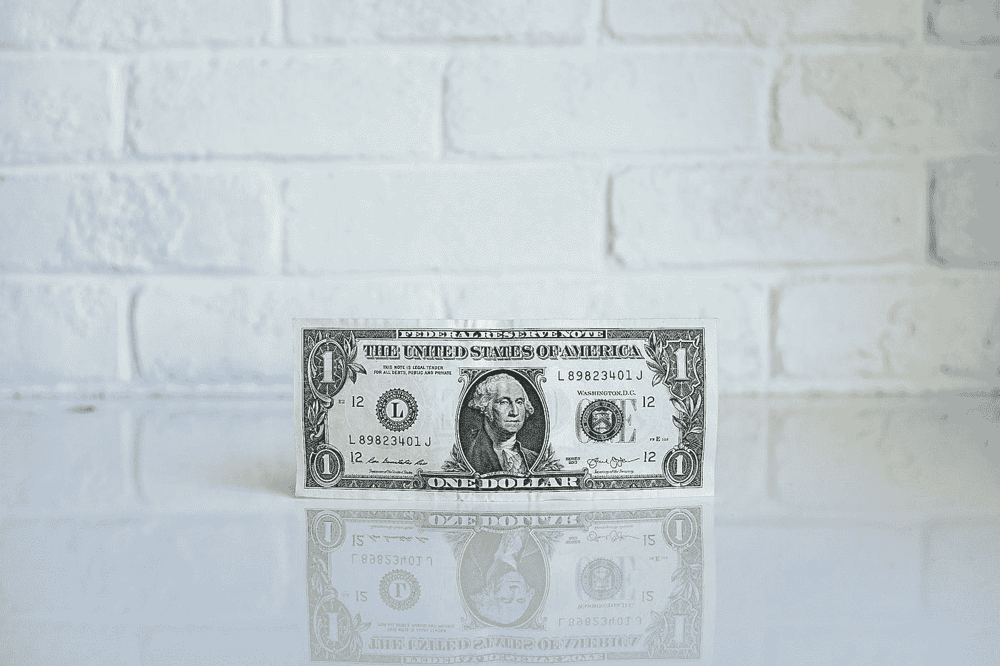

# 什么时候该买比特币？—减轻价格波动的简单方法

> 原文：<https://towardsdatascience.com/when-should-i-buy-bitcoin-a-simple-way-to-mitigate-price-volatility-7740e537c694?source=collection_archive---------32----------------------->

## 关于成本平均法事后表现的数据分析

[Icons8 团队](https://unsplash.com/@icons8?utm_source=medium&utm_medium=referral)在 [Unsplash](https://unsplash.com?utm_source=medium&utm_medium=referral) 上的照片

每天都有越来越多的人投资比特币。我们可以看到持有不少于 1 个比特币的地址数量不断上升。

但是，是什么阻止了像你这样的人购买你的第一枚比特币呢？加密货币是不稳定的资产，波动性会阻止人们购买该资产。价格会在几个小时内上下浮动 10%。不开玩笑。

那么什么时候应该购买比特币呢？这对于你我这样没有巨款的散户来说至关重要。我们输不起。

***如何确定买入费的时间？*** 最简单的回答是— ***你没有。***

# 美元成本平均法

美元成本平均(DCA)是积累比特币的一种常见策略，并且在加密货币领域势头越来越猛。你不是去冒险，去投机比特币的价格，而是每个月(或者每周，或者每天)花同样多的美元在比特币上，不管价格如何。

例如，不管价格如何，你每天都要买价值 10 美元的比特币。当价格触底时，你可能会错过，但这减轻了波动性对一次性购买大量比特币的影响。这也会阻止你冲动购物。

nave DCA 是最容易的 ***避险*** 策略，逐步积累比特币。尽管如此，有时你可能会觉得价格太高，你会希望当天避免购买比特币。

虽然让你的**情绪**驱动你的投资决策通常不是一个好主意，但我们可以依靠一些**技术指标**来提示你买入。然后，你可以稍微调整一下策略，只在资产被认为“超卖”时，买入价值 10 美元的比特币。

照片由 [NeONBRAND](https://unsplash.com/@neonbrand?utm_source=medium&utm_medium=referral) 在 [Unsplash](https://unsplash.com?utm_source=medium&utm_medium=referral) 上拍摄

# 条件美元成本平均法

我们以**相对强弱指数** (RSI)为例。它通常在 14 天的时间框架内使用，并在 0 到 100 的范围内测量。传统上，当 RSI 低于 30 时，资产被认为**超卖**。因此，如果你可以利用这个“买入信号”,在 RSI < 30 时只采用平均成本。

事实上，这种有条件的 DCA 策略通常比单纯的 DCA 表现得更好。上面的图显示了如果你在不同的时间开始使用原始 DCA 或各种条件 DCA 策略购买比特币，每比特币的平均成本(以美元计)。

即使你在 2017 年底‘加密货币泡沫’期间开始雇佣天真的 DCA，这可能是投资加密货币的最糟糕的时候，比特币累积的平均成本也不超过 7000 美元。在撰写本文时(2020 年 5 月)，比特币的价格徘徊在 9000 美元左右。

从下面显示的另一个图中，你可以想象如果你在不同的时间用不同的策略开始积累硬币，投资的**回报** (ROI)。零投资回报率意味着**收支平衡**。**事后看来**，无论您何时开始采用 DCA 策略，ROI 都是正的。

条件 DCA 策略的缺点是，您提出的条件可能过于严格，因此不会经常发生。以上述 RSI 为例，RSI < 30 only happened ~10% of the time in history. This is not ideal for budgeting.

## Takeaways

Price volatility should not stop you from investing in the future. Many Americans already bought Bitcoin with their stimulus cheques from the government.

Caveats: the past does not predict the future. You should do your own research before investing in cryptocurrencies.

***注自《走向数据科学》的编辑:*** *虽然我们允许独立作者根据我们的* [*规则和指南*](/questions-96667b06af5) *发表文章，但我们并不认可每个作者的贡献。你不应该在没有寻求专业建议的情况下依赖一个作者的作品。详见我们的* [*读者术语*](/readers-terms-b5d780a700a4) *。*

感谢阅读！你可以[注册我的时事通讯](http://edenau.mailchimpsites.com/)来接收我的新文章的更新。如果您对数据分析感兴趣，您可能会对以下内容感兴趣:

 [## 赢得垄断的 7 个策略

### 一个关于 Python、统计、可视化和童年记忆的故事

towardsdatascience.com](/7-strategies-to-win-monopoly-a89ead18b062)  [## 你会在泰坦尼克号上幸存吗？——对 Kaggle 的经典挑战

### 关于如何开始 Kaggle 之旅的 7 步指南

towardsdatascience.com](/would-you-survive-the-titanic-a-classic-challenge-on-kaggle-3efaa22bfb5e) 

声明:我不是财务顾问。给出的建议不是理财建议。你自己承担交易风险。

*最初发表于*[*edenau . github . io*](https://edenau.github.io/)*。*