# 在我的脸书粉丝页面上预测喜欢——我能在 6 个月内达到 10 万个喜欢吗？

> 原文：<https://towardsdatascience.com/when-should-i-reach-100k-likes-on-my-facebook-fan-page-21997db91990?source=collection_archive---------56----------------------->


作者照片

## 使用时间序列预测为社交媒体影响者设定数据驱动的目标。

我有一个 96k+赞的脸书粉丝页面。

```
[www.facebook.com/TwoHappyShibas/](http://www.facebook.com/TwoHappyShibas/)
```

> “这个月我应该获得多少新的赞？”
> 
> "如何建立有时间限制的目标？"
> 
> “我现在有 96k 的赞，什么时候应该达到 100k？”

在我成为数据分析师之前，这些是我问自己但从未回答过的一些顶级问题。

## 现在，作为一名数据分析师，我可以从数据中获得有意义的见解。

我对我的脸书粉丝页面的两年历史数据进行了时间序列分析，预测了未来六个月的赞数:

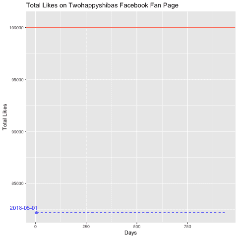

预测 https://www.facebook.com/TwoHappyShibas/[的总点赞数](https://www.facebook.com/TwoHappyShibas/)

有了预测，我可以直接回答上面提到的三个问题:

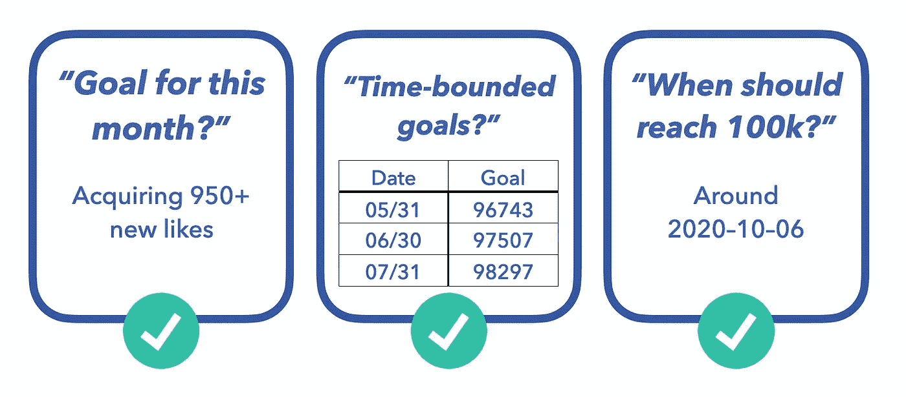

这个数据分析应用程序对我非常有帮助，因为现在我可以逐渐减少凭直觉做出的决定。

以前，我只能使用*脸书分析工具*来衡量我的表现，并与上一期进行比较，但从来不知道什么样的回报是足够的，什么是不够的。

但是，在我做了这个分析之后，设定目标变得更加容易实现，以数据为导向，也更加现实。该预测可以作为一个基准，帮助我创建一个数据驱动的时间表，以跟踪并继续对社交媒体施加影响。

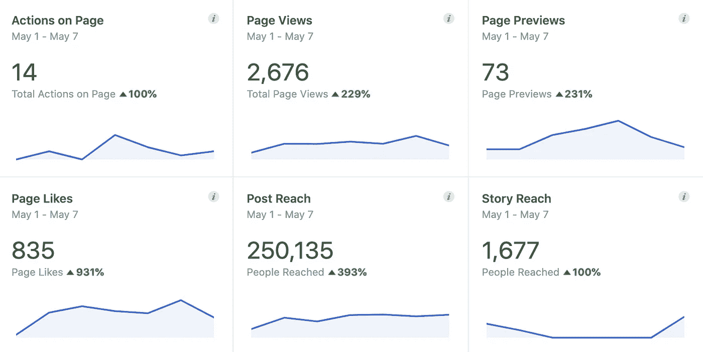

脸书分析工具:显示定期绩效比较

# 分析方法

1.  定义目标
2.  数据收集和准备
3.  数据探索性分析
4.  时间序列分析
5.  应用和见解

# 定义目标

> 问题:

在运营一个粉丝页面的时候，当我没有一个可靠的基准时，设定一个目标总是很难。例如，我不知道一个月获得多少新的喜欢会被认为是一个好的回报。

> 主要目标:

预测我的脸书粉丝页面上的总赞数，帮助我在未来设定可实现的、现实的数据驱动的目标。

# 数据收集和准备

数据是在我的 www.facebook.com/TwoHappyShibas/粉丝页面上收集的

通过脸书的 export insights 数据功能，我能够在两年内获得各种数据。

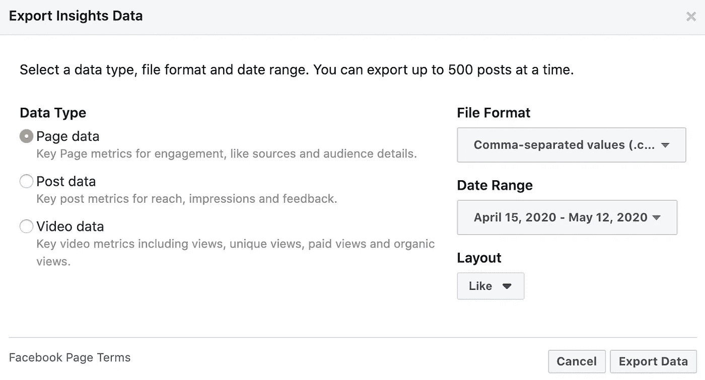

脸书允许用户在两年内导出数据(作者截图)

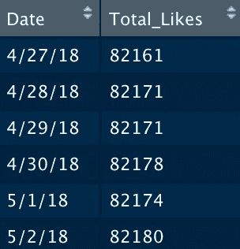

每日总点赞数(2018/04/27–2020/05/03)

这次我使用的是每日总点赞数据，它非常适合时间序列分析，因为它提供了每日的数字和日期。

```
> periodicity(like_xts)
Daily periodicity from 2018-04-27 to 2020-05-03
```

准备工作:

数据准备的主要部分是将数据转换成时序数据类型。

```
#Transform data into time series data$like  = data$Total_Likes%>%
  ts(start=c(2018,4,27) ,frequency=365)
```

# 数据探索性分析

在时间序列分析中，观察和处理数据的**季节性效应**、**趋势、**、**平稳性(稳定性)**是必不可少的。

首先，我看了一下 2018 年至 2020 年赞数增加的**季节性**，将数据分解为每日、每周和每月总赞数增加:

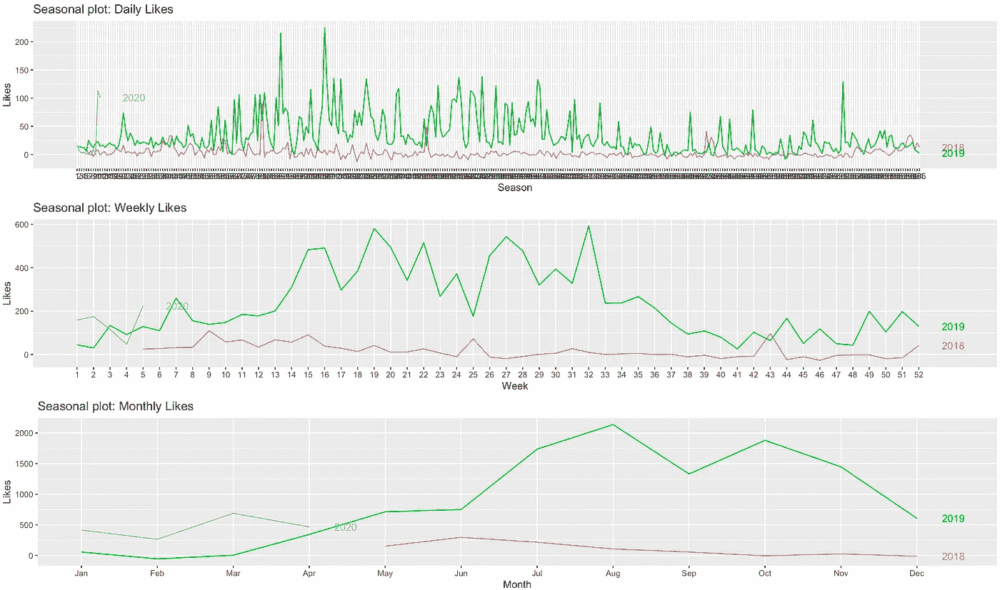

每日、每周和每月点赞

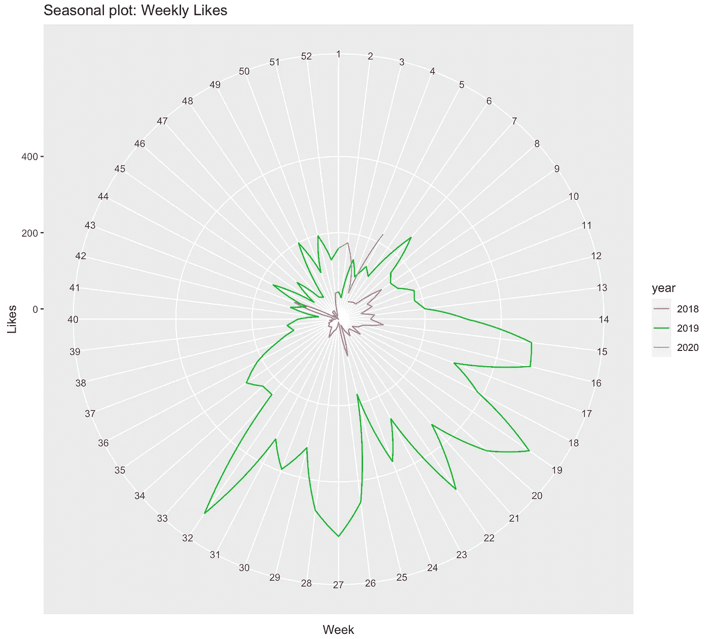

每周点赞数增加的极地季节图

根据我 5 年的社交媒体经验，图表显示数据中没有明显的季节效应。

我们可以通过分解数据来减少季节性:

```
#Generate seasonal-adjusted data
seasonal_adjusted = decomposedlike$x-decomposedlike$seasonal
```

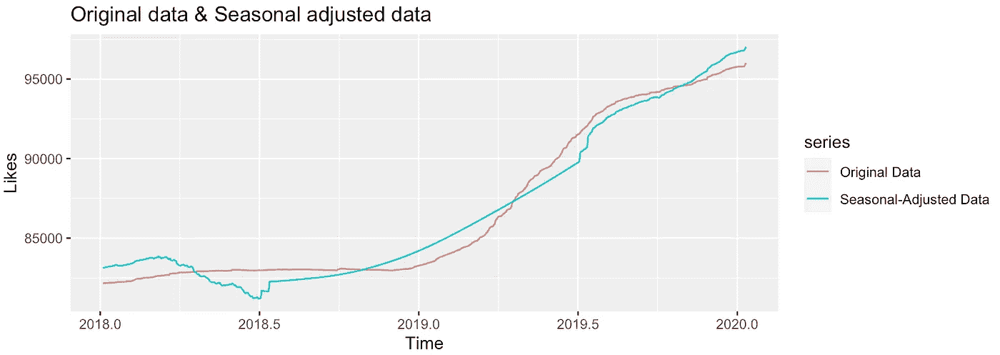

如图所示，原始数据和季节性调整数据之间没有显著差异。

其次，我们可以通过查看自相关图来观察**趋势**:

```
ggAcf(diff(like),lag =90)
```

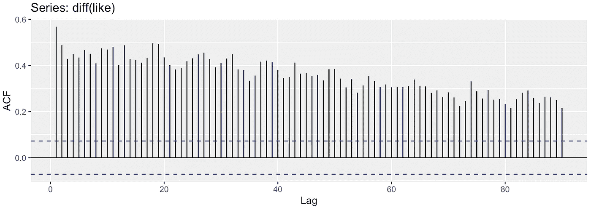

自相关图

该图表明，小滞后的自相关往往是显著的和积极的；同时，随着滞后时间的增加，这些值缓慢下降。
简而言之，**这个数据是有趋势的，季节性滞后不显著。**

分解图也显示了明显的增长趋势:

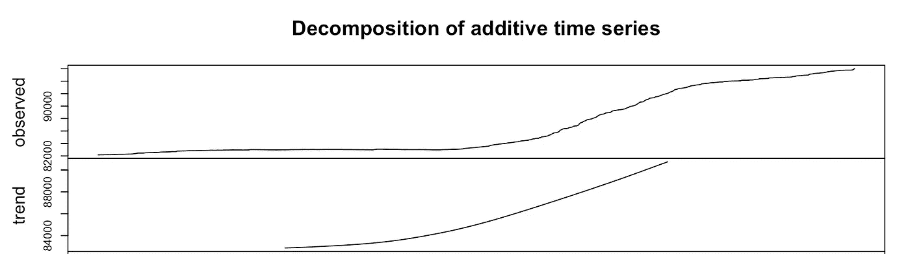

第三，我们使用 Dickey-Fuller 测试来检验**平稳性**:

```
> adf.test(like, alternative = "stationary")Augmented Dickey-Fuller Testdata:  like
Dickey-Fuller = -1.4016, Lag order = 9, **p-value = 0.8316**
alternative hypothesis: stationary
```

鉴于高 p 值，我们无法拒绝零➡ **️data 是不稳定的。**

然后，我对数据进行差分，通过消除时间序列水平的变化来帮助稳定平均值:

```
> adf.test(diff(like), alternative = "stationary")Augmented Dickey-Fuller Testdata:  diff(like)
Dickey-Fuller = -3.4011, Lag order = 9, **p-value = 0.05326**
alternative hypothesis: stationary
```

p 值非常接近我们想要的值，但是仍然无法拒绝空值。

然后我取第二个差。

```
> adf.test(diff(diff(like)), alternative = "stationary")Augmented Dickey-Fuller Testdata:  diff(diff(like))
Dickey-Fuller = -14.821, Lag order = 9, **p-value = 0.01**
alternative hypothesis: stationary
```

鉴于低 p 值，我们拒绝 null➡ **️data 是静止的。✅**

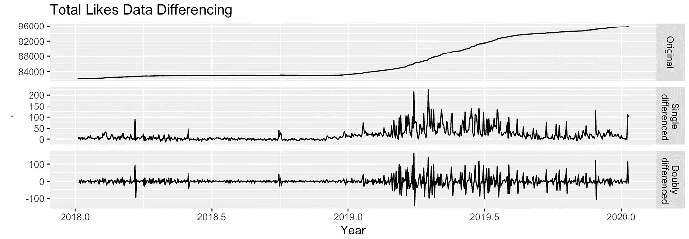

数据差异

在探索和更好地理解数据之后:

1.  季节性—不明显
2.  趋势——明显的增长趋势
3.  平稳性—采用双重差分数据实现平稳。

我们可以去做模特了！

# 时间序列分析

在建模过程中，我将比较四种不同的模型:

1.  ARIMA 模型的每日数据
2.  ARIMA 模型的周数据
3.  ARIMA 模型月度数据
4.  使用 ETS 模型的月度数据(ETS 与月度数据更吻合)

用四个模型做半年预测，我们可以看到只有《每日 ARIMA》和《每周 ARIMA》预测**我的粉丝页面在 6 个月内会达到 100k。**

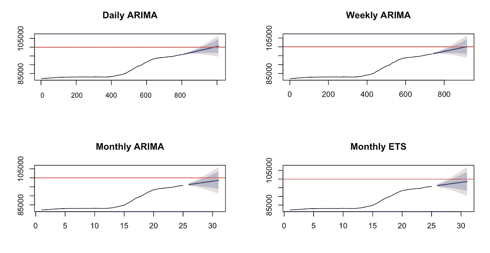

接下来，我们要测试哪些型号更可靠。我们将使用下面的“训练和测试”方法来评估模型。

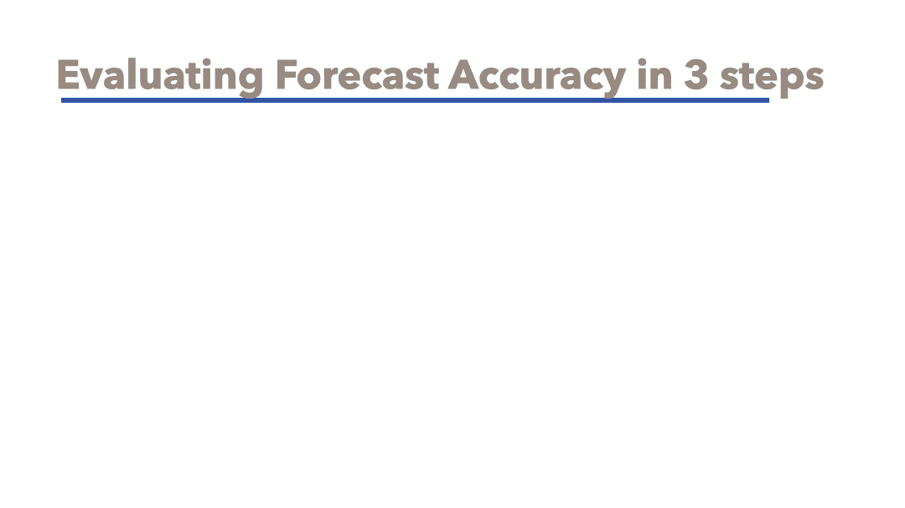

我把数据拆分成 21 个月作为训练数据，3 个月作为测试数据来测试准确性。

在我们测试了四个模型的准确性之后:

```
 ME        RMSE     MAE       MPE        MAPE**Daily   ARIMA**   **3.55192**   **101.0099**  **87.395**  **0.0032841335** **0.0918075**Weekly  ARIMA   219.605   287.5174  228.14  0.229669962  0.2386927Monthly ARIMA   48.6667   150.7824  149.33  0.05037247   0.1567438Monthly ETS     122.588   219.0160  207.47  0.127768354  0.2174692
```

结果:**日 ARIMA 模型表现最好**(精度)。

接下来，我们将深入探讨**每日 ARIMA 模型**是否可靠。如果不是，我们将测试第二好的模型。

首先，我们想看看汽车。ARIMA()函数非常适合:

```
> fit
Series: like 
ARIMA(0,**2**,3)> test$ttable
    Estimate     SE  t.value p.value
ma1  -0.7280 0.0374 -19.4414  **0.0000**
ma2  -0.1076 0.0434  -2.4808  **0.0133**
ma3  -0.0774 0.0370  -2.0945  **0.0366**
```

1.  当选择最低的 AICc 拟合时，它还显示双重差异数据是最佳拟合。 **✅**
2.  它表明 ma1、ma2 和 ma3 都很适合(低 p 值)。 **✅**

其次，我们需要检查**残差**:

```
> fit %>% residuals()%>% mean()
[1] 0.2174377
#the mean of risiduals is close to zero**✅**
```

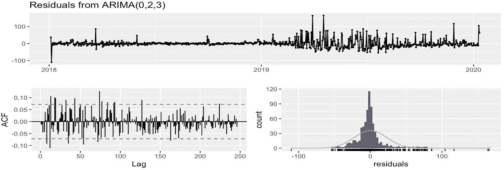

1.  残差看起来像白噪声序列。 **✅**
2.  93.6%的自相关位于蓝线之间，略低于 95%，但已经足够好了。 **✅**
3.  残差看起来像正态分布。 **✅**

```
qqnorm(residuals(fit)); qqline(residuals(fit))
```

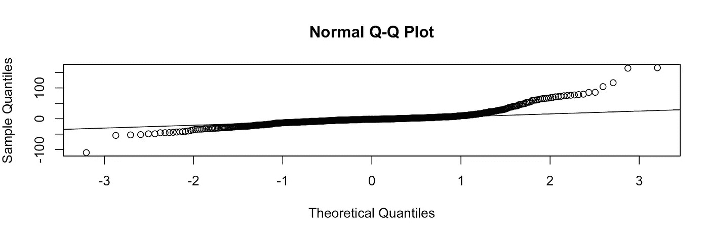

Q-Q 图显示这是一个相当好的分布。 **✅**

第三，我们可以看看训练和测试数据之间的区别:


经过三个月的训练和测试，MAPE(平均绝对百分比误差)约为 9%。对我来说足够准确，可以建立数据驱动的目标！

# 限制

> 我应该多久更新一次数据？

```
#Cross-validation
fc_function <- function(x, h){forecast(Arima(x, order=c(0,2,3)), h=h)}
e <- tsCV(like_xts, forecastfunction=fc_function, h=180)
mse <- colMeans(e^2, na.rm = T)
data.frame(h = 1:180, MSE = mse) %>%
  ggplot(aes(x = h, y = MSE)) + 
  geom_point()+
  ggtitle("Cross-Validation")
```

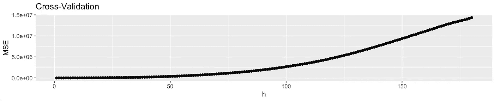

从这个交叉验证图中，我们可以看出 60 天内的预测相当准确。因此，在使用该模型时，最好每月至少更新一次数据。

# 结论和见解

> 我们终于可以让旧的方法停留在过去，拥抱数据分析的美丽！

> 一个社交媒体影响者如何将分析落实到实际应用中？

根据预测，如果我保持与过去模式相似的表现，我的粉丝页面将在 2020 年 5 月增长 950 个赞。因此，当我在制定这个月的计划时，我会知道如果我想在这方面付出很多努力，增长 950 个赞是不够的。相反，我应该设立一个更高的目标，例如，获得 1500 个新的喜欢。

而且，这对于我制定季度目标也是一个极好的帮助。我可以建立一个六个月的时间表。设立不切实际的目标再也不会发生了！

以前，为社交媒体账户设定目标高度依赖直觉和经验。现在，在分析的帮助下，我们终于可以让旧的方法停留在过去，拥抱数据分析的美丽！

如果您有任何想法或反馈想与我分享，请随时在 Linkedin 上给我发消息！

https://www.linkedin.com/in/kuanchengw/➡️