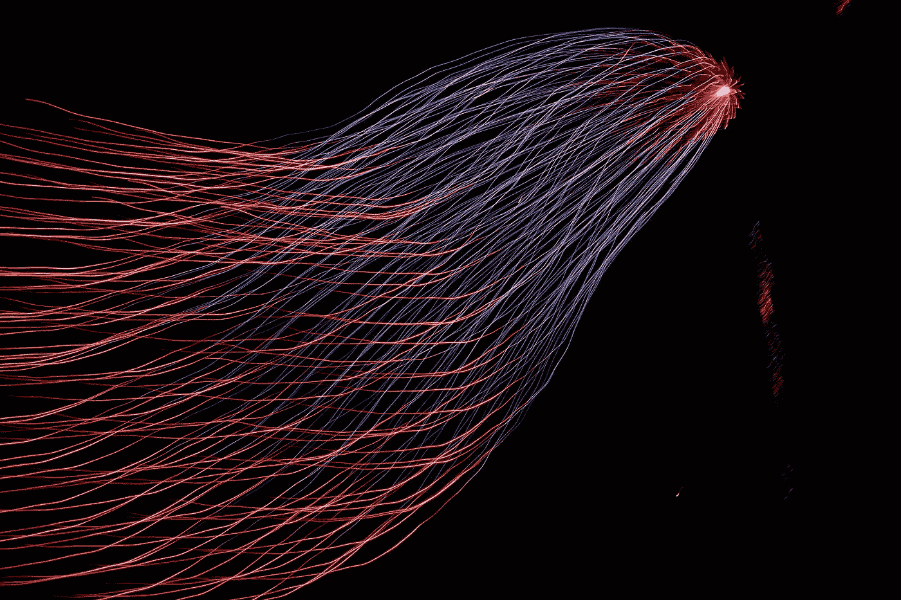

# 什么时候不应该用机器学习做预测？

> 原文：<https://towardsdatascience.com/when-shouldnt-you-use-machine-learning-to-make-predictions-61d25000ad88?source=collection_archive---------35----------------------->

## 机器学习/数据科学

## 极端不确定性世界中的机器学习

查尔斯·德鲁维奥在 [Unsplash](https://unsplash.com?utm_source=medium&utm_medium=referral) 上拍摄的照片

机器学习越来越好。越来越多的公司将机器学习作为其产品的一部分，因此越来越多影响我们的决策受到算法的影响。想知道在网飞看什么吗？一个非常强大的推荐引擎会提供接下来要看什么的建议。本能地，我们对由算法做出这样的决定感到舒服。但是考虑以下场景:

1.  2007 年的高盛。法国巴黎银行暂停赎回其 3 只基金(被广泛认为是大金融危机的开始)几天后，高盛首席财务官大卫·维尼亚告诉《金融时报》*我们看到连续几天出现 25 倍标准差的波动*。从字面上看，这种可能性非常低，以至于宇宙存在的时间还不足以让几个这样的事件发生。
2.  在 1977 年被美国宣布为非法之前，公司向居住在特定地区的人收取更高的服务费用(如信贷)是很常见的，而不考虑他们自己的信用历史。这被称为“红线”,对非裔美国人产生了不成比例的影响。虽然住在特定地区的人通常有不良的信用记录可能是真的，但这些地区的许多人肯定已经偿还了债务。我们大多数人会认为这种形式的“统计歧视”在道德上是可疑的。

在上述情况下，算法决策/机器学习的使用要么表现不佳，要么非常不合适。我最近读了一本很棒的书，书名是《彻底的不确定性——为不可知的未来做决策》，作者是默文·金和约翰·凯。这让我开始思考机器学习在预测中的作用。因此，给定一个具有代表性的数据样本的问题，在什么情况下应该对使用机器学习保持警惕？请继续阅读，了解广泛的高级框架…

# 不同种类的推理

照片由 [Tachina Lee](https://unsplash.com/@chne_?utm_source=medium&utm_medium=referral) 在 [Unsplash](https://unsplash.com?utm_source=medium&utm_medium=referral) 上拍摄

但是在我们考虑这个框架之前，考虑一下人类对世界的不同推理方式是有帮助的:

1.  **演绎推理**——比如“*我住在伦敦。伦敦在英国。因此我住在英国*。
2.  **归纳推理**——如“*对以往选举结果的分析表明，在有利的经济环境下，选民更倾向于执政党。2016 年美国总统大选中，他们的经济状况既不有利也不不利。因此，这次选举将是势均力敌的。这种推理利用过去发生的事件来推断未来可能的结果。*
3.  **溯因推理**——比如“*唐纳德·特朗普赢得 2016 年总统大选，是因为某些摇摆州对经济状况和身份的担忧，也是因为他的对手普遍不受欢迎*”。这种推理为一个独特的事件提供了最好的解释。人类在这方面很擅长，因为我们擅长过滤不同的、通常是相互矛盾的证据，以寻找最佳解释。

这些推理类型对应于以下机器复杂程度:

1.  **演绎推理** —传统软件很擅长这个。事实上，演绎推理是所有计算机代码的基础。例如，如果' *a* 等于' *b* ，'  b 等于' *c* '，那么逻辑上' *a* 等于' *c* '。
2.  **归纳推理** —机器学习通过使用过去的数据来推断未来，从而使用这种推理。安德烈·卡帕西称之为“软件 2.0”也许不是巧合。
3.  **溯因推理** —如果计算机可以这样推理，这将是真正的人工通用智能(软件 3.0)吗？计算机在这方面做得很差，因为使用哪些数据往往不明显，而且可用的数据很可能不完整。

因此，预测涉及的溯因推理越多，机器学习就越没用。根据定义，历史数据只在一定程度上对独特事件的反应有用。那么这和我们上面的两个场景有什么关系呢？

# 平稳性

照片由[亨特·哈里特](https://unsplash.com/@hharritt?utm_source=medium&utm_medium=referral)在 [Unsplash](https://unsplash.com?utm_source=medium&utm_medium=referral) 上拍摄

机器学习模型的一个关键假设是“平稳性”——也就是说，正在建模的潜在概率分布不会改变。简而言之，这意味着系统无法对当前对其未来状态的预测做出反应。

金融危机之前，银行使用风险价值模型(VaR)计算风险。这些模型开始于 20 世纪 80 年代，有两个关键输入——特定资产的每日回报和不同资产之间回报的方差。利用这两条信息，可以构建一个概率分布，详细说明一个资产组合在某一天的最大可能损失。这两个值是怎么计算出来的？当然是历史数据！

然而，这一历史数据是从银行没有遭受严重损失的时期得出的。同样，在 2007 年之前，抵押贷款违约主要是个人不幸(如失业)的结果，因此彼此之间没有关联。然而，当贷款发放取决于房价上涨时，房价的任何下跌都可能导致许多违约。因此，在某些情况下，被认为具有低共方差的资产最终具有非常高的共方差。该系统仅在某些条件下是静止的。

当然，在许多情况下，平稳性假设是有效的。例如，考虑一种机器学习算法，该算法观察肿瘤的图像并预测肿瘤是癌性的可能性。肿瘤肯定不会对算法做出的预测做出反应，并在未来采取更好的“伪装”。

这并不是说机器学习在不稳定的环境中没有用——它们肯定有用。然而，在解释这种模型的结果时需要格外小心。防止模型故障的几种建议方法:

1.  持续监控模型性能
2.  良好的判断力——《彻底的不确定性》的作者建议问一个简单的问题——“这里发生了什么？”因此，就高盛而言，这意味着要意识到，大金融危机的金融环境意味着，他们的资产比他们的模型所假设的更加相关，因此他们的模型价值有限。这当然是一种溯因推理。

所以，框架的第一部分如下:**模型环境越不稳定，对机器学习就越警惕。**

# 决策重要性

由[拍摄的照片](https://unsplash.com/@garri?utm_source=medium&utm_medium=referral)在 [Unsplash](https://unsplash.com?utm_source=medium&utm_medium=referral)

在第二种情况下，我们本能地对信贷价格的不同感到很不舒服，而不考虑个人的信用价值。走极端的话，想象一下法庭案件的判决完全由个人的总体情况决定，而不是由案件的具体情况决定。对个人来说，决定越重要，我们对以这种方式做出的决定就越不舒服。

我们的不公正感部分来自于没有考虑到每个案件的独特情况。仅仅因为他/她的背景的人通常是有罪的，有什么证据表明他/她犯了罪？如果一个事件是独特的，我们觉得似乎每个情况都需要根据它的优点来考虑。事实上，如前所述，事件越独特，机器学习在任何情况下提供合理预测的能力就越低。

我们的不公正感也部分源于错误决定对个人造成的后果。当然，我们都是独特的，但是很少有运动反对网飞建议的不公正。没被推荐好片的成本毕竟挺低的。然而，对于被自动算法筛选拒绝工作申请，我们可能会感到稍微不舒服一些。虽然我不是这个职位的典型申请人，但我肯定非常适合这个职位？为什么我被拒绝了？

越是独特的事件，我们越是以叙事的形式向对方解释事件。*例如，特朗普赢得 2016 年总统大选是对希拉里·克林顿*身份政治的回应。这些解释不能被有意义地描述为“最佳的”——事实上可能有许多相互竞争的解释。另一方面，机器学习根据历史相关性进行解释，因此很难解释和创建围绕某个事件的叙事。

同样，这并不是说机器学习不能用于重要的决策和独特的事件。然而，越是这样，我们越应该重视可解释性，并对我们模型的局限性做出正确的判断。

所以，框架的第二部分如下:**一个决策越重要&一个事件越独特，对机器学习就越警惕。**

# 例子

下面是几个机器学习的例子来说明这个框架的作用。

*   **一种癌症肿瘤检测算法**——问题是固定的，但决策的重要性很高。可解释性是必需的，需要小心使用。
*   **数据中心优化(就像在** [**这个**](https://deepmind.com/blog/article/deepmind-ai-reduces-google-data-centre-cooling-bill-40) **案例中)** —环境是静止的，每个决策的重要性都很低——很好地利用了机器学习。
*   **网飞推荐算法** —非平稳环境(人们的偏好随时间变化)但决策成本低——很好地利用了机器学习。
*   **临床试验预测** —不稳定的环境(新的试验设计范例、更高的护理标准)和决策成本高。可解释性是必需的，机器学习应该小心使用。

# 摘要

所以，总之，当你在处理机器学习的问题时，你应该问自己两个问题:

1.  模型环境是静止的吗？
2.  每个模型预测的重要性和独特性如何？

最后，如果这两种情况中的任何一种都适用，那么继续问《彻底的不确定性》的作者提出的问题总是值得的——“这里发生了什么”。它似乎只能以 Yogi Berra 的一句话来结束——“很难做出预测，尤其是对未来的预测”。