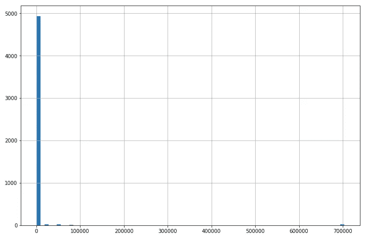
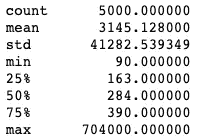

# 当中位数对平均数有利时

> 原文：<https://towardsdatascience.com/when-the-median-is-favorable-to-the-mean-c5b01b149ec0?source=collection_archive---------35----------------------->

## 选择更合适的描述性统计



运动鞋订单价格

*平均值*和*中位数*是描述数字数据时最常用的两个特征。这两者被称为集中趋势的度量，这意味着它们通过揭示数据的中心位置来描述一组数据。**平均值**是平均值——这是将所有数据相加，然后除以数据集中的点数得到的值。另一方面，**中位数**是一组数据中从最小到最大排序后的中间数。

```
*Data: 1, 8, 3* • Mean --> (1 + 8 + 3) / 3  =  **4**• Median --> 1, 3, 8 --> **3**
```

虽然平均值看起来像是描述数据时使用的逻辑度量，但情况并非总是如此。当谈到平均值时，它有一个关键的缺点——平均值很容易受到数据中异常值的影响。以上面图表中的数据为例。以上数据代表运动鞋订单的成本。正如我们所见，绝大多数数据都在图表的左侧。



数据的描述

当我们看一下上面的数据描述，我们看到 75%的运动鞋购买成本为 390 美元或更少。但是，如果我们取这个数据的平均值，我们的平均值将等于 3，145.13 美元。显然，这个数字不能非常准确地代表我们的数据。在这种情况下，一些严重的异常值(如果我们查看描述中的最大值，我们可以看到差异)会极大地影响平均值，因此，我们最好使用中值作为该数据集的报告指标。我们的中位数是 284 美元，利用运动鞋市场的领域知识，这更好地代表了我们的数据和运动鞋销售的总体情况。

显然，在决定使用哪种指标来表示数据之前，查看数据的分布是非常重要的。如果数据呈正态分布(均匀形状)，平均值可能是一个合适的描述符。然而，如果数据像我们在这里看到的那样是倾斜的，中间值可能是更好的选择。

## 参考资料:

[](https://statistics.laerd.com/statistical-guides/measures-central-tendency-mean-mode-median.php) [## 集中趋势测量

### 集中趋势的度量是试图通过识别集中趋势来描述一组数据的单个值

statistics.laerd.com](https://statistics.laerd.com/statistical-guides/measures-central-tendency-mean-mode-median.php)