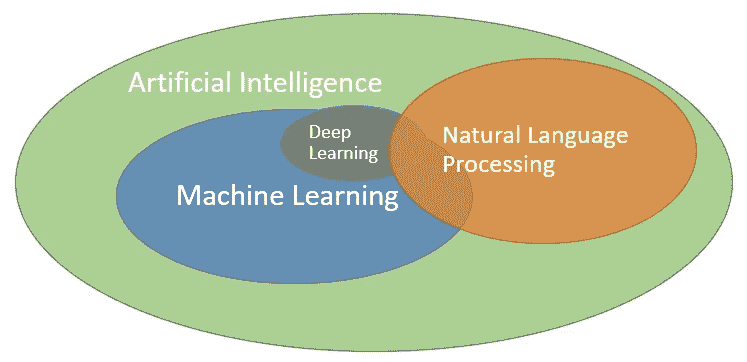

# 根据我的经验，何时不使用 AI 或使用它

> 原文：<https://towardsdatascience.com/when-to-not-use-ai-or-use-it-based-on-my-experience-abb58c063aba?source=collection_archive---------4----------------------->

照片由[V . babi enko](https://unsplash.com/@garri?utm_source=unsplash&utm_medium=referral&utm_content=creditCopyText)拍摄

我拥有机器学习博士学位，拥有 16 年在产品中部署可扩展解决方案和数据科学以实现收入和用户留存最大化的经验，包括 JustGiving 的 2600 万用户。作为初创企业和风投的导师和战略数据科学顾问，以下是我对何时应该和不应该使用 AI 的专家意见。经常有人问我如何开始使用人工智能？、*如何在我的产品中集成 AI*？”，或者“*我怎样才能用 AI* 获得研究资助？”鉴于我的[上有大量关于如何根据我的经验在数据科学、人工智能或大数据领域工作的文章](https://medium.com/@rfreeman/recommendations-for-working-in-data-science-ai-and-big-data-based-on-my-personal-experience-8dbc24be368c)，我想我会在一篇新的帖子中把这些内容放在一起，特别是关于何时适合使用人工智能以及**不适合使用人工智能**。

# 什么是人工智能(AI)？

首先，人工智能是一个通用术语，研究人脑和智能系统，人工智能通常是一个移动的目标，你可以说你的汽车，洗衣机和电话都内置了某种形式的人工智能。人工智能包括多学科，如数学、心理学、物理学、生物学、神经科学和计算机科学，旨在模仿计算机上的某种形式的智能。它是如何实现的是使用机器学习(ML)，自然语言处理(NLP)。其中进一步细分为神经网络、深度学习、强化、集成学习等。

让我们关注机器学习。人工智能不是魔法，人工智能和传统编程的主要区别在于，模型通过训练从数据中学习，而不是编写规则。模型具有参数和权重，当它使用不同的算法学习时，这些参数和权重被调整。然后，我们使用测试数据集来检查模型的准确性或性能。

# 在 B2B 和 B2C 的 ML / NLP 中，数据就是一切

没有大量的数据，你的算法将无法被训练或测试。例外情况是，例如遗传算法或强化学习，它们有一个适应度函数，奖励/后悔它们正在优化。但在我看来，它们在商业领域的应用有限，除非你在运行某种形式的模拟、驾驶、玩视频游戏、天气预报、有机化学建模等。我曾经与一家高性能计算( [HPC](https://en.wikipedia.org/wiki/Supercomputer) )供应商讨论过一个用例，我将在电子商务或 B2C 中使用模拟，他们很难回答我的问题。举例来说，如果我有 2600 万真实用户来运行测试，我为什么还要模拟事件或用户呢？

# 我没有数据，但仍然想使用人工智能

如果你没有产生、捕获或拥有历史数据，例如，你有一个新的用例或者是一个初创企业，那么仍然有可能使用 ML 和 NLP。通过寻找现有的开放数据集，如 [Kaggle](https://www.kaggle.com/datasets) 、 [AWS](https://registry.opendata.aws/) 、[美国政府的开放数据](https://www.data.gov/)或获得许可，为您的公司找到数据。这可以用来训练和测试你的初始模型。随着贵公司的发展和变得更加成熟，您将能够获取更多数据，并利用更好的培训/测试数据来改进模型。

# 数据科学家是合适的人选吗

对于那些仍然认为数据科学是 21 世纪最性感的工作的人来说，请再想一想，你将会把 80%的时间花在数据准备工作上，包括清理、标准化、规范化、塑造数据。只有这样，你才能达到人人都在谈论的*酷* *人工智能建模和可视化*。如果从这个角度来看，这与数据分析师和商业智能报告创建者日复一日所做的事情有许多相似之处，只是人工智能建模除外，因为他们对业务数据进行操作，并了解关键绩效指标和业务指标。我喜欢提升现有员工的技能，让他们成为数据科学家，因为他们拥有**业务和领域知识**，并且已经在处理数据。

此外，成功的数据科学家很少单独工作，他们需要成为更广泛的商业智能/数据工程团队的一部分，以某种可查询的形式准备数据，集成产品变化的开发人员/开发人员，以及帮助将模型推向生产环境的机器学习工程师。

# 离线数据科学与产品数据科学

您可以通过两种方式在组织中使用数据科学:*离线数据科学*和*产品中的数据科学*。

**离线数据科学**可以在笔记本电脑上进行，涵盖市场研究、客户/客户分析或 A/B 测试等任务。在这里，数据科学模型不会在生产中部署，而是对历史数据进行分析。这样做有巨大的好处，因为它补充了你现有的商业智能，并有助于塑造成功的产品。

> 在我看来，为了充分利用数据科学，它需要直接嵌入到您的产品和服务中，而不是事后思考，即您只是在事件或行动之后分析离线数据。这需要在预算、团队、高管支持和公司战略方面做出更大的承诺。

**产品中的数据科学**要复杂得多，成本也高得多，你需要合适的团队。我见过或采访过的很多数据科学家都不是优秀的开发人员。他们需要考虑使用笔记本以外的东西，笔记本有利于探索，但不利于将模型部署到产品中。一些云提供商确实帮助创建批量推理引擎和推理 API。然而，重要的是他们理解和学习最佳软件工程实践，并开始像开发人员一样思考测试、部署管道和可伸缩性。我也不认为他们应该独自完成这项工作，你需要 DevOps、开发人员和数据/机器学习工程师与他们合作。如果您希望在产品中部署模型，以便在用户浏览您的网站或应用程序时，直接向他们提供匹配、建议或预测，这是非常重要的。每一个网站和应用程序都在完成屏幕时间，所以任何改进都可以在保留(B2C)或生产力(B2B)方面产生巨大的差异。然后，你当然需要衡量模型相对于随机分组和/或硬编码规则的性能，如果性能下降，就采取行动。

# 值得加 AI 吗？

在商业中，我们经常谈论投资回报(ROI)来建造或购买任何东西。这同样适用于 ML 和 NLP，它会花费你多少精力、时间和金钱，相对于拥有一个全栈开发人员可以在一天内部署的硬编码规则集，回报会是什么？

让我们看看人工智能炒作之外的东西:

*   **用例**:会用到哪里？我发现，在商业中，这主要是在匹配、推荐、预测或向你所在领域或部门的用户或客户提出建议的领域。
*   **ROI**:it 是否会通过增加收入/生产率和/或减少成本/时间来增加价值。总是将这与使用人类完成任务或使用没有人工智能的正常软件开发过程进行比较。
*   **易于支持** : [Netflix Prize](https://en.wikipedia.org/wiki/Netflix_Prize) 是一个很好的例子，当性能最好的模型由于[工程成本和在产品](https://www.wired.com/2012/04/netflix-prize-costs/)中运行的复杂性而没有用于生产时。简单模型、预训练模型或没有人工智能更好，你可以更快地进入市场，特别是如果这些已经是解决的用例。例外情况是当你处理一个新的用例，做真正的研究开发，或者当然是你发表研究论文的大学研究。
*   **监控**:您需要过程来监控模型的性能，因为任何推理的退化都可能影响 ROI。如果发生这种情况，您需要有应急措施，并快速回滚或重新培训新的模型。
*   您是否拥有**正确的数据**:来自现有内部和/或外部来源的适合所选用例的充足且正确的数据。
*   **梦之队**:数据科学家不能孤立工作，他们需要被开发人员、工程师、产品经理和 DevOps 团队包围。

只是让数据科学团队重聚

## 后续步骤

大多数具有开发人员或计算机科学背景的人应该能够理解 ML 和 NLP 的概念。不要试图只招募数据科学家的人工智能大军，他们仍然需要**正确的数据**、**用例**以及 **ROI** 和**梦之队**，这是我认为你在制定数据科学相关的商业案例、研究提案或与投资者交谈时应该开始做的事情。如果您有任何问题/意见，或者如果您需要短期指导、战略咨询或数据科学执行顾问，请随时通过 LinkedIn 与我联系。