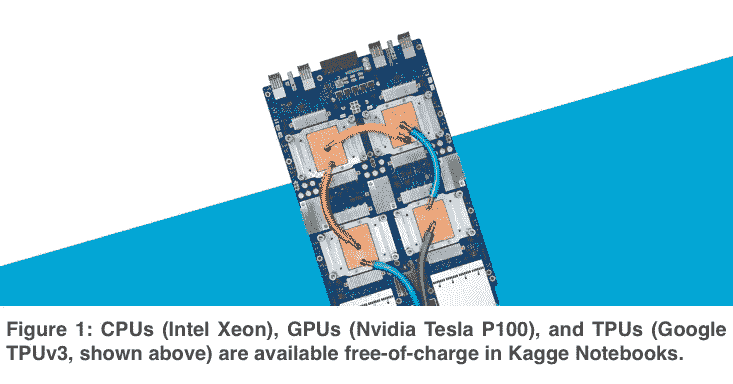
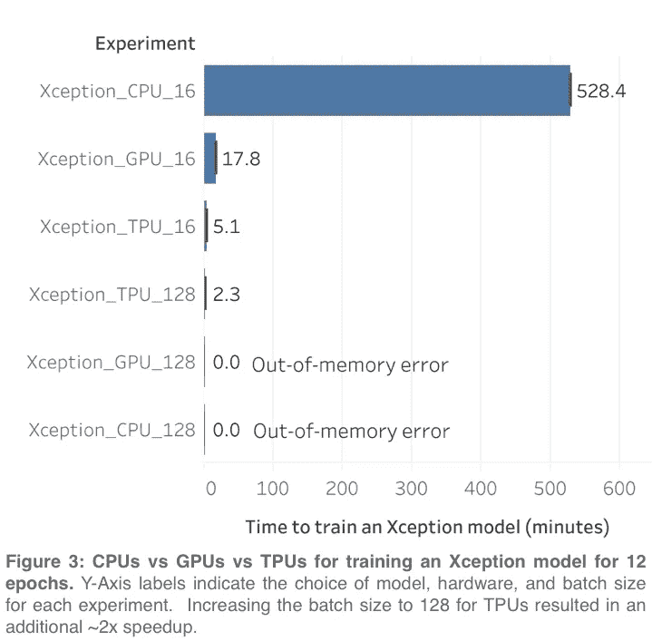
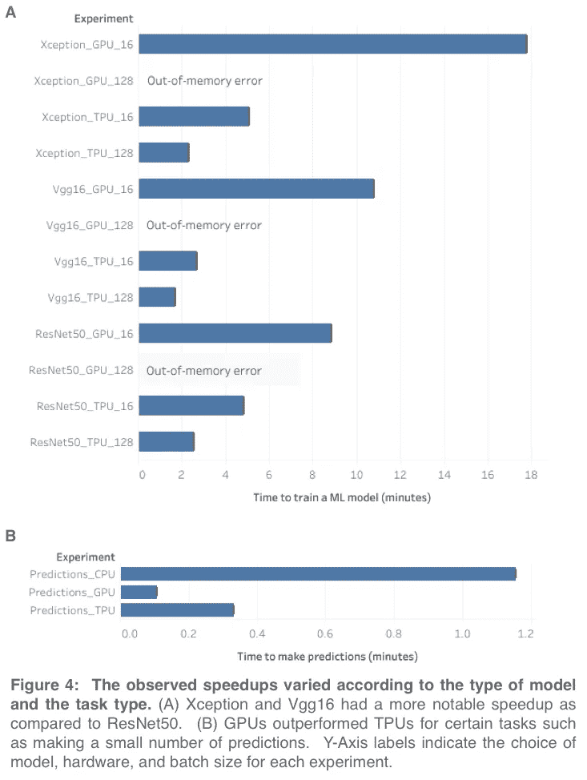
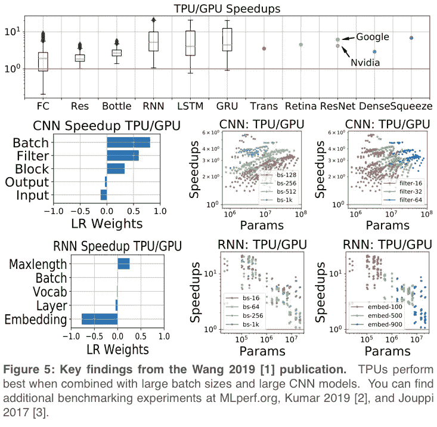

# Kaggle 比赛中什么时候用 CPUs vs GPUs vs TPUs？

> 原文：<https://towardsdatascience.com/when-to-use-cpus-vs-gpus-vs-tpus-in-a-kaggle-competition-9af708a8c3eb?source=collection_archive---------2----------------------->

每一个机器学习算法的背后都是数千兆赫兹的硬件运算。在设置 Kaggle 笔记本时，您可能已经注意到了几个处理器选项，但哪一个最适合您呢？在这篇博文中，我们比较了使用 CPU([英特尔至强](https://www.intel.com/content/www/us/en/products/processors/xeon.html) *)与 GPU([英伟达特斯拉 P100](https://www.nvidia.com/en-us/data-center/tesla-p100/) )与 TPUs ( [谷歌 TPU v3](https://cloud.google.com/tpu/) )来训练使用 [tf.keras](https://keras.io/) 编写的机器学习模型的相对优缺点(图 1**)。我们希望这能帮助你理解这些选项，并为你的项目做出正确的选择。

**我们如何准备考试**

为了比较 CPU vs GPU vs TPUs 在完成常见数据科学任务方面的性能，我们使用 [tf_flowers 数据集](https://www.tensorflow.org/datasets/catalog/tf_flowers)来训练一个卷积神经网络，然后使用三个不同的后端运行完全相同的代码三次(CPU vs GPU vs TPUs；GPU 是英伟达 P100，配有英特尔至强 2GHz(双核)CPU 和 13GB RAM。TPU 为 TPUv3 (8 核)，配有英特尔至强 2GHz (4 核)CPU 和 16GB RAM。附带的[教程笔记本](https://www.kaggle.com/mgornergoogle/flowers-with-keras-and-xception-fine-tuned-on-gpu)展示了让您的 TPU 发挥最佳性能的一些最佳实践。

例如:

1.  使用分片文件的数据集([例如。TFRecord](https://www.kaggle.com/paultimothymooney/convert-kaggle-dataset-to-gcs-bucket-of-tfrecords)
2.  使用 [tf.data](https://www.tensorflow.org/guide/data) API 将训练数据传递给 TPU
3.  使用大批量(例如 batch_size=128)

通过在工作流中添加这些先行步骤，可以避免常见的 I/O 瓶颈，否则会阻止 TPU 充分发挥其潜力。你可以通过访问官方的 [Kaggle TPU 文档](https://www.kaggle.com/docs/tpu)找到优化你的代码在 TPUs 上运行的额外技巧。

**硬件表现如何**

我们测试的三种硬件类型之间最显著的差异是使用 [tf.keras](https://keras.io/) 训练模型所用的速度。tf.keras 库是最受欢迎的机器学习框架之一，因为 tf.keras 使快速试验新想法变得容易。如果您花更少的时间编写代码，那么您就有更多的时间来执行计算，如果您花更少的时间等待代码运行，那么您就有更多的时间来评估新的想法(图 2)。tf.keras 和 TPUs 在参加[机器学习比赛](https://kaggle.com/c/flower-classification-with-tpus)时是一个强大的组合！

在我们的第一个实验中，我们对所有三种硬件类型使用了相同的代码([官方教程笔记本](https://www.kaggle.com/mgornergoogle/flowers-with-keras-and-xception-fine-tuned-on-gpu)的修改版本*** ),这需要使用非常小的批量 16，以避免 CPU 和 GPU 的内存溢出错误。在这些条件下，我们观察到，在训练一个[异常](https://keras.io/applications/#xception)模型时，与 CPU 相比，TPU 的速度提高了约 100 倍，与 GPU 相比，速度提高了约 3.5 倍(图 3)。由于 TPU 在处理大批量时运行效率更高，我们还尝试将批量增加到 128，这导致 TPU 的速度提高了约 2 倍，并且出现了 GPU 和 CPU 的内存不足错误。在这些条件下，TPU 能够训练一个[exception](https://keras.io/applications/#xception)模型，速度比之前实验中的 GPU 快 7 倍以上****。

观察到的模型训练加速因模型类型而异，Xception 和 Vgg16 的性能优于 ResNet50(图 4)。模型训练是我们观察到 TPU 以如此大的优势胜过 GPU 的唯一任务类型。例如，我们观察到，在执行少量预测时，我们手中的 TPU 比 CPU 快大约 3 倍，比 GPU 慢大约 3 倍(TPU 在某些情况下进行预测时表现异常，例如[对非常大的批次进行预测](https://docs.google.com/presentation/d/1O49AkNyYV48n0X4nWr7KE-5aask88pz9gBSQ26ZG-5o/edit#slide=id.g50ce3d3866_0_1590)，这在本实验中不存在)。

为了补充这些结果，我们注意到[王*等人。al*](https://arxiv.org/abs/1907.10701) 开发了一个名为 ParaDnn [1]的严格基准，可以用来比较不同硬件类型的性能，用于训练机器学习模型。王*等人用的就是这种方法。al* 能够得出结论，当使用 TPU 而不是 GPU 时，参数化模型的性能优势从 1 倍到 10 倍不等，真实模型的性能优势从 3 倍到 6.8 倍不等(图 5)。当与分片数据集、大批量和大模型相结合时，TPU 表现最佳。

**训练车型时的价格考虑**

虽然我们的比较对硬件一视同仁，但在价格上有相当大的差异。**TPU 的价格大约是 GPU 的 5 倍(Nvidia Tesla P100[GPU 的](https://www.nvidia.com/en-us/data-center/tesla-p100/)[1.46 美元/小时](https://cloud.google.com/compute/gpus-pricing)对比[GPU 的](https://cloud.google.com/tpu/pricing)[8.00 美元/小时](https://cloud.google.com/tpu/)谷歌 TPU v3 对比[4.50 美元/小时](https://cloud.google.com/tpu/pricing)在 [GCP](https://cloud.google.com/pricing/) 具有“按需”访问功能的 TPUv2)。如果您试图优化成本，那么使用 TPU 是有意义的，如果它训练您的模型的速度至少是使用 GPU 训练相同模型的 5 倍。**

**当数据以[分片格式](https://www.kaggle.com/paultimothymooney/convert-kaggle-dataset-to-gcs-bucket-of-tfrecords)存储在 [GCS 存储桶](https://www.kaggle.com/paultimothymooney/how-to-move-data-from-kaggle-to-gcs-and-back)中，然后以大批量传递给 TPU 时，我们始终观察到模型训练速度提高了约 5 倍，因此我们向熟悉 [tf.data](http://tf.data) API 的注重成本的消费者推荐 TPU。**

**一些机器学习实践者优先考虑减少模型训练时间，而不是优先考虑减少模型训练成本。对于那些只想尽可能快的训练他们的模型的人来说，TPU 是最好的选择。如果你花更少的时间训练你的模型，那么你就有更多的时间迭代新的想法。但是不要相信我们的话——你可以通过在一个免费的 [Kaggle 笔记本](https://www.kaggle.com/docs/kernels#the-kernels-environment)上运行你自己的代码来评估 CPU、GPU 和 TPU 的性能优势。Kaggle 用户已经在尝试 TPU 和文本数据方面获得了很多乐趣和成功:查看[这个论坛帖子](https://www.kaggle.com/c/tensorflow2-question-answering/discussion/127333)，它描述了 TPU 如何被用来训练一个 BERT transformer 模型，以在最近的 [Kaggle 比赛](https://www.kaggle.com/c/tensorflow2-question-answering)中赢得 8000 美元(二等奖)。**

****您应该选择哪个硬件选项？****

**总之，我们推荐 CPU 是因为它们的多功能性和大内存容量。当你想加快各种数据科学工作流的速度时，GPU 是 CPU 的一个很好的替代选择，当你特别想尽可能快地训练一个机器学习模型时，TPU 是最好的选择。**

**通过针对您正在使用的特定硬件优化您的代码，您可以获得更好的结果，我们认为将针对 GPU 优化的代码的运行时与针对 TPU 优化的代码的运行时进行比较是非常有趣的。例如，记录使用 GPU 加速库(如 [RAPIDS.ai](https://rapids.ai/) )训练梯度增强模型所需的时间，然后将该时间与使用 TPU 加速库(如 [tf.keras](https://keras.io/) )训练深度学习模型所需的时间进行比较，这将非常有趣。**

**一个人训练一个准确的机器学习模型最少需要多少时间？你一天能评估多少不同的想法？当与 tf.keras 结合使用时，TPU 允许机器学习实践者花更少的时间编写代码，花更少的时间等待他们的代码运行——留下更多的时间来评估新想法和提高自己在 [Kaggle 比赛](http://kaggle.com/c/flower-classification-with-tpus)中的表现。**

# **引用的作品**

**[1] Wang Y，Wei G，Brooks D. [对深度学习的、GPU 和 CPU 平台进行基准测试](https://arxiv.org/pdf/1907.10701.pdf)。2019. *arXiv: 1907.10701* 。**

**[2] Kumar S，Bittorf V 等。艾尔。[在谷歌 TPU-v3 吊舱上缩放 MLPerf-0.6 模型](https://arxiv.org/pdf/1909.09756.pdf)。2019. *arXiv: 1909.09756* 。**

**[3]茹皮·恩·扬等。艾尔。[张量处理单元的数据中心内性能分析](https://ieeexplore.ieee.org/abstract/document/8192463)。2017. *2017 年 ACM/IEEE 第 44 届计算机体系结构国际年会(ISCA)* 。**

# **脚注**

******* CPU 类型因可变性而异。除了英特尔至强处理器，您还可以分配到英特尔 Skylake、英特尔 Broadwell 或英特尔 Haswell 处理器。GPU 是英伟达 P100，配有英特尔至强 2GHz(双核)CPU 和 13GB RAM。TPU 为 TPUv3 (8 核)，配有英特尔至强 2GHz (4 核)CPU 和 16GB RAM。**

****图 1 图片来自[https://cloud . Google . com/blog/products/ai-machine-learning/cloud-TPU-breaks-scalability-records-for-ai-inference，](https://cloud.google.com/blog/products/ai-machine-learning/cloud-tpu-breaks-scalability-records-for-ai-inference)经许可。**

*****修改了教程笔记本，以保持三个不同后端之间的参数(如 batch_size、learning_rate 等)一致。**

****** CPU 和 GPU 实验使用了 16 的批处理大小，因为它允许 Kaggle 笔记本从上到下运行，而没有内存错误或 9 小时超时错误。当批量增加到 128 时，只有支持 TPU 的笔记本电脑能够成功运行。**