# 何时使用 Pandas transform()函数

> 原文：<https://towardsdatascience.com/when-to-use-pandas-transform-function-df8861aa0dcf?source=collection_archive---------6----------------------->

## 一些最有用的熊猫把戏


照片由[巨浪 926](https://unsplash.com/@billow926?utm_source=unsplash&utm_medium=referral&utm_content=creditCopyText) 在 [Unsplash](https://unsplash.com/s/photos/programming-pandas?utm_source=unsplash&utm_medium=referral&utm_content=creditCopyText) 上拍摄

Pandas 是一个令人惊叹的库，它包含大量用于操作数据的内置函数。其中，`transform()`在你想要操作行或列的时候非常有用。

在本文中，我们将介绍以下最常用的熊猫`transform()`功能:

1.  转变价值观
2.  结合`groupby()`的成果
3.  过滤数据
4.  在集团层面处理缺失值

请查看我的 [Github repo](https://github.com/BindiChen/machine-learning/blob/master/data-analysis/013-pandas-transform/pandas-transform.ipynb) 获取源代码

# 1.转变价值观

我们来看看`pd.transform(**func**, **axis=0**)`

*   第一个参数`*func*`是指定用于操作数据的函数。它可以是函数、字符串函数名、函数列表或轴标签字典- >函数
*   第二个参数 ***轴*** 是指定`*func*`应用于哪个轴。`0`用于将`*func*`应用于每一列，而`1`用于将`*func*`应用于每一行。

让我们借助一些例子来看看`transform()`是如何工作的。

## 一项功能

我们可以传递一个函数给`func`。例如

```
df = pd.DataFrame({'A': [1,2,3], 'B': [10,20,30] })**def plus_10(x):
    return x+10**df.transform(**plus_10**)
```

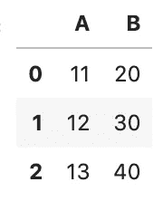

您也可以使用 lambda 表达式。下面是`plus_10()` **:** 的λ当量

```
df.transform(**lambda x: x+10**)
```

## 字符串函数

我们可以将任何有效的熊猫字符串函数传递给`func`，例如`'sqrt'`:

```
df.transform(**'sqrt'**)
```

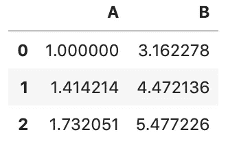

## 函数列表

`*func*`可以是功能列表。例如**编号**中的`sqrt`和`exp`:

```
df.transform(**[np.sqrt, np.exp]**)
```

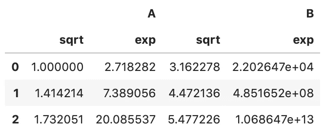

## 轴标签的字典->函数

`*func*`可以是轴标签的字典- >功能。例如

```
df.transform(**{
    'A': np.sqrt,
    'B': np.exp,
}**)
```

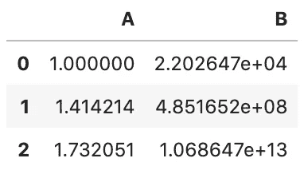

# 2.组合`groupby()`结果

熊猫`transform()`最引人注目的用途之一是结合`grouby()`的结果。

让我们借助一个例子来看看这是如何工作的。假设我们有一个关于连锁餐厅的数据集

```
df = pd.DataFrame({
  'restaurant_id': [101,102,103,104,105,106,107],
  'address': ['A','B','C','D', 'E', 'F', 'G'],
  'city': ['London','London','London','Oxford','Oxford', 'Durham', 'Durham'],
  'sales': [10,500,48,12,21,22,14]
})
```


我们可以看到每个城市都有多家餐厅有销售。我们想知道“每家餐厅在该城市的销售额占多大比例”。预期的输出是:

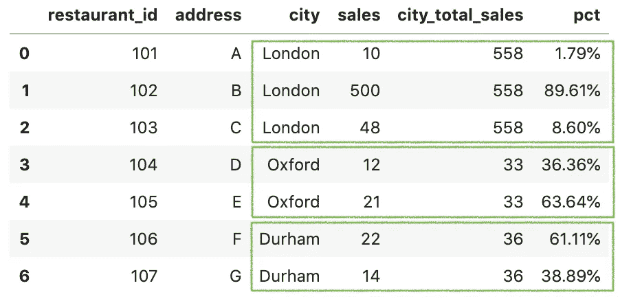

这个计算中棘手的部分是，我们需要得到一个***city _ total _ sales***并将其组合回数据中，以便得到百分比。

有两种解决方案:

1.  `groupby()`、`apply()`和`merge()`
2.  `groupby()`和`transform()`

## 解决方案 1: `groupby()`、`apply()`和`merge()`

第一个解决方案是用`groupby()`分割数据，用`apply()`聚集每个组，然后用`merge()`将结果合并回原始数据帧

**第一步:用** `**groupby()**` **和** `**apply()**` **计算出*城市 _ 总 _ 销售额***

```
city_sales = df.**groupby('city')**['sales']
             .**apply(sum)**.rename('city_total_sales').reset_index()
```

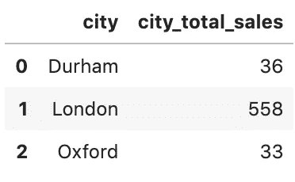

`groupby('city')`通过对城市列进行分组来拆分数据。对于每个组，函数`sum`应用于 ***销售*** 列，以计算每个组的总和。最后，新列被重命名为***city _ total _ sales***，索引被重置(注意:`reset_inde()`需要清除`groupby('city')`生成的索引)。

此外，熊猫还有一个内置的`[sum()](https://pandas.pydata.org/pandas-docs/stable/reference/api/pandas.Series.sum.html#pandas.Series.sum)`功能，下面是熊猫的`sum()`等价物:

```
city_sales = df.groupby('city')['sales']
             **.sum()**.rename('city_total_sales').reset_index()
```

**第二步:使用** `**merge()**` **函数合并结果**

```
df_new = pd.**merge**(df, **city_sales**, how='left')
```

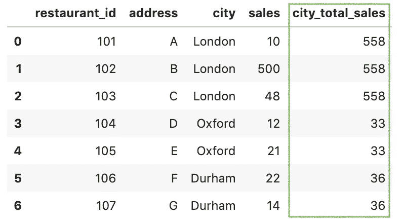

对于左外连接，使用`merge()`和`how='left'`将分组结果合并回原始数据帧。

**第三步:计算百分比**

最后，可以计算百分比并进行格式化。

```
df_new['pct'] = **df_new['sales'] / df_new['city_total_sales']**
df_new['pct'] = df_new['pct'].apply(**lambda x: format(x, '.2%')**)
```

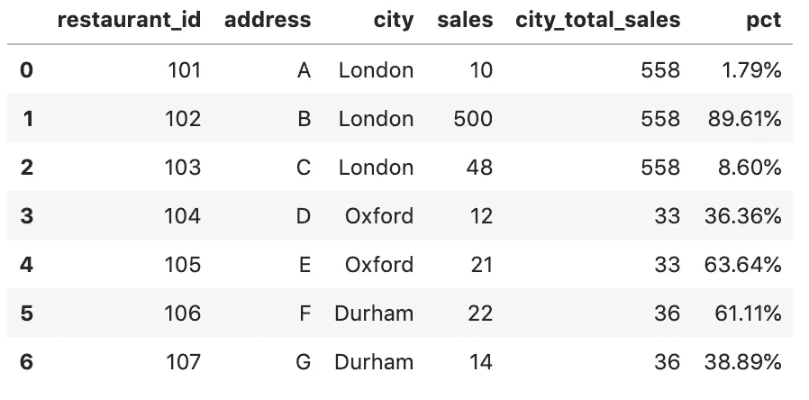

这当然有助于我们的工作。但是这是一个多步骤的过程，需要额外的代码来获得我们需要的形式的数据。

我们可以使用`transform()`函数有效地解决这个问题

## 解决方案二:`groupby()`和`transform()`

这个解决方案改变了游戏规则。一行代码就可以解决应用和合并问题。

**第一步:使用** `**groupby()**` **和** `**transform()**` **计算*城市 _ 总 _ 销售额***

执行转换后，转换函数会保留与原始数据集相同数量的项目。因此，使用`groupby`后跟`transform(sum)`的一行步骤返回相同的输出。

```
df['city_total_sales'] = df.groupby('city')['sales']
                           .**transform('sum')**
```

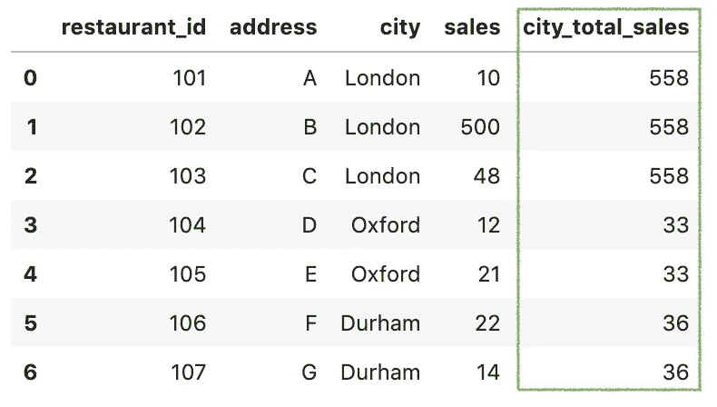

**第二步:计算百分比**

最后，这与求解百分比的方法相同。

```
df['pct'] = **df['sales'] / df['city_total_sales']**
df['pct'] = df['pct'].apply(**lambda x: format(x, '.2%')**)
```

# 3.过滤数据

`transform()`也可以用来过滤数据。这里我们试图获得城市总销售额大于 40 的记录

```
df[df.groupby('city')['sales'].transform('sum') > 40]
```

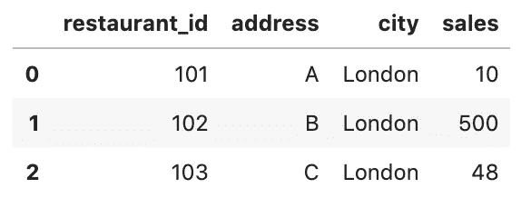

# 4.在组级别处理缺失值

Pandas `transform()`的另一个用途是在组级别处理缺失值。让我们通过一个例子来看看这是如何工作的。

这是一个用于演示的数据框架

```
df = pd.DataFrame({
    'name': ['A', 'A', 'B', 'B', 'B', 'C', 'C', 'C'],
    'value': [1, np.nan, np.nan, 2, 8, 2, np.nan, 3]
})
```

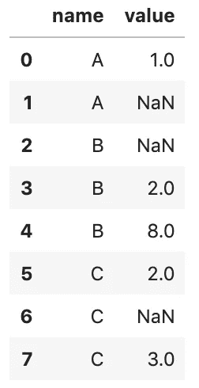

在上面的例子中，数据可以按名称分成三组，每组都有缺失值。[替换缺失值的常见解决方案是用均值](/working-with-missing-values-in-pandas-5da45d16e74)替换 NaN。

我们来看看各组的平均值。

```
df.groupby('name')['value'].mean()name
**A    1.0
B    5.0
C    2.5**
Name: value, dtype: float64
```

这里我们可以使用`transform()`用组平均值替换缺失值。

```
df['value'] = df.groupby('name')
                .**transform(lambda x: x.fillna(x.mean()))**
```

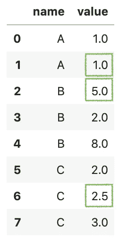

# 好了

感谢阅读。

请在我的 Github 上查看[笔记本的源代码。](https://github.com/BindiChen/machine-learning/blob/master/data-analysis/013-pandas-transform/pandas-transform.ipynb)

如果你对机器学习的实用方面感兴趣，请继续关注。

## 你可能会对我的其他一些熊猫文章感兴趣:

*   [熊猫的应用()和变换()的区别](https://medium.com/@bindiatwork/difference-between-apply-and-transform-in-pandas-242e5cf32705)
*   [使用熊猫方法链接提高代码可读性](https://medium.com/@bindiatwork/using-pandas-method-chaining-to-improve-code-readability-d8517c5626ac)
*   [在熊猫数据帧中处理日期时间](/working-with-datetime-in-pandas-dataframe-663f7af6c587)
*   [熊猫阅读 _csv()你应该知道的招数](https://medium.com/@bindiatwork/all-the-pandas-read-csv-you-should-know-to-speed-up-your-data-analysis-1e16fe1039f3)
*   [用 Pandas read_csv()](/4-tricks-you-should-know-to-parse-date-columns-with-pandas-read-csv-27355bb2ad0e) 解析日期列应该知道的 4 个技巧

更多可以从我的 [Github](https://github.com/BindiChen/machine-learning) 中找到