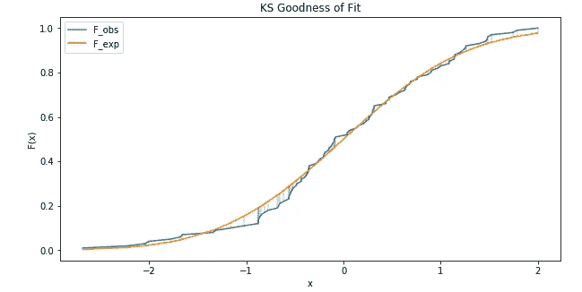
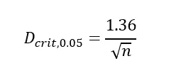
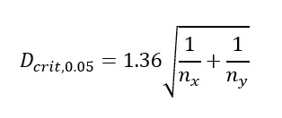
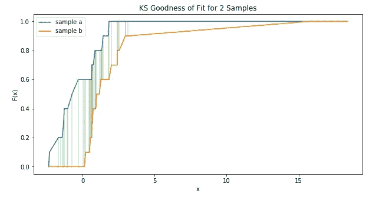

# 何时使用柯尔莫哥洛夫-斯米尔诺夫检验

> 原文：<https://towardsdatascience.com/when-to-use-the-kolmogorov-smirnov-test-dd0b2c8a8f61?source=collection_archive---------4----------------------->

## 理论、应用和解释

在 [Unsplash](https://unsplash.com?utm_source=medium&utm_medium=referral) 上由 [Nerfee Mirandilla](https://unsplash.com/@nerfee?utm_source=medium&utm_medium=referral) 拍摄

# 动机

假设检验在许多应用中被使用，而且这种方法看起来很简单。然而，很多时候，我们往往会忽略潜在的假设，并需要问:我们是在拿苹果和桔子做比较吗？当数据科学家决定放弃基于缺失特征的观察时，问题也出现了。

假设我们有特征`f1, f2,… fn`和一个二元目标变量`y`。假设许多观察结果缺少一个或多个特征的信息，我们决定删除这些观察结果(行)。通过这样做，我们可能已经改变了一个特征`fk`的分布。将这个问题公式化为一个问题:删除观测值会改变特征的分布吗？这个变化**意义重大**吗？

在这篇文章中，我们将提出一些 t 检验的假设，以及 Kolmogorov-Smirnov 检验如何验证或否定这些假设。也就是说，尽早声明 t 检验和 KS 检验测试的是不同的东西是至关重要的。

对于每一步，我们将介绍理论并用 Python 3 实现代码。如需完整示例，请随意阅读 jupyter 笔记本:[https://github . com/NadimKawwa/Statistics/blob/master/KS _ test . ipynb](https://github.com/NadimKawwa/Statistics/blob/master/KS_Test.ipynb)

# t 检验的局限性

有些情况下，我们应该怀疑 t 检验的结果。t-检验假设情况产生正常的数据，不同之处仅在于一种情况下的平均结果不同于另一种情况下的平均结果。

也就是说，如果我们对来自非正态分布的数据进行 t 检验，我们可能会增加出错的风险。根据[中心极限定理](https://en.wikipedia.org/wiki/Central_limit_theorem) (CLM)，随着对照组/治疗组变得足够大，t 检验变得更加稳健。

然而，在我们有足够大的样本的情况下，t 检验仍然可能失败。

## 具有相同平均值的小型数据集

考虑下面代码块中随机生成的两个样本:

两个样本都是从具有相同均值的正态分布中生成的，但是通过目测，很明显两个样本是不同的。t 检验可能无法发现这种差异，并自信地说两个样本是相同的。

使用 [scipy.ttest.ttest_ind](https://docs.scipy.org/doc/scipy/reference/generated/scipy.stats.ttest_ind.html) 对这些样本进行 t 检验，得出大于 0.05 的 p 值。因此，我们不能拒绝相同平均分的零假设。

## 不同均值相同分布

假设我们生成两个均值不同的小数据集，但非正态分布掩盖了差异，如下面的代码所示:

如果我们事先知道数据不是正态分布的，我们就不会一开始就使用 t 检验。考虑到这一点，我们引入一种方法来检查我们的观察值是否来自参考概率分布。

# KS 测试

KS 检验是非参数和无分布的检验:它对数据的分布不做任何假设。KS 检验可以用来比较一个样本和一个参考概率分布，或者比较两个样本。

假设我们有我们认为来自分布 p 的观察值`x1, x2, …xn`，KS 检验用于评估:

*   零假设:样本确实来自 P
*   替代假设:样本不是来自 P

为了建立 KS 检验的直觉，我们后退一步，考虑描述性统计。众所周知，正态分布的平均值为 0，标准差为 1。因此，我们预计不超过 15%的数据低于平均值 1 个标准差以上。

我们将使用[累积分布函数](https://en.wikipedia.org/wiki/Cumulative_distribution_function) (CDF)。更具体地说，我们将使用[经验分布函数](https://en.wikipedia.org/wiki/Cumulative_distribution_function#Empirical_distribution_function) (EDF):生成样本中点的累积分布函数的估计值。

CDF 的用处在于它唯一地表征了概率分布。我们希望将观察数据的经验分布函数 **F_obs** 与零假设相关的累积分布函数 **F_exp** 进行比较。

# 测试样本是否属于分配

在第一个例子中，假设我们的样本来自正态分布`N(0,1)`。我们希望将观察数据的经验分布函数与零假设相关的累积分布函数进行比较。

下面是设置这个实验的方法:

*   按升序对观察值进行排序
*   计算观测值的 CDF
*   对于每个观测值，xi 计算 F_exp(xi) = P(Z ≤ xi)
*   计算绝对差值
*   记录最大差异
*   计算临界值
*   拒绝或接受零假设

实现相当简单:

下面的图直观地展示了我们正在做的事情。观察值`F_obs`由蓝色曲线表示，而理论值`F_exp`由橙色曲线表示。垂直的绿线是观测值和理论值之间的差异

如果我们的最大差异小于`D_Crit`,我们无法拒绝零假设。95%时的临界值近似为:

其中 n 是样本数。

# 两个样品的 KS

给定两个样本`x`和`y`，我们希望测试它们是否来自同一个分布 p。首先改变的是接近 95%临界值的公式:

其中`n_x`和`n_y` 是每个样本中的观察次数。

我们将从两个分布中随机生成两个随机样本:

*   常态
*   [对数正态](https://en.wikipedia.org/wiki/Log-normal_distribution)

为了比较这两者，我们实施了以下步骤:

*   订购每个样品
*   串联成一个排序数组
*   计算两个样本的观测累积分布函数
*   计算它们的最大绝对差值`D_n`
*   对比`D_crit`

在实现代码之前，我们在下面的图中展示了我们的视觉目标。查看 CDF，我们可以直观地说，样本 a 和 b 不来自相同的分布。

在下面的代码块中，我们将实现前两步。

接下来，我们利用 scipy 的 [percentileofscore](https://docs.scipy.org/doc/scipy/reference/generated/scipy.stats.percentileofscore.html) 来计算 CDF，如下所示:

在我们的例子 `D_crit=0.408`中，不出所料，我们得到了`D_n=0.6`，我们拒绝了两者来自同一分布的无效假设。

# 结论

我们使用了 KS 检验来比较一个样本和一个参考概率分布，或者比较两个样本。在许多日常应用中，测试用于验证假设并帮助指导决策。

为了更快地实现，scipy 包提供了一个针对[拟合优度](https://docs.scipy.org/doc/scipy-0.14.0/reference/generated/scipy.stats.kstest.html)或[两个样本](https://docs.scipy.org/doc/scipy-0.14.0/reference/generated/scipy.stats.ks_2samp.html)的 KS 测试。

# 参考

**维基百科**:[https://en . Wikipedia . org/wiki/Kolmogorov % E2 % 80% 93s mirnov _ test](https://en.wikipedia.org/wiki/Kolmogorov%E2%80%93Smirnov_test)[https://en . Wikipedia . org/wiki/Cumulative _ distribution _ function](https://en.wikipedia.org/wiki/Cumulative_distribution_function)

**圣本笃学院和圣约翰大学**:[http://www.physics.csbsju.edu/stats/KS-test.html](http://www.physics.csbsju.edu/stats/KS-test.html)

**牛津大学统计系**:[http://www.stats.ox.ac.uk/~massa/Lecture%2013.pdf](http://www.stats.ox.ac.uk/~massa/Lecture%2013.pdf)