# 预测新冠肺炎的顶峰

> 原文：<https://towardsdatascience.com/when-will-covid-19-peak-96a41939ac33?source=collection_archive---------31----------------------->

## 流行病传播建模的简单指南

[粘土银行](https://unsplash.com/@claybanks?utm_source=medium&utm_medium=referral)在 [Unsplash](https://unsplash.com?utm_source=medium&utm_medium=referral) 拍摄的照片

全球新冠肺炎确诊病例:

*   3 月 1 日:88585
*   3 月 15 日:169511 人
*   4 月 1 日:935，232

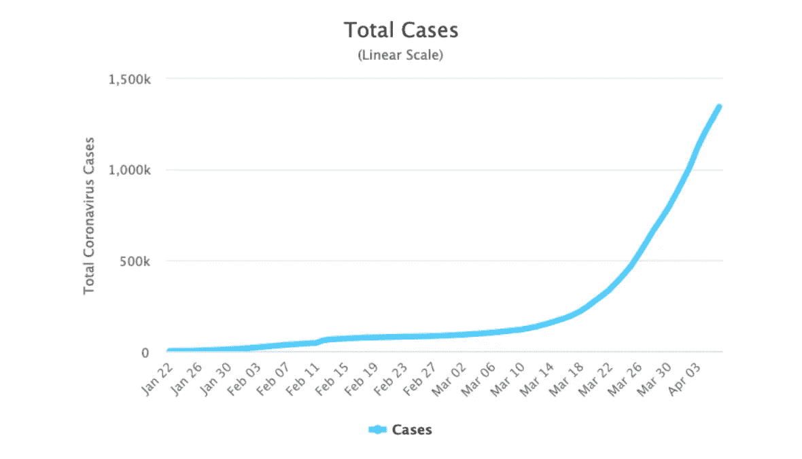

来源:[https://*www . worldometers . info*/coronavirus/](https://www.worldometers.info/coronavirus/?utm_campaign=homeAdUOA?Si)，最近一次访问时间为 2020 年 4 月 7 日

在撰写本文时，全球有超过 200 万例确诊病例。当政府采取行动使曲线变平时，统计学家和流行病学家开始预测它会蔓延多远。3 月 30 日和 31 日进行的一项专家调查估计到 4 月 5 日总病例数在 141，000 到 1，000，000 之间。但是为什么估算的差距如此之大呢？

这篇文章探索了用于预测传染病传播的模型背后的基本概念，比如新冠肺炎(不需要数学背景)。

# **设置**

每个预测模型都有一套假设。我们称之为模型的基本设置。这里，我们将以 [SIR 型号](https://en.wikipedia.org/wiki/Compartmental_models_in_epidemiology#The_SIR_model)为例。规则是:

**规则#1:** 我们对规模为 N 的人群中的感染进行建模，其中 N 不变。

规则 2: 我们人口中的每个人一次只能处于三种状态之一:

*   易受感染的:可能从其他感染者那里感染
*   **I** 感染:有感染，并能感染易感人群
*   **R** ecovered:免疫，不能再感染
    或再感染*(注:特别针对新冠肺炎，* [*SIS*](https://en.wikipedia.org/wiki/Compartmental_models_in_epidemiology#The_SIS_model) *或*[*SIRS*](https://idmod.org/docs/general/model-sir.html)*型号可能更合适。* [*我们还不知道*](https://www.cnbc.com/2020/04/13/who-officials-say-its-unclear-whether-recovered-coronavirus-patients-are-immune-to-second-infection.html) *一个人是否会被再次感染)*

**规则#3:** 人只能按顺序通过这三种状态过渡。从 S，到 I，到 r。

我们将使用这些字母作为人口中属于每个类别的人数的缩写。例如，如果我们对一个 100 人的群体进行建模，并且我们假设在第一天只有一个人被感染，我们会将其描述为:

*   N = 100(总人口规模)
*   S = 99，(易感人群的数量)
*   I = 1，(被感染的人数)
*   R = 0(康复的人数)

# **时代变迁**

上面的简写可能是对当前形势的准确描述。然而，每组的人数随着时间的推移而变化。以下图表为例，说明一种传染病如何在我们假设的 100 人中传播:

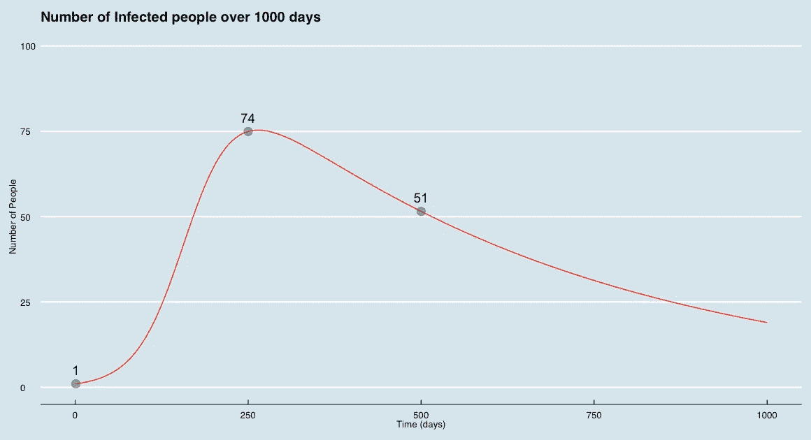

*   第一天: *I = 1*
*   第 250 天: *I = 74*
*   第 500 天: *I = 51*

如果不参考时间，我们之前对每个类别中人数的速记符号并不能告诉我们太多。为了更加清晰，我们做了一点小小的改进:

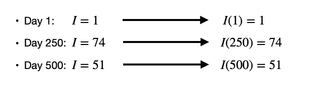

一般来说，我们将其记为 *I(t)* ，其中 *t* 代表时间(在本例中是天数)。我们可以用同样的方式描述易感者和康复者的数量:

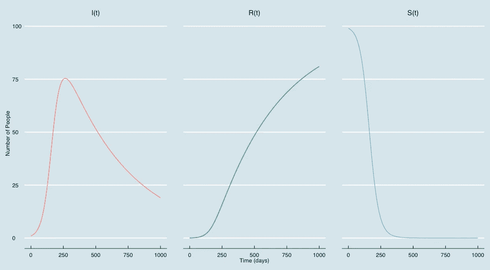

通常，我们在同一个图表上绘制所有三条线，并像这样展示我们的模型:

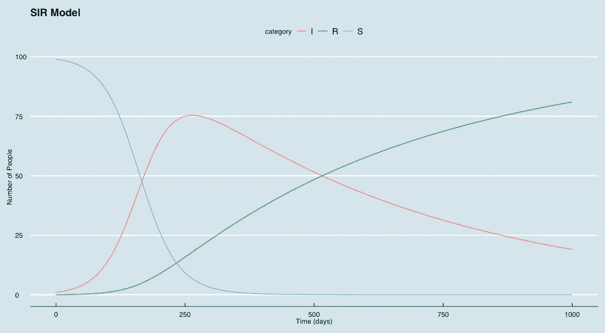

现在我们已经有了模型的基本设置，我们如何使用它来进行预测呢？换句话说，以下两种模式的区别是什么？

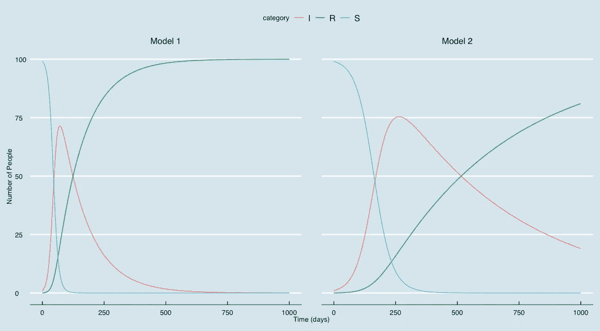

答案是:

# **速度决定一切**

这种差异可以用两个主要因素来解释:

1.  疾病传播的速度有多快
2.  一个人被感染后恢复的速度有多快

## **感染速度**

决定疾病传播速度的因素有两个。

首先是这种疾病的传染性。把这想象成一个易感者接触到一个感染者后被感染的机会。这种被称为 ***遗传性*** 的感染。如果遗传率是 0.5，这意味着有 50/50 的机会。如果是 0.25，那么就有 1/4 的几率，以此类推。

第二个是人群中的人互相接触的频率。感染者和易感者相互接触越频繁，易感者被感染的可能性就越大。这被称为“*平均接触率*”。

感染传播的速度取决于***和*****的平均接触率*** 。当我们把这些放在一起，就得到 ***传输率*** 。如果传染率高，传染病会传播得更快。*

****传染率*** *=传染率*平均接触率**

## ***恢复速度***

*当一个人被感染时，他们会传染给其他人。一旦他们康复了，他们就不能再感染任何人或再次感染(还记得我们设置的规则吗？).恢复时间长有两个主要后果。首先是每个感染者会有更长的时间去传染其他人。第二是很多人同时被感染的可能性会更大。*

*举下面这个例子。让我们假设每个感染者每天接触 10 个易感者。如果只需要一天恢复，那就只有 10 次机会传染给另一个人。如果需要 10 天，就有 100 次传播感染的机会。现在我们假设同时感染组有 50 个人。现在每天有 5000 次传播疾病的机会。*

*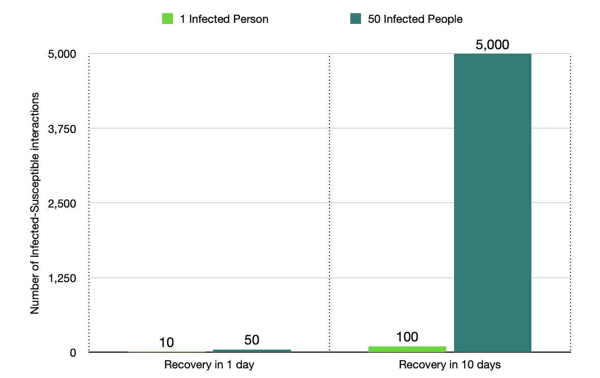*

*一个人恢复需要多长时间被称为**。如果恢复率较低(即，如果一个人需要更长时间恢复)，传染病将传播得更快。***

# *****将所有这些放在一起*****

***现在，我们已经有了将工作模型组合在一起的所有部分。***

*   ***感染开始时每组的人数***
*   ***传输速率***
*   ***回收率***

***有了这些信息，我们可以预测每组中有多少人会倒下，以及这将如何随时间变化。***

## *****易感*****

***随着传染病的传播，易感人群会减少。我们使用以下公式对此进行建模:***

***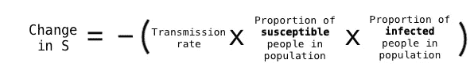***

*   ***如果很大一部分人是易感人群，那么我们预计 *s* 的变化会更快，因为每个感染者都更容易与易感者接触。***
*   **同样，如果大部分人口被感染，我们预计 *s* 的变化会更快，因为感染者和易感者有更高的机会进行接触。**

## ****被感染****

**感染人数随时间有两个变化。随着越来越多的人脱离易感人群，这一数字会上升，随着人们康复，这一数字会下降。我们需要在这里对两个部分进行建模。**

**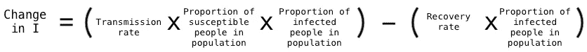**

*   **等式的第一部分与 s 中的*变化完全相同(除了它是正的)。随着人们离开易感状态，他们进入了感染状态。***
*   **等式的第二部分模拟康复人数变化的速度。恢复率仅适用于受感染的人口比例，因为只有那些受感染的人才能过渡到恢复状态。**

## ****恢复了****

**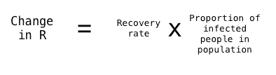**

*   **这与 i 中*变化的负部分相同(除了这里是正的)。那些离开感染状态的人，进入康复状态。***

# **结束语**

**如果你已经做到了这一步，花一点时间思考一下你刚刚学过的内容。简单介绍一下数学:**

**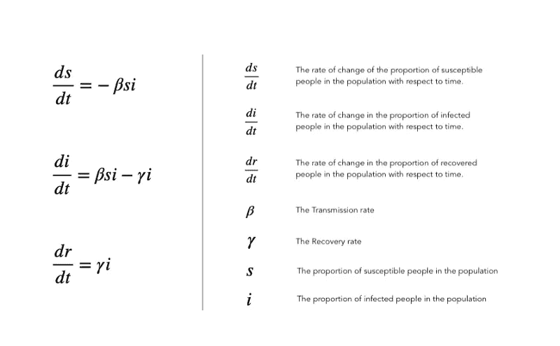**

**控制 SIR 模型的微分方程组**

**您已经完成了:**

*   **如何使用微分方程系统来模拟传染病的传播**
*   ****隔间模型**背后的概念(还有[其他变体](https://en.wikipedia.org/wiki/Compartmental_models_in_epidemiology)**
*   **传染病传播速度背后的关键决定因素**

**记住，每个预测模型都有一套假设。没有完美的模式。虽然 SIR 有其优点，并形成了许多其他房室模型的基础，但它也有其局限性。这里有几个要记住:**

*   **它假设人口规模不变(换句话说，不考虑出生、自然死亡或移民)**
*   **它可能不适用于可能再次感染的情况(SIRS 或 [SIS](https://en.wikipedia.org/wiki/Compartmental_models_in_epidemiology) 模型在这种情况下可能更有用)**
*   **它假设了一个“混合良好的人群”，人群中每个感染者和易感者相遇的几率足够接近模型中假设的*平均接触率***

# **更新—2020 年 5 月 25 日**

**传输和恢复率定义了**基本再生数—** 这些房室模型中的一个关键变量。您可以在这里找到详细信息:**

** [## 基本生殖数字对新冠肺炎和医疗保健意味着什么

### 新冠肺炎会压垮我们的医疗系统吗？

towardsdatascience.com](/will-covid-19-overwhelm-our-healthcare-systems-f5bc49bc77a2)** 

*****编者注:*** [*走向数据科学*](http://towardsdatascience.com/) *是一份以研究数据科学和机器学习为主的中型刊物。我们不是健康专家或流行病学家，本文的观点不应被解释为专业建议。想了解更多关于疫情冠状病毒的信息，可以点击* [*这里*](https://www.who.int/emergencies/diseases/novel-coronavirus-2019/situation-reports) *。***