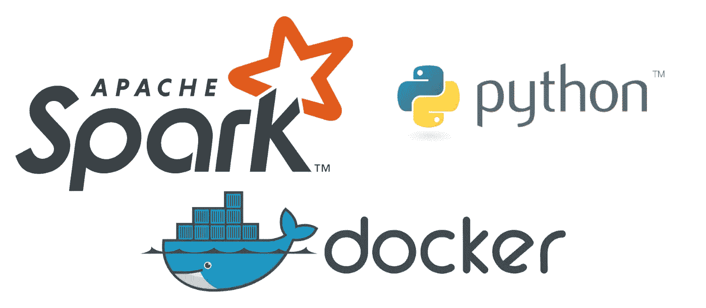
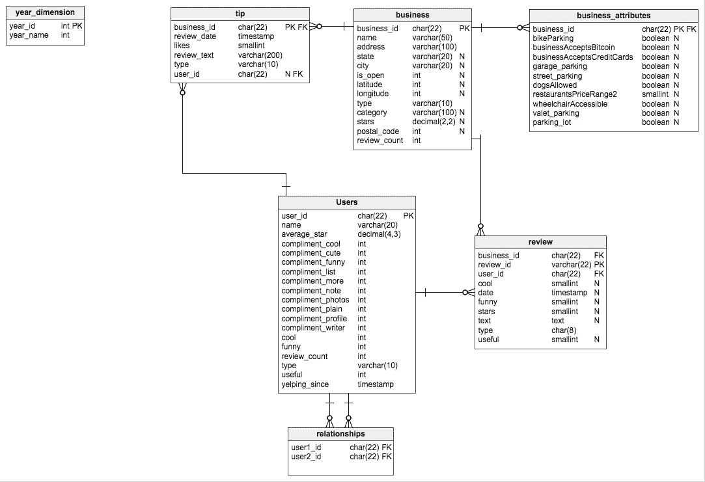
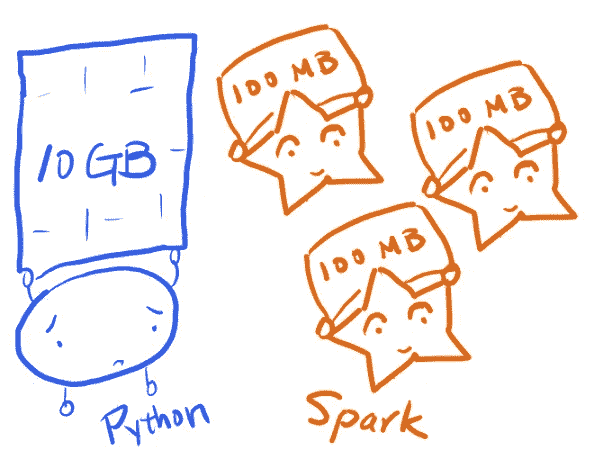

# 当您的 Docker 与 Pyspark 会面，对 10gb 以上的客户评论数据进行情感分析时——第 1 部分

> 原文：<https://towardsdatascience.com/when-your-docker-meets-pyspark-to-do-sentiment-analysis-of-10-gb-customer-review-data-part-1-277633d39bba?source=collection_archive---------55----------------------->



来源:[蒂亚戈梅洛](https://medium.com/u/6c997f2b4cff?source=post_page-----277633d39bba--------------------------------)，途经:[中](https://medium.com/u/504c7870fdb6?source=post_page-----277633d39bba--------------------------------)

在这篇博客中，我将向您展示如何轻松使用 Pyspark 来处理千兆字节规模的数据集。好了，让我们开始吧:


开始！(图片来自@Pixabay 的@Pexels)

## 设置 Docker 引擎

现在，docker 将用于轻松下载 jupyter/pyspark docker 映像，然后使用它进行分布式处理。所以，你必须知道的第一件事就是你的 OS 是否有 Docker 引擎。

Linux 用户在这方面不会有问题，他们只需按照说明在他们的操作系统中设置 docker，链接如下:

【Linux 用户 Docker 手册:

对于 Windows 和 Mac 用户，您可以通过官方链接来设置 docker 引擎:

[Docker 手册 Windows 用户:](https://docs.docker.com/docker-for-windows/install/)

[Docker 手册 Mac 用户:](https://docs.docker.com/docker-for-mac/install/)

> 注:如果你是一名数据科学家/分析师，在阅读这篇文章时，我强烈推荐你使用 Linux 操作系统发行版，因为它真的会对你有所帮助，尤其是在将数据科学成果投入生产的时候。

现在，有了 Docker 引擎，我们必须做的下一件事是获得 pyspark 图像(如果您没有的话)。这可以通过 bash 中的以下命令轻松完成:

这是一个有点大的文件(大约 4.5GB)，在提取后，我们需要使用命令行仔细检查我们的图像:

这是我们本地机器中所有图像的列表，我们可以看到*jupyter/pyspark-notebook*是我们将使用的图像之一:

现在，如果你的清单上有 jupyter/pyspark 笔记本，那太好了！


来源:疯狂宝贝 via: @imgflip

## 将本地目录连接到 Docker 容器

现在，您有了一个讨论大数据的 spark 映像。现在，由于大多数情况下，我们的大数据不在 docker 所在的目录中，我们需要将大数据集移植到容器，这样容器就可以直接访问数据，在我的例子中，以下代码进行了这种装载(我将在下面分解):

好了，我们来破解上面的代码，全面了解一下:

因此，它将流量从我们机器上的端口 8888 传递到 Docker 映像上的端口 8888，在本例中为(jupyter/pyspark-notebook)

在这里，用本地工作目录替换“~/Documents/pyspark_docker”。这个目录将被容器访问，这就是选项“-v”在代码中所做的。该目录可能是空的，您稍后将需要放一些文件。所以，如果你完成了上述步骤，现在 Jupyter 笔记本应该会出现在你的浏览器中，你将会有你的数据的确切路径。现在，如果您已经达到了这个阶段，那么恭喜您，现在您已经准备好使用大数据了:


来源:[像素](https://medium.com/u/5c7773c5a002?source=post_page-----277633d39bba--------------------------------)

在这项工作中，yelp 数据集将用于 spark 的分布式计算。此链接提供的 Yelp 数据集将被用作典型的商业大数据:

【Yelp 数据集的开源链接

对于这个特定的数据，我发现这个博客对数据的数据建模很有帮助，如下所示:

[数据建模](https://paulx-cn.github.io/blog/6th_Blog/)



来源:保罗·谢，via:

## 开始与 Spark 会话的数据争论

## 设置 Pyspark

## 通过 Spark 读取审查数据

仅从数据的规模来看，我们有大约 8000 万条评论，确实是一个大数据！：



来源:[https://changhsinlee.com/pyspark-udf/](https://changhsinlee.com/pyspark-udf/)，转自:[张信利](https://changhsinlee.com/)

```
number of rows:8021122
number of columns:9
```

```
root
 |-- business_id: string (nullable = true)
 |-- cool: long (nullable = true)
 |-- date: string (nullable = true)
 |-- funny: long (nullable = true)
 |-- review_id: string (nullable = true)
 |-- stars: double (nullable = true)
 |-- text: string (nullable = true)
 |-- useful: long (nullable = true)
 |-- user_id: string (nullable = true)
```

## 情感分析

在下面的代码中，我定义了 *text_processing* 函数，该函数将删除标点符号，使所有评论变成小写，并删除英文停用词:

在这一步中，您可能需要运行以下代码来安装 NLTK 包。

```
/opt/conda/lib/python3.7/site-packages/sklearn/utils/deprecation.py:144: FutureWarning: The sklearn.feature_extraction.stop_words module is  deprecated in version 0.22 and will be removed in version 0.24\. The corresponding classes / functions should instead be imported from sklearn.feature_extraction.text. Anything that cannot be imported from sklearn.feature_extraction.text is now part of the private API.
  warnings.warn(message, FutureWarning)
```

## 添加 clean_text 列

```
+--------------------+--------------------+
|          clean_text|                text|
+--------------------+--------------------+
|worked museum eag...|As someone who ha...|
|actually horrifie...|I am actually hor...|
|love deagans real...|I love Deagan's. ...|
|dismal lukewarm d...|Dismal, lukewarm,...|
|oh happy day fina...|Oh happy day, fin...|
+--------------------+--------------------+
only showing top 5 rows
```

好了，现在我们有了干净的文本，是时候做情感分析来看看每个评论的分数了

```
+-----+--------------------+
|score|          clean_text|
+-----+--------------------+
| 21.0|worked museum eag...|
|-11.0|actually horrifie...|
| 13.0|love deagans real...|
| -7.0|dismal lukewarm d...|
| 26.0|oh happy day fina...|
+-----+--------------------+
only showing top 5 rows
```

```
root
 |-- business_id: string (nullable = true)
 |-- cool: long (nullable = true)
 |-- date: string (nullable = true)
 |-- funny: long (nullable = true)
 |-- review_id: string (nullable = true)
 |-- stars: double (nullable = true)
 |-- text: string (nullable = true)
 |-- useful: long (nullable = true)
 |-- user_id: string (nullable = true)
 |-- clean_text: string (nullable = true)
 |-- score: float (nullable = true)
```

## 根据审查分数对业务进行分组

在这里，我对所有业务的平均分进行分组:

```
root
 |-- business_id: string (nullable = true)
 |-- avg(score): double (nullable = true)
```

```
209393
```

在 Markdown 中写入介质？试试[马克迪姆](https://markdium.dev/)！