# 当回归模型的误差包含两个峰值时

> 原文：<https://towardsdatascience.com/when-your-regression-models-errors-contain-two-peaks-13d835686ca?source=collection_archive---------15----------------------->


(图片由[作者](https://sachin-date.medium.com/)提供)

## 关于处理双峰残差的 Python 教程

原始残差是实际值和由经过训练的回归模型预测的值之间的差值。

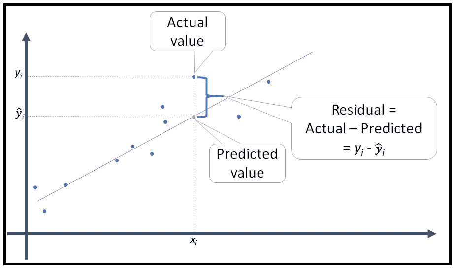

残差=实际值-预测值(图片由[作者](https://sachin-date.medium.com/)提供)

残差的频率分布图可以很好地判断模型是否正确指定，即模型是否是数据集的正确模型，是否考虑了所有重要的回归变量，以及模型是否以无偏的方式拟合了数据。

您通常希望看到的是以零为中心的正态分布残差图，如下所示。

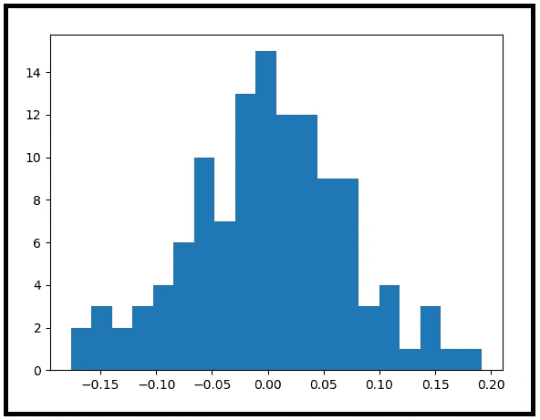

残差的正态分布频率图(图片由[作者](https://sachin-date.medium.com/)提供)

残差的正态分布频率图是一个精选的、合适的模型的标志。

但残差图往往是偏斜的，或者有厚尾或者薄尾，有时也不是以零为中心。有办法解决这些问题。有时人们不得不接受某种程度的不正常。

在本文中，我将向您展示当您的模型的残差变成双峰时该怎么办，即它们有两个峰值而不是一个，如下所示:


双峰频率分布(图片由[作者](https://sachin-date.medium.com/)提供)

## 数据集

我们将使用为期两年的租赁自行车日常使用数据集。以下是数据集的前 10 行:

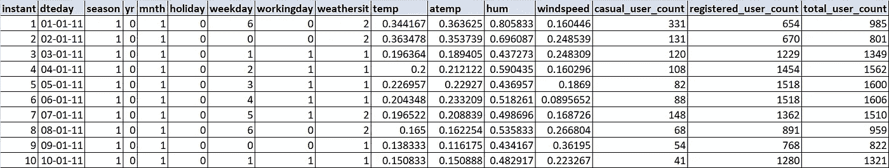

租赁自行车使用计数(来源: [UCI 机器学习库](https://archive.ics.uci.edu/ml/datasets/Bike+Sharing+Dataset))(图片由[作者](https://sachin-date.medium.com/))

数据集中的变量如下:

**瞬间**:行索引
**dteday** :以 dd-MM-yy 格式进行测量的日期
**季节**:当时的天气季节
**年**:当时的年份:0=2011，1=2012
**月**:当时的月份:1 日至 12 日
**节假日**:测量是否在节假日进行(T16) no=0)
**weekday** :星期几(0 到 6)
**工作日**:测量是否在工作日进行(yes=1，no=0)
**weathersit** :当天天气情况:1 =晴朗，少云，部分多云，部分多云。 2 =薄雾+多云，薄雾+碎云，薄雾+少云，薄雾。3 =小雪，小雨+雷雨+散云，小雨+散云。4 =暴雨+冰托盘+雷雨+薄雾，雪+雾。
**temp** :温度，归一化到 39C
**atemp** :真实手感，归一化到 50C
**嗡嗡声**:湿度，归一化到 100
**风速**:风速，归一化到 67
**休闲 _ 用户 _ 计数**:休闲自行车租赁者计数
**注册 _ 用户 _ 计数**:注册(会员)自行车计数

你可以从这里下载数据集[。](https://gist.github.com/sachinsdate/413910079ab4ef4332e7a97cae55d13a)

## 回归模型

我们将建立一个回归模型，其中**因变量**为 **registered_user_count** ，而**解释变量**或所谓的**协变量**如下:
**季节、月份、假日、工作日、工作日、天气、温度、atemp、哼声、风速**。

> 由于我们正在建模计数，我们将使用 Python statsmodels 库中的**泊松回归模型**。

让我们从导入所有必需的包开始:

```
**import** pandas **as** pd
**from** patsy **import** dmatrices
**import** numpy **as** np
**import** statsmodels.api **as** sm
**import** statsmodels.stats.stattools **as** st
**import** matplotlib.pyplot **as** plt
```

将数据集加载到 Pandas 数据框中:

```
df = pd.read_csv(**'bike_sharing_dataset_daywise.csv'**, header=0, parse_dates=[**'dteday'**], infer_datetime_format=True)
```

创建训练和测试数据集:

```
mask = np.random.rand(len(df)) < 0.8df_train = df[mask]df_test = df[~mask]print(**'Training data set length='**+str(len(df_train)))print(**'Testing data set length='**+str(len(df_test)))
```

用 [Patsy](https://patsy.readthedocs.io/en/latest/quickstart.html) 语法创建回归表达式。我们说 **registered_user_count** 是因变量，它依赖于~右侧提到的所有变量。

```
expr = **'registered_user_count** ~ **season** + **mnth** + **holiday** + **weekday** + **workingday** + **weathersit** + **temp** + **atemp** + **hum** + **windspeed'**
```

设置 X、y 矩阵:

```
y_train, X_train = dmatrices(expr, df_train, return_type=**'dataframe'**)y_test, X_test = dmatrices(expr, df_test, return_type=**'dataframe'**)
```

建立和训练泊松回归模型:

```
poisson_training_results = sm.GLM(y_train, X_train, family=sm.families.Poisson()).fit()
```

poisson_training_results 是一个类型为 [GLMResults](https://www.statsmodels.org/0.6.1/generated/statsmodels.genmod.generalized_linear_model.GLMResults.html) 的对象。打印模型摘要:

```
print(poisson_training_results.summary())
```

这会打印出以下内容:

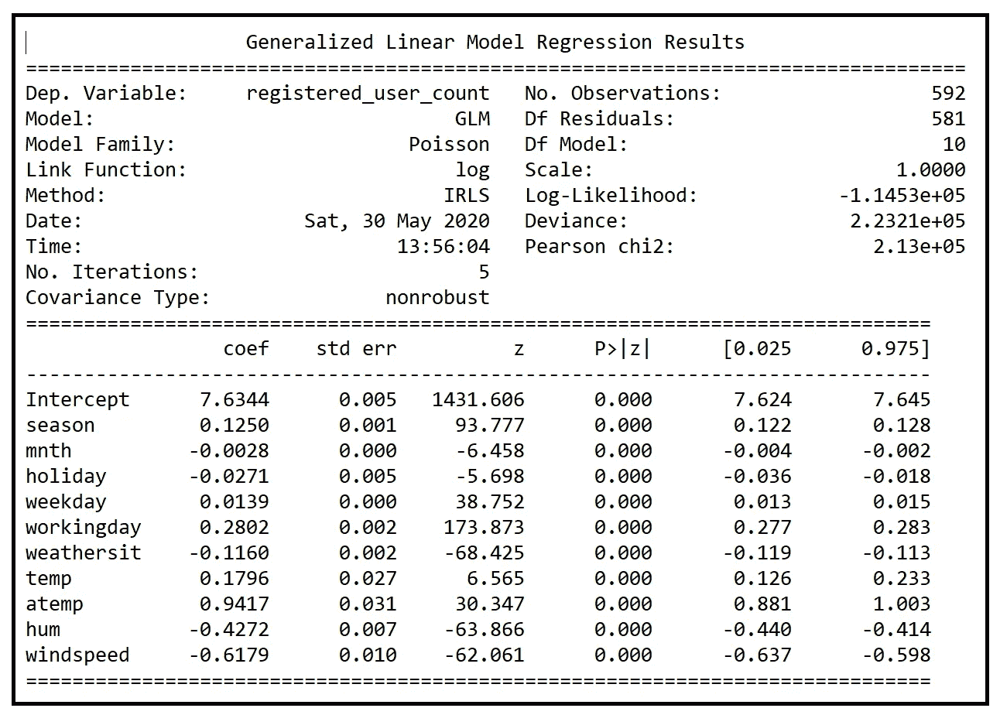

拟合泊松回归模型的输出(图片由[作者](https://sachin-date.medium.com/)提供)

很高兴看到所有的模型系数在 p 值为< 0.001 i.e. at 99.999% confidence level.

As against linear regression models, models in which the dependent variable is a count, rarely produce normally distributed residual error distributions.

So we have to normalize the raw-residuals using other means. Three popular transformations are:

*   The Pearson residual
*   The Anscombe residual
*   The Deviance residual

Statsmodels makes all three kinds of residual errors available to us via GLMResults. **resid_pearson** 时都具有统计显著性。 **resid_anscombe** ，以及 GLMResults。 **resid_deviance** 变量

原始残差在 GLMResults 中可用。 **resid_response** 。

我们将打印出所有 4 种残差的偏度和峰度，看看哪一种是最正态分布的。完美的正态分布的偏斜度为零，峰度为 3.0。

```
**raw_residual_skewness** = st.**robust_skewness**(poisson_training_results.**resid_response**)[0]**pearson_residual_skewness** = st.**robust_skewness**(poisson_training_results.**resid_pearson**)[0]**anscobe_residual_skewness** = st.**robust_skewness**(poisson_training_results.**resid_anscombe**)[0]**deviance_residual_skewness** = st.**robust_skewness**(poisson_training_results.**resid_deviance**)[0]

**raw_residual_kurtosis** = st.**robust_kurtosis**(poisson_training_results.**resid_response**)[0]**pearson_residual_kurtosis** = st.**robust_kurtosis**(poisson_training_results.**resid_pearson**)[0]**anscobe_residual_kurtosis** = st.**robust_kurtosis**(poisson_training_results.**resid_anscombe**)[0]**deviance_residual_kurtosis** = st.**robust_kurtosis**(poisson_training_results.**resid_deviance**)[0]

residual_stats = [
[**'Raw residual'**, raw_residual_skewness, raw_residual_kurtosis],[**'Pearson\'s residual'**, pearson_residual_skewness, pearson_residual_kurtosis],
[**'Anscombe residual'**, anscobe_residual_skewness, anscobe_residual_kurtosis],
[**'Deviance residual'**, deviance_residual_skewness, deviance_residual_kurtosis]
                ]

residual_stats_df = pd.DataFrame(residual_stats, columns=[**'Residual'**, **'Skewness'**, **'Kurtosis'**])

print(residual_stats_df)
```

这会打印出下表:

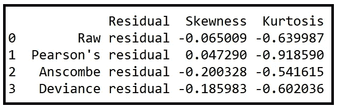

我们正在寻找偏度最接近零、峰度最接近 3.0 的残差类型。考虑到该表中所有值的接近程度，很难从该表中选择合适的残差类型。我们将选择皮尔逊残差，因为它的偏斜度最接近于零。

让我们绘制皮尔逊残差的频率分布图:

```
poisson_training_results.resid_pearson.**hist**(bins=50)plt.show()
```

我们看到以下双峰分布！


回归误差(皮尔逊残差)似乎具有双峰分布(图片由[作者](https://sachin-date.medium.com/)提供)

这里发生了什么导致了双峰回归误差？

当回归误差为双峰时，可能会出现以下几种情况:

> 因变量是二元变量，如赢/输、死/活、涨/跌等。但是你的回归模型可能会生成预测，一个连续变化的实值。所以如果你编码了(赢=1，输=0)，或者(死=0，活=1)等等。并且您的回归模型在 0.5 附近的狭窄范围内生成预测值，例如 0.55、0.58、0.6、0.61 等，那么回归误差将在零的一侧(当真实值为 0 时)或零的另一侧(当真实值为 1 时)达到峰值。
> 
> 如果您没有为数据集选择正确的回归模型，和/或您缺少关键的解释变量，而没有这些变量，大多数预测都徘徊在 0.5 左右，这又会发生。

在我们的例子中，因变量是计数，我们使用了一个适合计数的模型，即泊松模型，因此可以排除上述情况。

> 双峰残差的另一个原因是，人们可能遗漏了一个二元回归变量，该变量以下列方式影响输出值:
> 
> 当变量值为 0 时，输出范围在一定范围内。
> 
> 当变量的值为 1 时，输出将呈现一个全新的值范围，这是以前的范围中所没有的。

事实证明，在我们的例子中确实如此！我们忽略了二元变量 yr(观察年份),它有两个值:0 = 2011 年，1 = 2012 年。

我们来看看 yr 是如何影响因变量 registered_user_count 的。我们将绘制注册用户数与您的年数的关系图:

```
df.plot.scatter(**'yr'**, **'registered_user_count'**)plt.show()
```

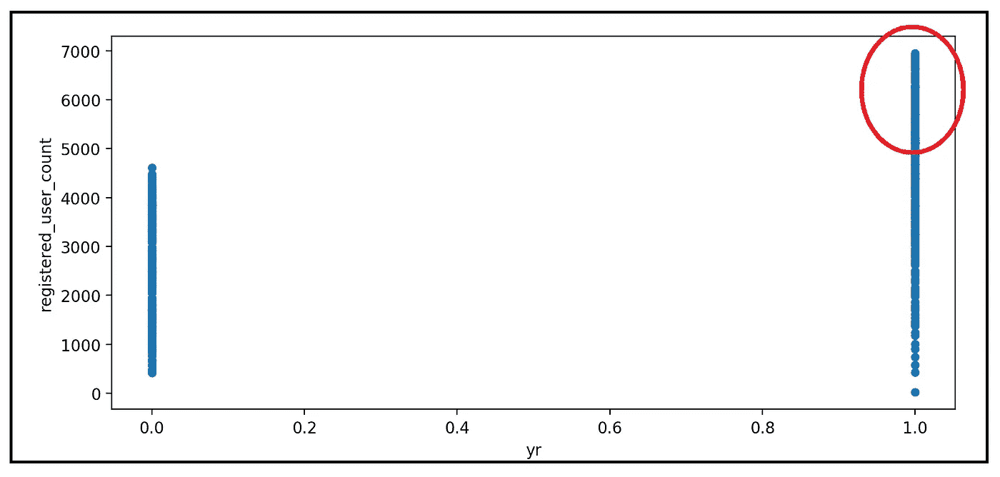

注册用户数与年份(图片由[作者](https://sachin-date.medium.com/)提供)

位于红圈的**注册用户计数**的所有值仅在年份=1 时出现，即 2012 年。由于我们在模型中忽略了 yr，我们的模型无法解释更高值计数的存在。每次实际值在 5000–7000 范围内时，它都会产生系统误差，导致残差图中出现第二个峰值。

如果这个理论是正确的，将 yr 加入到模型中应该可以解决残差的双峰问题。因此，让我们将 yr 添加到回归表达式中，并再次构建和训练模型:

```
*#Set up the regression expression. This time, include yr.* expr = **'registered_user_count ~ yr + season + mnth + holiday + weekday + workingday + weathersit + temp + atemp + hum + windspeed'** *#Set up the X and y matrices for the training and testing data sets* y_train, X_train = **dmatrices**(expr, df_train, return_type=**'dataframe'**)y_test, X_test = dmatrices(expr, df_test, return_type=**'dataframe'**)

*#Using the statsmodels GLM class, train the Poisson regression model on the training data set* **poisson_training_results** = sm.**GLM**(y_train, X_train, family=sm.families.**Poisson**()).**fit**()

*#print out the training summary* print(poisson_training_results.**summary**())
```

这会产生以下输出:

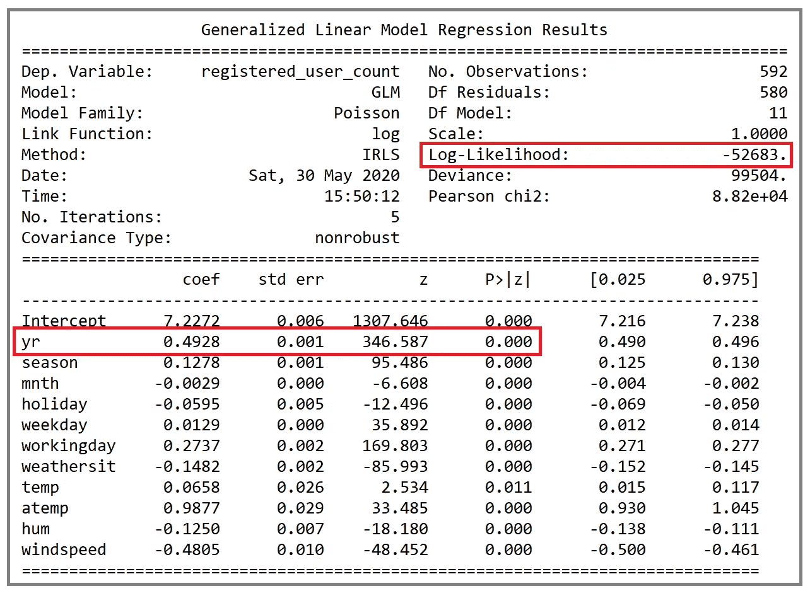

泊松回归模型结果(图片由[作者](https://sachin-date.medium.com/))

这一次，请注意 yr 是回归变量之一，其系数在 99.999%的置信水平下具有统计显著性。

此外，该模型的对数似然比是-52683，这比没有 yr 的先前模型的对数似然比(-114530)大得多。对数似然是一种拟合优度的度量。在这种情况下，它表明添加 yr 大大提高了模型的拟合优度。这与我们的理论一致，yr 的缺失阻止了我们的模型解释所有这些高值计数。

到目前为止一切顺利。

让我们检查包含 yr 的修正模型的所有 4 种残差:

```
**deviance_residual_skewness** = st.**robust_skewness**(poisson_training_results.**resid_deviance**)[0]

**raw_residual_kurtosis** = st.**robust_kurtosis**(poisson_training_results.**resid_response**)[0]**pearson_residual_kurtosis** = st.**robust_kurtosis**(poisson_training_results.**resid_pearson**)[0]**anscobe_residual_kurtosis** = st.**robust_kurtosis**(poisson_training_results.**resid_anscombe**)[0]**deviance_residual_kurtosis** = st.**robust_kurtosis**(poisson_training_results.**resid_deviance**)[0]

residual_stats = [
[**'Raw residual'**, raw_residual_skewness, raw_residual_kurtosis],[**'Pearson\'s residual'**, pearson_residual_skewness, pearson_residual_kurtosis],
[**'Anscombe residual'**, anscobe_residual_skewness, anscobe_residual_kurtosis],
[**'Deviance residual'**, deviance_residual_skewness, deviance_residual_kurtosis]
                ]

residual_stats_df = pd.DataFrame(residual_stats, columns=[**'Residual'**, **'Skewness'**, **'Kurtosis'**])

**print**(residual_stats_df)
```

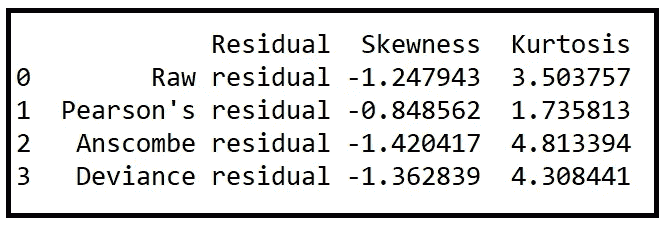

(图片由[作者](https://sachin-date.medium.com/)提供)

皮尔逊残差再次以接近于零的偏斜度在所有产品中表现出色。虽然，原始残差的峰度最接近 3.0。

让我们绘制修正模型的皮尔逊残差的频率分布图:

```
df.plot.scatter(**'yr'**, **'registered_user_count'**)plt.show()
```

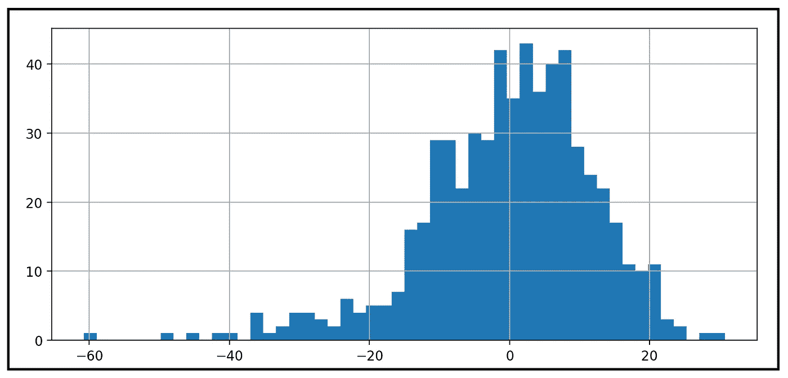

模型的皮尔逊残差的频率分布(图片由[作者](https://sachin-date.medium.com/)提供)

这一次，随着 yr 变量的加入，双峰现象在很大程度上消失了。

让我们并排看两个图，左边没有 yr，右边有 yr:

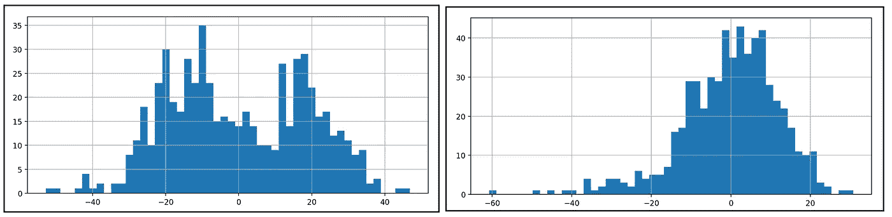

回归残差(左=没有 yr 的模型，右=有 yr 的模型)(图片由[作者](https://sachin-date.medium.com/)提供)

通过引入一个重要的二元回归变量，我们成功地修正了残差中的大部分双峰。添加缺失的变量也大大提高了模型的拟合优度。

让我们获取模型对测试数据集的预测，我们还将绘制预测计数与实际计数的对比图:

```
*#fetch the predictions* **poisson_predictions** = poisson_training_results.**get_prediction**(X_test)*#.summary_frame() returns a pandas DataFrame* predictions_summary_frame = poisson_predictions.**summary_frame**()*#print the predictions* **print**(predictions_summary_frame)*#The* ***mean*** *column contains the predicted count* predicted_counts=predictions_summary_frame[**'mean'**]*#get the actual count from y_test* actual_counts = y_test[**'registered_user_count'**]

*#Plot the predicted counts versus the actual counts for the test data.* fig = plt.figure()fig.suptitle(**'Predicted versus actual user counts'**)predicted, = plt.plot(X_test.index, predicted_counts, **'go-'**, label=**'Predicted counts'**)actual, = plt.plot(X_test.index, actual_counts, **'ro-'**, label=**'Actual counts'**)plt.legend(handles=[predicted, actual])plt.show()
```

我们得到如下的情节:

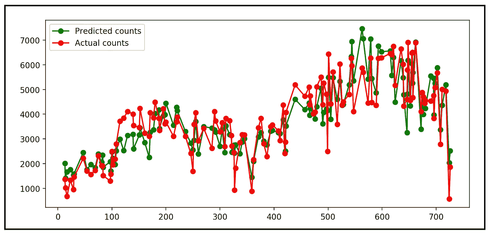

预测数量与实际数量的对比(图片由[作者](https://sachin-date.medium.com/)提供)

以下是本文中使用的完整源代码:

源代码

你可以从这里下载数据集。

## 进一步阅读的建议

[](/testing-for-normality-using-skewness-and-kurtosis-afd61be860) [## 使用偏度和峰度检验正态性

### …以及使用综合 K 平方和 Jarque–Bera 正态性检验的分步指南

towardsdatascience.com](/testing-for-normality-using-skewness-and-kurtosis-afd61be860) [](/an-illustrated-guide-to-the-poisson-regression-model-50cccba15958) [## 泊松回归模型图解指南

### 和使用 Python 的泊松回归教程

towardsdatascience.com](/an-illustrated-guide-to-the-poisson-regression-model-50cccba15958) 

## 数据集的引用:

*Fanaee-T，Hadi 和 Gama，Joao，“结合集合检测器和背景知识的事件标记”，《人工智能进展》(2013):第 1–15 页，Springer Berlin Heidelberg，doi:10.1007/s 13748–013–0040–3。*

*感谢阅读！如果你喜欢这篇文章，请关注我的*[***Sachin Date***](https://timeseriesreasoning.medium.com)*获取关于回归和时间序列分析的技巧、操作方法和编程建议。*