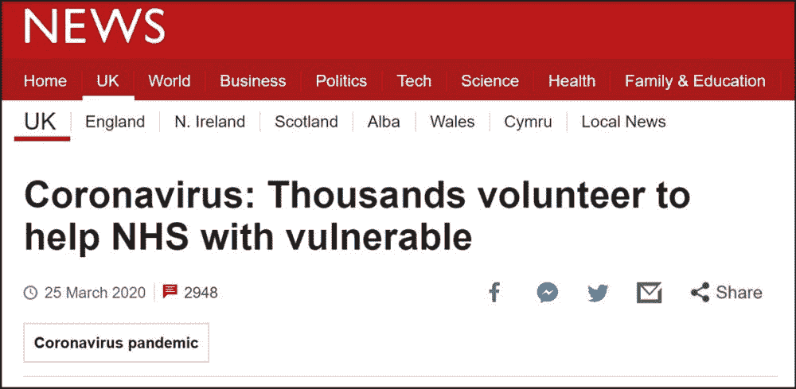
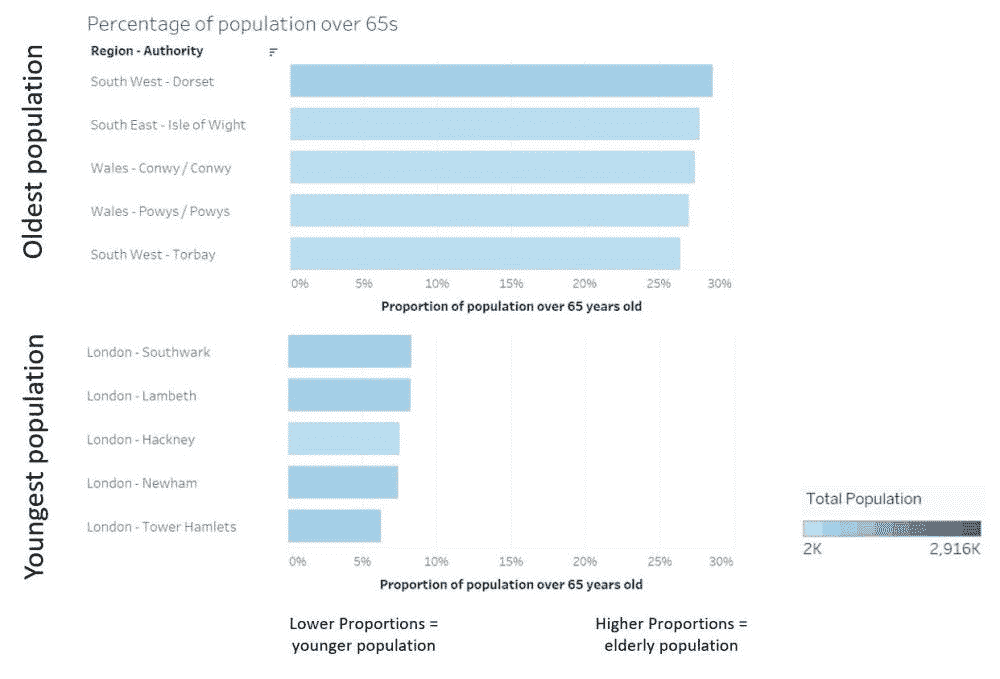
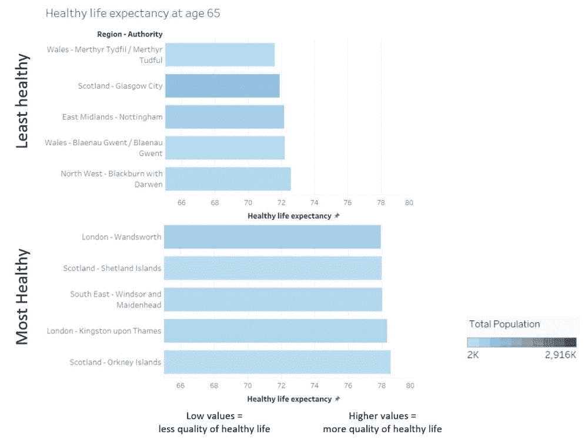
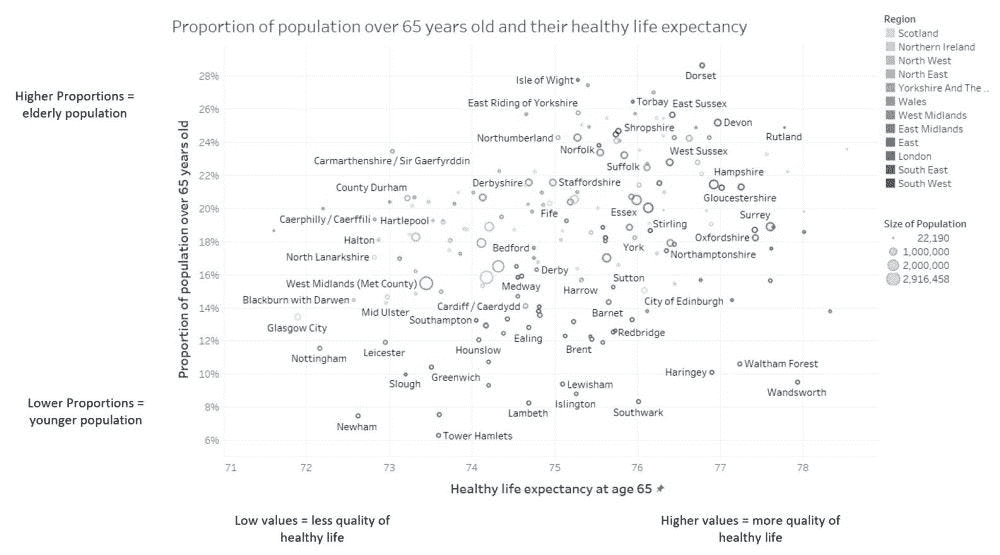
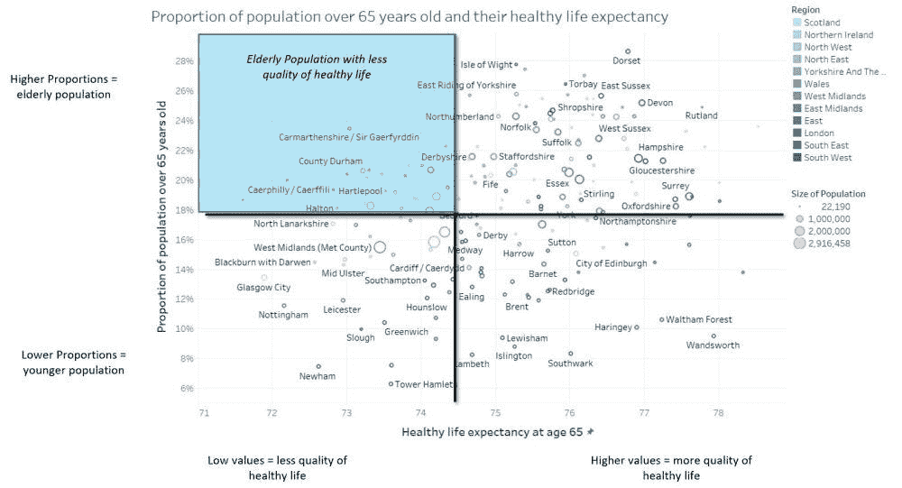
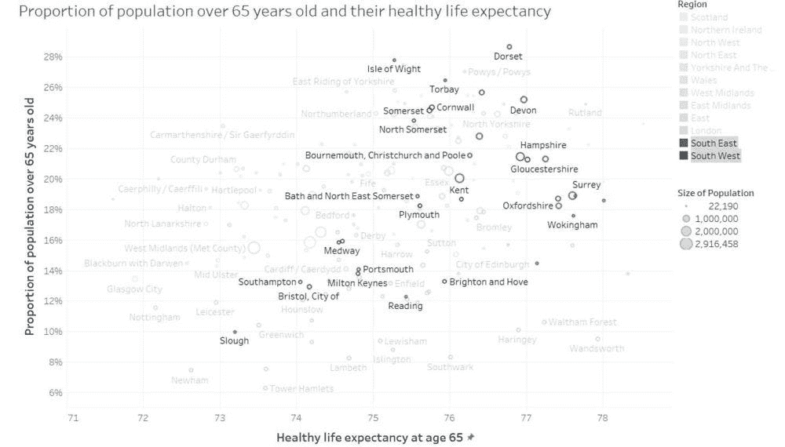
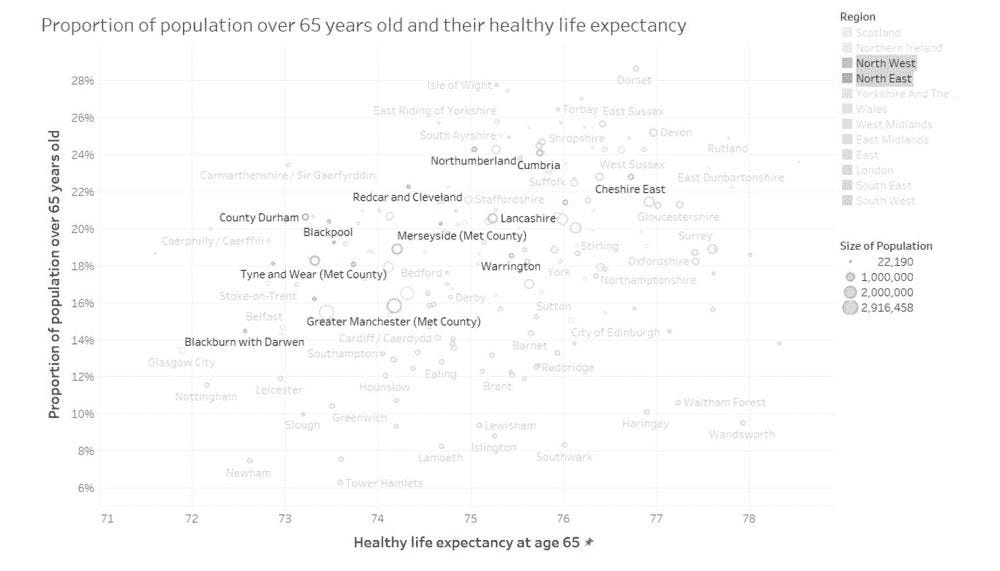
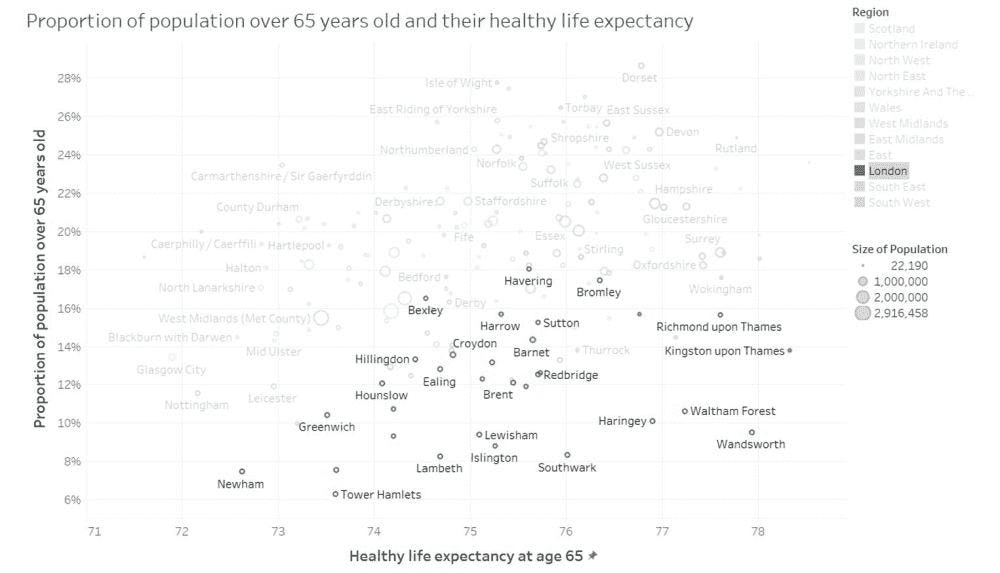

# 英国哪些地方的人最脆弱？

> 原文：<https://towardsdatascience.com/where-are-the-most-vulnerable-people-in-the-uk-227d1b44ebe?source=collection_archive---------59----------------------->

## 与英国和世界其他地区一样，随着疫情继续发展，病例和死亡人数持续上升，我们一直在观察新冠肺炎的影响。

鲍里斯·约翰逊(Boris Johnson)实施英国封锁后，这是政府要求志愿者的新闻头条之一:

在英国，据估计有超过 150 万人患有潜在的健康疾病。这些人被要求呆在家里 12 周以保护自己免受病毒感染。这意味着他们将需要帮助来完成他们习惯做的日常活动，如购买食品杂货和去看医生。

对此，政府发出请求，要求志愿者在隔离持续期间支持国民保健服务。几天之内就有 50 万人注册了！这被认为是一个巨大的成功，因为政府只期待其中的一半。几天后，这一数字增加到 75 万名志愿者，政府被迫暂停任何新的申请，以便他们能够处理已经收到的申请。

这个分析的目的是什么？
然而，考虑到弱势人群遍布英国，英国国民医疗服务体系如何确保他们有足够的志愿者为最需要帮助的人提供帮助？这项分析旨在确定英国哪些地方是弱势人群高度集中的地区，以及 NHS 志愿者应该把工作重点放在哪里。

**数据来源和假设是什么？** 本次分析使用的数据来源有:

*   国家统计局 2018 年年中人口估计数。该数据集按性别、地区和年龄提供人口估计数。
*   ONS 2016-2018 年健康预期寿命和无残疾预期寿命。该数据集提供出生时和 65 岁时的预期寿命、健康预期寿命和无残疾预期寿命，按性别和地区分列。

两个数据源都是从国家统计局网站上以 Excel 格式下载的。数据转换和合并是通过使用 Tidyverse 库在 R 中完成的。有关源代码和代码的更多细节，请参见源代码部分

基于数据源中已经应用的假设，应用了以下定义:

*   老年人是指居住在英国的 65 岁以上的人
*   “健康状况良好”是指健康状况“非常好或良好”,日常活动“没有”限制

这两个来源按地区和区域级别进行了组合，以便进行有意义的粒度分析。

英国最老的人口在哪里？
人口估计数据集拥有英国每个年龄、性别和地区的人口估计数。在这种情况下，通过使用特定老年人的比例，我们可以确定英国人口比例较高的地区。在这种情况下，为了与预期寿命数据集保持一致，这个阈值被设置为 65 岁。

下图显示了 65 岁以上人口比例最高的地区。

从这张图中可以看出，五个最古老的地区中有三个位于英格兰南部，另外两个位于威尔士。比例最高的地区，65 岁以上人口超过 25%。比例最低的五个地区仅占 5%多一点，全部位于伦敦。

**英国最不健康的人群在哪里？** 健康预期寿命数据集具有可用的预期寿命数据、健康状况良好的预期寿命和无残疾的预期寿命，以执行各项活动。这一数据是按性别、地区和出生时以及年满 65 岁的人的预期寿命计算的。该数据集可用于识别健康状况良好的预期寿命较低的群体。

要找出英国最不健康的人群，首先要做的是计算健康预期寿命和无残疾预期寿命之间的平均值，作为总体健康寿命的近似值。这个数字将代表一个人在 65 岁时健康状况良好的寿命。

下图按区域显示了最低和最高的健康预期寿命:

平均寿命最低的地区在健康状况良好的情况下不会活到 73 岁。在最低的五个地区中，有两个位于威尔士。将这些数字与下图中预期最高的地区进行比较，人们将平均多活五年

**英国大多数最不健康的地区在哪里？通过结合人口百分比和健康年龄预期这两个指标，有可能确定英国许多潜在弱势人群集中的地区。**

*   每个点代表英国的一个地区；点的大小代表总体人口。
*   每个点的蓝色阴影代表每个区域在地理上的位置。

如下图所示，英国最脆弱的地区(65 岁以上人口比例最高，健康寿命最低)位于左上角区域:

英格兰北部和南部相比如何？
可以看到，较暗的颜色倾向于聚集在右下角，表明英国南部倾向于拥有更年轻、生活状态更健康的人口。

相比之下，西北和东北地区主要集中在图表的左上方，表明它们比南方更脆弱。

与全国其他地方相比，伦敦怎么样？
伦敦的大部分地区位于右下角，其中几个地区达到了最高的健康预期寿命。

某个地区与全国其他地区相比如何？
本分析中显示的图形是使用 Tableau 生成的，允许用户与数据可视化进行交互。这一分析已上传到 Tableau Public，使每个人都可以通过网络浏览器使用任何平台来使用它，而无需使用任何特定的软件。

只能通过以下链接[http://bit.ly/UKVulnerablePeople](http://bit.ly/UKVulnerablePeople)访问数据可视化。

从这个分析中我们可以总结出什么？
我们的分析表明，通过在数据可视化工具中使用来自国家统计局的数据，我们可以识别弱势人群的主要地区，即健康预期寿命低的老年人比例较高。这表明有一种趋势，即英格兰南部的健康预期寿命高于英格兰北部，而伦敦的老年人比例最低。

这种分析结合交互式可视化工具可以用来识别可能需要更多 NHS 志愿者的领域。截至 4 月 6 日，NHS 志愿者的申请仍处于暂停状态，最初收到的 750，000 份申请没有进一步的分配通知。

**我从这项分析中学到了什么？做这个分析的原因之一是将我的一些“呆在家里”的时间用在一些不同于网飞的事情上！但出于玩笑，我认为使用我的数据科学技能可能是有价值的，如果在使用这个工具后会感到更受鼓励来支持他们的社区。最后，这也有助于我通过使用国家统计局的数据，更好地了解英国的社会人口状况**

**本分析的来源**

——BBC 文章:
[https://www.bbc.co.uk/news/uk-52029877](https://www.bbc.co.uk/news/uk-52029877)

-英国、英格兰和威尔士、苏格兰和北爱尔兰的人口估计:2018 年年中，使用[https://www . ons . gov . UK/peoplepulationandcommunity/populationandmigration/populationestimates/datasets/populationestimates forukenglandwalesscotland Northern Ireland](https://www.ons.gov.uk/peoplepopulationandcommunity/populationandmigration/populationestimates/datasets/populationestimatesforukenglandandwalesscotlandandnorthernireland)

-ONS 2016–2018 年健康预期寿命和无残疾预期寿命
https://www . ONS . gov . uk/peoplepulationandcommunity/healthandssocial care/healthandlifeexpectancyattbirthandage 65 bylocalareasuk

-R 代码和 Tableau 仪表板也可以在下面的 GitHub 资源库
[https://github.com/eduardo-cc/UKVulnerablePeople](https://github.com/eduardo-cc/UKVulnerablePeople)中找到

特别感谢来自 4most 的 Jenika Karsan 帮助我校对和编辑这篇文章！

*最初发表于*[*http://speakthedata.com*](https://speakthedata.com/2020/04/06/where-are-the-most-vulnerable-people-in-the-uk/)*和*[https://www.4-most.co.uk](https://www.4-most.co.uk/)*。*