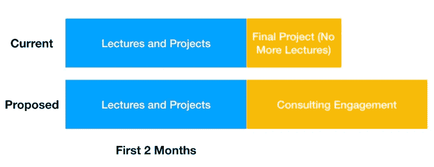

# 数据科学训练营将何去何从？

> 原文：<https://towardsdatascience.com/where-do-data-science-bootcamps-go-from-here-6dd92f6cb17f?source=collection_archive---------70----------------------->

克里斯·蒙哥马利在 [Unsplash](https://unsplash.com?utm_source=medium&utm_medium=referral) 上的照片

## 在一个远程教育和雇佣减少的世界里，这种模式还有意义吗？

我之前写过[我参加数据科学训练营](/my-journey-to-data-science-c885027b8a62)的经历。我非常喜欢它，并且非常深情地回忆起我的经历。我也感谢我的幸运星，我去年完成了这个项目，而不是今年。随着公司放缓或完全冻结招聘，数据工作市场已经放缓至爬行状态(经验丰富的数据科学家和分析师的竞争使情况变得更糟，他们受到裁员的影响或寻求退出正在衰落的公司)。

数据科学训练营面临着巨大的挑战，他们需要不断发展以保持业务活力。今天的文章探讨了数据科学训练营行业面临的挑战和机遇。

# 如果没有工作，没有友情，价值何在？

训练营的目的一直是尽可能快地找到一份技术工作(尽可能少的时间和金钱)。与传统教育不同，这里没有学位，只有一张结业证书，老实说，这对雇主来说没什么意义。

相反，训练营试图利用(1)他们的关系(充其量也是有限的)，(2)你自己对失业的绝望，以及(3)和志同道合、同样绝望的同龄人在一起的动力，作为加速求职过程的催化剂。要求你辞去以前工作的全职数据科学训练营实际上是对你自己的一种赌注，这种赌注就是你将能够学习材料，获得面试机会，并在面试中有效地传达你的新知识。

根据我的经验，我发现(2)和(3)比(1)有效得多。在完成我的队列的大约 20 名学生中，只有 4 人通过训练营的直接联系找到了工作。但是我们其余的人从频繁的学习小组、合作和纯粹的约会中找到了很多动力。是的，我们本可以免费得到那个角色——但是在紧要关头，很难找到一群志同道合的人(还有失业者！)有这种积极性的朋友(没有什么比花大价钱更能激励人们从某样东西中获取价值了)。记住，当我们都开始找工作的时候，我们已经一起学习、工作和约会了 3 个月。尽管我现在很喜欢我的工作，但我经常深情地回忆起那些充满压力但又充满乐趣的日子。

同样，一旦人们找到了工作，他们也不会突然忘记自己的伙伴。我们都努力向同伴推荐机会——最终有两个人通过训练营朋友的推荐找到了工作(还有几个人通过他们的同学获得了面试机会)。

## 存在的价值

对我来说，由于缺乏更好的措辞，在那里有很多价值。我发现训练营给我和我的同伴提供了一个学习、探索和找工作的物理基地，这与其他任何市场化服务(如课程和就业安置)一样多，甚至更多。

但是今天，我们学习数据科学的狭小教室将是一个巨大的新冠肺炎风险。因此，大多数训练营，包括我参加的那个训练营，现在都转向了在线形式。这意味着每个人都在家学习和工作，虽然讲座在技术上仍然是现场直播的，但他们不再有那种感觉了。理论上，这看起来没什么不同，但是相信我，亲身经历是非常重要的。我至少不会花 16000 美元购买一个在线训练营。

有了远程学习，就不再需要互相监督来比较、讨论和调试代码了(不，缩放是不一样的)。很少有像这样的课堂互动，学生机敏的问题引发了 25 分钟的讨论(最终每个人都从讨论和好奇心中受益)。没有深夜炸鸡三明治、黑客项目和乒乓球(公平地说，他们在我的同伴之后拆掉了乒乓球室)。

**我想说的是，随着向在线形式的转移，许多让训练营体验变得美妙的微妙东西都消失了。**你签下了经验丰富的导师和职业支持——但当你从另一边走出来时，你会发现 80%的价值实际上来自于你与其他同伴建立的亲密关系和友谊。没有这些，训练营就失去了很多价值。

# 那么训练营能做什么呢？

不幸的是，没有简单的解决方法。健康安全第一。在一个每个训练营都在线(至少暂时在线)并且数据科学职位空缺较少的世界里，**训练营提供者将需要接受这样一个事实，即他们的服务同时价值更低，需求更少。**

因此价格下跌(和整合)可能是不可避免的。与此同时，对于勇敢和勤奋的训练营提供者来说，未来一年左右是一个向更好转变的重要机会。数据行业已经不像以前那样炙手可热了——在收入下降的情况下急于削减成本的公司将保留他们的软件工程师(因为他们一直在工作)，同时解雇远离业务前线的员工(如数据科学家)。

这并不意味着不再需要分析或数据驱动的洞察力；只是它被搁置了，或者被认为成本太高，目前不值得追求。

> 这是训练营和他们的学生介入的机会。

***一方面，有些公司对数据科学感兴趣，但没有预算支付全职数据人员的市场薪酬。另一方面，数据科学学习者渴望获得实际的实践经验，他们愿意以市场价格的一小部分从事这项工作。那么，为什么不重组训练营的体验来满足这种需求呢？***

## 当前格式

目前，大多数训练营包括 3 个月的教学(和项目工作)。有 4 到 5 个项目，形成你的项目组合，成为你简历上的数据科学子弹。最后的项目通常伴随着对雇佣伙伴的演示。训练营结束后，每周或每两周会有职业服务登记，但除此之外，能否跟上求职步伐取决于你自己。

你可能不知道的一件事是，大多数正式的指导和讲座在 2 个月内结束，最后 4 周主要是做你的期末项目和面试练习。是的，训练营的最后几周有点像自习室(尽管教官和助教会在旁边问问题)。

## 更好的格式

当前与提议的格式

在我的想象中，训练营将会持续 4 到 5 个月。在前两个月，重点是提高学生的技能**,而后半个月则是让学生团队与实际公司一起从事数据科学咨询工作。**

训练营提供者有两个缺点。首先，一个更长的训练营意味着一个给定的地点一年只能毕业 2 到 3 批，而不是现在的 4 批；因此，在其他条件相同的情况下，供应商赚的钱会更少。其次，提供者需要在报名之前做更多的跑腿工作——他们需要为即将入学的学生安排公司和项目。

**尽管充满挑战，但这也是实现显著差异化的机会。目前，训练营行业变得越来越商品化(给价格带来下行压力)。因此，无所作为也会导致收入减少。但是如果一个训练营可以通过列出许多有趣的项目来展示价值，那么他们可以收取更高的价格。**

这给了训练营提供者的职业服务员工一个更有针对性的目标。目前，职业服务员工扮演着一个奇怪的角色，一部分是啦啦队员，一部分是网络员(试图与公司招聘人员和招聘经理建立联系)，一部分是大学就业顾问(修改简历，进行模拟行为面试，并润色学生的 LinkedIn 个人资料)。这有很多工作，很难同时做好。加剧这一挑战的是，每个训练营通常只有一名职业服务人员，他或她不仅需要管理当前队列的求职，还需要管理所有先前队列的持续求职。在我提议的结构中，职业服务员工将从一个多面手变成一个专家，专门与对数据科学咨询感兴趣的公司建立联系(以及一系列酷项目)。

如果训练营提供商及其员工能够成功做到这一点，那么它就能让学生在找工作时处于更有利的位置(因为他们有在实际公司工作的实际经验)，并将其产品与只在网上销售的同行区分开来。

显然，所有这一切当面进行会更好，但数据科学咨询也可以远程进行。这与公司喜欢给候选人的带回家作业的扩展版没有太大区别(他们给候选人一个数据集和一些开放式问题，并要求他们尽最大努力)。

# 结论

以前我建议过某人(不是它！)[为有抱负的数据科学家搭建一个匹配数据科学项目和实习的平台](/a-better-way-to-skill-up-b2e5ee87dd0a)。在看到同行努力寻找工作后，我觉得这样一个平台是帮助训练营毕业生和其他有抱负的数据科学家(来自非传统背景)更无缝地突破进入数据科学行业的缺失环节。

我在新冠肺炎之前就写了这篇文章，当时我觉得训练营没有什么动力去修正他们的商业模式。现在情况不同了。生存危机是可怕的——但它也是变得更好的催化剂和机会。已经有大量廉价或免费的学习数据科学的资源(大部分都是高质量的)。但是有抱负的从业者获得实际经验的途径很少。如果数据科学训练营想要保持相关性，那么他们应该想出如何最好地为他们的学生建立这些途径。