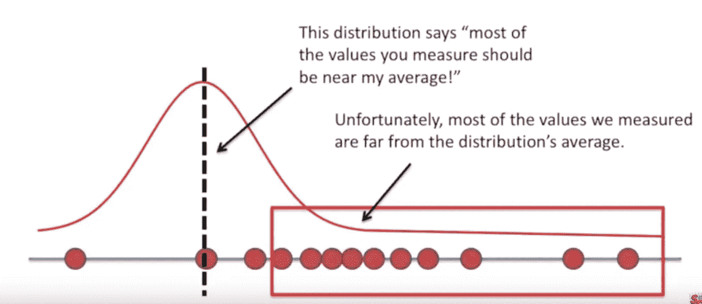

# 为什么要用均方差(MSE)？

> 原文：<https://towardsdatascience.com/where-does-mean-squared-error-mse-come-from-2002bbbd7806?source=collection_archive---------10----------------------->

## 从概率角度看均方误差

Genessa panainite 在 [Unsplash](https://unsplash.com?utm_source=medium&utm_medium=referral) 上拍摄的照片

大家好。

如果你对机器学习感兴趣，但没有深入研究它背后的概率论，你可能会想知道损失函数从何而来。他们仅仅是因为在实践中效果更好而使用*吗？*

一个来自[knowyourmeme.com](http://knowyourmeme.com)([原始网址](https://i.kym-cdn.com/photos/images/newsfeed/001/461/040/fcd.jpg))的常见模因模板

我想我会分享从 [CS109(斯坦福大学计算机科学家的概率论)](http://cs109.stanford.edu)中获得的一个见解，这是我最近参加的一门课程。我们将回答以下问题:

*   MSE 到底是从哪里来的？只是有人猜测一个好的损失函数吗？
*   为什么你想要预测和地面真相之间的差异的平方，而不是只取其绝对值，或将其提高到四次方，或六次方？？换句话说，*为什么 MSE 效果这么好？*

快速品尝一下答案:**这取决于我们对数据如何建模的合理假设的本质。**

三项免责声明:

*   这不是激励 MSE 的唯一方法，但我确实没有见过，我认为这比“因为在实践中你可以更容易地得到它的导数”更有见地
*   我自己意识到了这一点，但我确信在我之前还有很多人意识到了这一点
*   我假设你熟悉概率(什么是正态分布，不太清楚)，但不一定是上过概率论课的水平。如果有，太好了！你可以跳过一些背景。

但首先，了解一些背景知识。

# 背景

你可能知道，机器学习与概率交织在一起，所以我们将在这里介绍一些相关的概念。

## 最大似然估计

在很多机器学习中，你的目标是为你的数据找到最佳模型(无论是找到将图像分类为包含猫或狗或其他模型的最佳 convnet)。这背后的一个核心概念是*最大似然估计。*

什么是最大似然估计？我们将用下面的例子来演示(改编自 Youtube 频道 StatQuest 的[这个很棒的视频)。](https://www.youtube.com/watch?v=XepXtl9YKwc)

## 例子

让我们假设你有一个神秘的正态分布，点被抽样，并说它代表老鼠的体重。

来源: [Youtube/StatQuest](https://www.youtube.com/watch?v=XepXtl9YKwc)

统计学家做的一件有点奇怪的事情是**假设数据是从某个模型**中抽取的。在这种情况下，我们可以假设这个小鼠体重数据是从正态分布中取样的。现在让我们找到它！(这可能看起来与说一些关于 MSE 的事情非常无关，但请原谅我。)

直觉上，您可能希望正态分布在样本中心附近达到峰值。你也希望正态分布根据样本分布的距离而展开。

所以，你会*而不是*想要这样的东西

“坏”模型；来源: [Youtube/StatQuest](https://www.youtube.com/watch?v=XepXtl9YKwc)

但是你会想要这样的东西吗

一个“好”的模型；来源: [Youtube/StatQuest](https://www.youtube.com/watch?v=XepXtl9YKwc)

原来有一种数学方法可以表达一个模型有多“好”(这一节很重要)。我们称之为给定模型的数据的*可能性*。它可以用函数 L 表示如下，其中θ是模型，I 是样本的指数，f 是概率密度函数(PDF)。

可能性的定义

请注意，在函数 f 中，参数包含一个竖线|。这仅仅意味着我们正在评估函数*，因为*我们使用的是模型θ。

似然性本质上包含所有样本的概率密度的乘积。换句话说，这是对数据集被赋予选择特定模型的可能性的综合衡量。

然后，要找到最佳模型，只需取其“argmax”即可。

最佳模特

实际上，如果足够简单，这将涉及[求导](https://www.khanacademy.org/math/ap-calculus-ab/ab-diff-analytical-applications-new/ab-5-4/a/applying-the-first-derivative-test-to-find-extrema)，或者如果更复杂，将涉及其他一些优化方法，例如[梯度上升](https://en.wikipedia.org/wiki/Gradient_descent)。

## 关于可能性的直觉

为了巩固关于可能性如何工作的一点直觉，考虑所有样本都是 x_i=5.0 的数据集。然后，假设你的模型是一个正态分布，紧紧围绕 x=15。然后，PDF f(x_i|theta)会极小，乘以许多小值会产生一个极小的似然值。

相比之下，考虑正态分布紧紧集中在 x=5.0 附近，正是样本出现的地方。直观来看，这款应该比上一款好很多。我们用似然来验证一下:PDF f(x_i|theta)会非常大，很多大值相乘会产生一个非常大的似然值。更好的模型可能性更大，这和我们的直觉不谋而合。

## 负对数似然

在实践中，我们实际上稍微修改了一下上面的可能性表达式。首先，我们取可能性的对数。为什么？两个主要原因:

1.  这对于浮点运算来说要好得多(你不想因为把一堆小数字相乘而损失精度)。
2.  求和的导数比求积更容易。

由于似然性通常位于 0 和 1 之间，因此对数似然性(表示为 L1(θ))将位于负无穷大和 0 之间。

现在考虑最大化负值是很尴尬的，所以我们取其负值，称之为(恰当地命名为)“负对数似然”，而不是*最小化*这个。这通常成为我们熟悉的常规损失函数(交叉熵损失只是负对数可能性的伪装，但这是另一个故事)。

# MSE？？

现在，我们将通过一个演示示例来展示 MSE 的来源。

为了简单起见，让我们执行线性回归；即找到最佳拟合线。

线性回归；来源:[维基百科/线性回归](https://en.wikipedia.org/wiki/Linear_regression)

现在让我们写下如何对数据建模(在鼠标重量的例子中，我们假设它是通过正态分布生成的)。这正是导致 MSE 的原因。

## 我们的假设

让我们假设我们的数据是按照如下方式采样的:**给定 X 的某个值，Y 完全由 mx+b 确定，该值受到以 0 为中心的正态分布的随机样本的扰动**(其中“m”是斜率，“b”是 Y 截距)。这是有意义的，因为直觉上给定一个 X，Y 并不总是精确的 mx+b，而是在 mx+b 附近有一些噪声(现实世界会妨碍)。

从视觉上，你可以想象我们的模型真的只是一堆正态分布沿对角线方向堆叠，形成山脉般的外观。对于那些数学爱好者来说，我们的模型可以表示为

其中“X”是某个变量，参数是“m”和“b”，而“Z”是某个预先确定的具有零均值和某个方差σ的高斯函数。

## 推导 MSE

现在我们想计算这样一个模型的可能性(这里唯一的参数是θ= m)。首先，回想一下高斯分布的 PDF 的定义:

高斯分布的 PDF

现在，这个模型的可能性(我们可以忽略外部的正常数因子，因为它不影响我们的优化)是

此模型的可能性

我们简单地通过用高斯函数代替我们的 PDF 来获得之前的似然性定义。

在实践中，我们希望获得负对数似然。所以，经过一些代数运算后，对数似然是

此模型的对数似然

然后，负对数似然

负对数似然

瞧啊。负对数似然，我们从假设真实数据对于给定的 x 呈正态分布中获得的损失函数是**非常精确的均方误差**，即

一般来说，均方误差的定义

只差一个常数！还不错。

## 一些反思

所以这就是均方差是如此普遍和巨大的损失函数的原因；**它基于极其合理的概率假设**:给定一些自变量的值(也称为世界的某个状态)，因变量按照高斯分布分布。现在已经非常清楚(y_i - y_pred)的来源:**高斯分布 PDF 中的指数项**。我认为这是一种更好的思考 MSE 的方式，而不仅仅是简单地“我们使用它是因为它很容易区分”(尽管这在某种程度上是正确的)。

如果你开始将此推广到更复杂的推理任务，你就可以开始对 MSE 如何运作有真正的直觉了。例如，考虑用多项式拟合一组(x，y)点。你可以想象在曲线周围的 y 方向上上下下，我们有突出页面的高斯 pdf。现在，您可以将使用 MSE 的梯度下降视为在 y 方向上上下调整一组高斯函数，以最大化每个单独 x 值的可能性，并且整个问题已经简化为一个迭代鼠标重量的示例，其中我们正在计算如何放置 x 的每个值的正态分布*的平均值。这种直觉无缝地转化为许多 x 值(即一个 x 向量)的情况。*

现在想象有多个 y 输出。然后，你试图为每个可能的 x 找到一个多元高斯分布的最佳平均向量。

# 总结想法

当我第一次在最大似然估计的背景下通读涵盖“线性回归精简版”(没有 y 截距的线性回归)的 CS109 课堂笔记时，我没有意识到它可以带来一些关于我已经使用和熟悉了相当长时间(MSE)的事物的直觉和见解。重温它们，再读一遍，认真思考，结果是一次颇有收获的经历。关于它的写作也填补了我理解上的一些漏洞。我建议至少为你感兴趣的课程做一些这样的事情；这会让你更加欣赏这个主题。

此外，这个小小的探索让我对人工智能和深度学习的技术有了更好的理解。许多现有的技术起初看起来像是任意构造的，但如果你深入研究概率论，就会发现它们都来自相同的核心思想。因此，我认为学习这些基本概念是必要的:它帮助你以一种更加基础的方式思考 ML，它甚至可能帮助你想出你自己的新的有趣的技术/算法！