# 智能城市传感器预测客流量

> 原文：<https://towardsdatascience.com/where-is-everyone-going-9b2bd487a6aa?source=collection_archive---------41----------------------->

## 利用空间数据分析了解和预测澳大利亚墨尔本的行人交通。

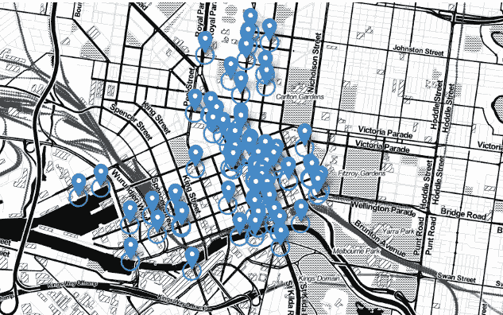

我有建筑设计和城市规划的背景，一直对应用数据来改善我们的城市和建筑环境很感兴趣。像全球许多城市一样，墨尔本的目标是在未来几十年内成为智能城市，而数据正在推动这一目标的实现。数据分析声称是智能城市的未来，因此有许多实质性的数据集可供公众免费使用。在我第一次深入研究城市数据时，我使用了墨尔本市提供的几个地理空间数据集来了解行人的行走模式。

**项目目标**

对于决定开店地点的企业来说，客流量和行人活动是一个需要考虑的重要因素。繁华地区的商店和餐馆可能会吸引更多的顾客和注意力。考虑到这个客户群，我使用的主要数据集是每小时统计有多少人通过城市人行道下的不同传感器。

通过查看传感器计数，可以观察到步行交通的总体趋势。然而，我也想了解是什么把更多或更少的人带到了特定的地区。是否可以根据附近的建筑物或城市特征来预测行人流量？从城市规划的角度来看，关于城市中哪些因素会增加或减少行人流量的信息将有助于预测新开发项目对附近区域的影响。

为了确定某些因素是否会影响行人数量，我在分析中加入了其他几个地理空间数据集。本文将介绍这个项目的主要步骤，但是完整的代码可以在[我的 Github 库](https://github.com/jewelbritton/Pedestrian-Footfall-Melbourne)上找到。

# 数据收集和清理

如前所述，墨尔本市[提供了许多有价值且干净的数据集。幸运的是，只需要做最少的数据清理工作，但是下面我概述了我使用的数据集以及在建模之前我是如何组织数据的。](https://data.melbourne.vic.gov.au/)

**每小时人行道传感器计数**

我的主要数据集是人行道传感器计数，它具有以下特征:*每个传感器的位置坐标*，一个*传感器 ID* 号，每小时记录的*日期时间*，以及*每小时计数*值。下面是整个城市所有传感器位置的可视化 Tableau 地图。

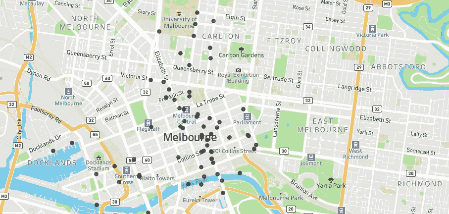

墨尔本所有的人行道传感器，通过 Tableau 上的位置坐标映射。

数据从 2009 年至今，每月更新。当 2009 年开始收集数据时，只有 18 个传感器，现在有 65 个，所以在过去十年中增加了许多传感器。在数据清理过程中，我发现许多传感器都有错误的记录，因为计数会在几周或几个月内突然降到零。今年年中还增加了新的传感器。为了保持一致性，我创建了一个函数来生成传感器的年度列表，每次至少有 12 个月的完整记录。由于前两年(2009 年和 2010 年)的记录不太稳定，2020 年的记录还不到整整 12 个月，传感器的范围被更改为 2011 年至 2019 年。

**附近城市特征**

为了更好地了解不同传感器附近的城市特征，我包含了来自该城市的几个地理空间数据集。这些被包括在内，以测试传感器附近的特征与该区域接收到的客流量之间是否存在相关性。这些数据集包括**年度建筑数据、** **自行车码头位置&容量、地标&兴趣点以及城市街道照明。**这些单独的数据集中的每一个都包括位置坐标和一些关于特征的信息。

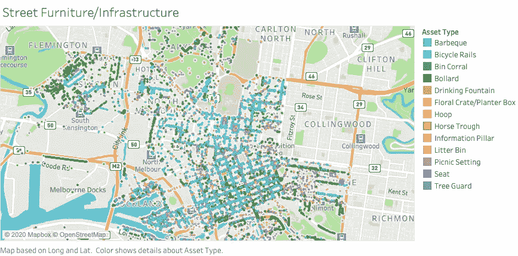

本次分析中包含的城市特征数据集之一是墨尔本的街道设施和基础设施。

**传感器趋势**

为了获得传感器趋势的概述，我创建了一个热图来了解每个传感器繁忙的日子和月份。这是两个传感器的热图，它们从 2011 年到 2018 年有一致的数据。

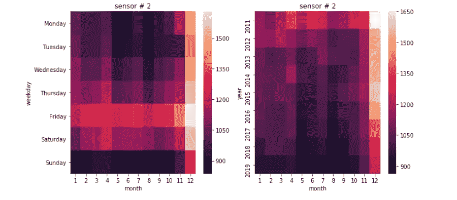

传感器 2 的热图，它看起来在 12 月的星期五最繁忙。一周中没有太多的人流量，因此该传感器最有可能位于娱乐或休闲区。

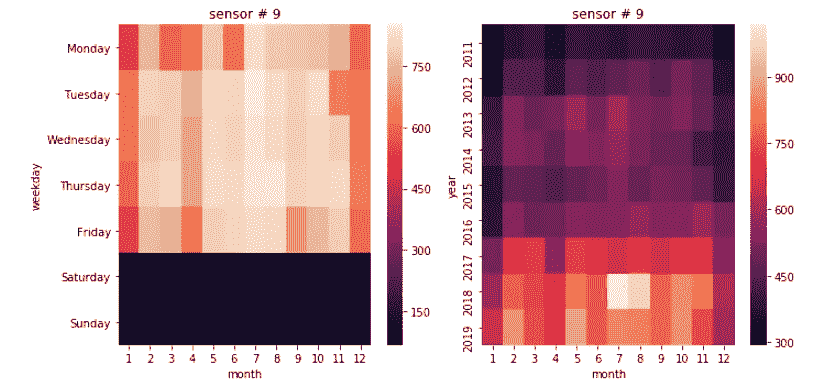

传感器 9 的热图，它在工作日几乎完全处于繁忙状态，表明它可能位于商业区。从 2016 年到 2017 年，客流量也有明显增加。还要注意两个传感器之间的规模差异，即使在最繁忙的情况下，传感器 9 也没有传感器 2 那么多的行人流量。

# **绘制位置特征**

**产生传感器气泡**

为了将所有基于位置的数据集与它们最接近的传感器结合起来，我利用 GeoPandas Python 库在每个传感器周围创建了 100 米的半径。半径保持较小，因此它只包括直接影响传感器上的脚步的元素。下面是我在 follow 中创建的地图，上面标有传感器的周围半径。要了解更多关于在 lyum 中开发地图的信息，请点击查看[源代码。](https://python-visualization.github.io/folium/modules.html)

每个传感器周围 100 米半径的叶子图。

**绘制附近的特征**

然后，再次使用 GeoPandas，我开发了一个函数来检查位置数据集中的每一项(建筑物、自行车、照明等。)来查看坐标是否在任何传感器的半径内。如果该点位于传感器的半径范围内，则坐标和要素信息会添加到传感器列表中。一旦在所有位置数据集中找到了 100 米半径内的所有要素，我就创建了一个函数来在 foylus 中绘制这些信息。

以下是传感器 2 和 9 及其附近所有要素的地图。通过这种视觉，我们可以看到传感器 100 米半径范围内的所有城市元素。街道照明是珊瑚色，地标是紫色，建筑是浅蓝色，街道基础设施是灰色。可以在深蓝色圆圈的中心看到传感器。

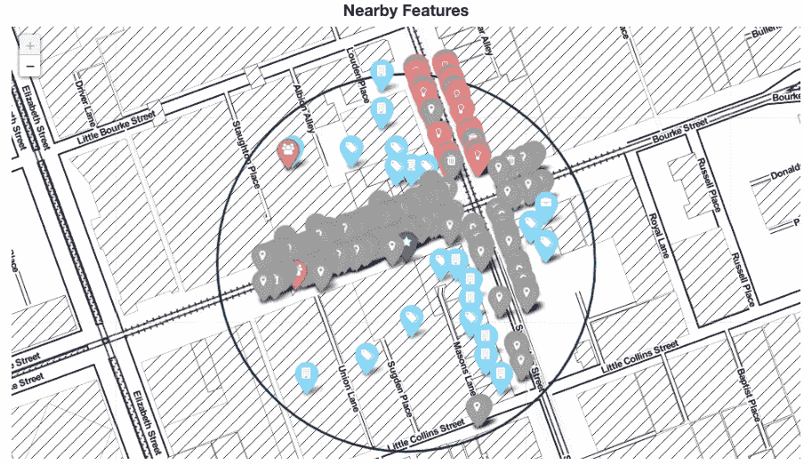

传感器 2 的所有位置特征都在传感器 100 米半径范围内。

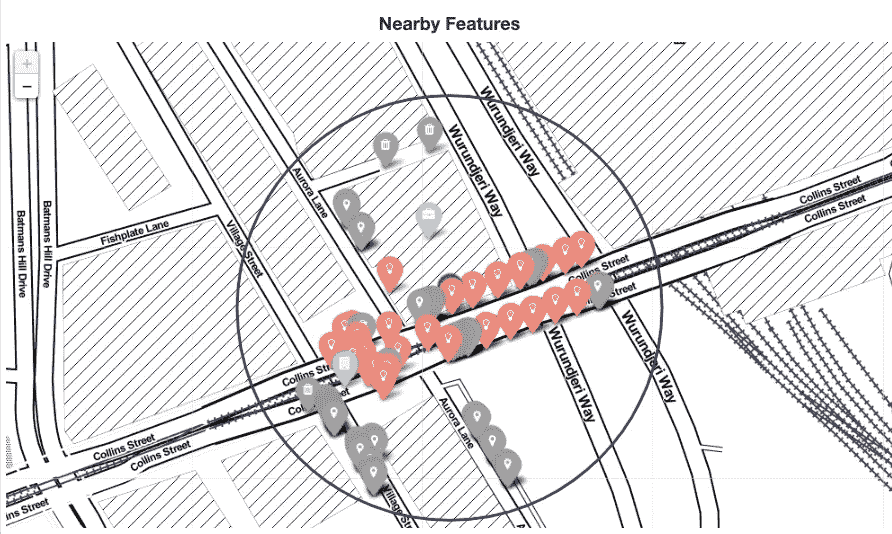

传感器 9，其所有位置特征都在传感器 100 米半径内。

# 基于位置特征预测每日客流量的回归方法

既然我们可以看到哪些要素在每个传感器的 100 米范围内，建模就可以开始了。对于建模的第一阶段，我想做一个相对简单的线性回归，看看是否有可能仅根据附近的位置特征来预测每个传感器的每日客流量。该模型的特征是半径内每种特征的数量和传感器 ID，并预测日平均客流量。

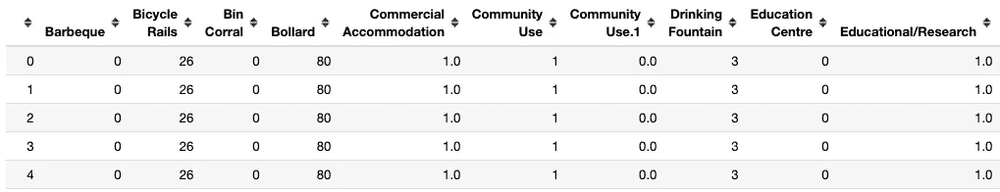

数据框的一个片段。总共有 60 多列详细说明了传感器半径内每个邻近要素的数量。

由于位置要素的数量在一年内没有变化，因此我不期望模型能够准确预测每天的变化和趋势。然而，我认为这将是有趣的，看看哪些功能增加或减少了客流量。训练和测试数据采用随机 80/20 分割，所有年份混合到每组中。

**模型结果:*线性回归***

-训练分数:0.7751

-测试分数:0.7749

-简历得分:0.7747

-根均方误差:224.592

所有分数都在 0.77 以上，这个模型在第一次尝试中表现得相对较好。分析特征的重要性以了解哪些特征增加和减少了客流量是很有趣的。然而，该模型在用于预测未知数据时表现不佳。例如，如果训练数据仅包含 2011 年至 2017 年的信息，而测试数据仅包含 2018 年的信息，则模型的得分会大幅下降。

**特征重要性**

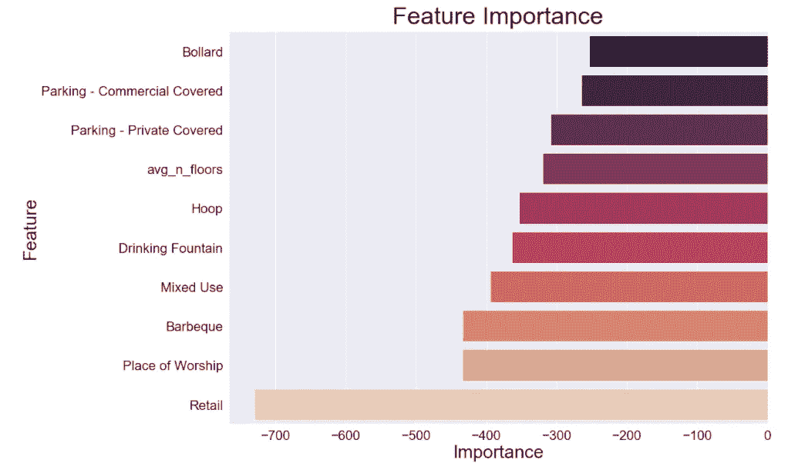

特点是**减少**的客流量

令人惊讶的是，传感器半径内的零售点数量越多，实际上对客流量产生了负面影响。其他有趣的特点是减少了人流量，有更多的礼拜场所，更大的平均建筑楼层，和更多的停车位置。

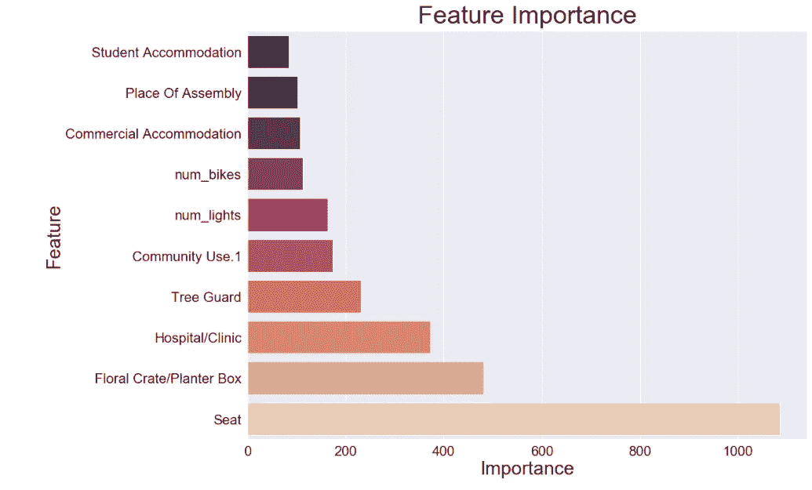

特点是**增加**客流量

更多的座位和医院对传感器接收的客流量有积极的影响，还有一些城市基础设施，如花坛和护林。这些也许是最令人惊讶的，因为这些是我们在城市中漫步时不一定会注意的特征。

**实际与预测**

这种模型的主要缺点是，它每天为每个传感器预测相同的值。由于特征在一年内没有变化，该模型无法将每日趋势考虑在内。这使得该模型在预测未来客流量时表现不佳。

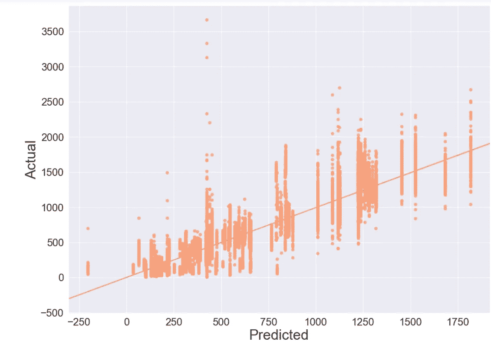

此图显示了线性回归模型预测的数据与实际每日客流量之间的差异。垂直线表明该模型每天预测每个传感器的相同计数，并且不针对每天的变化和趋势进行调整。

在用相同的特征调整这个模型之后，通过使用具有 GridSearchCV 的决策树回归器，CV 分数将提高到. 828。然而，用实际与预测的图表说明的相同问题仍然存在。仅使用*和*位置特征的模型只能变得如此精确，因为它没有考虑每天的变化，也不能预测未来的交通。

# 预测未来客流量

为了开发一个可以预测未来客流量的模型，我将之前回归模型中使用的位置特征与更多基于日期的信息相结合。除了半径中不同位置要素的数量之外，月、日、年和星期几的信息也作为要素包含在内。此外，我还包括了一年前或两年前(如果前一年没有有效数据的话)那天的计数。通过这些功能，训练和测试数据根据年份进行拆分，因此模型是根据 2011-2017 年的数据训练的，而测试数据是 2018 年的。

在调整参数和测试几种不同的模型类型后，该模型产生了迄今为止最高的分数，并能够以 90%的准确率预测每个传感器的 2018 年每日客流量。

**模型结果: *Ada Boost 回归器***

-训练分数:0.9994

-测试分数:0.9032

-简历得分:0.8744

-根均方误差:158.7632

**特征重要性**

对该模型预测影响最大的特征是基于日期的信息和过去一年的数据。这表明每个传感器都有一个有助于预测的年度趋势。还有几个基于位置的因素对预测相对重要，如篮球架、安全岛护柱的数量、平均楼层数和自行车护栏的数量。

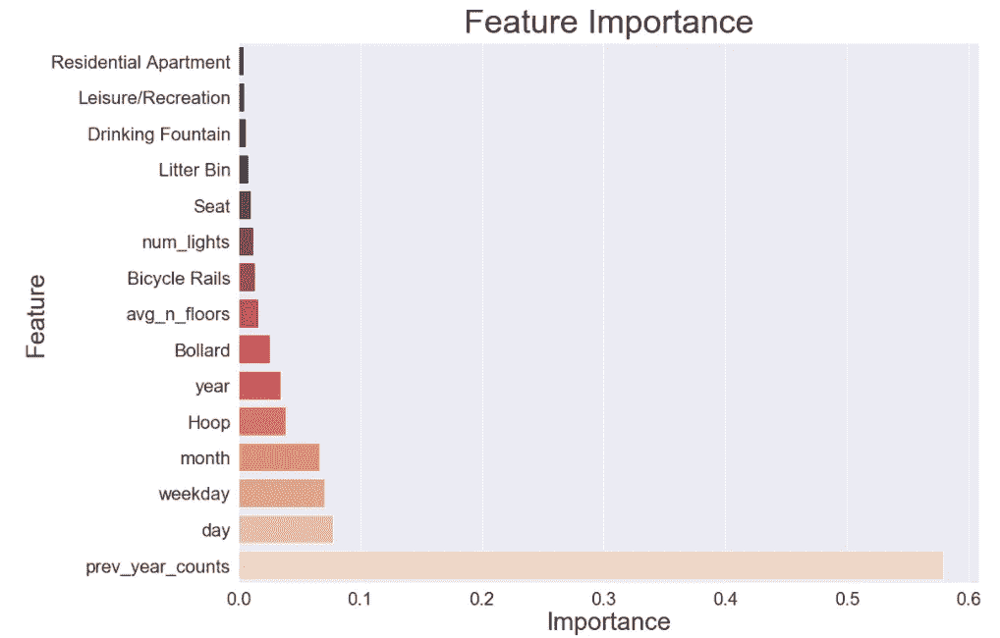

对预测影响最大的特征

**实际与预测**

该模型的预测更加细致入微，能够预测每个传感器的不同日计数。因此，该模型更加准确，并且在预测值和实际值之间存在更强的线性趋势。有几个强异常值，其中模型预测值比实际值高或低得多，可以进一步调查这些点，以更好地了解是什么影响了这些变化。

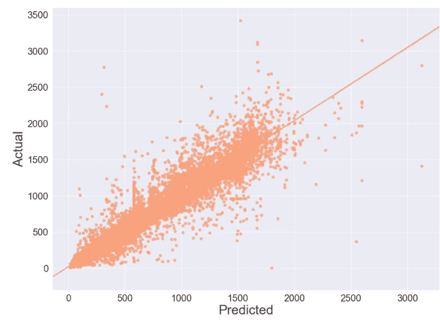

从模型中生成的实际每日计数与预测每日计数

# 结论

*那么，人们在墨尔本四处走动会产生什么影响呢？*从这些模型中，我们了解了城市的哪些特征会吸引更多的行人，哪些特征会减少游客，以及哪些特征有助于预测未来的趋势。

第一个模型显示，一个有更多座位、花坛、医院和社区使用建筑的区域会有更多的人流量。有更多零售店、宗教场所和烧烤的地方会减少平均每天去那里的人数。如果商业或城市规划者的目标是预测未来趋势，他们会想使用第二种模型。该模型表明，过去一年的数据和特定日期的信息将是估计未来客流量的最强预测因素。然而，一些城市基础设施元素，如篮球架、护柱的数量以及周围建筑的平均楼层数，也可以提供更准确的预测。

这个项目是一次很好的学习经历，让我更好地理解了地理空间数据科学——这是一个我将继续探索的主题。总的来说，我对目前为止发现的结果很满意，并渴望在未来继续这个项目。我想进一步探讨一些想法来改进我的模型:

*   返回分析每小时的行人计数数据，而不是每天的平均值，以获得更精确的趋势
*   包括城市的更多位置特征
*   包括季节性信息，例如城市事件、公共假日、体育赛事等。
*   基于位置特征对传感器进行聚类，以便可以预测没有前一年数据的新传感器的客流量

感谢您的阅读，如果您有任何建议或想法，请随时通过 [LinkedIn](https://www.linkedin.com/in/jewelbritton/) :)联系我