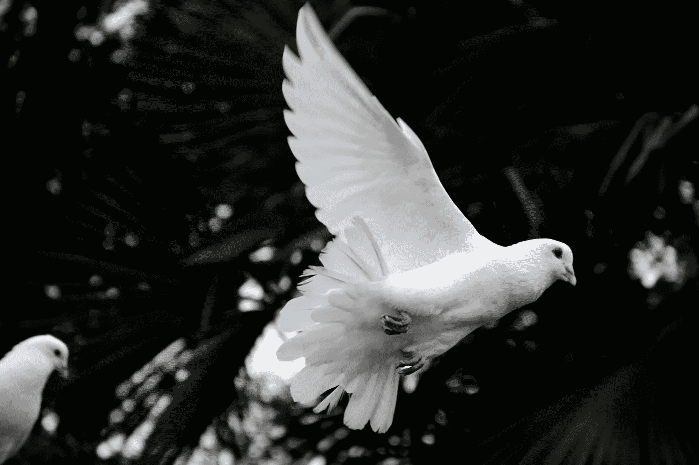
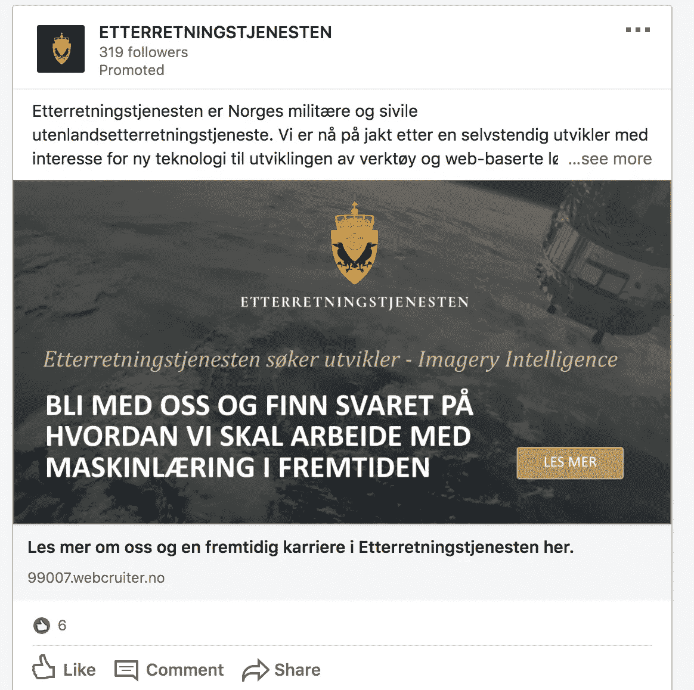
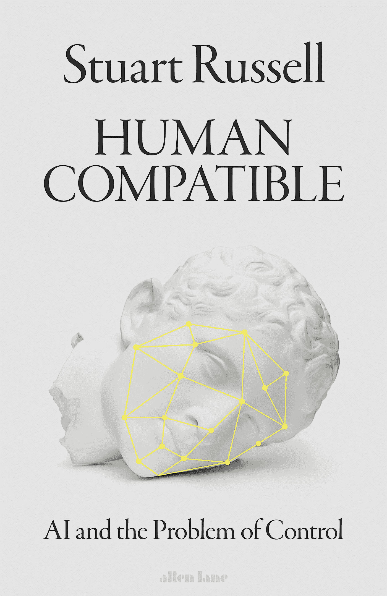

# AI 和平战略在哪里？

> 原文：<https://towardsdatascience.com/where-is-the-ai-strategy-for-peace-a89c1c681fe9?source=collection_archive---------38----------------------->

Photo by– [卡晨](https://unsplash.com/@awmleer) [@awmleer](https://unsplash.com/@awmleer)

## 对国家人工智能战略症结的简短思考

在 1 月 29 日这一天，我已经阅读了欧洲所有的国家战略，至少是那些已经出版的，以及大多数拥有人工智能计划的大国的国家战略。与此同时，我看到了各种关于人工智能主题的指数，这些指数衡量了各种因素。我发现，战略中所缺少的东西，与书面文件中所陈述的内容，或政治家们在发布后添加的内容一样有趣。

在 2020 年，我注意到大多数战略*(除了中国、法国、印度和葡萄牙)*中有一个重要的缺失，那就是对生态的关注，以及对 2019 年历史性变化的关注——街头抗议气候危机的儿童。

在大多数衡量人工智能进步的标准中，美元符号滚动，科学论文大量涌现，他们关注基础设施的需求。当一家公司击败另一个游戏时，我们会庆祝，无论是:危险、国际象棋、围棋、英雄联盟还是任何其他可以想象的智力活动。

尽管必须指出的是，在欧洲的大多数国家战略中(大多数由商业、贸易、数字或创新部门制定)，国防并没有明确和占主导地位，但它在某种程度上隐约出现在表面之下，以及在民族国家在讨论中提出的观点中。毕竟，在所谓的“AI 双头垄断”中，主导辩论的是美国和中国——如果美国这么做，中国会怎么做，等等。然后欧洲等等。

在人工智能的讨论中，自主武器的话题引人注目。

在我的祖国挪威，当然也有军队招募网络精英的情况。由于我在这个领域的其他地方从事机器学习，我显然是促销活动的目标。

作为机器学习工程师加入挪威的“智能单位”

作为一个例子，这里也有对自动驾驶汽车的测试，以及对自动武器(或简单地说，带有机器学习组件的武器)的投资，这是我们确定无疑的。这是自主防御车辆“Tor”在高草丛中的测试之旅。

对于国防工业来说，采用新技术并探索如何利用新技术更好地保卫国家是非常明智的。人们也很容易想到生命损失会更少。

尽管如此，在我的头脑中没有任何清晰的战略，我看到过和平的谈论。

关于人工智能话题的讨论通常会转向人工智能军备竞赛，特别是当一个反乌托邦式的未来观点出现时。

圣诞节期间，我读了一本斯图尔特·拉塞尔写的书。本书*人类兼容:AI 和控制的问题*。这是我极力推荐的一本书。

图为上述书籍的封面，可在此处找到。

这本书提出了几个支持和反对人工智能控制方法的论点，这些论点经常被人工智能社区的不同研究人员争论，这是一个真正发人深省的阅读。

我不会通过列出清单来破坏这本书，但是我可以说，以目前的进展来控制人工智能不是一个零和游戏，而是一个合作的努力。他将此与国际上遏制人类基因组编辑风险行为的努力进行了比较(遗憾的是，随着 CRISPR 和廉价 DNA 试剂盒的出现，这种风险行为再次出现)。

人类面临的潜在生存威胁的问题当然是一个合作的问题。这一点对大多数人来说应该是显而易见的。

挪威有着试图理解和平的悠久传统，特别是与奥斯陆(PRIO)的和平研究所合作。因此，在该研究所有这样一个专注于人工智能的项目可能并不奇怪。

 [## 人工智能的军事应用-伦理项目现已获得资助

### 人工智能(AI)在军事规划中发挥着越来越大的作用。这个项目将提供一个伦理…

www.prio.org](https://www.prio.org/News/Item/?x=2491) 

这个项目处于研究阶段，也有政策倡议。

我当然希望看到这个项目取得良好的进展，因为当结果是:

1.  它没有发生或；
2.  我们降低了某事发生的可能性。

我想这就是为什么它如此困难和重要。

另一个很好的例子是马克斯·泰格马克(Max Tegmark)和其他人，他们成立了未来生命研究所(Future of Life Institute)，专注于存在风险，特别是:人工智能、生物技术、核能和气候。

 [## 家-生命的未来研究所

### 科技赋予生命前所未有的繁荣潜力...

futureoflife.org](https://futureoflife.org/) 

然而，写在导言中的问题仍然存在。

> 为什么我们没有将和平视为国家人工智能战略的明确组成部分？和平实际上是缺失的。

我天真地在谷歌上搜索“欧洲人工智能和平战略”，得到了大量这样的信息。希望这只是一个糟糕的谷歌搜索案例。

在相对较短的时间范围内(也许 20-50 年，也许 100 年)，可以在生存层面上威胁到我们人类的技术当然值得考虑，作为共同努力防止迫在眉睫的灾难的领域。

你会希望，我也会希望，满怀希望——随着气候危机和人工智能的出现，各国将更加致力于和平与合作，而不是军备竞赛。

> 我们可以将人工智能作为一种工具，在缓解、适应和恢复方面进行合作，而不是进行军备竞赛。

然而，国家人工智能战略有一个和平问题，因为它根本不存在于概述和出版的文件中。

## 总结

我的鼓励当然是我们应该在未来的 AI 战略中把这个话题提上日程。伦理是一个开始，然而，如果人工智能被用于好的方面，我们可以更明确地表达我们的雄心。如果人工智能是用来做好事的，至少要表达出和平的意图和适当的措施，以确保这种投资与人工智能发展的快速增长一样多，这种发展扩散了迄今为止的国家战略讨论。为什么不把和平作为政策重点？

这里是#500daysofAI，您正在阅读的是第 239 条。500 天来，我每天都在写一篇关于或与人工智能相关的新文章。我目前 100 天 200-300 的重点是人工智能的国家和国际战略。