# 数据在哪里？

> 原文：<https://towardsdatascience.com/where-is-the-data-798faccb4e29?source=collection_archive---------31----------------------->

## 更多信息请在推特上关注我:[https://twitter.com/faviovaz](https://twitter.com/faviovaz)

## 或者如何丰富数据集并自动创建新要素。

插图作者:[伊泽尔·巴斯克斯](http://instagram.com/heizelvazquez)

O 当你在处理一个新的数据集时，最困难的事情之一是发现预测你的目标的最重要的特征，同时，在那里你可以找到新的信息来源，可以提高你对数据和模型的理解。

在本文中，我将向您展示如何在没有任何编程技能的情况下做到这一点。是的，这听起来很奇怪，但是请原谅我。在以后的文章中，我将探索可以帮助您做到这一点的其他编程库，并看看哪种方法会产生更好的结果。

我们将用一个示例数据集来做这件事。我们将使用美国西雅图金县的房屋销售数据集。您可以在此找到关于数据的所有信息:

 [## 美国金县的房屋销售

### 用回归法预测房价

www.kaggle.com](https://www.kaggle.com/harlfoxem/housesalesprediction) 

数据集的想法是根据不同的特征来预测房子的价格。在我向您展示如何进行数据丰富之前，让我们用 python 加载数据以获得一些相关信息。下面你可以看到一个简单的笔记本:

需要注意的是，我并没有为数据集做整个 EDA，这只是为了获得基本信息。我将要展示的内容并没有消除您必须遵循的数据科学流程，只是为了丰富您的数据并获得更多相关信息。

好了，现在是时候了。

我们将通过一个名为 Explorium 的系统来实现这一目标。前阵子发现这个软件，一直用到现在。他们将自己的产品描述为:

> Explorium 正在推动数据科学领域的一种新范式——公司可以根据他们需要的数据，而不是他们拥有的数据来建立模型。发现唯一一个专注于机器学习的高级数据的端到端数据科学平台。

因此，这是一个端到端的平台，您可以在其中构建和部署模型，但我们将在其他文章中探讨这一点。您可以在这里要求一个演示来复制我在本文中所做的事情:

 [## 请求演示探索

### 本网站使用 cookies 来改善您浏览网站的体验。在这些饼干中…

www.explorium.ai](https://www.explorium.ai/request-a-demo/) 

我要做一个循序渐进的教程。如果你有任何问题，请在下面的评论区告诉我:)。

## 创建项目:

当你可以访问这个应用程序时，你要做的第一件事就是创建一个项目。

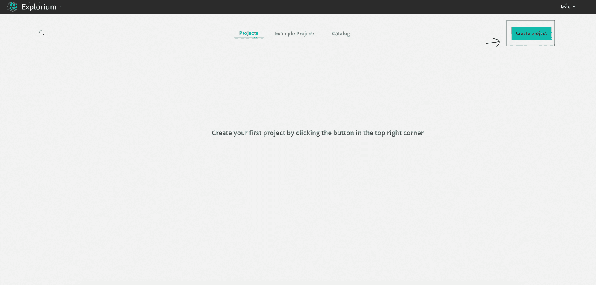

然后将项目命名为:

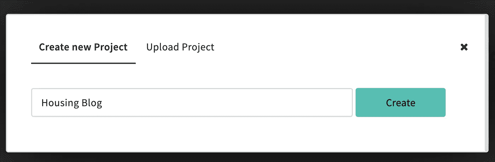

## 加载数据

下一步是将数据载入系统。有几种方法可以做到这一点，比如:

*   当地的
*   S3
*   神谕
*   Teradata
*   关系型数据库
*   Mssql
*   Postgres
*   红移
*   储备
*   谷歌大查询
*   谷歌存储

我将从我的本地计算机加载它。几秒钟后，您应该会看到以下屏幕:

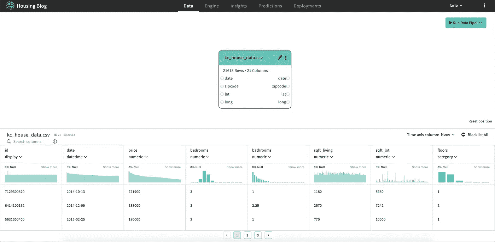

如您所见，底部有一个非常基本但有用的数据探索工具。您可以获得一些关于您的数据的基本统计数据。

如你所见:

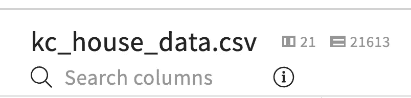

我们有 21 列和 21613 行，与我们在 Python 中看到的一致。

## 数据引擎

现在是开始魔法的时候了。在 Explorium 中，您有一个称为“引擎”的东西，在那里软件将根据您的数据创建新的要素，并根据列及其内容获得新的数据集。

这是我们将要做的事情(摘自网站):

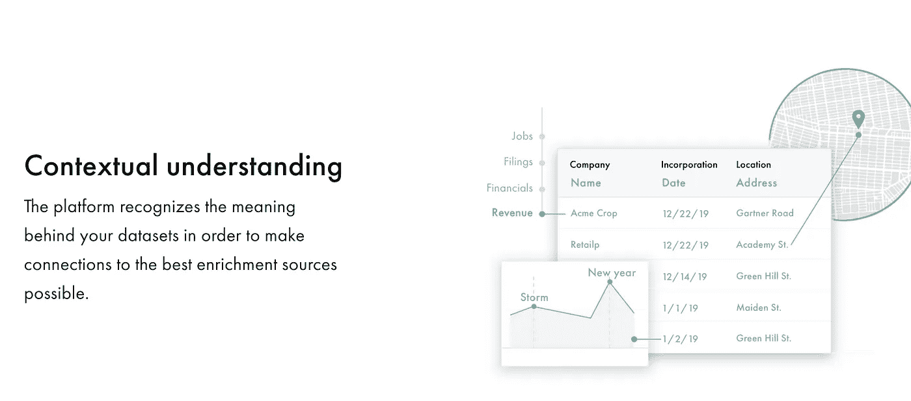

[https://www.explorium.ai/data-enrichment/](https://www.explorium.ai/data-enrichment/)

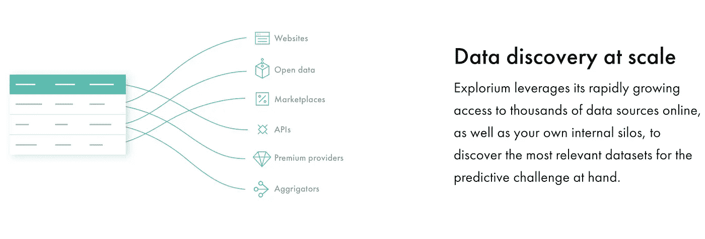

https://www.explorium.ai/data-enrichment/

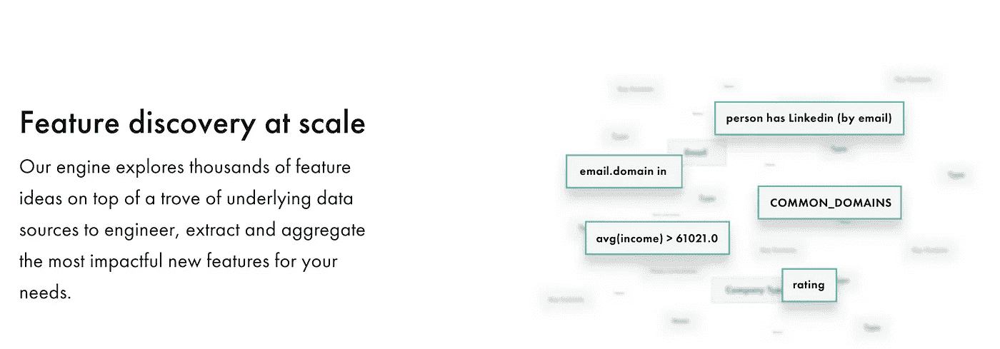

【https://www.explorium.ai/feature-discovery/ 

系统还可以做更多的事情，正如我提到的，我们将在其他文章中对此进行探讨。我们继续。

我们现在必须设定，我们试图预测什么。这更多是针对软件的机器学习部分，但也是继续的必要条件:

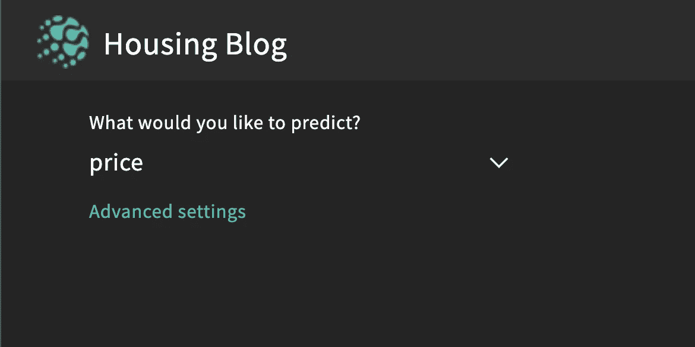

我们现在必须按下播放按钮:

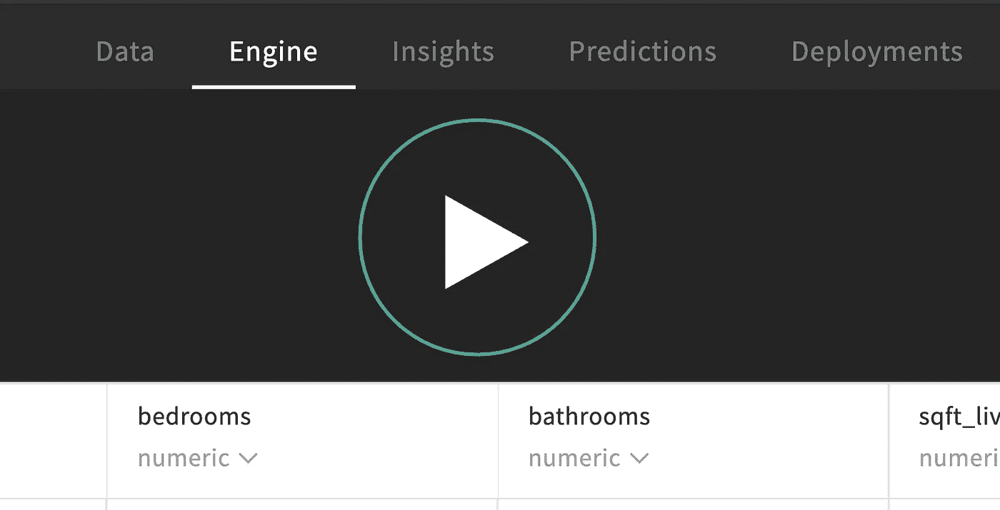

现在我们等着。

然后我们再等一会儿。这可能需要几分钟。系统正在使用您的信息从成千上万的数据集中提取其他数据。

如你所知，大约 5 分钟后，系统检测到 30 个有用的数据集和大约 890 个特征。如果你不想等待更多的时间，你可以停止引擎，但我建议你等到最后。

## 洞察力

几分钟后，您应该会看到类似这样的内容:

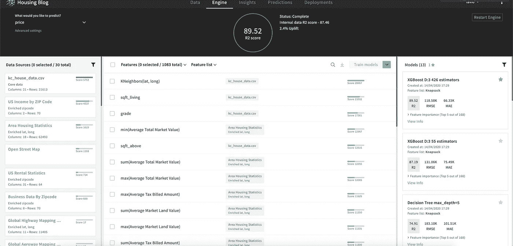

让我把那一页翻给你听。在顶部，我们看到内部数据(以及从数据集创建的一些新要素)的得分(R)为 87.46，相当不错，而外部数据的得分为 89.52，稍好一些。这并不奇怪，但这确实是事实。

在左侧部分，您可以看到它发现了 30 个有用的数据集，并且与您的数据相匹配。在中间，您可以看到它从内部和外部数据创建的所有不同的特征，最后，在右边部分，您可以看到一些 ML 模型的结果。您会看到最好的模型是使用 XGBoost 创建的，RMSE 为 118.5K，MAE 为 66.3K

我们现在不打算关注模型。只有数据。在中间部分，您可以获得预测价格的最佳 50 个特征:

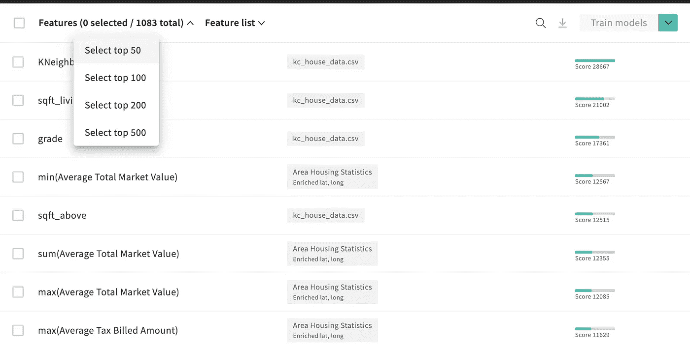

如果您单击此处，然后单击下载所选功能:

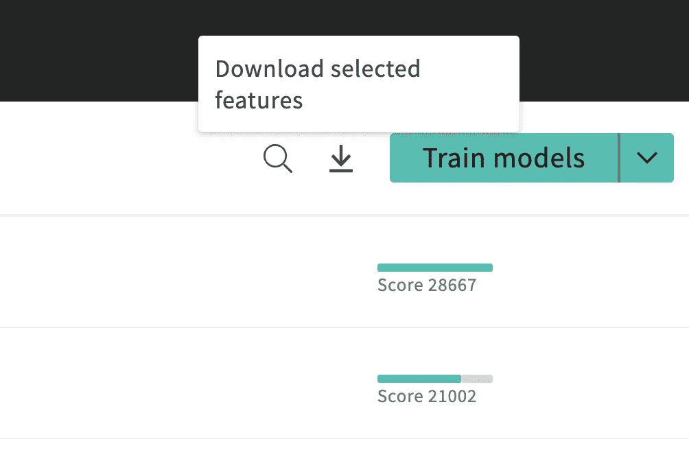

你将下载最好的 50 个功能来预测价格。这里很重要的一点是，价格不会在那里，所以如果你想在外部使用新数据，我们将需要追加它。让我们在 pandas 中加载数据并查看它:

正如您看到的，列的名称非常明确，但是我们可以用 Python 和 Pandas 轻松地改变它，所以不要担心。现在回到 Explorium，在 Insights 选项卡中，您可以获得功能重要性:

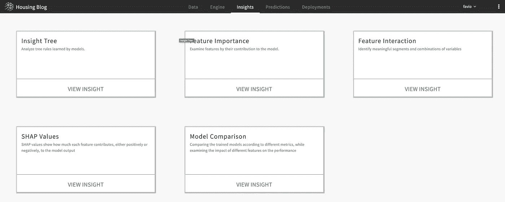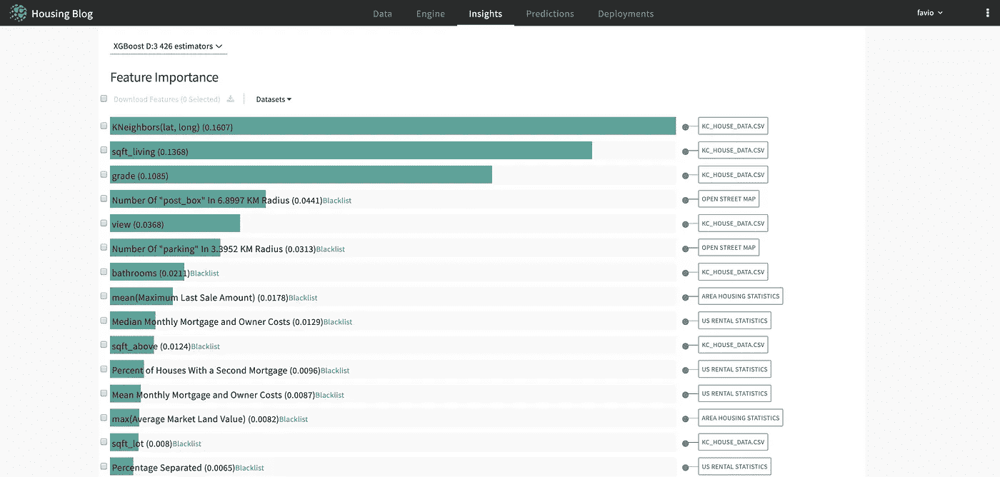

在这里你可以看到变量对建模有多重要以及它们来自哪里。如您所见，其中一些来自原始数据集，一些来自外部数据集，此外，我们的数据中还有一些现有列的 K-Neighbors。这对离线建模非常有帮助。

对了！！您也可以直接下载外部数据集:

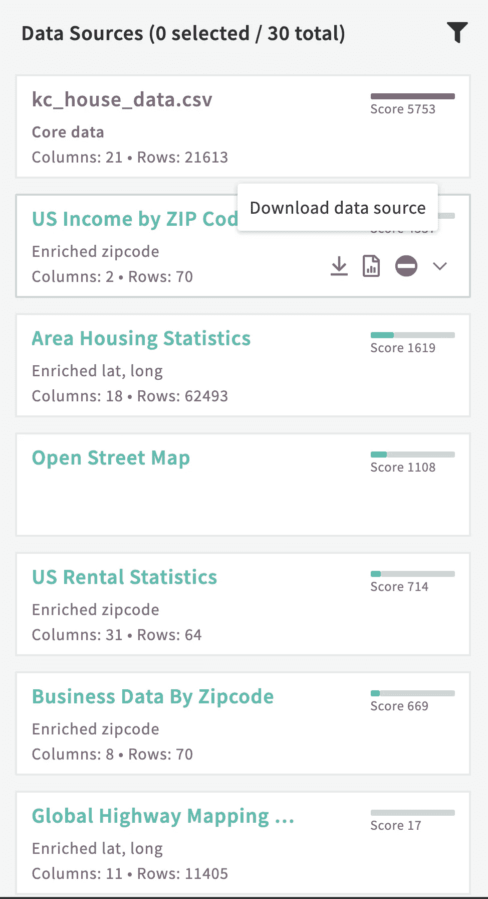

从他们那里得到完整的侧写。

## 结论

丰富和改进您的数据现在变得非常简单。正如我之前提到的，将来我会将结果与 Explorium 和一些 Python 库进行比较，请继续关注。

我们可以看到，这个过程非常简单和直观，如果您不需要建模，您可以保留新数据并自己工作。我可以向你保证，大部分工作都在发现阶段，数据清理和特性工程，建模很容易，编码也越来越简单。

如果您将这种类型的软件与对业务的良好理解和有效的数据科学方法相结合，您将更快地震撼数据科学世界。

感谢阅读！如果你想了解我的文章，请在 Medium 和 Twitter 上关注我:

 [## 法维奥·巴斯克斯

### Favio Vázquez 的最新推文(@FavioVaz)。数据科学家。物理学家和计算工程师。我有一个…

twitter.com](https://twitter.com/faviovaz)