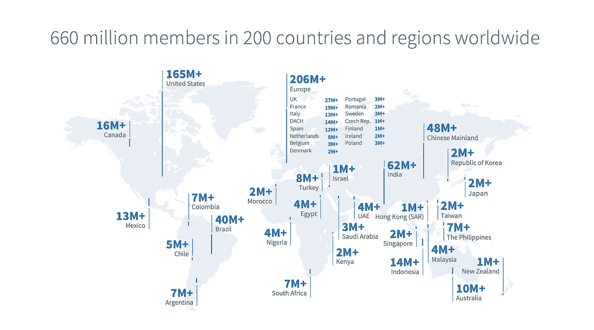
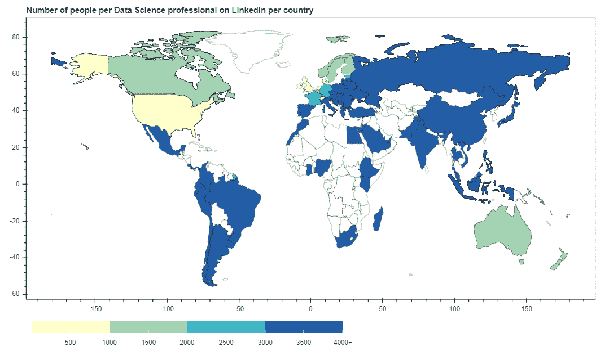
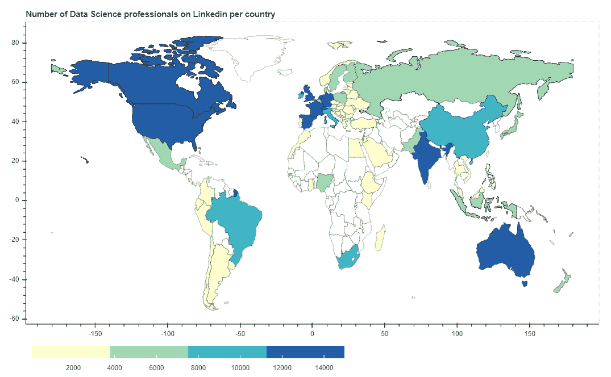
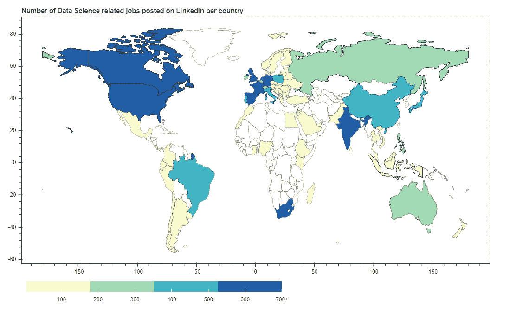
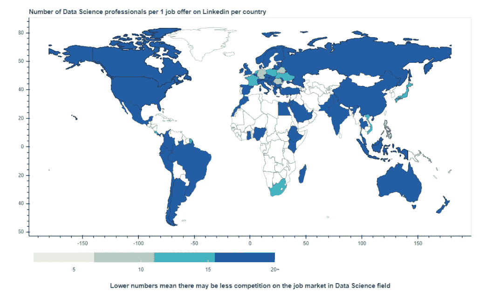

# 哪里最容易找到数据科学的工作？不是你想的那样！

> 原文：<https://towardsdatascience.com/where-it-is-the-easiest-to-get-data-science-job-not-where-you-may-think-28e33ec652b3?source=collection_archive---------38----------------------->

照片由[在](https://unsplash.com/@freetousesoundscom?utm_source=medium&utm_medium=referral) [Unsplash](https://unsplash.com?utm_source=medium&utm_medium=referral) 上免费使用声音

**新冠肺炎对生活的几乎所有方面都产生了影响，包括人们的工作，也包括广泛的 IT 领域(以及我们最感兴趣的领域——数据科学领域)。**

为了帮助同行业的同事找工作，我决定对 LinkedIn 数据做一个小分析，并回答如下问题:

*   哪些国家拥有最大的数据科学劳动力？
*   哪些国家拥有最大的数据科学就业市场(空缺职位数量)？
*   哪些国家的人均数据科学专家数量最多？

最后，在哪里最容易找到数据科学工作(根据空缺职位数量和员工数量的比例)？

这项研究是在 LinkedIn Jobs & People data 上进行的，涵盖了数据科学和类似领域(数据科学家、数据分析师、数据工程师、数据科学经理、大数据专家)至少有两个职位空缺的所有国家。

在我们对结果过于兴奋之前——让我们记住一件事:分析只在 LinkedIn 数据上进行。该网站本身在世界各地的受欢迎程度并不相同，因此在 LinkedIn 受欢迎程度较低的国家，大多数工作可以在其他网站上发布，专家注册和分享其个人资料的动力较小，因此我们可能会错过一些数据。

来源:Linkedin

然而，LinkedIn 仍然是最受欢迎的以就业为导向的在线服务，所以我们仍然可以捕捉到一些有趣的见解！

**1。人均科学家数量最多**

先说数据科学职业在全球的普及程度。哪些国家的人均数据科学家数量最多？*每一个数据专业人员有多少人？*

## 数据职业似乎在来自小型发达经济体(和美国)的人群中最受欢迎——爱尔兰、新加坡、瑞士、美国、卢森堡。

**2。科学家总数最多**

哪些国家拥有最大的数据科学劳动力？

## 这里没有惊喜。主要是最大的经济体(主要是英语圈)——美国、印度、英国、加拿大和法国。其中一些是大多数技术工人移居的国家。

**3。最大作业量**

事情越来越有趣了。

在哪些国家，该领域的空缺职位数量最多？

**与上一篇相似——世界上一些最大的经济体:美国、印度、德国、英国、法国。**

**4。每位科学家的最大工作量**

你可能最感兴趣的一个。世界上哪里(或者可能是哪里)最容易找到数据工作？不是你想的那样！

**答案是欧洲&东南亚的一些国家——葡萄牙、白俄罗斯、罗马尼亚、菲律宾、德国。**

在葡萄牙，每份工作只有 6 名数据专业人员。白俄罗斯和罗马尼亚有 8 起，菲律宾有 9 起，德国有 10 起。

**在其他一些国家，每份工作只有 11-12 名专业人士，这些国家包括:新加坡、日本、波兰、南非和哥斯达黎加。**

为什么是这些国家？

一些解释可能是，目前像葡萄牙、白俄罗斯、罗马尼亚、菲律宾或波兰这样的国家拥有蓬勃发展的 IT 部门，这是因为公司决定将分支机构外包或转移到劳动力成本更低、劳动力受教育程度更高的国家。

你有更好的解释吗？在评论中分享！🎉

这对你意味着什么？这些国家可能值得研究！

## 然而，请记住，即使就业市场竞争不那么激烈，也并不意味着你会更容易找到工作——可能仍然存在当地法规(工作许可证)和要求(懂当地语言)。工资也可能很低，导致对他们的需求减少。

如果你对数据或代码(Python 和 Bokeh)感兴趣，你可以在这里找到:

 [## 主 m-kortas/DS-playground 的 DS-playground/datascience jobs _ analysis . ipynb

### 深度学习、机器学习、NLP 和可视化-DS-playground/datascience jobs _ analysis . ipynb at main…

github.com](https://github.com/m-kortas/DS-playground/blob/main/visualisation/Linkedin_analysis/DataScienceJobs_analysis.ipynb)