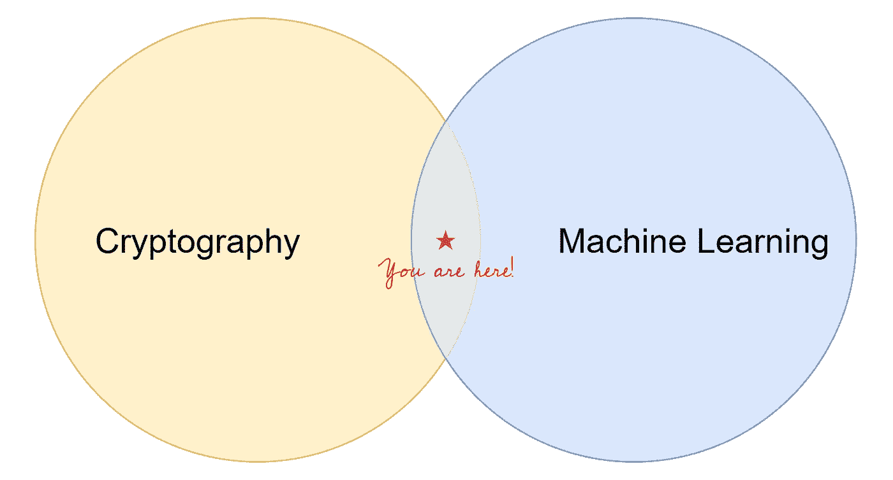
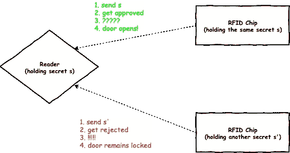
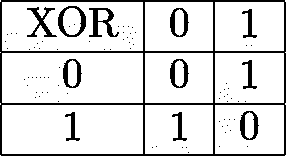
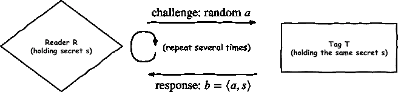
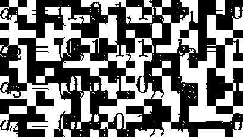
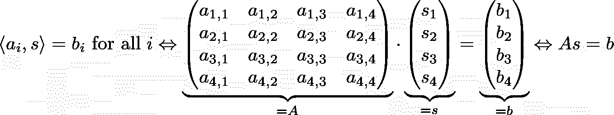
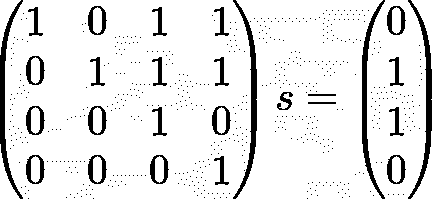
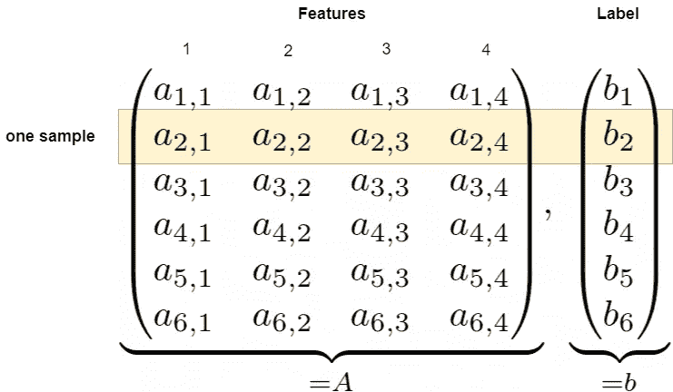
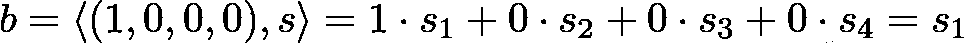

# 机器学习遇到密码学

> 原文：<https://towardsdatascience.com/where-machine-learning-meets-cryptography-b4a23ef54c9e?source=collection_archive---------5----------------------->

## 通过机器学习解决带噪声的密码相关学习奇偶校验问题



当你读到这里的时候，很可能你已经知道一些关于机器学习的事情。你知道机器学习算法通常会接受一堆*样本，*每个样本包含固定数量的*特征，*并最终输出一个*预测*。

你可能听说过(但没有深入研究)的是*密码学*领域。这是一个神秘的话题，涉及到安全、密码和隐藏的东西。也许你甚至听说过 *AES* 或 *RSA* ，它们是*加密*数据*的算法。*

但是不要担心，即使您以前从未接触过密码学，您也能够理解，因为我将从入门的角度来解释一切。

在这篇文章中，我想把这两个领域结合起来。我将向您介绍一个易于理解但难以解决的用于构建密码算法的问题——所谓的**带噪声的学习奇偶校验**问题，简称 **LPN** 。LPN 中的“L”应该已经给你的机器学习敲响了警钟，因为这个问题可以被视为一个常规的机器学习问题！

但首先，让我们看看 LPN 问题在加密设置中自然出现在哪里，以及如何定义它。之后，我们将使用机器学习来解决 LPN 问题。

# 动机

假设您拥有一家酒店，并且您想要管理对客人房间的访问，即每个客人应该只能进入他们自己的房间。有道理，对吧？


你的酒店。照片由[英治 K](https://unsplash.com/@abovedaworld?utm_source=medium&utm_medium=referral) 在 [Unsplash](https://unsplash.com?utm_source=medium&utm_medium=referral) 上拍摄。

现在，传统上你可以使用普通的物理钥匙。缺点是，人们有时会丢失钥匙，这意味着您的业务会有很大的成本，因为您必须更换受影响的门上的锁。

因此，您决定部署智能卡，特别是带有 RFID(射频识别)芯片的卡，以及相应的锁。由于你必须提供许多门，并且你想省钱，你选择**非常弱的 RFID 芯片**，即计算能力递减的芯片，甚至可能没有自己的电源。


苏珊·普兰克在[皮克斯贝](https://pixabay.com/de/?utm_source=link-attribution&amp;utm_medium=referral&amp;utm_campaign=image&amp;utm_content=4312260)拍摄的照片。

你的系统应该是这样工作的:每把锁和每张卡都存储了一个**密钥**，一个二进制向量，比如 *s=* (1，0，1，0)，*实际上要长得多*。如果你把你的卡放在一把锁旁边，这把锁就像一个阅读器一样扫描卡的密钥。在这种情况下，芯片被称为**标签**。

> 线索:如果卡和门的秘密钥匙匹配，门就会打开。

完美！但是怎么做呢？嗯，一个简单的方法是把你的卡放在锁旁边，锁告诉卡上的芯片把它的密钥发送给锁。然后，锁检查两个密钥是否相等，如果相等，则开门。



这是有意义的，因为如果您没有正确的卡，即您芯片上的密钥与门锁中的密钥不同，门将无法打开。

## 问题是

当客人想要进入他们的房间时，这种解决方案的麻烦就开始了:一个坏人，通常在密码学中被称为*攻击者*，可能坐在走廊上，显然只是无辜地在他们的笔记本上打字。攻击者实际做的是 [*嗅探*](https://en.wikipedia.org/wiki/Sniffing_attack)*RFID 流量，*即读取锁和客人芯片之间的通信。如果芯片直接发送密钥，攻击者将看到它，存储它，伪造一个包含这个密钥的卡，然后将能够进入房间。


一个典型的黑客在工作，这一次没有滑雪面具。纳赫尔·阿卜杜勒·哈迪在 [Unsplash](https://unsplash.com?utm_source=medium&utm_medium=referral) 上拍摄的照片。

所以，这是个坏主意。只有在世界上没有坏人的情况下(极不可能)才有效。相反，我们必须武装自己，为我们的客人提高安全性。想法是这样的:

> 芯片必须以某种方式向锁证明它拥有正确的密钥，而不泄露它。

我听到你尖叫: ***这就是加密的作用！*** 你说的没错。攻击者只能在嗅探工具中看到垃圾，而无法重建密钥。但可悲的是，RFID 芯片对于加密任何东西来说都太弱了，因为你想省钱，记得吗？*可悲的是，现实世界中的大公司也是如此。这种芯片几乎没有计算能力，存储空间也只能勉强容纳密钥。因此，我们需要另一种更轻量级的解决方案。*

一种方法是使用类似于 **Hopper** 和 **Blum** 的 **HB 协议**的加密协议。这个协议使得攻击者很难提取密钥。


照片由 [Goh Rhy Yan](https://unsplash.com/@gohrhyyan?utm_source=medium&utm_medium=referral) 在 [Unsplash](https://unsplash.com?utm_source=medium&utm_medium=referral) 上拍摄

***我要介绍的 vanilla HB 协议还有其他漏洞，不应该在实际中使用。我用它只是因为它容易解释。为了现实世界的安全，应该使用该协议或其他安全协议的更安全的扩展。***

## 血红蛋白协议

所以，你有一个**阅读器*R*(锁)和一个**标签*T*(你的芯片)。 *T* 现在想要向 *R* 证明它拥有相同的密钥**而不泄露它。**这是通过 *R* 反复询问 *T* 只有具有正确密钥的标签才能回答的问题来实现的。到目前为止，我们已经看到单个问题“你的秘密密钥是什么？”是不安全的，因为这已经暴露了太多的信息。相反，在 HB 协议中 *T* 被要求一次只透露一小部分秘密，直到 *R* 能够确定 *T* 拥有正确的秘密密钥。****

假设 *R* 和 *T* 的密钥实际上都是同一个 *s* =(1，0，1，0)。现在 *R* 向 *T* 发送一个随机二进制向量 *a* (例如 *a* = (1，0，1，1))，并期望 *T* 用标量积 *b* = *< a，s >，*对其进行响应，即


在这个例子中。我们称这个*为*为*挑战*。记住，我们在这里处理的是位算术，所以“+”实际上是一个 XOR。乘法和实数乘法是一样的。或者对数学家来说:我们在域 GF(2)或𝔽₂中计算，这个域有两个元素。



异或就像整数的普通加法，只是 1+1=0。

*R* 可以自己计算标量积(它知道 *a* 和 *s* )并检查 *T* 的答案。如果 *T* 的答案是相同的，那么 *R* 可以更加确信 *T* 确实拥有相同的密钥。为了增加信心，这个游戏要重复几次。



例如，如果 *T* 没有正确的密钥，那么在足够多的回合之后，它很可能不会成功，因为单个响应的正确概率只有 0.5。因此，例如，在 10 轮之后，成功认证的机会仅为 1/1024，**小于 0，1%** 。

这听起来好多了吧？T 现在并没有一口气透露它的秘密，相反，它通过回答挑战给了 *R* 一些信息。**但可悲的是，这也是完全没有安全感的。**攻击者仍然可以写下 *R* 和 *T* 之间的完整通信，然后轻松求解线性方程组来恢复 *s* 。这是通过以下方式完成的:假设攻击者已经为挑战/响应对写下了以下内容:



攻击者也知道



其中 *A* 是包含 *aᵢ* 行和*b*bᵢ行的矩阵。在我们的例子中:



攻击者必须解决的线性方程组。

因此，解决这个系统为*的*产生的秘密。如果 *s* 大得多，即 1024 位长，这也可以通过[高斯消除](https://en.wikipedia.org/wiki/Gaussian_elimination)容易地完成。顺便说一下解决方法是 *s* = (1，0，1，0)。😎

# 噪声问题下的学习奇偶校验

有一个非常小但是非常重要的调整来防止我们的攻击者: *T* 只是在它的响应中添加了一些随机的[伯努利](https://en.wikipedia.org/wiki/Bernoulli_distribution)噪声。它不是将 *< a，s*发送回 *R，*而是掷一枚概率为 *p* 为 1，否则为 0 的硬币 *e，并将*a，s > +e* 发送回阅读器*。*换句话说，标签以概率 1- *p* 将 *< a，s >* 发送回 *R* ，并以概率 *p* 将响应位从 0 翻转到 1 或从 1 翻转到 0 *。*我们假设*p<0.5。**

这并不能**而不是**阻止攻击者嗅探 *R* 和 *T* 之间的通信，并做笔记*，*当然，但他们现在必须解决以下问题:


**这个符号表示方程组的每个方程只有概率 1- *p* 才是正确的。更正式地说，你可以把它写成 *As+e=b，*其中 *e* 是噪声向量，每个分量(独立地)以概率 *p* 为 1，以概率 1-*p***为 0

> 因此，攻击者必须在 GF(2)上解一个嘈杂的方程组。对于一个恒定的错误率 p，这个问题——带噪声的学习奇偶校验(LPN)问题——被认为对于足够长的密钥长度是不可行的。如果攻击者可以获得任意多个方程，这也是正确的。

即使添加了这些错误， *R* 也可以完成确定 *T* 是否知道 *s* 的工作。如果 *T* 具有正确的 *s，*大约 1- *p* 响应的一小部分将是正确的*。*这意味着如果 *p* = 0.25，HB 协议运行 1000 次迭代， *T* 应该给**大约 750 个正确响应**。

如果 *T* 没有正确的 *s* ，它将给出大约 0.5 个正确答案的分数，即**1000 个**回合中的 500 个回合协议运行。这允许 *R* 决定 *T* 是否有正确的秘密，并且这个协议对我们的用例仍然有意义。

## 通过机器学习求解 LPN

现在让我们开始有趣的部分。我们已经确定，解决 LPN 问题意味着，给定一个随机二进制矩阵 *A* 和一个二进制向量 *b=As+e* ，恢复 *s.*

**重要观察:**我们可以把矩阵 *A* 的每一行 *aᵢ* 现在作为一个样本，把向量 *b* 中对应的值 *bᵢ= < aᵢ，s > +eᵢ* 作为标签。



使用秘密长度为 4 和六个捕获的通信的例子，我们可以看到矩阵 A 的每一行包括四个特征，并且 b 中的条目是相应的标签。我们的数据集大小为 6。

正如在机器学习中使用的正常数据集所发现的，标签 *bᵢ* 实际上类似于特征向量 *aᵢ* 和固定秘密向量 *s(一些基本事实)*的标量积，但是添加了误差项。但是，当我们抛出一个机器学习算法来预测标签时，我们如何才能获得秘密呢？

好吧，如果我们能很好地学习问题*，*，我们就能为标签生成好的预测(标积；地面真相)为每个特征向量 *aᵢ* 我们喜欢。如果我们放入向量 *a* =(1，0，0，0)，那么我们会得到一个很好的猜测



**第一位的*s*！对向量(0，1，0，0)，(0，0，1，0)和
(0，0，0，1)做同样的操作，我们就有了密钥的所有位。**

因此，我们可以使用机器学习来解决 LPN 问题。

## 评论

LPN 问题是一个非常通用的问题，您也可以使用它来构建*加密、基于身份的加密、用户认证、不经意传输、消息认证码*，以及可能更多的构造。此外，与因式分解问题不同，LPN 问题无法使用量子计算机轻松解决。与它的轻量级配对，它是构建后量子安全算法的一个很好的候选者。所以，不用担心，如果 RSA，这种基于大数分解的算法，在量子计算机面前消亡了。；)

关于 LPN 问题的更多信息和更好的数学定义，请参考我的论文[2]。

# 实验

让我们首先定义一个 *LPN oracle，*即一个我们可以在实例化时用一个密钥和一个错误级别 *p* 来填充的类，这给了我们想要的那么多样本。

这可以使用以下代码轻松完成:

```
import numpy as np

class LPNOracle:
    def __init__(self, secret, error_rate):
        self.secret = secret
        self.dimension = len(secret)
        self.error_rate = error_rate

    def sample(self, n_amount):
        # Create random matrix.
        A = np.random.randint(0, 2, size=(n_amount, self.dimension))
        # Add Bernoulli errors.
        e = np.random.binomial(1, self.error_rate, n_amount)
        # Compute the labels.
        b = np.mod(A @ self.secret + e, 2)
        return A, b
```

我们现在可以用长度为 16 的随机秘密和 p = 0.125 来实例化这个 oracle。

```
p = 0.125
dim = 16
s = np.random.randint(0, 2, dim)
lpn = LPNOracle(s, p)
```

我们现在可以从`lpn`开始取样:

```
lpn.sample(3)

# My output:
# (array([[1, 1, 1, 1, 0, 0, 0, 0, 1, 0, 1, 0, 0, 1, 1, 1],
#        [1, 1, 0, 0, 1, 0, 0, 1, 1, 0, 0, 0, 1, 0, 1, 0],
#        [1, 0, 1, 1, 0, 0, 1, 0, 1, 1, 1, 0, 1, 0, 0, 0]]),
# array([1, 1, 1], dtype=int32))
```

这里我们采样了 3 个数据点。现在，让我们试着用决策树找到*的*。当然，您也可以尝试逻辑回归、伯努利朴素贝叶斯和您选择的任何其他分类器。

```
from sklearn.tree import DecisionTreeClassifier

dt = DecisionTreeClassifier()

# Get 100000 samples.
A, b = lpn.sample(100000)

# Fit the tree.
dt.fit(A, b)

# Predict all canonical unit vectors (1, 0, 0, ..., 0), (0, 1, 0 ,0, ..., 0), ..., (0, 0, ..., 0, 1).
s_candidate = dt.predict(np.eye(dim))

# Check if the candidate solution is correct.
if np.mod(A @ s_candidate + b, 2).sum() < 14000:
    print(s_candidate, s)
else:
    print('Wrong candidate. Try again!')
```

学习算法可能无法捕捉基本事实并学习另一个函数。在这种情况下，向量的所谓*汉明权重*相当高(对于我们长度为 100000 的向量来说大约为 50000)*。*这对应于标签 *T* 具有错误密钥并且可以正确回答大约一半挑战的情况。如果 *s* _candidate = *s，*汉明重量将在 0.125 * 100000 = 12500 左右。

在这个例子中，阈值为 14000 是在识别正确的秘密和不输出错误的候选解之间的一个很好的折衷。你可以在[2，23 页]中找到如何得到这个界限。

# 结论

我们已经定义了 LPN 问题，并了解了当试图破解加密 HB 协议时它是如何出现的。然后我们用一个简单的决策树解决了一个小问题。

**但旅程才刚刚开始:**我们可以用其他/更好的算法(深度学习，有人吗？)或巧妙的花招来

*   获得更高的成功率，
*   使用更少的样本和
*   能够解决更高维度的问题。

关于求解 LPN 的非机器学习算法的列表和解释，请查看我的论文[2]。还有，如果你想出名，比如试着求解一个秘密长度为 512，p=0.125 的实例。这个 LPN 实例目前未被破坏，用于一些现实世界的密码系统。祝你好运！；)

# 参考

[1] N. Hopper 和 M. Blum，[安全人类识别协议](https://link.springer.com/chapter/10.1007/3-540-45682-1_4) (2001)，密码学与信息安全理论与应用国际会议，Springer

[2] R. Kübler，[学习奇偶与噪声问题的时间记忆权衡](https://hss-opus.ub.ruhr-uni-bochum.de/opus4/frontdoor/deliver/index/docId/5940/file/diss.pdf) (2018)，学位论文(波鸿鲁尔大学)

我希望你今天学到了新的、有趣的、有用的东西。感谢阅读！

**作为最后一点，如果你**

1.  **想支持我多写点机器学习和**
2.  **无论如何，计划获得一个中等订阅，**

**为什么不做** [**通过这个环节**](https://dr-robert-kuebler.medium.com/membership) **？这将对我帮助很大！😊**

*说白了，给你的价格不变，但是大约一半的订阅费直接归我。*

非常感谢，如果你考虑支持我的话！

> *有问题就在* [*LinkedIn*](https://www.linkedin.com/in/dr-robert-k%C3%BCbler-983859150/) *上写我！*