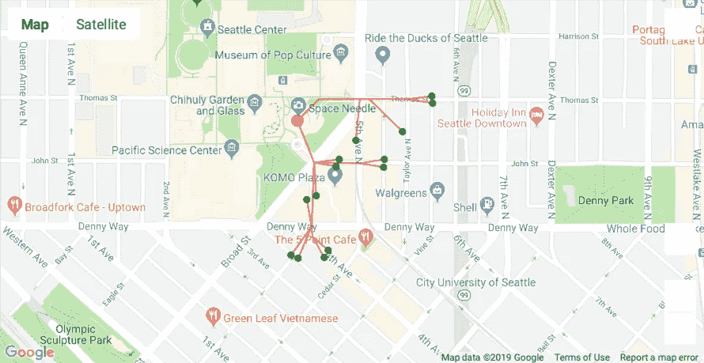
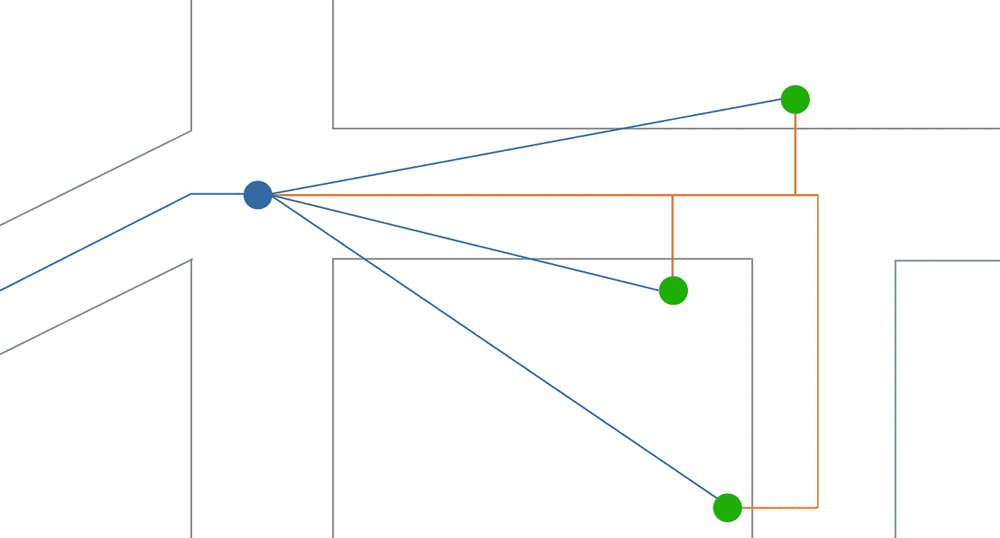
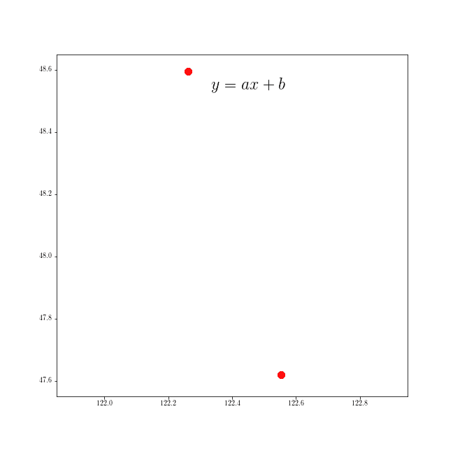
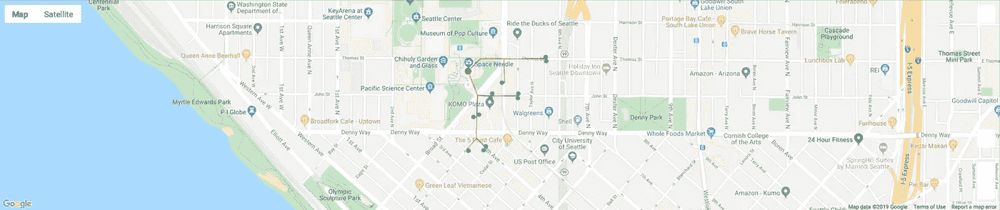

# 停车点到底在哪里？

> 原文：<https://towardsdatascience.com/where-really-are-the-parking-spots-ed6a1129035e?source=collection_archive---------63----------------------->

## 利用急流寻找更准确的步行距离

这个形象怎么了？

在[之前的故事](/where-should-i-walk-e66b26735de5)中，我们探索了 NVIDIA RAPIDS package 的 [cuSpatial](https://medium.com/rapids-ai/releasing-cuspatial-to-accelerate-geospatial-and-spatiotemporal-processing-b686d8b32a9) 和 [cuGraph](https://medium.com/rapids-ai/status-of-rapids-cugraph-refactoring-code-and-rethinking-graphs-efe9956d5528) 库，并使用它们来查找到西雅图太空针附近最近停车点的步行距离。这是在[融合数据科学](https://fusiondatascience.com/)的约翰·默里的大力帮助下才有可能实现的，他友好地提供了一张金县道路图，以十字路口列表(带有地理坐标)和连接十字路口与计算长度(以码为单位)的边列表的形式。

然而，快速浏览一下上面的地图，很快就会发现我们之前提出的相对简单的方法存在一个问题:从最近的十字路口到停车点的距离是一条直线(*直线*)。在这个故事中，我们将看看如何解决这个问题。

# 《当乌鸦飞》与《当人们工作》的对比

我们如何解决上述问题？让我们更接近真实步行距离的一种方法是在地图上(为每个停车点)找到一个停车点，该停车点的位置垂直于道路本身，如下图所示。

蓝线显示当前的解决方案。正如你所看到的，我们正在建筑物和十字路口上空飞行，这是正常人通常做不到的。然而，橙色线显示了一种更现实的方法，即一个人沿着道路走到选定的停车位置。

因此，我们需要向我们的图中添加更多的节点和边:每个停车位置一个，以使到最近道路的距离最小化，即，位于连接两个节点的线上的节点，并且当连接到停车计时器的位置时，这样的线是垂直的。

# 让我们做一些数学！

给定 3 个点，找出两条线的交点是小学时的一个简单问题，所以下面只是一个快速复习。

我们寻找新节点位置的方法。

给定平面上的两个点，我们可以通过获取这两个点之间的纬度差并除以它们的经度差，快速找到连接两个节点(道路交叉口)的黑线的斜率 *a* :

*a =(lat _ pt _ 1-lat _ pt _ 2)/(lon _ pt _ 1-lon _ pt _ 2)*

垂直线的斜率就是 *a* 的负倒数:

*a _ vertical =-1/a*

同样简单的是找到黑线的常数 *b* ，因为我们已经知道了斜率:

*b=lat_pt_1-a*lon_pt_1*

当然，我们可以用另一个点得到同样的结果。给定垂直线的斜率和停车点的位置—我们现在可以快速地做同样的事情来找到*b _ vertical*。

由于交叉点处的点将具有相同的纬度，无论我们使用什么等式(它毕竟是一个交叉点)，我们可以将这些等式设置为彼此相等，以找到交叉点的经度:

*a * lon _ intersection+b = a _ vertical * lon _ intersection+b _ vertical*

快速的代数变换，我们可以清楚地看到 *lon_intersection* 点:

*lon _ intersection =(b _ vertical-b)/(a-a _ vertical)*

找到纬度现在是微不足道的，因为我们可以使用任何一个方程来得到它。

# 来做点编码吧！

现在我们有了方法，让我们把它转换成一个 RAPIDS 内核。

上述内核中的点 *x* 和 *y* 是描绘道路的两点，点*REF*是停车点。注意:如果你不熟悉定义 RAPIDS 内核，我在之前的两篇文章中已经提到了:[我应该停在哪里？](/where-should-i-park-29e8da95265a)和[我该往哪里走？](/where-should-i-walk-e66b26735de5)所以我就不在这里讨论了。

在我们上面的计算中，我们没有解决两种特殊情况:当道路完全沿着南北或东西走向时。在前一种情况下(南北对齐)，投影点的经度是任一点的经度，而纬度将是停车位置的纬度。在后一种情况下(东西走向)，解决方案将是相反的:我们取任一点的纬度，经度将是停车点的纬度。

我们现在可以迭代所有的停车位置。首先，我们需要将经度和纬度添加到 *road_graph_data* 数据帧中；作为复习，这个数据帧只包含一对节点和它们之间的距离。我们将从*道路节点*数据帧中获取这些数据。

计算停车位置和 *road_graph_data* 中的所有点之间的距离是没有意义的，因此我们将节点列表划分为距离正在处理的停车节点大约 2000 英尺以内的节点。

现在我们可以找到交点了。

因为我们正在处理 2000 英尺以内的节点，所以我们需要检查该点是否位于两个节点之间。我们通过检查从交点到每个点的哈弗线距离之和小于或等于这两个节点之间的实际长度来做到这一点。

为了找到最佳拟合，我们选择距离停车点距离最小的点，并将该节点添加到节点列表中。

最后，我们还添加了连接停车位置和找到的交叉点的边。

处理~1500 个停车咪表位置只用了 3 分 20 秒(大王县有 12.7 万多个道路节点！)上的[英伟达泰坦 RTX](https://www.nvidia.com/en-us/titan/titan-rtx/) 。

# 成功了吗？！

使用与我们在[之前的故事](/where-should-i-walk-e66b26735de5)中提出的相同的 cuGraph 方法，我们现在可以找到更可靠的方法来遍历我们的图表并找到太空针附近最近的停车位置！

