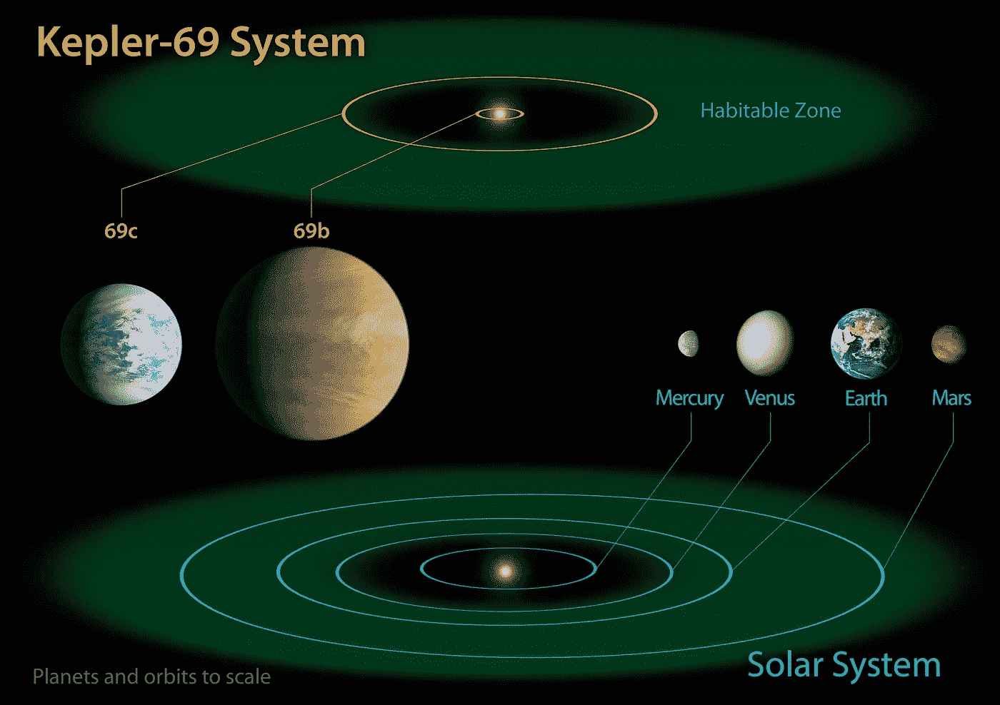
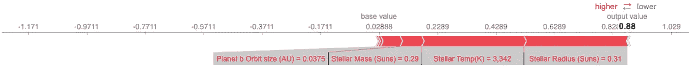
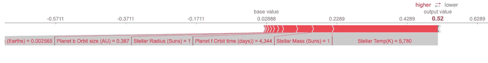
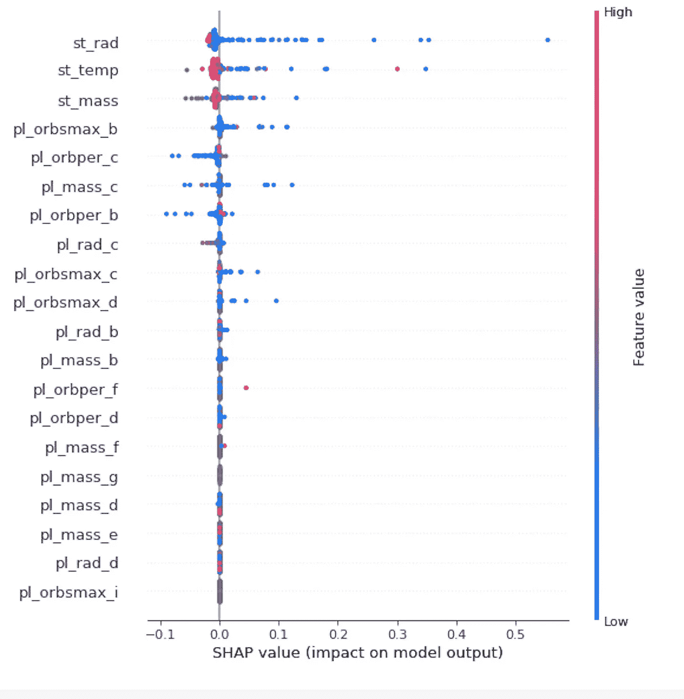

# 我们应该在哪里寻找可居住的行星？

> 原文：<https://towardsdatascience.com/where-should-we-look-for-habitable-planets-9d9330275d8c?source=collection_archive---------36----------------------->

和很多人一样，我从小就迷上了天文学和太空探索。最有趣的可能性之一是其他恒星周围的世界，并且可以居住(或有人居住！)世界更是如此。在发现任何系外行星之前，我们可以推测其他恒星系统的性质，但我们只有我们的太阳系来观察和检查我们的理论。我们很自然地认为，其他拥有潜在宜居行星的恒星系统看起来会像我们的一样——大型气体巨行星在较大的轨道上，较小的岩石行星靠近恒星。然而，事实并非如此。

随着 51 Pegasi b 的发现，我们了解到在其他类似太阳的恒星周围有行星，这些恒星系统的排列方式与我们的不同。进一步的系外行星发现进一步证实了这一点，包括一些具有潜在宜居世界的恒星系统。一个这样的例子是开普勒-69(如下所示)，它有一颗靠近恒星运行的大型气态行星，以及一颗在较大轨道上的较小的潜在宜居行星——这种安排与太阳系非常不同

我们如何整理这些数据来发现适合居住的星球呢？我们已经知道，可居住的行星需要主序星不太热也不太大，但即使有这些要求，许多恒星也符合要求。由于搜寻系外行星的资源有限，任何缩小搜索范围的方法都会有所帮助。也许我们可以超越恒星的要求，利用我们所知道的已经发现的恒星系统来预测可居住的行星可能在哪里。一种方法可能是使用机器学习来尝试更好地预测哪些恒星将拥有可居住的行星。

考虑到这一点，我建立了一个梯度增强模型，根据恒星和其他行星来预测恒星系统是否有可居住的行星。作为输入，我使用了每颗恒星的不可居住行星的质量、半径和轨道大小，以及恒星的温度、半径和质量。只有大约 4%的多行星恒星系统有可居住的行星，所以猜测没有恒星有可居住的行星的基线，虽然没有帮助，但确实提出了一个需要克服的挑战。当然，我们的目标是改进恒星数据，所以我也只使用这些数据构建了一个类似的模型。因此，我们可以看到行星数据是否改善了预测。

我的两个模型都是成功的(它们在准确性和 ROC-AUC 得分方面都超过了基线，精确度和召回率在下面详述)。此外，正如我所希望的，行星模型打败了只有恒星的模型。作为进一步的验证，我将太阳系包括在测试集中，去掉了地球(就像其他系统的潜在可居住行星一样)，以查看模型是否可以正确预测太阳及其其他 7 颗行星中有一颗可居住的行星。令人高兴的是，行星模型预测我们的太阳有一颗可居住的行星！不幸的是，纯恒星模型认为我们的太阳只有 40%的机会拥有可居住的恒星。

# 评估模型

stellar 模型的召回率为 33%，正确找到了三分之一的目标系统，精确度为 50%，假阳性和真阳性的数量相等。行星模型的召回率为 50%，找到了一半的可居住系统，精确度为 75%，三次正确预测中只有一次误报。当然，基线的召回率为 0——没有识别出任何潜在的可居住的恒星系统，但也没有假阳性。

梯度推进模型给了我们概率和分类，所以我们可以看看一颗恒星有可居住世界的概率。随着检测方法的改进或更多的资源被分配给搜索，这可能是有用的。我们可以检查的候选人越多，召回就越重要，精确度就越不重要——假阳性越多，假阴性越少，这是一种可以接受的权衡。只接受 5%的可能性会让我们在两个模型中都得到 100%的回忆分数，行星模型再次比只有恒星的模型给出了更好的精确度——24%比 20%。由于潜在的宜居行星很少出现，所以在精确度和召回率之间存在权衡也就不足为奇了，但这确实向我们展示了模型的行为符合我们的意愿——不太可能的预测包括更多的假阳性，但也捕捉到了所有的目标恒星。

# 用 Shapley 值看引擎盖下

绘制 Shapley 值可以帮助我们了解模型使用什么特征来进行预测，以及这是否符合直觉。下面是狼 1061 的沙普利力图:

这是我们太阳系的沙普利力图

我们可以看到，虽然恒星的特征主导了预测，但行星的特征也起了作用。特别是，我们的太阳尤其受到木星和金星轨道的帮助。这与我们对恒星系统知识的预期大致相符。我们可以通过 Shapley force summary 在整个测试集上看到相同的效果:

再次，恒星特征占主导地位，但我们可以看到行星肯定也有影响。

# 结论

这些模型表明，在评估一颗恒星拥有可居住行星的可能性时，纳入来自已发现行星的数据是有价值的。这种模型目前面临的最大挑战是数据的不完整状态。许多团队已经使用各种方法和仪器发现了系外行星，并不是所有团队都为每个发现的行星提供相同的数据。这加剧了已经很小的样本。

同样值得考虑的是，现有的系外行星样本被我们探测它们的能力扭曲了。例如，更小、更冷的恒星可能有更靠近轨道运行的可居住行星，并且靠近轨道运行的行星更容易被探测到。因此，我们在相对较小的冷恒星周围发现更多可居住行星的事实可能并不反映它们的真实分布。

# 数据、方法、参考资料、链接

系外行星数据来自[美国宇航局系外行星档案馆](https://exoplanetarchive.ipac.caltech.edu/index.html)

可居住性数据来自[可居住系外行星目录](http://phl.upr.edu/projects/habitable-exoplanets-catalog/data/database)，这是位于阿雷西博的波多黎各大学[行星可居住性实验室的一个项目](http://phl.upr.edu/)

建模是用 python 和 [scikit-learn](https://scikit-learn.org/stable/) 和 [XGBoost](https://xgboost.readthedocs.io/en/latest/python/python_intro.html) 完成的

我的 python 笔记本可以在我的 [GitHub repo](https://github.com/chowell2000/Exoplanets) 中找到