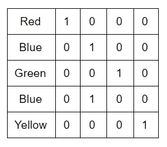
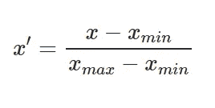
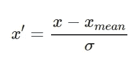

# 从哪里开始您的数据科学项目

> 原文：<https://towardsdatascience.com/where-to-begin-your-data-science-project-c22b1749ec1e?source=collection_archive---------44----------------------->

## 数据预处理解码，适合初学者。

现在，我们已经了解了一些数据科学的基础知识，重要的是，您需要将理论知识融入到初级项目中，以提高您的技能。

任何数据科学项目的第一步都是数据预处理。你从各种来源获得的原始数据并不是一种可以直接应用算法的形式。它需要被清理，丢失的数据需要被处理，数据需要被转换以便算法可以应用于它。

我将讨论只包含分类数据和数字数据的简单数据集。

米卡·鲍梅斯特在 [Unsplash](https://unsplash.com?utm_source=medium&utm_medium=referral) 上的照片

我们需要找到一个数据集来处理。我会列出一些你可以查阅的资源

*   【https://www.kaggle.com/datasets 
*   [https://catalog.data.gov/dataset](https://catalog.data.gov/dataset)
*   [https://datasetsearch.research.google.com/](https://datasetsearch.research.google.com/)
*   [https://archive.ics.uci.edu/ml/index.php](https://archive.ics.uci.edu/ml/index.php)
*   [https://data.gov.in/](https://data.gov.in/)

除了这些可用的数据集，人们还可以通过从网上抓取数据来制作自己的数据集。python 有内置的库来帮助你完成这个过程。

手里有了数据，打开自己喜欢的工作环境(我用的是 Jupyter 笔记本)，从导入库开始。

*首先，我们将导入****Pandas****，它有助于高效地组织和操作数据，在进行数据分析时非常有用。接下来，我们导入****NumPy****，这有助于操作数字数据。添加****matplotlib . py plot****用于绘制简单图形。*

> 使用这些库的一个简单方法是在导入时为它们保留一个快捷方式。

例如，在导入时，如果你写了“import matplotlib.pyplot as plt ”,你可以在将来简单地使用这个库作为“plt”。

现在，让我们最终将数据集放到我们的工作环境中。我们将把我们的数据作为**数据帧**来访问。DataFrame 是 Pandas 的一个对象，你可以将 DataFrame 可视化为一个电子表格。

假设您希望将数据帧命名为 df1，这样就可以将数据集加载到 df1 上，如下所示:

*df1 = pandas . read _ CSV(<数据路径>)*

> 这里“read_csv”就是读。csv 文件，可以用“read_excel”来读取。xls 文件。同样，熊猫为你提供了阅读工具。html，。json，。sql 文件。

所以这只是介绍性的部分，我们并没有对我们的数据做任何修改。现在我们开始有趣的部分。

当你开始观察你的数据时(*)运行“df1.isnull()。sum()"快速浏览数据中缺失的记录*)您首先会注意到并非所有的数据属性都是完整的。你会在很多地方看到“南”。这是你丢失的数据。您处理的任何数据总是会有缺失值。有一些技巧可以解决这个问题。

最简单的方法是**删除包含任何缺失值的行。**您通常会处理包含数千个元组的数据集，因此删除几百个应该不会有什么不同，对吧？

" *df1.dropna()* "将删除包含任何缺失值的所有行。

但是，如果您删除的行代表了关于数据的一些重要信息，该怎么办呢？所以我们尽量避免删除任何条目。

> 仅当缺失值占数据的 1%以下时，才限制删除行。

我们采用的另一种方法是填充缺失的值。一种方法是使用 sklearn 库的**估算器类。python 中的 Scikit Learn 或 sklearn 库包含许多用于机器学习和统计建模的有用工具。这允许您用现有值的*平均值(众数/中值)*来填充缺失值。**

使用“*可以实现类似的事情。fillna()* "函数。“fillna()”还允许您分别通过“bfill”和“ffill”参数用*之前或之后的值*填充缺失值。

我提到过我们将处理分类和数字数据。

> 各种机器学习算法要求输入和输出是数字。

我们将从 sklearn.preprocessing 导入 **LabelEncoder 类。这将非常快速地为每个分类变量分配一个数字。**

假设你有 4 个不同的变量-绿色，黄色，蓝色和红色。因此，使用上述方法，您的代码将把这些变量分别映射到 0、1、2 和 3。

使用 LabelEncoder 有一个限制——当你将颜色设置为模型中的一个变量时，模型会认为黄色(1)比绿色(0)更重要。

> 它将根据分配给变量的数量赋予它们权重。

当我们的分类变量类似于小、中、大，因为小

> 因此，对于显示出一些优先级的变量，LabelEncoder 工作得很好。

为了解决属性颜色的问题，我们将引入*虚拟变量*。在虚拟变量中，每个分类变量都有一列。每列只有两个值- 0 或 1。

为属性“颜色”引入虚拟变量

当您创建虚拟变量并将它们输入到模型中时，您可以确保这些变量中的每一个都具有同等的重要性。这可以通过使用 sklearn.preprocessing 中的 **OneHotEncoder 类来实现。**

既然我们已经完成了大部分预处理，我们可以继续将数据分成训练和测试数据集。

> 一个一般的经验法则是保留 15-20%的数据用于测试，其余的用于训练。

测试你的最终模型以了解你的模型是好是坏是很重要的，不要在你训练它的相同数据上测试你的模型也是很重要的。我们又要拯救 sklearn 图书馆了。sklearn.cross_validation 的 **train_test_split 类**将生成现有数据集的两个随机子集。

在应用合适的算法之前，我们要做的最后一件事是*特征缩放*。大多数算法，如 K-means、SVM、线性回归、逻辑回归等，对属性的尺度非常敏感，也就是说，它们要求所有数据都在同一尺度上。许多基于距离的模型使用欧几里德距离，如果属性在不同的尺度上，那么其中一个属性将倾向于支配距离。即使适当的算法不是基于距离，缩放也有助于算法更快地收敛。我想在这里补充一点，基于树的算法受特征缩放的影响不大。

因此，有两种方法可以将所有属性归入同一等级- **规范化和标准化**

归一化使用一个非常简单的公式将数据从 0 扩展到 1:

这可以通过从 sklearn.preprocessing 导入 **MinMaxScalar 类来实现。**

在标准化中，我们使用属性的平均值和标准差来衡量我们的数据。

缩放数据的平均值为 0，标准差为 1。结果数据没有特定的限制范围。

为了标准化，从 sklearn.preprocessing 导入 **StandardScaler 类。**

建议在进行要素缩放之前分割数据。您可以在训练数据上安装缩放器，并使用它来转换测试数据。

有了这个，你的数据就可以用来建立模型了。记得要彻底练习预处理，这个阶段需要很多时间。

如果您有任何建议或问题，可以在这里联系我[。](https://www.linkedin.com/in/apurva-puri-40124a157/)