# 柏林去哪里游泳！

> 原文：<https://towardsdatascience.com/where-to-swim-in-berlin-4ed862633cd3?source=collection_archive---------53----------------------->

## 使用熊猫和 Matplotlib 探索柏林哪个区最适合户外游泳者。


照片由 [**亚历山大·涅普洛夫**](https://www.pexels.com/@aleksandr-neplokhov-486399?utm_content=attributionCopyText&utm_medium=referral&utm_source=pexels) 发自 [**佩克斯**](https://www.pexels.com/photo/man-cannonballing-to-the-lake-1371808/?utm_content=attributionCopyText&utm_medium=referral&utm_source=pexels)

我喜欢游泳！尤其是户外。在柏林的夏天，没有什么比去美丽的湖泊或河流中凉快一下更让我喜欢的了。这是我特别欣赏的一件事，因为在我的家乡苏格兰，这种情况很少发生。尽管那里有许多美丽的湖泊和河流，但在一年中的大部分时间里，只有最勇敢的人才会不穿潜水服跳入水中！

考虑到这一点，我决定看看柏林的哪个地区最适合人们居住，如果户外游泳是他们的首要任务的话。由于我是一个非常酷的人，我选择在 Python 中使用流行且强大的数据分析包来研究这个问题。

我在这里的目的是提供一个初学者友好的指南，使用 pandas 和 Matplotlib 中一些基本但强大的功能——创建数据框架。groupby()，。merge()加上其他几个——帮助人们开始数据分析。希望我可以用我的代码示例来说明我是如何操作我的示例数据的，读者可以根据他们自己的需要和项目来使用它。反正就是这么计划的！感谢所有的反馈。

对于任何数据分析项目，第一步都是找到一些数据。谢天谢地，柏林政府有一个[开放数据网站](https://daten.berlin.de/)，在那里你可以找到各种有趣的(老实说，不太有趣的)数据集进行研究。其中，我们找到了这个[的浴场列表，](https://daten.berlin.de/datensaetze/liste-der-badestellen)正是我们要找的。谢谢，柏林开放数据！

让我们开始数据分析吧！你可以在 Github [这里](https://github.com/thecraigd/Badestellen)跟随笔记本，或者你可以在 Binder [这里](https://mybinder.org/v2/gh/thecraigd/Badestellen/94c3fad7d7ca9540f0649cb24778fa3384368bb4)运行它，不需要安装任何东西。

首先，让我们导入将要使用的库，并导入数据本身。

```
import pandas as pd
import numpy as np
import matplotlib.pyplot as pltbad = pd.read_csv('badestellen.csv', sep=';')display(bad)
```

请注意，我使用的是 Jupyter 笔记本，所以我在这里使用的是`display`而不是`print`，这提供了一个更有吸引力、更易于导航的输出。这是给你的小费！

这给了我们这样的输出:

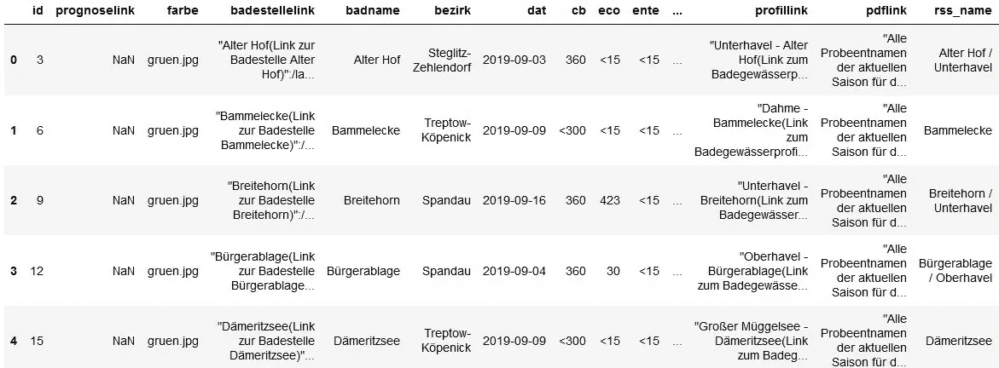

那是一些好看的数据！

数据框`bad`有 39 行(每一行代表一个不同的浴场)和 23 列(每一列都有与该浴场相关的不同属性)。这应该能给我们一些线索。

现在将是一个很好的时机来提及一些限制我们一般分析的东西。该数据集仅包括城市中的“官方”浴场。按照德国的标准，柏林人相当不守规矩，一般来说，他们也很可能找到并利用“非官方”的浴场——事实上，如果你在夏天四处看看，你会发现人们基本上在任何看起来不错的地方游泳(也有一些看起来不好的地方)。

然而，我将假设任何特定地区的官方和非官方浴场的数量将高度相关，因为它们都是由一个潜在变量驱动的。你能猜到我在想哪个变量吗？

如果你猜中了“该地区的水体数量”，那么你就中奖了(没有奖金)！我认为这是一个相当安全的假设，至少对我们的目的来说是这样，但是在进行任何数据分析时，检查您的假设是否合理，或者是否有一些隐藏的偏见或系统错误潜入您的数据，这总是至关重要的。没有一个数据集是完美的，无论如何，我们经常不得不使用它，但是如果我们能够尽可能意识到我们的数据在哪些方面是不完美的，我们的工作总是会得到改进。好了，哲学结束——回到洗澡的地方！

现在使用 Matplotlib，我们可以很容易地查看城市周围的浴场分布。

```
plt.hist(bad['bezirk'], rwidth=0.8, bins=np.arange(9)-0.5)plt.xticks(rotation=90)
plt.style.use('seaborn')plt.show()
```

这给了我们这样的输出:

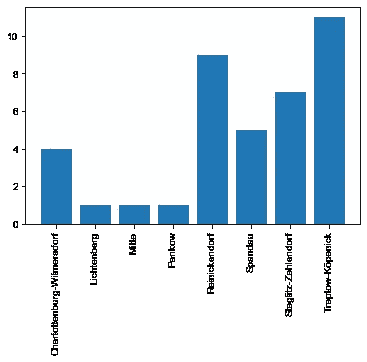

每个地区浴场的绝对分布

我用了几个小技巧让它比默认的输出更加漂亮。`rwidth=0.8`术语将条形的宽度减少到 80%,而不是默认的 100%,这为条形之间提供了一些空间。这使得图表(至少在我看来)更具可读性。`bins=np.arange(number of columns + 1) — 0.5`将条形置于 x 轴刻度的中心，这也让输出看起来更好一些。请注意，您需要将`(9)`更改为您拥有的列数+ 1，以使其适用于您的图表。

`plt.xticks(rotation=90)`将标签旋转 90 度，这样它们就不只是一大堆重叠的文本了。如果你喜欢更活泼的角度，你可以尝试 45 度。最后，`plt.style.use('seaborn')`利用了 Matplotlib 已有的[样式表](https://matplotlib.org/tutorials/introductory/customizing.html)(示例[此处为](https://matplotlib.org/3.1.1/gallery/style_sheets/style_sheets_reference.html))，它允许您使用一行代码来更改绘图上的多个表示功能，并且不费吹灰之力就能获得更加个性化的外观！

Matplotlib 非常灵活，但这种灵活性意味着另一方面，如果您希望它做某件特定的事情，您通常需要明确地告诉它该做什么。它受欢迎的一个好处是，你的问题的答案通常只需要一次谷歌搜索。[文档](https://matplotlib.org/3.2.1/contents.html)总体上是广泛而清晰的，提供了示例，[堆栈溢出](https://stackoverflow.com/)是*咳咳* *溢出*，有问有答。总的来说，我发现 Python 社区非常受欢迎，如果你有问题或者想做什么，很有可能其他人也想做同样的事情，并在网上的某个地方询问过。在任何级别的编程或一般的数据分析中，[谷歌都是你的朋友](https://medium.com/better-programming/if-you-want-to-be-a-senior-developer-stop-focusing-on-syntax-d77b081cb10b)。

让我们来看看我们美丽的直方图，在我们费尽周折创建它之后。我们可以看到，柏林的 12 个区中，有 8 个区有官方的浴场。Lichtenberg，Mitte 和 Pankow 各有一个，Treptow-kpe nick 以 11 个遥遥领先。从地图上看，这是有道理的——特雷普托-科佩尼克是最大的地区，一眼望去，似乎是最蓝的。

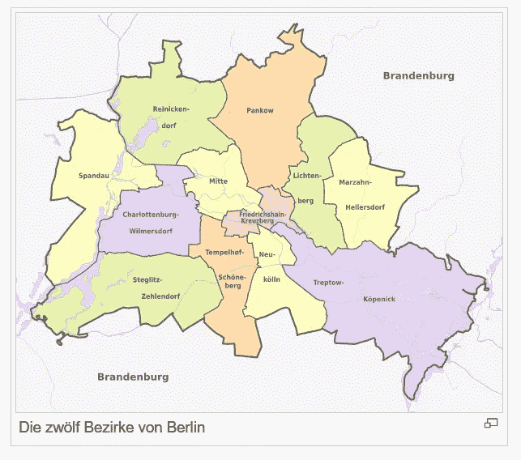

来源:[浴盆](https://commons.wikimedia.org/wiki/User:TUBS)，via [维基百科](https://commons.wikimedia.org/wiki/File:Berlin,_administrative_divisions_(%2Bdistricts_-boroughs_-pop)_-_de_-_colored.svg) / [CC BY-SA](https://creativecommons.org/licenses/by-sa/3.0)

这是我们最基本的分析。只需几个步骤，我们就从 CSV 文件中的原始数据创建了一个熊猫数据框架，并创建了一个可视化，清晰地显示了该数据中的一些有意义的信息。但是我们可以更进一步！

也许知道有多少人住在不同的地区会很有趣，这样我们就可以控制这些地区的人口。也许特雷普托-科佩尼克是人口最稠密的地区，这就是为什么它有最多的海水浴场？或者也许这就是最大的原因？在控制其他变量(如人口和面积)的情况下，对数据进行更多的处理和分析可以让我们回答这些问题。

令人高兴的是，pandas 通过其强大的数据分析功能和核心功能[数据框架](https://www.geeksforgeeks.org/python-pandas-dataframe/)让这一切变得简单。

为此，我们需要创建一个数据帧，其中包含我们在直方图中显示的信息。我们可以使用[来做到这一点。groupby()](https://pandas.pydata.org/pandas-docs/stable/reference/api/pandas.DataFrame.groupby.html) 还有一点想象力！

```
stellen_pro_bezirk = pd.DataFrame({'Number_of_Badestellen': bad['bezirk'].groupby(bad['bezirk']).count()}, columns=['Number_of_Badestellen'])display(stellen_pro_bezirk)
```

这给了我们:

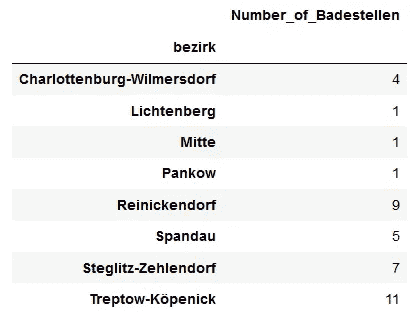

当我们把它绘制成柱状图时，我们会得到:

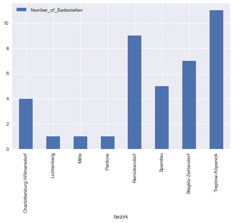

与之前的图完全相同，除了格式上的变化，因为第一个是直方图，第二个是条形图。我们可能会在处理 Matplotlib 格式时分心，但是我们想要做的只是确认这个数据帧包含了它应该包含的信息。

回到创建这个数据帧的代码行。这太激烈了！事实上，这可能是我们将在这个分析中看到的最复杂的一行代码，所以让我们来分解它。

我们用的是 [pd。DataFrame()](https://pandas.pydata.org/pandas-docs/stable/reference/api/pandas.DataFrame.html) 创建一个数据帧。该函数可以将 Python 字典作为输入，其中使用键作为列名，使用值作为列数据。我鼓励你通读[文档](https://pandas.pydata.org/pandas-docs/stable/reference/api/pandas.DataFrame.html)，以便对此有一个坚实的理解。在我们的例子中，我们使用字典

`{'Number_of_Badestellen': bad['bezirk'].groupby(bad['bezirk']).count()}`

作为我们数据框架的来源。键`'Number_of_Badestellen'`只是列标题，这里的主要动作是字典中值端的术语:`bad['bezirk'].groupby(bad['bezirk']).count()`

这里，我们简单地取原始数据帧的“bezirk”列，按同一列的值分组，并应用[。count()](https://pandas.pydata.org/pandas-docs/stable/reference/api/pandas.DataFrame.count.html) 聚合器告诉我们每个值在该列中出现了多少次。例如，“夏洛滕堡-威尔默斯多夫”在数据帧`bad`的列`bezirk`中出现了 4 次。这将为值“Charlottenburg-Wilmersdorf”创建一个具有相应值“4”的行。不错！

现在，这些数据被表示为一个数据框架，我们准备好获取并整合一些进一步的数据来回答我们的问题。这是事情真正开始的地方！

## 人口控制

柏林是一个不断增长的大城市，截至 2018 年 12 月，总人口为 3748148 人(我从哪里得到这个数字的？别走开——一切很快就会揭晓！).就我们的目的而言，最好能找到地区一级的人口。这些信息可以从[维基百科、](https://de.wikipedia.org/wiki/Berlin#Stadtgliederung)获得，但是我们能相信吗？虽然维基百科总的来说比它的名声让你相信的要更准确，但尽可能从原始来源获取信息总是一个好习惯。我们的数据分析技能自己动手也是很好的练习。

我们再次求助于 [daten.berlin.de](http://daten.berlin.de) 获取一些数据。快速搜索发现[可用的最新数据](https://daten.berlin.de/datensaetze/einwohnerinnen-und-einwohner-berlin-lor-planungsr%C3%A4umen-am-31122018)来自 2018 年 12 月——让我们看看它是否能给我们提供我们正在寻找的信息。

```
einwohner = pd.read_csv('EWR201812E_Matrix.csv', sep=';')
display(einwohner.head(10))
```

这给了我们:


这个数据帧有 447 行和 51 列，因此值得花点时间来理解这里的数据是什么，以及它与我们想要做的事情有什么关系。令人欣慰的是，柏林-勃兰登堡统计局(该数据集的创建者，柏林-勃兰登堡统计局)提供了一份补充指南[来澄清问题。](https://www.statistik-berlin-brandenburg.de/opendata/Beschreibung_EWR_Datenpool_2018.pdf)

我们只是想找出柏林每个区的居民总数。查阅我们的指南，我们可以确定我们主要感兴趣的列是‘BEZ’(代表 *Bezirk* —区，这里以数字给出)和‘E _ E’(代表 *Einwohner insgesamt* —总居民)。我们这里有 447 个数据点，比我们的 12 个区还多，但这是可以理解的，因为柏林-勃兰登堡统计局收集和提供的数据比这更精细。通过几行代码，我们可以从这些数据中提取我们想要的信息。

首先，我们创建一个新的 DataFrame，只包含我们感兴趣的列。我们可以在熊猫身上使用[很容易地做到这一点。iloc[]](https://pandas.pydata.org/pandas-docs/stable/reference/api/pandas.DataFrame.iloc.html) :

```
# Let's slice our dataframe using .iloc[]
einwohner_edited = einwohner.iloc[:,[2,7]]
```

这给了我们一个 447 行 2 列的数据帧。我们可以使用[很容易地按地区汇总数字。groupby()](https://pandas.pydata.org/pandas-docs/stable/reference/api/pandas.DataFrame.groupby.html) 与[链接。sum()](https://pandas.pydata.org/pandas-docs/stable/reference/api/pandas.core.groupby.GroupBy.sum.html) 。这将把每一行的“总居民”列`E_E`中的值加在一起，并且在`BEZ`列中具有唯一值。这将为我们提供每个地区的居民总数，这正是我们要寻找的。

```
einwohner_sum = einwohner_edited.groupby('BEZ').sum()
display(einwohner_sum)
```


可以更漂亮，但是数据摆在那里！

不错！现在我们有了各区的总人口。然而，地区只是作为数字给出的。我们怎么知道哪个区是哪个区？嗯，经过一些研究，原来柏林的每个行政区都被[分配了一个号码](https://www.statistik-berlin-brandenburg.de/regionalstatistiken/r-gesamt_neu.asp?Ptyp=410&Sageb=33000&creg=BBB&anzwer=8)，我们在柏林-勃兰登堡统计局的朋友们总是用这个号码，在其他官方场合也是如此。很高兴知道！

我们可以创建一个包含地区名称的 Python 列表，并将它作为一列添加到我们的新数据帧中，同时给它一些更有意义的列名，如下所示:

```
bezirke = ['Mitte', 'Friedrichshain-Kreuzberg', 'Pankow', 'Charlottenburg-Wilmersdorf', 'Spandau', 'Steglitz-Zehlendorf', 'Tempelhof-Schöneberg', 'Neukölln', 'Treptow-Köpenick', 'Marzahn-Hellersdorf', 'Lichtenberg', 'Reinickendorf'] einwohner_sum['Bezirk'] = bezirke
einwohner_sum.columns = ['Population', 'Bezirk']
display(einwohner_sum)
```

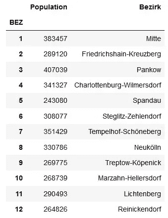

😘👌

至此，我们已经将柏林-勃兰登堡统计局的官方统计数据简化为一个简单的数据框架，其中包含了我们感兴趣的数据。现在是时候将我们的数据框架连接在一起了，这样我们就可以继续回答我们的问题了——柏林哪个区的人均洗浴场所最多？

熊猫又来了。我们可以使用 pd，只用一行代码非常简单地做到这一点。 [merge()，](https://pandas.pydata.org/pandas-docs/stable/reference/api/pandas.DataFrame.merge.html)像这样:

```
pop_and_badestellen = pd.merge(stellen_pro_bezirk, einwohner_sum, left_on='bezirk', right_on='Bezirk')display(pop_and_badestellen)
```

这产生了:

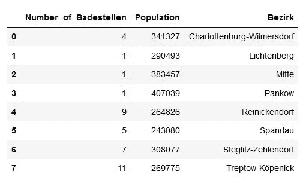

太美了

刚刚到底发生了什么？我们使用非常强大的 [pd.merge()](https://pandas.pydata.org/pandas-docs/stable/reference/api/pandas.DataFrame.merge.html) 函数将两个数据帧`stellen_pro_bezirk`和`einwohner_sum`合并成一个闪亮的新数据帧。要做到这一点，我们需要告诉熊猫合并哪些列(即在哪些列中寻找匹配)，这就是这里的参数`left_on='bezirk', right_on='Bezirk'`所做的。如果我们的专栏有相同的名字(当我们命名它们为 tbh 时，这是一个非常聪明的做法)，那么我们可以只使用`on='Bezirk'`，但是 pandas 足够灵活，可以给我们提供选择。

与 [pd.merge()](https://pandas.pydata.org/pandas-docs/stable/reference/api/pandas.DataFrame.merge.html) 的默认合并被称为[‘内部连接’](https://www.analyticsvidhya.com/blog/2020/02/joins-in-pandas-master-the-different-types-of-joins-in-python/)——这意味着只有匹配的行才会被返回。这就是为什么尽管`einwohner_sum`有 12 行，我们最终在新的数据帧`pop_and_badestellen`中有 8 行。当我们使用内部连接时,“bezirk”和“Bezirk”不匹配的行将被删除。在我们的例子中，这正是我们想要的行为，但是如果我们想要一个外部连接(其中所有的行都被保留，缺失的值用空值填充(pandas 中的 NaN))，我们可以通过使用参数`how='outer'`很容易地实现。

好了，现在我们已经合并了我们的数据框架，让我们继续前进，并开始控制人口！我们可以用一些非常简单的数学来做这个:

```
pop_and_badestellen['badestellen_pro_einwohner'] = pop_and_badestellen['Number_of_Badestellen'] / pop_and_badestellen['Population']
```

这里，我们在 DataFrame ( `badestellen_pro_einwohner`)中创建了一个新列，这是将每个地区的浴场数量除以那里的人口数的简单结果。我告诉过你数学很简单！现在我们可以绘制这个新列，看看我们能学到什么。

```
plt.bar(data=pop_and_badestellen, x='Bezirk', height='badestellen_pro_einwohner')
plt.xticks(rotation=90)plt.show()
```

这给了我们:

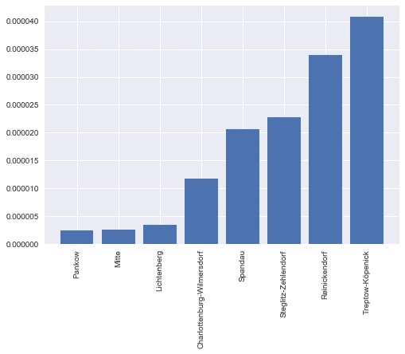

漂亮！所以我们可以看到，当我们控制人口时，结果大致相同。trep tow-KP enick 仍然处于领先地位，人均浴场数量最多，Reinickendorf 仍然位居第二，其他排名基本符合我们之前绘制的绝对数字。

这也许不像控制人口完全颠覆了早期的结果那样令人兴奋，但是这对于我们的分析是非常有用的信息。我们可以看到，如果我们从绝对数量的角度来考虑沐浴点的数量，或者如果我们从人均沐浴点的数量来看，我们的数据显示了类似的情况。如果我们要根据我们的分析提出建议(相信我，我们会的！)那么这个加强了那些。

## 按区域控制

我们的下一步是考虑每个地区的面积。特雷普托-科佩尼克是该市最大的区，所以也许这就是那里有这么多海水浴场的原因。让我们做一些进一步的分析，看看我们能发现什么。

我们的第一步是获取每个地区的数据。我再次从我们在柏林-勃兰登堡的[统计局的老朋友那里得到了这个消息。我们可以做一些奇特的事情，如保存为 CSV 或 Excel 文件，并使用熊猫(](https://www.statistik-berlin-brandenburg.de/webapi/jsf/tableView/tableView.xhtml)[)导入它。read_csv()](https://pandas.pydata.org/pandas-docs/stable/generated/pandas.read_csv.html) 和[。read_excel()](https://pandas.pydata.org/pandas-docs/stable/reference/api/pandas.read_excel.html) 将是这种情况下的首选武器)，如果我们的数据集更大，那么这肯定是明智的选择。然而，我们只有 12 个条目，所以我们可以简单地编写一个 Python [列表](https://developers.google.com/edu/python/lists)(与我们的数据帧中的数据顺序相同)，并将其作为新列添加到我们的`einwohner_sum`数据帧的副本中，如下所示:

```
area = [3947, 2041, 10306, 6472, 9187, 10256, 5303, 4493, 16842, 6178, 5212, 8931][einwohner_area = einwohner_sum](https://pandas.pydata.org/pandas-docs/stable/reference/api/pandas.DataFrame.copy.html).copy() 
einwohner_area['Fläche'] = areadisplay(einwohner_area)
```

有必要使用[。copy()](https://pandas.pydata.org/pandas-docs/stable/reference/api/pandas.DataFrame.copy.html) 方法，如果我们想创建一个新的 DataFrame 对象(所谓的“深度复制”)。如果我们只使用`einwohner_area = einwohner_sum`，任何后续的更改都会影响两个数据帧，因为它们都是对 Python 中一个对象的引用。这相当复杂，但是你可以[阅读更多关于它的内容](https://www.geeksforgeeks.org/copy-python-deep-copy-shallow-copy/)来更好地理解这在 Python 中是如何工作的。

然后，我们只需添加一个新列“flche”(在德语中是“area”的意思)，这就是我们的新列表。嘣！

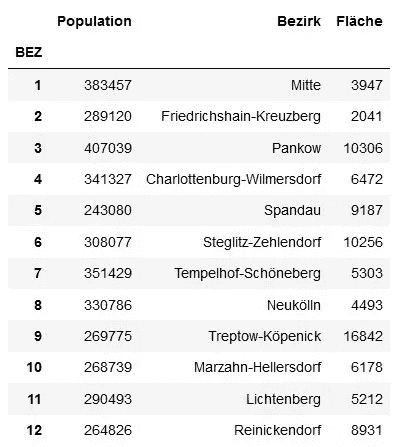

然后，如果您阅读了本文的前一部分，我们将遵循一个非常熟悉的过程(如果您没有，您在这里做什么？回去读吧！太棒了！).

```
# merge the DataFrames
area_and_badestellen = pd.merge(stellen_pro_bezirk, einwohner_area, left_on='bezirk', right_on='Bezirk')# create a new column
area_and_badestellen['badestellen_pro_km'] = area_and_badestellen['Number_of_Badestellen'] / area_and_badestellen['Fläche']display(area_and_badestellen)
```

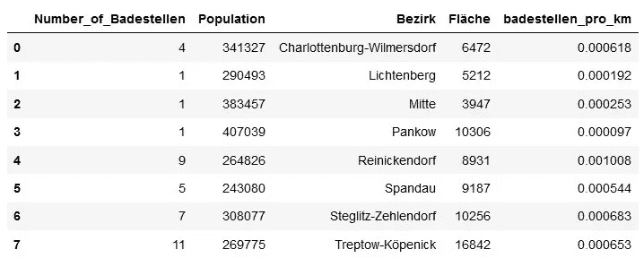

是不是很可爱？

现在我们有了看到结果所需的所有信息，但是我们只需要再做一步就可以像以前一样把它变成一个漂亮的图表。

```
area_and_badestellen.sort_values(by='badestellen_pro_km', inplace=True) # sorting for purely aesthetic reasonsplt.bar(data=area_and_badestellen, x='Bezirk', height='badestellen_pro_km')
plt.xticks(rotation=90)plt.show()
```

这给了我们:

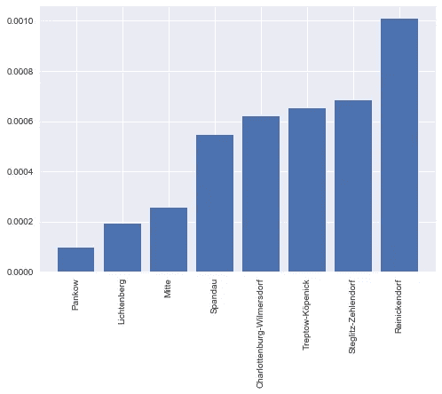

有意思！

在这里查看我们的结果，我们可以看到，如果您只是对该地区浴场的纯粹集中感兴趣，那么 Reinickendorf 就是您应该去的地方。根据这一指标，上届冠军特雷普托-科佩尼克(Treptow-kpenick)已经退居第三位——仍然表现强劲，但不再是第一名。

## 将它整合在一起

那么我们学到了什么？嗯，主要是说，如果你想在附近拥有最多的游泳场所，以及最少的人使用它们，那么特雷普托-科佩尼克就是你要去的地方！然而，柏林有一个非常好的公共交通系统，所以仅仅因为这个地区拥有最高的人均浴场率，并不意味着你将拥有整个地方。

如果你对纯粹的集中浴场更感兴趣(也许你想在一天内参观几个？)，那么 Reinickendorf 就是适合你的地方。然而，总的来说，从这一分析中，我们可以有把握地向一个正在寻找新住处的假想的人提出建议，他最关心的是附近有许多洗澡的地方。他们应该搬到特雷普托-科普尼克。那里真好！

这说明了任何数据分析项目的关键点。你可以做出最漂亮的可视化效果，或者以最奇特、最复杂的方式操纵数据，但最终要让你的分析有意义、有用，你需要拥有你正在分析的领域的领域知识，或者与拥有这种知识的人合作。这有助于你避免尴尬的误解，也有助于你获得有益的见解，实际上为你的听众带来好处，不管他们是谁。

我希望这篇文章能帮助您了解我们如何通过 pandas 和 Matplotlib 库使用 Python 轻松而强大地操作数据。我们在这里使用的技术都是您可以在未来的数据分析项目中反复使用的。

非常感谢您抽出时间和我一起探讨这个话题。和往常一样，我非常欢迎你的反馈——你可以在 Twitter 上联系我，地址是@[craigdoedata](https://twitter.com/craigdoesdata)，让我知道我该如何更有效地完成这项分析。我仍然在学习，我也想知道你的秘密，所以请与我分享。

再说一遍，整个 Jupyter 笔记本和相关文件都可以在我的 [Github 页面](https://github.com/thecraigd/Badestellen)和[活页夹](https://mybinder.org/v2/gh/thecraigd/Badestellen/94c3fad7d7ca9540f0649cb24778fa3384368bb4)上找到，我鼓励你使用它们。

下次见！


更像这样？访问[craigdoedata . de](https://www.craigdoesdata.de/)