# 何时应该使用约束求解器而不是机器学习

> 原文：<https://towardsdatascience.com/where-you-should-drop-deep-learning-in-favor-of-constraint-solvers-eaab9f11ef45?source=collection_archive---------16----------------------->

## 约束求解器的实际应用。学习其他技术可以为您节省几天的数据清理和模型训练时间。


*魔方可以被建模为约束满足问题【1】，*图片由 [NeONBRAND](https://unsplash.com/@neonbrand?utm_source=unsplash&utm_medium=referral&utm_content=creditCopyText) 在 [Unsplash](https://unsplash.com/?utm_source=unsplash&utm_medium=referral&utm_content=creditCopyText) 上发布

Machine Learning 和 *Deep Learning* 是业界正在流行的词汇。品牌领先于功能导致深度学习在许多人工智能应用中被过度使用。

这篇文章将提供对约束满足的快速理解，这是一种强大但未被充分利用的方法，可以解决人工智能和计算机科学其他领域的大量问题，从物流和调度到时间推理和图形问题。

# 解决现实世界的问题

让我们考虑一个事实性和高度话题性的问题。

> 一个疫情正在崛起。医院必须迅速组织起来治疗病人。

这个世界需要一种算法，在给定多种标准的情况下，如疾病的严重程度、患者年龄和位置、医院容量和设备等，该算法将感染者和医院匹配在一起。

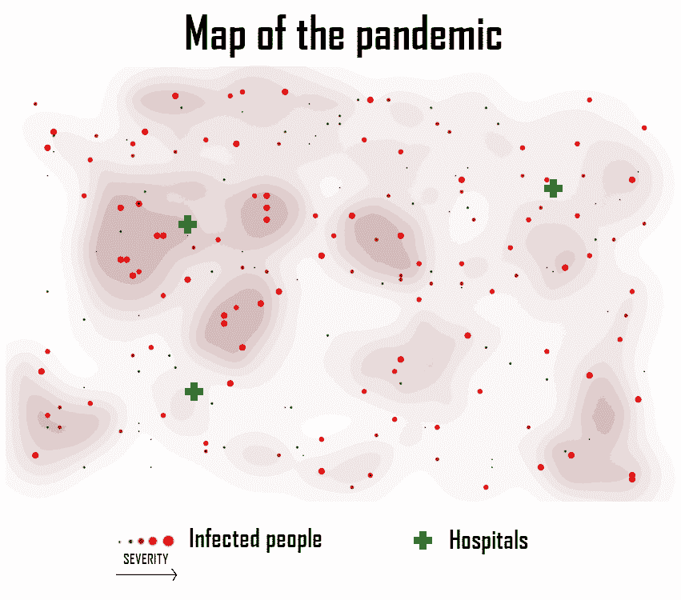

*图 1:疫情地图，简化为 3 个参数:患者和医院的位置，患者的严重程度*

许多人会说，神经网络将是最适合它的:不同的配置，从广泛的参数范围，需要减少到一个独特的解决方案。

然而，有一些不利因素会破坏这种方法:

*   模型需要训练，因此需要以前案例的历史数据，
*   清理和整合数据集会浪费大量时间，
*   各种各样的架构都需要通过长时间的培训来测试。

另一方面，如果用布尔可满足性问题来表述，这种情况不会有任何上述缺点，同时仍然在不确定的多项式时间内给出次优解(NP-完全问题)，并且不需要任何历史数据。

*免责声明:这篇文章的目的是快速浏览 CSP。理论和问题公式将被忽视。对于更严格的方法，请参考[2][3][4]。*

# 抽象问题

这篇文章将为约束编程提供一个*温和的介绍，旨在解决这个案例研究。这张疫情地图(1)展示了我们算法的输出结果，它将感染者与医院进行匹配。约束求解有几种框架。[谷歌优化工具(又名，或-Tools)](https://developers.google.com/optimization) 是一个解决组合优化问题的开源软件套件。我们的问题将使用 Python 中的这个框架来建模。*

```
from ortools.sat.python import cp_model
```

[](https://colab.research.google.com/drive/1vFkt5yIQtyelqvCh2TsJ9UDeM5miXqui) [## 查看这篇文章的互动笔记本

### 在一片混乱中把病人和医院联系起来

colab.research.google.com](https://colab.research.google.com/drive/1vFkt5yIQtyelqvCh2TsJ9UDeM5miXqui) 

## 因素

现在，让我们将问题简化为 4 个参数(1):

*   受感染者的位置
*   感染者的严重程度
*   医院的位置
*   每所医院的床位数

让我们用 python 来定义这些参数:

```
# Number of hospitals
n_hospitals = 3
# Number of infected people
n_patients = 200
# Number of beds in every hospital
n_beds_in_hospitals = [30,50,20]
# Location of infected people -- random integer tuple (x,y)
patients_loc = [(randint(0, 100), randint(0, 100)) **for** _ **in** range(n_patients)]
# Location of hospitals -- random integer tuple (x,y)
hospitals_loc = [(randint(0, 100), randint(0, 100)) **for** _ **in** range(n_hospitals)]  
# Illness severity -- 1 = mild -> 5 = severe
patients_severity = [randint(1, 5) **for** _ **in** range(n_patients)]
```

## 变量

约束满足问题由一组变量组成，这些变量必须以满足一组约束的方式赋值。

*   设 *I* 为医院集合
*   让 *Jᵢ* 成为医院 *i* 的床位集合
*   设 *K* 为患者集合。

让我们将变量的索引族定义为:

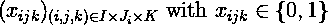

如果在医院里*我*，床 *j* 被人 *k* 那么 *xᵢⱼₖ = 1* 。为了将医院的每张病床与一个病人相关联，目标是找到一组满足所有约束的变量。

我们可以将这些变量添加到我们的模型中:

```
model = cp_model.CpModel()
x = {}
**for** i **in** range(n_hospitals):
  **for** j **in** range(n_beds_in_hospitals[i]):
    **for** k **in** range(n_patients):
      x[(i,j,k)] = model.NewBoolVar("x(%d,%d,%d)" % (i,j,k))
```

## 硬约束

硬约束定义了我们模型的目标。这些问题至关重要，如果不解决，问题就无法解决:

*   每张床上最多只能有**一个人，**
*   **每个人最多只能有一张单人床。**

**让我们关注第一个硬约束。每个医院的每个床位*j*I:**

*   **要么有一个独特的病人，**
*   **要么床是空的。**

**因此，它可以用以下方式表示:**

**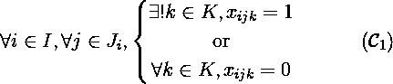**

**我们的求解器是一个组合优化求解器，它只能处理整数约束。因此，必须变成一个整数方程:**

**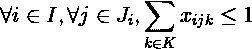**

**这个不等式可以添加到我们的模型中。**

```
# Each bed must host at most one person
**for** i **in** range(n_hospitals):
  **for** j **in** range(n_beds_in_hospitals[i]):
    model.Add(sum(x[(i,j,k)] **for** k **in** range(n_patients)) <= 1)
```

**接下来，第二个硬约束:对于每个患者 *k* :**

*   **要么他在一个独特的医院的独特的病床上，**
*   **要么他在家。**

**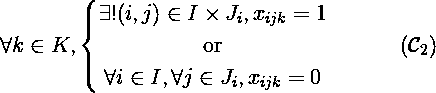**

**同样，可以转化为一个整数不等式:**

**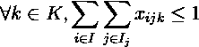**

**最后，这个约束可以添加到模型中。**

```
# Each person must be placed in at most one bed
**for** k **in** range(n_patients):
  inner_sum = []
  **for** i **in** range(n_hospitals):
    inner_sum.append(sum(x[(i,j,k)] **for** j **in** range(n_beds_in_hospitals[i]))) 
  model.Add(sum(inner_sum) <= 1)
```

## **软约束**

**接下来，还有*软约束*。这些都是非常需要的:我们的解决方案必须尽可能地满足它们，但是它们对于找到解决方案并不是必不可少的:**

*   **每个病人都应该被放在床上，**
*   **每个人都应该由最近的医院处理，**
*   **在没有足够床位的情况下，*病情严重的病人应*优先处理。**

**当硬约束被建模为等式或不等式时，软约束是最小化或最大化的表达式。**

**设*ω*为满足硬约束的所有解的集合。**

**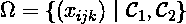**

***每个病人都应该被安排到一张病床上*的意思是最大限度地增加被占用的病床数量。**

**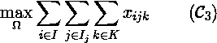**

***每个人都应由最近的医院处理*是指尽量缩短每个病人与其指定医院之间的距离。**

**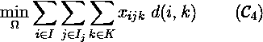**

***当没有足够的床位时，应首先处理病情严重的病人*是指最大化所有处理病人的总严重程度。通过表示 *sev(k)* 患者的严重程度 *k* :**

**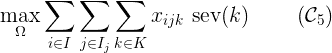**

**然后，我们可以将所有软约束简化为一个目标:**

**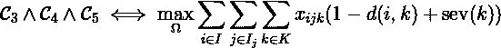**

**人们需要小心:这些软约束没有相同的域。**

*   **患者最大化约束范围从 *0* 到 *n* ，其中 n 为患者人数，**
*   **严重性约束范围从 *0* 到 *5n***
*   **距离约束范围从 *0* 到所有 *i* 和 *k* 的最大欧几里德距离。**

**假设所有这些约束共享相同的优先级，我们必须定义惩罚因子来平衡不同的约束。**

**下面是相应的代码:**

```
# Integer distance function
idist = **lambda** xy1, xy2: **int**(((xy1[0]-xy2[0])**2 + (xy1[1]-xy2[1])**2)**0.5)# Gain factors (1/penalty factors)
gain_max_patients = 140
gain_severity = **int**(140/5)
gain_distance = -1# Maximization objective
soft_csts = []
**for** i **in** range(n_hospitals):
  **for** j **in** range(n_beds_in_hospitals[i]):
    **for** k **in** range(n_patients):
      factor = \
        gain_max_patients \
        + gain_distance * idist(hospitals_loc[i], patients_loc[k]) \
        + gain_severity * patients_severity[k]
      soft_csts.append(factor * x[(i,j,k)])model.Maximize(sum(soft_csts))
```

# **解决者**

**现在我们可以启动求解器了。它会尝试在指定的时间限制内找到最优解。如果它无法找到最优解，它将返回最接近的次优解。**

```
solver = cp_model.CpSolver()
solver.parameters.max_time_in_seconds = 60.0
status = solver.Solve(model)
```

**在我们的例子中，求解器在 2.5 秒内返回一个**最优解** (2)。**

**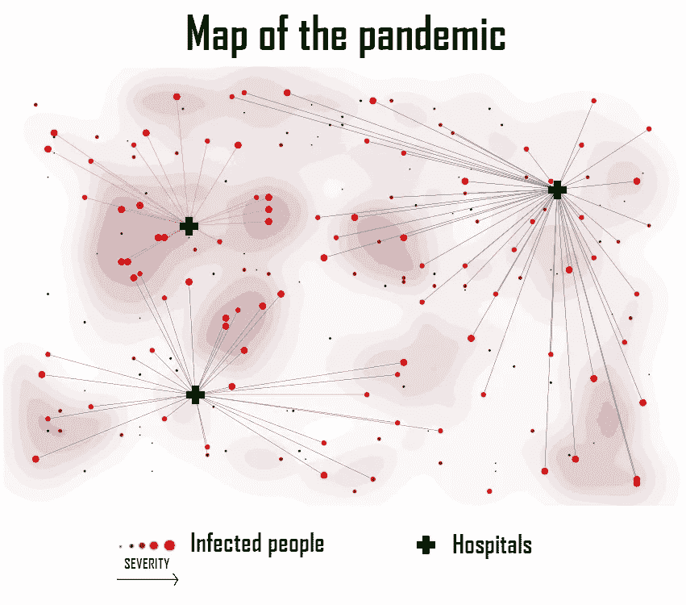**

***图 2:求解器返回的解***

# **结论**

**要创建这个解决方案，只需要 **1 小时的研究和 30 分钟的编程**。**

> **对于深度学习的对手，人们可以预测几天的数据清洗，至少一天的时间来测试不同的架构，另一天用于训练。**

**此外，如果模型化良好，CP-SAT 模型是非常稳健的。以下是不同模拟参数的结果(3)。在许多不同的情况下，结果仍然是一致的，随着模拟参数的增加(3000 名患者，1000 张病床)，解决方案推断只需不到 3 分钟。**

**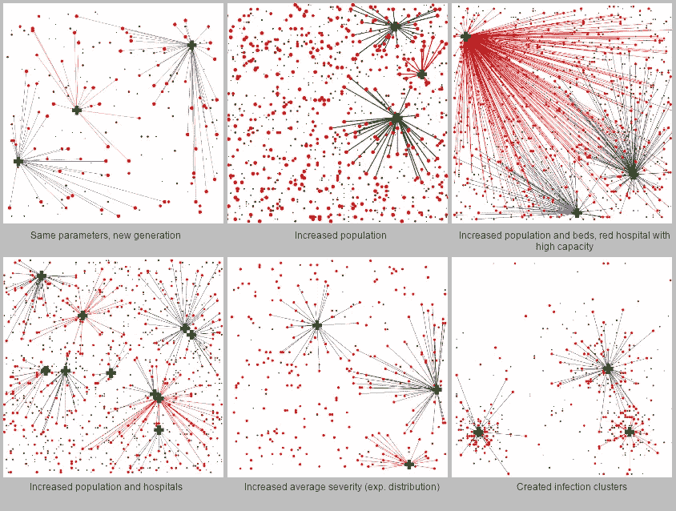**

***图 3:不同的模拟参数***

**当然，CSP 几乎不适用于计算机视觉和 NLP 等主题，在这些主题中，深度学习有时是最好的方法。然而，在物流，调度和计划，它往往是要走的路。**

**深度学习炒作激发了一些人[尝试一些疯狂的举动](/detecting-covid-19-with-97-accuracy-beware-of-the-ai-hype-9074248af3e1)来获得认可。有时，最好是通过阅读几篇关于你正在研究的问题的调查论文来回归基础。**

**[*安托万冠军 2020 年 4 月 1 日*](https://www.antoinechampion.com/Blog?articleId=4)**

# **参考**

**[1]陈景超，*利用 SAT 求解器求解魔方*，arXiv:1105.1436，2011 .**

**[2] Biere，a .，Heule，m .，和 van Maaren，H. *可满足性手册*，第 185 卷。IOS 出版社，2009 年 a**

**[3] Knuth，D. E .，*计算机编程的艺术*，第 4 卷，分册 6:可满足性。艾迪森-韦斯利专业公司，2015 年**

**[4] Vipin Kumar，*约束满足问题的算法:一项调查*，AI 杂志第 13 卷，第 1 期，1992 年。**