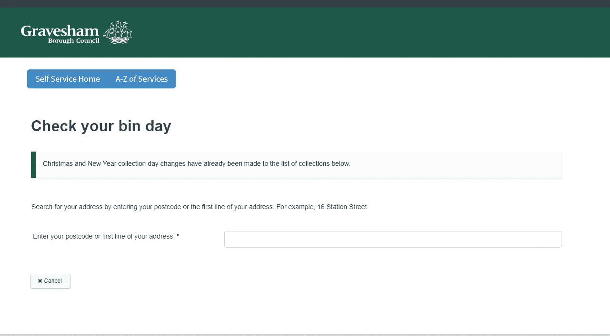
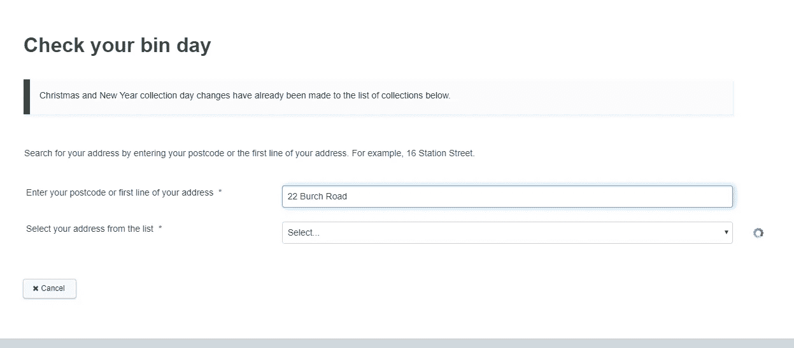
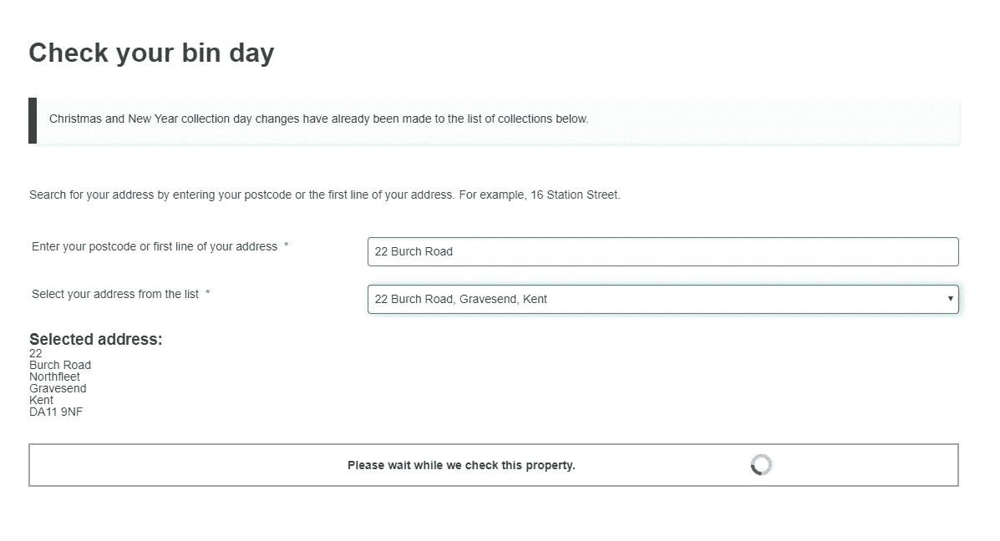
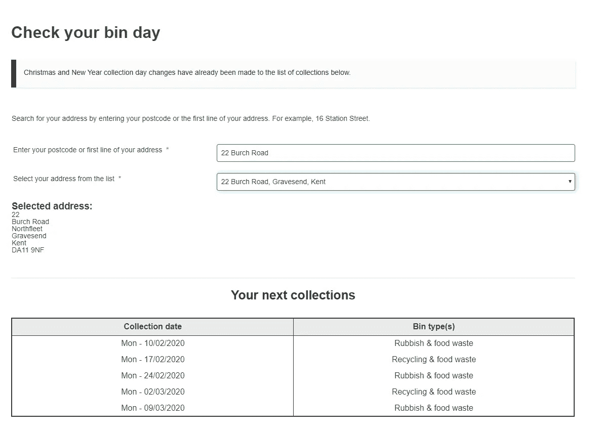

# 我需要放在哪个垃圾桶里？用 Python 和 Selenium 抓取网站

> 原文：<https://towardsdatascience.com/which-bin-do-i-need-to-put-out-scraping-websites-with-python-and-selenium-c59738cdb88?source=collection_archive---------39----------------------->

## 我如何使用 Selenium 来自动化 web 页面交互并从这些页面中抓取信息

在之前的一篇文章中，我展示了一个在英国议会议事录网站上搜集信息的例子。这是一个相对简单的例子，因为一旦网页被加载，议会议事录就提供网页提供的所有数据。所有可以出现在页面上的文本，无论是立即出现在段落中，还是隐藏起来只在按下按钮时才显示出来——所有这些都已经存在于页面源代码中，随时可以被像 [BeautifulSoup](https://www.crummy.com/software/BeautifulSoup/bs4/doc/) 这样的包获取。

在我将要向您展示的示例中，我们需要的数据在页面的源代码中并不容易获得。一旦我在表单中输入了一些信息，它就会在服务器端动态加载。在这种情况下，我们不能只使用 BeautifulSoup (BS4 ),因为那里没有可供 BS4 抓取的内容。在信息出现供我们抓取之前，我们首先需要*以某种方式与页面进行交互*。

这就是硒元素发挥作用的地方。Selenium 是一个 Python 包，可以在浏览器中自动执行操作。Selenium 将打开一个浏览器窗口，可以导航到一个网站，点击页面上的元素，并在输入元素中输入文本。它甚至可以与 iframes 中页面上的元素进行交互，这也是 BeautifulSoup 一直在努力解决的问题。我们可以使用 Selenium 在网页上执行操作，让新信息出现在页面上，然后抓取新信息。

对于这个例子，我将找到所有信息中最重要的信息——在给定的一周内哪个垃圾箱需要被放出来。在我的镇上，我们在一般废物和回收之间交替，我忘记了每周我需要把哪一个放出去。当银行放假时，我也完全失去了记忆。

## 需要的包

这些是我用过的包

```
from selenium import webdriver
from selenium.webdriver.common.keys import Keys
import time
```

我还必须下载一个网络驱动程序。这是一个适用于 Firefox 或 Google Chrome 的可执行文件，Selenium 可以访问并打开它。Selenium 使用 webdriver 作为浏览器来控制。我下载了谷歌 Chrome 的 webdriver，[可以在这里找到](https://chromedriver.chromium.org/downloads)。

```
driver = webdriver.Chrome('C:\\Users\\gormanp\\chromedriver.exe')
driver.get('[https://my.gravesham.gov.uk/en/AchieveForms/?form_uri=sandbox-publish://AF-Process-22218d5c-c6d6-492f-b627-c713771126be/AF-Stage-905e87c1-144b-4a72-8932-5518ddd3e618/definition.json&redirectlink=%2Fen&cancelRedirectLink=%2Fen&consentMessage=yes#_ga=2.209993814.256753923.1580820371-471535357.1579531399'](https://my.gravesham.gov.uk/en/AchieveForms/?form_uri=sandbox-publish://AF-Process-22218d5c-c6d6-492f-b627-c713771126be/AF-Stage-905e87c1-144b-4a72-8932-5518ddd3e618/definition.json&redirectlink=%2Fen&cancelRedirectLink=%2Fen&consentMessage=yes#_ga=2.209993814.256753923.1580820371-471535357.1579531399')) 
```

在上面的代码中，我将 webdriver 的文件位置传递给 Selenium，这样它就可以打开一个浏览器窗口。然后，我将我想访问的网站的 URL 传递给它——在本例中，这是我的理事会的 bin 收藏网页的一个可怕的 URL。



格雷夫舍姆委员会的网页，找出斌天。

正如你从上面的图片中看到的，我们有一个带有表单字段的页面，要求输入我的地址或邮政编码。Selenium 能够点击页面上的元素，并在输入字段中输入文本。

我在使用 Selenium 抓取这个页面时遇到了一个障碍，它让我困惑了一段时间——我正在选择我想要与之交互的元素的 id，但是我得到一个错误，说找不到它。这是因为页面上的表单不是页面本身的一部分，它是作为 iframe 嵌入的。幸运的是，Selenium 可以使用“switch_to.frame()”函数与嵌入式 iframes 进行交互。

```
#this tripped me up a lot - the form is loaded in an iframe, so we need to tell selenium to switch to looking
#at the iframe rather than the elements that make up the main page. driver.switch_to.frame("fillform-frame-1")
```

现在我已经选择了页面的右框架，我需要单击文本框并键入我的地址。

```
#create a variable for the address I want to searchaddress = "22 Burch Road"#find the postcode search input box, using the id of that box, then wait to ensure the focus is on the boxdriver.find_element_by_id("postcode_search").click()#type the address into the box, then wait, as the form has to load its resultsdriver.find_element_by_id("postcode_search").send_keys(address)time.sleep(5)
```

我首先创建一个变量来保存我的地址，因为我以后还需要用到它。然后我用 Selenium 函数“find_element_by_id”找到页面上的文本输入框，点击它将光标放入框中。之后，我再次使用“find_element_by_id ”,但是我没有使用 click，而是使用“send_keys”在框中键入地址。

我已经事先手动查看了我的 bin day，我知道一旦框中有了有效的地址，地址选择器下拉框就会自动出现，所以此时我不需要再单击或与页面交互。然而，我确实需要告诉脚本在下拉框加载时等待几秒钟。



在选择下拉框中加载地址的页面

下拉框加载后，我需要从列表中选择地址。这个下拉列表中只有两个项目—我要选择的地址和默认的“选择…”值。对网页抓取没有帮助，但是很容易解决。

```
addresslist = driver.find_element_by_id('YourAddress')#look through the options and find the one that starts with the right address. There will be at least two options
#as there is a default "select" option, followed by actual addressesfor option in addresslist.find_elements_by_tag_name('option'):
    x = option.text
    if x.startswith(address):
        option.click() # select() in earlier versions of webdriver
        break#long wait here, because it takes a while for the form to load the bin day information 

time.sleep(10)
```

首先，我给下拉框列表分配一个变量名 addresslist。然后，我使用 for 循环来查看列表中每个选项的文本，并确定它是否以我在上面的框中键入的地址文本(“Burch Road 22”)开头。我使用 startswith，因为下拉列表中的地址在道路名称后面还有城镇和县。如果找到了地址，Selenium 使用“click()”命令选择地址。

然后，我使用另一个等待周期，这个时间甚至更长，因为 bin 收集表需要很长时间来加载。



慢慢来…



终于！

我们终于加载了我们的结果，所以现在我们可以用这个表来找出一周中的每一天，以及在这些天哪些箱子会被放出来。

```
timings = driver.find_element_by_id("table2")#we need to say .text to output the table as text, otherwise we just get an element id number and session. print(timings.text)
```

我找到表的元素 id，然后将该元素的文本打印到终端。

在以后的文章中，我将展示如何将从网站上收集的这类信息输出到电子邮件或电报消息中，但现在，我将把它留在这里。

这是如何使用 Selenium 的一个非常简单的例子，但是它可以很容易地扩展到抓取多个页面，抓取需要多次点击才能找到所需信息的页面，或者从由多个 iframes 组成的页面中获取信息。

一如既往，如果你认为有一种方法可以更好地执行，请在评论中告诉我。我还在学习，所以欢迎任何反馈。