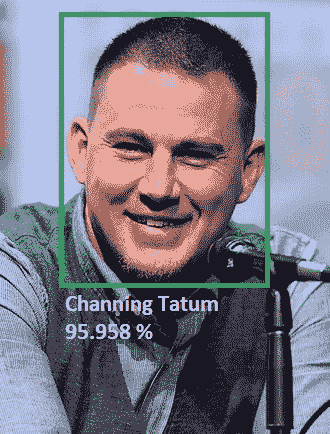
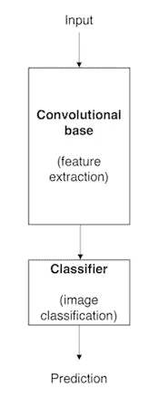
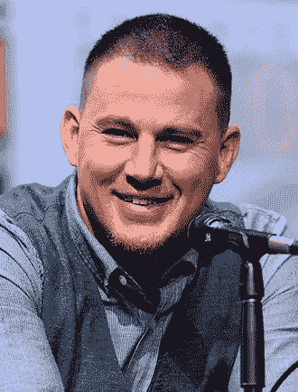
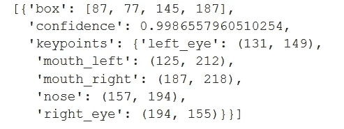
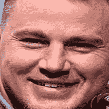
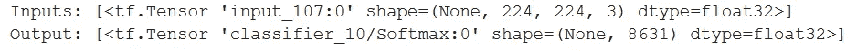
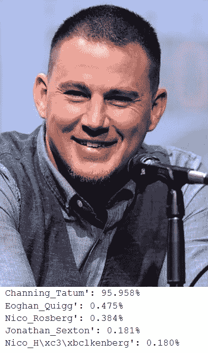

# 你是哪位名人？使用深度学习的人脸识别

> 原文：<https://towardsdatascience.com/which-celebrity-are-you-d8c6507f21c9?source=collection_archive---------18----------------------->

## 使用 ResNet-50 卷积神经网络架构在 Python 中构建影像分类模型的简单指南



图像分类器以 95.9 %的概率检测到该图像中的查宁·塔图姆( [img 源](https://upload.wikimedia.org/wikipedia/commons/thumb/8/8d/Channing_Tatum_by_Gage_Skidmore_3.jpg/330px-Channing_Tatum_by_Gage_Skidmore_3.jpg)

# **简介**

T4:你有没有想过哪个名人和你长得很像？如果你在想“是的，我愿意”，那么这篇文章就是给你的。

由于机器学习，你可以扫描你的面部特征，并将其与超过 3000 名名人的 260 万张面孔的数据库进行比较。

阅读本指南后，您将了解以下内容:

*   深度学习卷积神经网络过程背后的直觉是什么
*   如何安装 keras_vggface 库并在实际项目中使用这些模型
*   你如何让模型预测哪个名人与你最相似

## 概观

要知道哪个名人和自己最像，我们得执行以下步骤。这些步骤将在整篇文章中详细解释:

1.  载入图像(你自己的图像或随机图像)
2.  从图像中提取人脸
3.  进行预处理，使人脸图像能够被识别。
4.  将图像加载到深度神经网络“ResNet-50”中。
5.  提取结果

# 人脸识别

在我们进入编码之前，我们需要对一些概念有一个高层次的介绍。
人脸识别是从图像中识别人的过程。由于机器学习领域的最新发展，我们现在能够让模型本身学习应该从图像中提取哪些特征。

## **卷积神经网络**

深度卷积神经网络目前主导着图像分类领域。近年来的趋势是建立更深层次的神经网络来解决越来越复杂的图像分类任务。由于本文的范围相当有限，我们将只解释其背后的直觉。

过程如下，我们给网络输入一张人脸图像。这张人脸图像将被传送到多层(卷积基底)。在第一层中，检测基本特征:边缘、角、…中间层检测物体的一部分。在我们的例子中，他们可能会学会察觉:眼睛、鼻子、耳朵……在最后一层，他们学习识别不同形状和位置的完整物体。然后，基于所有这些检测到的特征，分类器进行预测。



卷积神经网络的过程

## Resnet50

Resnet50 是一个深度学习卷积神经网络，在标准人脸识别数据集上取得了最先进的结果。它使用了 VGGFace2 数据集，这是一个大规模的人脸数据集，包含 9.9131 名受试者的超过 331 万张图像。与标准卷积神经网络的主要区别在于它使用残差学习。这意味着它不是试图学习特征，而是试图学习残差。更详细的解释可以在[这里](https://arxiv.org/pdf/1512.03385.pdf)找到。

# 我们开始吧！

## 步骤 0:安装并加载必要的包

首先，我们需要安装必要的软件包。为了确保得到和我一样的结果，我建议你在[谷歌合作环境](https://colab.research.google.com/notebooks/intro.ipynb#recent=true)上运行这段代码。协作笔记本在谷歌的云服务器上执行代码，这意味着无论你的机器功率如何，你都可以利用谷歌硬件的能力。最棒的是，它完全**免费**！

*   用于从图像中检测人脸的 mtcnn 包([来源](https://github.com/ipazc/mtcnn))
*   resnet50 cnn 模型的 keras _ vgg face([来源](https://github.com/rcmalli/keras-vggface))
*   张量流([来源](https://github.com/tensorflow/tensorflow))
*   keras ( [来源](https://github.com/keras-team/keras))
*   opencv ( [来源](https://github.com/opencv/opencv))

```
!pip install mtcnn!pip install keras_vggface!pip install tensorflow!pip install keras!pip install opencv!pip install PIL
```

按如下方式导入已安装的软件包:

```
import mtcnnfrom mtcnn.mtcnn import MTCNNfrom keras_vggface.vggface import VGGFacefrom keras_vggface.utils import preprocess_inputfrom keras_vggface.utils import decode_predictionsimport PILimport osfrom urllib import requestimport numpy as npimport cv2# Import this one if you are working in the google colab environmentfrom google.colab.patches import cv2_imshow
```

## 步骤 1:图像加载

为了这个练习，我们导入一张查宁·塔图姆的图片。这使得每个人都可以很容易地复制它，也证明了模型的准确性。用你自己的图片链接更改 url 链接(*提示:你可以使用你的 linkedin 账户的图片 url)。*

```
# Give the image linkurl = "https://upload.wikimedia.org/wikipedia/commons/thumb/8/8d/Channing_Tatum_by_Gage_Skidmore_3.jpg/330px-Channing_Tatum_by_Gage_Skidmore_3.jpg"# Open the link and save the image to resres = request.urlopen(url)# Read the res object and convert it to an arrayimg = np.asarray(bytearray(res.read()), dtype='uint8')# Add the color variableimg = cv2.imdecode(img, cv2.IMREAD_COLOR)# Show the imagecv2_imshow(img)
```



步骤 1 的期望输出( [img 源](https://upload.wikimedia.org/wikipedia/commons/thumb/8/8d/Channing_Tatum_by_Gage_Skidmore_3.jpg/330px-Channing_Tatum_by_Gage_Skidmore_3.jpg))

## 第二步:人脸检测

图像现在已载入。因为我们的模型只需要人脸，所以我们需要从图像中提取人脸。为此，我们使用 mtcnn 包。MTCNN 实现了最先进的结果，并且能够检测各种面部特征(眼睛、嘴等等)。更多关于 MTCNN 的信息可以在这里找到。

```
# Initialize mtcnn detectordetector = MTCNN()
```

然后，我们确定一些面部提取参数:

*   目标尺寸:人脸图像应该有多大？对于 ResNet50 图像，要求大小为(224，224)
*   Border_rel:这个参数决定了我们希望人脸图像放大到什么程度。我们现在把它设置为零。

```
# set face extraction parameterstarget_size = (224,224) # output image size
border_rel = 0 # increase or decrease zoom on image
```

我们调用检测器来检测给定图像中的人脸。我们看到人脸被检测到的概率为 99.8%。关键点被分配了坐标。

```
# detect faces in the imagedetections = detector.detect_faces(img)print(detections)
```



MTCNN 检测输出

通过使用 box 变量，我们可以确定面部的坐标。

```
x1, y1, width, height = detections[0]['box']dw = round(width * border_rel)dh = round(height * border_rel)x2, y2 = x1 + width + dw, y1 + height + dhface = img[y1:y2, x1:x2]
```

选择图像中的人脸后，我们将人脸的大小调整为 ResNet-50: 224，224 所需的格式。

```
# resize pixels to the model sizeface = PIL.Image.fromarray(face)
face = face.resize((224, 224))
face = np.asarray(face)# show facecv2_imshow(face)
```



查宁·塔图姆的脸( [img 来源](https://upload.wikimedia.org/wikipedia/commons/thumb/8/8d/Channing_Tatum_by_Gage_Skidmore_3.jpg/330px-Channing_Tatum_by_Gage_Skidmore_3.jpg))

## 第三步:预处理

ResNet-50 模型期望有多个图像作为输入。目前，我们只有一个图像。为了解决这种差异，我们扩展了一维，因此我们有一个 1 x 224 x 224 x 3 的形状，而不是 224 x 224 x 3 的形状。

```
# convert to float32
face_pp = face.astype('float32')
face_pp = np.expand_dims(face_pp, axis = 0)
```

机器学习模型需要得到一致的数据。为了确保我们所有的图像是一致的，我们必须应用一个归一化函数。幸运的是，我们可以使用 Keras 的 preprocess_input 函数来归一化我们的人脸图像。该函数将对 0 到 255 范围内的像素值进行归一化，使其适合深度学习。不要忘记将 version 参数设置为“2 ”,以便对 ResNet-50 进行专门的预处理。

```
face_pp = preprocess_input(face_pp, version = 2)
```

## 第四步:预测

所有的准备工作现在都完成了。干得好！

这里，我们通过调用 VGGFace 实例来初始化 ResNet50 模型。我们仔细检查模型期望的输入和模型将给出的输出。

```
# Create the resnet50 Modelmodel = VGGFace(model= 'resnet50')# Check what the required input of the model is & outputprint('Inputs: {input}'.format(input = model.inputs))print('Output: {output}'.format(output = model.outputs))
```



ResNet-50 型号的输入和输出

接下来，我们让我们的模型预测预处理后的人脸。

```
# predict the face with the inputprediction = model.predict(face_pp)
```

## 第五步:提取结果

这张脸现在已经被预测到了。我们只需要解码我们的预测，并以可读的方式打印出来。

```
# convert predictions into names & probabilitiesresults = decode_predictions(prediction)# Display resultscv2_imshow(img)
for result in results[0]:
print ('%s: %.3f%%' % (result[0], result[1]*100))
```



查宁·塔图姆的预测结果( [img 来源](https://upload.wikimedia.org/wikipedia/commons/thumb/8/8d/Channing_Tatum_by_Gage_Skidmore_3.jpg/330px-Channing_Tatum_by_Gage_Skidmore_3.jpg)

这就对了。
你刚刚在卷积神经网络的帮助下进行了一次预测。如果你用查宁·塔图姆的照片做了这个，别忘了用你自己的照片试试，看看你和哪个名人有最大的相似之处。

# 后续步骤

下一步，我们可以应用迁移学习。迁移学习指的是**重用**一个问题的预训练模型，并将其应用于另一个问题的过程。我们可以使用这种最先进的 ResNet-50 模型，并在不同的人群中重新训练分类层。

# 来源

[ResNet50 论文](https://arxiv.org/pdf/1512.03385.pdf)

[keras 中的卷积神经网络](https://machinelearningmastery.com/how-to-perform-face-recognition-with-vggface2-convolutional-neural-network-in-keras/)

# 开源代码库

完整的代码可以在[我的 github](https://github.com/BgtEwoud/CNN_celeb) 上找到。我建议在执行代码时使用 google collab。