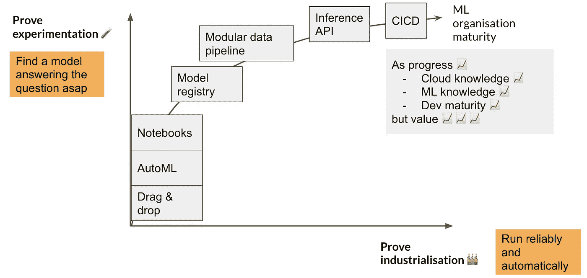

# 需要哪家云服务商 ML 平台？

> 原文：<https://towardsdatascience.com/which-cloud-servicer-provider-ml-platform-do-you-need-69ff5d96b7db?source=collection_archive---------28----------------------->

## [入门](https://towardsdatascience.com/tagged/getting-started)

## AWS Sagemaker，Azure ML 平台还是 GCP AI 平台？其实无所谓。不是为了工业化。

首先，我假设你已经选择了一个云服务提供商(CSP ),或者有能力为你的组织选择一个。其次，我还假设你需要能够构建、训练、调整、评估和部署机器学习模型，那么你最有可能做的第一件事就是检查你选择的 CSP 的 ML 平台。还是应该看看那些第三方厂商？怎么比较？

让我们看看什么才是真正重要的，也就是更大的图景。

改编自 https://www.cartoonstock.com/cartoonview.asp?[的漫画 catref=CC123672](https://www.cartoonstock.com/cartoonview.asp?catref=CC123672) ，经作者许可编辑。

# 实验 vs 工业化

在每个 ML 甚至数据科学项目中，都有两个目标完全不同的阶段。在实验过程中，目标是找到一个能尽快回答(业务)问题的模型。而在工业化过程中，目标是可靠和自动运行。

让我们假设一个组织将卓越运营优先于商业价值。也许两年后，他们有了一个生产中的模型，这个模型带来了价值，但是运行起来却很有魅力。大多数(创新)项目在很久以前就被扼杀了，因为没有展示价值。

首先证明实验，然后工业化。(图片由作者提供)

所以有意义的轨迹就是你在上图中看到的绿色。首先使用非常基本的服务，这些服务可能不适合生产使用，但是至少已经显示了价值。这一领域的前四个项目很可能会失败，但第五个项目会大获成功。

## 典型挑战

ML 平台喜欢吹嘘他们如何提供与不使用这些工具相关的*典型*问题的解决方案。我认为他们确实有。尽管如此，他们无法解决的挑战仍然很大。

**实验的典型挑战**取决于组织规模。(图片由作者提供)

**工业化的典型挑战**取决于组织规模。(图片由作者提供)

# 隐性技术债务和 MLOps

当更深入地谈论 ML 项目的工业化时，有两个术语你应该记住。

第一个术语与谷歌前一段时间发表的一篇关于机器学习系统中隐藏的技术债务的论文有关。ML 模型的构建只是将模型投入生产的全部工作的一小部分。把它做好是一个复杂的过程。

改编自[https://papers . nips . cc/paper/5656-hidden-technical-debt-in-machine-learning-systems . pdf](https://papers.nips.cc/paper/5656-hidden-technical-debt-in-machine-learning-systems.pdf)

谷歌还发表了一篇关于 [MLOps 应该看起来像](https://cloud.google.com/solutions/machine-learning/mlops-continuous-delivery-and-automation-pipelines-in-machine-learning)的文章。他们定义了三个成熟度等级。这将导致生产中更高的可靠性和可观察性。

1.  **m lops 0 级**🐣:模型的手工构建和部署。
2.  **MLOps 一级**🤓:部署管道，不部署模型。
3.  **MLOps 二级** **😎** : CICD 整合，自动再训练，概念漂移检测。

通过查看他们对这一过程的示意图(见下图),您会立即发现这可能会变得复杂。组织需要一个坚实的战略来达到这个成熟度水平。为了长期成功，决策者需要看到价值。

改编自[https://cloud . Google . com/solutions/machine-learning/mlops-continuous-delivery-and-automation-pipelines-in-machine-learning](https://cloud.google.com/solutions/machine-learning/mlops-continuous-delivery-and-automation-pipelines-in-machine-learning)

# 从小处着手，专注于实验

我们提出以下采用演进。这是有意义的。

如果您的组织没有云、ML 或 Python 方面的经验，请从以下方面入手:

*   朱庇特笔记本(或[朱庇特实验室](https://medium.com/@mohtedibf/the-evolution-of-jupyter-notebook-jupyter-lab-704f3e93230c))，
*   [AutoML](https://medium.com/analytics-vidhya/a-critical-overview-of-automl-solutions-cb37ab0eb59e) ，
*   [拖动&落下工具](/drag-and-drop-tools-for-machine-learning-pipelines-worth-a-try-63ace4a18715)。

它们是基本的，用于实验，但可以显示业务的快速价值。这使得企业对 IT 有了更多的认同和信心，去关注那些可以增加你的工业化模型的稳定性和可追溯性的特性。

(图片由作者提供)

一旦你准备好进一步走向工业化，你想看的第一个特性是一个注册模型。这是一个跟踪已训练模型并可用于部署的地方。它可以帮助你追踪哪个表现好，或者不好。此外，如果您想了解两个月前的 *one* good model 是如何实现的，那么这将非常有帮助。

其次，你通常不想只训练和部署一个模型。典型的管道包括

1.  数据预处理，
2.  模型调整，
3.  模特培训，
4.  模型评估(使用更难计算的指标)，
5.  所有数据的最终模型训练，
6.  模型部署步骤。

从这一点开始，你不想再在笔记本上玩了，而是创建一个 Python 模块，例如 Git。

第三，到目前为止，我假设您只进行了批量推理(针对吞吐量进行了优化)。例如，每天凌晨 2 点运行批处理管道，对前一天收集的一组数据执行预测。会有那么一个时刻，你也希望能够一直这样做*，以一种所谓的在线方式(也称为请求-回复)。为了实现这种能力，可以使用 API 端点。它从一个已部署的模型中返回一个对它收到的每条消息的预测。然后，针对延迟对该流进行优化。您最小化了消息发送者从 API 端点接收有效响应的时间。*

*最后，将您的 ML 管道集成到 CICD 流中。为再培训设置触发器。这是最后一步。根据组织在为常规 IT 系统建立流程方面的经验，采用速度可能会有所不同。建立这样的流程可以被视为经历地狱。你只希望少数人经历地狱。推动他们制作令人信服的模板，供其他经验不足的数据科学家或工程师使用。*

# *很酷，但是我应该选择什么 ML 平台呢？*

*答案是:看情况。*

*GCP AI 平台，Azure ML 和 AWS Sagemaker 有很多共同的服务。它们都提供了下面摘要中所示的功能。*

**

*(图片由作者提供)*

*他们之间的差异是显著的。不采用特定平台不应该成为交易障碍。尽管我很难搞清楚👍s 或👎我总结了下面几个清晰的例子。*

**

*免责声明，这是我在使用 3 个不同平台的基础上得出的个人观点。(图片由作者提供)*

# *该不该换 ML 平台？*

*如果你是一家初创公司，想要一个 ML 平台，并且你仍然有选择云提供商的奢侈，从你的需求开始。做你的研究，并以此为基础做出选择。您不需要在 Kubernetes 集群上部署昂贵的 Kubeflow 平台来部署一些模型。*

*如果您是一个较大的组织，并且已经选择了云提供商，我们建议继续选择。不要为了几个额外的铃铛和哨子而改变。就像社交媒体平台一样，最终它们看起来和做的都一样。谷歌可能有更好的 AutoML 工具，但我很确定他们会 Azure，AWS 会赶上来(如果他们还没有的话)。*

*请注意，在这些平台上部署超过 5–10 个型号会变得非常昂贵。*

# *一般性建议*

## *1.用于**实验***

*关注快速迭代⚡，自助服务💁并且易于调试🐛。*

*选择你最擅长的工具。AWS Sagemaker、GCP AI 平台或 Azure ML 肯定有助于加速*

*   *探索，*
*   *模型调整，*
*   *培训，*
*   *树立标杆。*

## *2.为了**的工业化***

*关注可靠性🧘‍♂️和可追溯性🔍和避免技术碎片化🧩.*

*如果你是一个大型组织，可以考虑将模型工业化与云中现有的稳定数据工程链相集成(例如在 Kubernetes 上)。
如果你是一家初创公司，使用这些 ML 平台的部署选项。这对你来说是一个明显的加速器。当然，如果部署的型号数量很少(<5-10 个型号)。如果过了一段时间你注意到*

*   *成本很高，*
*   *数据访问问题或*
*   *不稳定持续存在，*

*那么是时候远离那些 ML 平台了。走向稳定的数据工程链(像大公司一样)。*

*最后，你也可以查看我们关于这个主题的网上研讨会。*

# *额外收获:从实验到工业化平稳过渡的技巧*

***科学与工程代码解耦** 机器学习往往有很多样板代码需要添加。想想训练循环、数据加载、日志记录……如果你用 Pytorch，一定要看看 [Pytorch Lightning](https://github.com/PyTorchLightning/pytorch-lightning) 。*

**

*来自:[https://github . com/PyTorchLightning/pytorch-lightning/blob/master/docs/source/_ images/general/fast _ 2 . gif](https://github.com/PyTorchLightning/pytorch-lightning/blob/master/docs/source/_images/general/fast_2.gif)*

## ***采用项目编码模板***

*组织内部的每个项目都需要一些代码来*

*   *与 CICD 系统集成，*
*   *与选择的 ML 平台集成，*
*   *设置数据访问，*
*   *设置日志记录等。*

*使用一种叫做 [cookiecutter](https://github.com/cookiecutter/cookiecutter) 的东西，在 git repo 中生成项目结构，这将使新项目摆脱所有这些麻烦。看看 https://github.com/drivendata/cookiecutter-data-science 的[和](https://github.com/drivendata/cookiecutter-data-science)，这是一个很好的起点。*

**

*来自 https://github.com/drivendata/cookiecutter-data-science[的](https://github.com/drivendata/cookiecutter-data-science)*

## ***标准化***

*简而言之，限制使用的技术堆栈的数量。你用得越多，你需要维护的就越多。当数据科学将他或她的模型留给数据工程师时，这也简化了转换。*

# *承认*

*我要感谢 Kristof Martens、Gergely Soti、Pascal Knapen 以及来自 [Data Minded](https://www.dataminded.be/) 的 Kris Peeters，感谢他们的意见和反馈。而且我们的客户能够使用如此多的不同技术堆栈。*