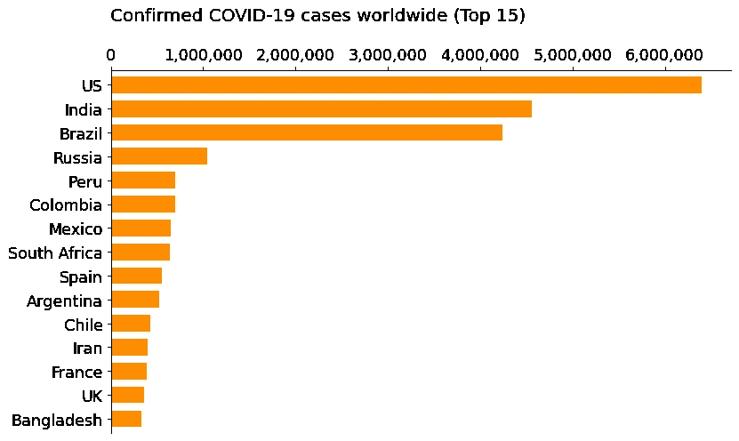
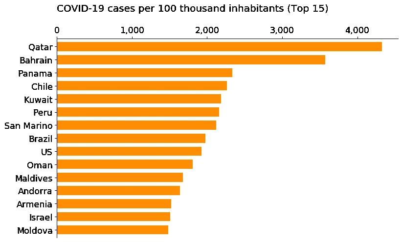
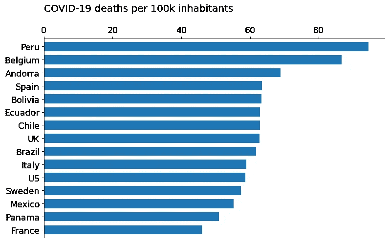
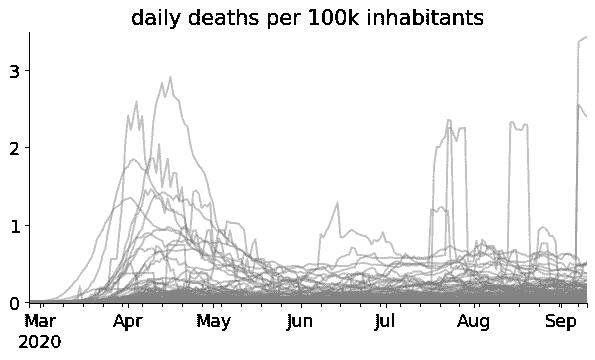
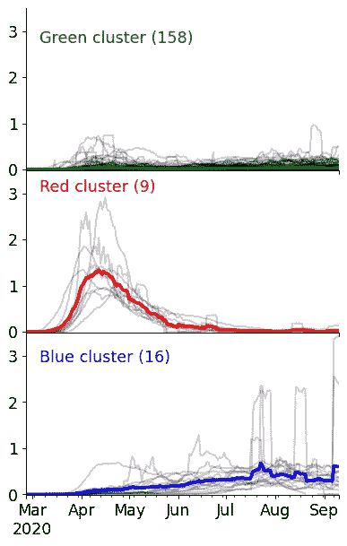
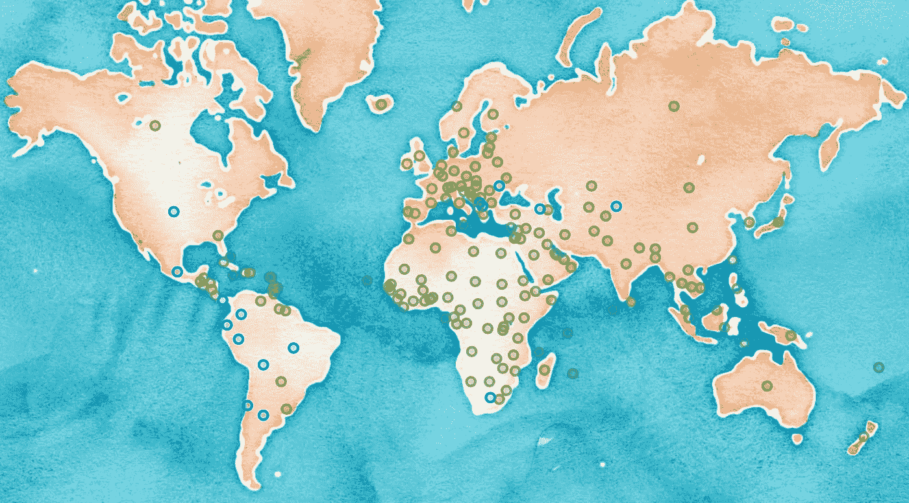

# 新冠肺炎:官方数字背后隐藏着什么？

> 原文：<https://towardsdatascience.com/which-countries-are-affected-the-most-by-covid-19-4d4570852e31?source=collection_archive---------29----------------------->

## [变更数据](https://towardsdatascience.com/tagged/data-for-change)

## 机器学习揭示洞察力:时间序列聚类分析。

[engin akyurt](https://unsplash.com/@enginakyurt?utm_source=unsplash&utm_medium=referral&utm_content=creditCopyText) 在 [Unsplash](https://unsplash.com/@enginakyurt?utm_source=unsplash&utm_medium=referral&utm_content=creditCopyText) 上拍摄的照片

## 概观

2020 年初，一种新型病毒开始在 Mainland China 传播。事实证明，这是一个影响深远、改变世界的事件的开始。

在第一波病毒席卷全球之后，我想提出两个问题:

*   哪些国家受新冠肺炎的影响最大？
*   哪些政府采取了正确的措施来阻止病毒的传播？

要回答，我们首先要了解官方确诊病例数字背后隐藏的**是什么。**

然后，我们将**机器学习算法应用于新冠肺炎数据**。这将各国组织成具有相似流行病学行为的群体。令人惊讶的是，这些群体在世界地图上形成了局部集群。这个意外的发现帮助我们回答了上面的问题。

## 如何决定哪些国家最痛苦？

当我第一次接触新冠肺炎的数据时，我自然检查了确诊的新冠肺炎病例的数量。该数据由约翰·霍普斯金大学提供。

全球前 15 名新冠肺炎感染病例。所有图表均由作者创作。(数据来自 2020 年 9 月)

这个排名告诉我们什么有意义的事情吗？显然，美国的感染人数比西班牙多得多，而西班牙是一个小得多的国家。然而，这并不意味着美国比西班牙受影响更大。

因此，感染人数需要根据每个国家的人口进行标准化。现在，这将允许独立于国家大小的更公平的比较。

全球标准化新冠肺炎病例。

卡塔尔、巴林、巴拿马、智利和科威特的感染密度最高。你知道吗？

但是等一下……各国有不同的检测政策:
**更多的新冠肺炎检测会产生更多的确诊病例——而完全不检测意味着零病例。** 所以，我们需要一个与测试量无关的量。

> 新冠肺炎的死亡人数是由测试率无偏估计的。

每个国家的标准化总死亡人数。

我们将使用标准化的死亡人数来比较国家！秘鲁、比利时和安道尔是死亡人数最多的国家(按人口标准化)。你听说过这个事实吗？此外，**上述前 15 个国家中有 7 个属于欧洲大陆**。

让我们更深入地研究一下隐藏在数据背后的东西。

照片由[在](https://unsplash.com/@enka80?utm_source=medium&utm_medium=referral) [Unsplash](https://unsplash.com?utm_source=medium&utm_medium=referral) 上的九个 koepfer 拍摄

## 分析每天的死亡人数

太好了，我们找到了一个合适的衡量标准来判断各国在病毒下遭受了多大的痛苦。现在我们将分析这个量随时间的发展，看看我们还能从中学到什么。

意大利、德国、美国和巴西的标准化每日死亡人数(7 天平均值)。

通过检查上面的每日死亡曲线，人们可以**提取** **不同的流行病学行为。**例如，红色曲线显示意大利 4 月份有许多人死亡。然而，他们设法阻止了病毒的传播。意大利通过几个月完全关闭社交生活达到了这个目的。

绿色曲线的德国没有受到第一波新冠肺炎浪潮的重创。国家反应迅速，从一开始就减缓了社会生活。结果，死亡人数几乎回到零。

另一方面，从四月到现在，巴西和美国不断有人死亡。他们还没有设法控制住病毒。

我们能通过观察其他国家学到一些东西吗:

所有 188 个国家的每日死亡曲线。你能认出任何模式吗？

好吧，这看起来有点乱。有 188 个国家。但是我们能找到多少不同的特征曲线呢？

为了清理混乱并找到模式，我们将应用聚类算法。这种无监督学习技术将相似的数据曲线分组在一起。

## 寻找跨国集群——收拾残局。

汉斯-彼得·高斯特在 [Unsplash](https://unsplash.com/s/photos/chaos?utm_source=unsplash&utm_medium=referral&utm_content=creditCopyText) 上拍摄的照片

python 包[ts learn](https://tslearn.readthedocs.io/en/stable/index.html)【2】为**时间序列**提供机器学习算法。我们将 k 均值聚类方法应用于标准化的每日死亡曲线。

该算法将行为相似的国家分组。结果是以下三个集群:

对国家进行聚类，绿色、红色和蓝色线条给出了每个聚类的均值曲线。图表显示了一段时间内标准化的每日死亡人数。

绿色组(158 个国家)显示每日死亡人数很少，接近于零。那些国家受到新冠肺炎的轻微影响。

另一方面，红色集群(9 个国家)在第一波(4 月/5 月)中有**巨大的死亡人数。但是，设法控制住了局面，死亡率几乎回到了零。**

相比之下，蓝色集群包含 16 个国家，这些国家不断遭受**新冠肺炎死亡。随着时间的推移，情况似乎越来越糟。**

## 集群在世界各地是如何分布的？

快速浏览下面的地图，可以看到红色星团位于欧洲大陆。此外，蓝色集群的国家集中在北美和南美。

红色、绿色和蓝色星团在世界地图上的分布。

红色区域包括西班牙、法国、英国、意大利、比利时、瑞典、荷兰、爱尔兰和安道尔。在新冠肺炎的第一波浪潮中，这些国家经历了一段艰难的时期。但是，通过对日常生活施加限制，他们减缓了死亡的速度。现在，这些国家几乎恢复了常态。

美国、巴西、秘鲁、哥伦比亚、墨西哥、阿根廷、智利、玻利维亚、厄瓜多尔和巴拿马还没有设法阻止死亡。那些国家可能会**尽快采取适当的行动**。

## 结论

我们已经讨论了新冠肺炎影响的一个合适的度量标准，它允许在不同的国家之间进行比较。

**关注标准化死亡人数抵消了检测率偏差。此外，我们要注意的是，还有社会经济因素。例如获得保健系统或其质量。我们在这里没有考虑这些影响。**

一种聚类算法帮助我们将国家分为三个主要的特征群。国家、

*   只受到病毒的轻微影响，
*   仅在 2020 年 4 月的第一次新冠肺炎浪潮中遭受了艰难的时期，
*   和不断遭受死亡的国家。

> 严格的社会限制帮助大多数欧洲国家控制住了病毒。但是，*在一些* *北美和南美国家，人们仍然奄奄一息。* **不幸！**

所有的数据可视化都是用 Python、Pandas 和 leav 完成的。Github 上 [**完整代码的链接可以在这里**](https://github.com/rbiele02/07_clustering_covid_time_series) 找到。数据来自 2020 年 9 月 13 日。

[1]JHU·CSSE 提供的“新型冠状病毒(新冠肺炎)病例”数据可在此下载:
[https://github . com/CSSEGISandData/新冠肺炎/tree/master/csse _ covid _ 19 _ Data/csse _ covid _ 19 _ time _ series](https://github.com/CSSEGISandData/COVID-19/tree/master/csse_covid_19_data/csse_covid_19_time_series)

[2] Tslearn，时间序列数据的机器学习工具包。
塔维纳德、法乌齐、范德维勒、迪沃、安德罗兹、霍尔茨、佩恩、尤尔查克、鲁尔姆、科拉尔和伍兹。
机器学习研究杂志**21**(2020)*1–6。*[https://tslearn.readthedocs.io/en/stable/index.html](https://tslearn.readthedocs.io/en/stable/index.html)