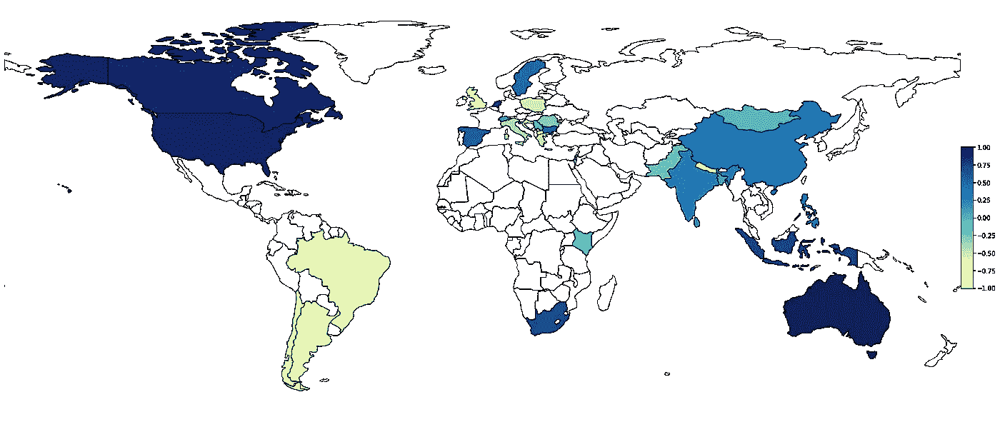
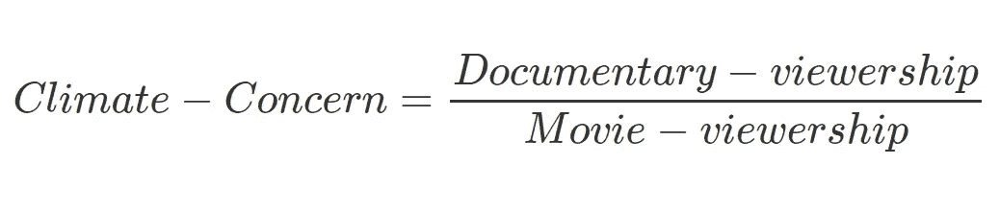
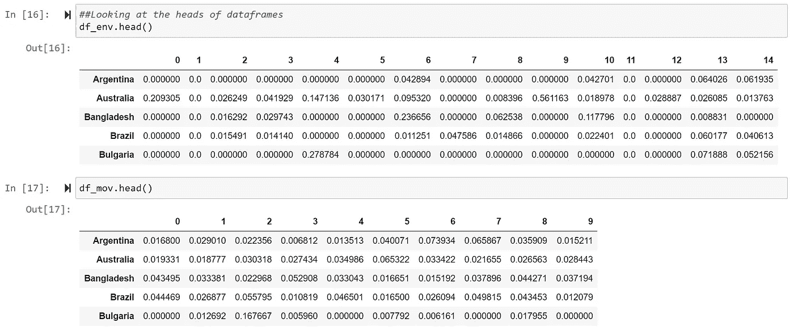
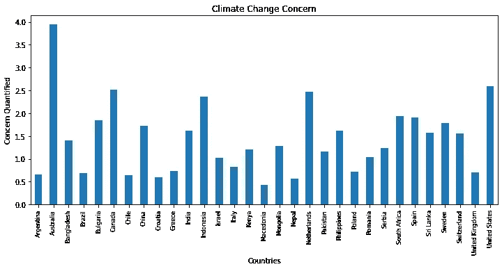

# 哪些国家关注气候变化？

> 原文：<https://towardsdatascience.com/which-countries-are-concerned-about-climate-change-mining-bittorrent-5114edd7aeb5?source=collection_archive---------55----------------------->

尼克·邦达列夫摄于[佩克斯](https://www.pexels.com/photo/crop-woman-with-burning-globe-in-hands-4310199/?utm_content=attributionCopyText&utm_medium=referral&utm_source=pexels)

## 激流科学

## 分析环境和气候相关纪录片的收视率，以量化世界各国对气候变化的关注。

## 澳大利亚目前高度关注气候变化。

*在澳大利亚野火和 2019 年亚马逊森林夷为平地之间，极地冰的持续融化，日益肆虐的全球天气，南极上空被遗忘的欧洲大小的臭氧洞和当前的百年疫情；关键问题是****——我们世界的国家对气候变化有多关心？***

在这篇文章中，我展示了我的实验，通过将数据科学应用于 BitTorrent 网络的挖掘来寻找这个重要问题的答案。如果你像我一样没有耐心，关键见解会在底部呈现，供你快速阅读。下面的歌词是一个很好的总结。

深色意味着对气候的高度关注。没有颜色意味着缺乏足够的数据。

所以让我们开始吧！

# 概观

要回答题目中的问题，我们需要数据。这个实验中使用的数据是全球气候变化和环境相关纪录片的代表性观众人数。

基本的假设是，如果我关心气候，那么我会通过观看与气候变化相关的纪录片来寻找相关信息。因此，如果一个国家的居民比其他人看更多这样的纪录片，那么我们可以推断他们的关注度更高。

但是，事情没那么简单。并非所有国家都以同样的身份使用非法下载。例如，*菲律宾*是一个在 torrent 网络中显示出极高流量的国家，而*英国*公民似乎更喜欢合法地消费越来越实惠的内容。自然，菲律宾环境相关纪录片的下载量会高得多。这样的变异需要 ***归一化*** 。

为了进行这种标准化，通过挖掘关于一组在世界范围内流行的商业电影的数据，例如*泰坦尼克号*或更近的名为 *1917* 的战争电影，来捕获洪流观众的一般特征。

筛选出那些数据太少的国家也很重要。这可能是由于多种原因造成的，例如，饱受战争蹂躏的*阿富汗*几乎没有洪流流量，可能是由于缺乏互联网连接。

更重要的是，这项调查是基于这样一个假设，即人们喜欢看英语纪录片，这并没有错，考虑到英语是一种全球语言，一个国家的人们对气候等问题表示关注，通常会拥有学习这种语言的必要手段。但是，由于这个原因，一些非洲国家甚至欧洲国家应该被排除在这个分析之外。

本质上，这个想法很简单，但很有趣。可视化工具有助于理解分析的结果。现在让我们看看我在阅读代码时用来执行这些分析的过程。

第一项任务是数据工程。我不会重复使用分布式哈希表挖掘 BitTorrent 网络的部分以及与之相关的其他任务，这在之前的一篇文章中已经介绍过了。

 [## 走向激流科学:数据工程

### 挖掘 BitTorrent 网络

towardsdatascience.com](/towards-torrent-science-data-engineering-d79e774886cb) 

# 数据工程

像*thepiratebay.org*这样的 BitTorrent 网站包含大量文件，主要是盗版电影和视频。通过抓取此类网站，收集与气候变化和环境相关的种子。这些种子然后被用于挖掘 BitTorrent 网络，以提取具有它们在世界上的位置的对等体(下载者)。这样就建立了一个数据集。这个数据集代表了这些纪录片在多个国家的观众特征。

但首先，我们需要选择一套流行的气候和环境的纪录片，这些纪录片可以在种子网站上找到，并被同行们寻找。在花了一些时间在互联网上回顾这些纪录片后，以下一组纪录片最终定稿。

被考虑的气候变化纪录片列表

为了进行上述动机的标准化，考虑了以下好莱坞电影的集合。它们仍然很受欢迎，并且已经遍及全球。

被考虑的商业好莱坞电影列表

第一步是提取数据，但我跳过了关于从 BitTorrent 中提取数据的部分，因为它在我以前的文章中有所涉及。

下一步是使用 Pandas 库创建数据框，以便进行进一步的分析。实现的函数(代码如下所示)返回一个字典，其中包含与上面列出的每个视频相对应的种子集的 IP、国家和城市。这被转换成表格数据并存储在 Pandas 数据框中。

示例输出如图 1 所示。这显示了按字母顺序排列的前五个国家的 10 部好莱坞电影的同行人数。

图 1-示例输出:电影数据帧

如前所述，由于缺乏数据，阿富汗必须排除在这一分析之外。同样的逻辑适用于许多国家，例如，阿尔巴尼亚人似乎对使用 BitTorrents 观看这些好莱坞电影并不特别感兴趣。

事实上，通过过滤掉至少有十个国家*的环境纪录片总同行，只有三十个国家*有资格进行进一步的分析。大多数非洲国家和许多欧洲国家不得不被过滤掉。**

**使用 Pandas 数据框时，代码非常简单。所以没有在这个空间展示。**

**现在让我们继续分析部分。**

# **分析学**

**在数据工程的过程之后，我们只剩下两个表格(数据帧),分别是好莱坞电影和关注气候的纪录片的收视率数据。**

**为了量化对气候的关注，我们将使用一个简单的方法。一个国家的气候纪录片和好莱坞电影的观众比例应该表明它的关注。这在下面的等式中表示。**

****

**但在此之前，正如概述中所提到的，我们需要执行标准化步骤，以便进行分析。**

## **正常化**

**下面来自维基百科的规范化定义适合于我们案例中的分析目的。**

> **归一化是指创建统计数据的移位和缩放版本，其目的是这些**归一化值**允许以消除某些总体影响的方式比较不同数据集的相应归一化值。—维基百科**

**首先，针对每个数据集，分别对各个国家的每个视频的对等计数(收视率)进行归一化。然后，对视频中每个国家的结果数据进行归一化处理。必须按此顺序进行，否则，上述所需的比率将不起作用。**

**这在下面的代码中有解释。第 2 行和第 3 行用于沿列标准化，第 4 行和第 5 行用于跨行标准化。**

**上述代码的输出如下图所示。它显示了前五个国家的标准化值。请注意，之前图像中出现的阿富汗、阿尔及利亚、阿尔巴尼亚和安哥拉现在都被过滤掉了。**

****

**归一化后，对每行的值求和，然后确定两个数据集的比值。这在 Python 中也很简单，代码如下所示。**

**从前五个国家的产出可以推断，澳大利亚似乎比其他国家更关心气候。**

**现在，让我们通过图和地图将输出可视化，并得出见解。**

# **形象化**

**让我们先来看看简单的条形图。这里不分享代码，因为它很简单。根据我们的分析，从这个图表中可以明显看出，澳大利亚人是世界上最有气候意识的公民。**加拿大人**、**美国人**和**荷兰人**也非常关注气候变化。**

****

**柱状图——气候问题。澳洲人还挺在意的！**

**根据我们的分析，印度尼西亚人、南非人、西班牙人和保加利亚人属于第二类。**

**现在让我们用色彩图在地图上标出这些发现。**

> **Choropleth 图提供了一种简单的方法来可视化一个地理区域内的测量值如何变化，或显示一个区域内的可变性水平。— *维基百科***

**在世界地图上，每个国家都根据其与气候相关的价值进行了着色。下图是使用 *geopandas* 库生成的。此外，代码如下所示。**

**阴影越深，对该国气候的关注就越高。同样显而易见的是，由于缺乏数据，许多国家都是白色的。这项分析主要限于英语盛行的三十个国家。**

**似乎只有当我们的家园被摧毁时，我们才意识到气候变化，就像澳大利亚发生的那样。亚马逊也发生了大规模火灾。但是巴西人似乎对此并不关心，至少从我们的分析中可以看出。也许，因为火灾只是在经济上帮助了巴西人——不像澳大利亚。**

****

**使用开源 Python 库生成的绘图。**较暗的色调意味着对气候的高度关注。**白色显示的国家表示缺乏足够的数据。**

**虽然新西兰没有出现在地图或分析中，这是因为 BitTorrent 在那里并不流行。尽管粗略地看了一下他们有限的观众群，表明他们对这类纪录片感兴趣。**

**让我们讨论一下在这一分析中必须考虑的潜在警告。**

# **警告**

1.  **第一个潜在的问题是电影和视频的选择。如果不同的一组视频给出不同的结果呢？就纪录片而言，激流世界里几乎没有其他受欢迎的纪录片。但是电影的选择是可以进一步探讨的。**
2.  **如果有与气候相关的地区语言的视频，没有英文版的怎么办？这当然是可能的。尽管一部好的纪录片应该被翻译成英语以吸引更多的观众，但最受欢迎的还是英语。**
3.  **数据可靠吗？有大量的 VPN 服务器，很多时候地理定位是误导。这是一个问题，但我们可以预期噪声会降低，因为商业电影流和纪录片流都会导致这种系统误差，我们实际上是在取一个比率。事实上，我们观察到了一些与乌克兰有关的异常现象——也许它值得单独写一篇文章。**

# **洞察力**

1.  **澳大利亚、加拿大、荷兰和美国是对气候表现出最大关注的国家。紧随其后的是南非、西班牙、保加利亚和印度尼西亚。不幸的是，巴西似乎还没有达到这一水平，至少根据这一分析。英国的情况类似。**
2.  **总的来说，发达国家对气候更加关注。英国是个例外，这有点令人惊讶，也是一种反常现象。这可能是一个错误的结论，需要调查。或许通过其他来源的数据——比如 Twitter。**
3.  **虽然之前没有提到**，但《甜蜜之地》是目前全世界最受欢迎的纪录片，在各大洲都有很高的收视率。这是一部关于蜜蜂的纪录片，可以在亚马逊 Prime 上看到。如果你还没有看过这部纪录片，并且希望更多地了解环境，这部纪录片可能是一个好的开始。****

**代码的 Github 链接是:[https://github.com/deepakkarunakaran/torrent-analytics](https://github.com/deepakkarunakaran/torrent-analytics)**

**期待在未来进行更多的分析，可能会有更多的数据和一些更酷的 ML/DL 算法。观察电影类型偏好的分布可能会产生有趣的结果，值得深思。**

**你可以在 Linkedin 上联系我@[https://www.linkedin.com/in/deepak-karunakaran/](https://www.linkedin.com/in/deepak-karunakaran/)**