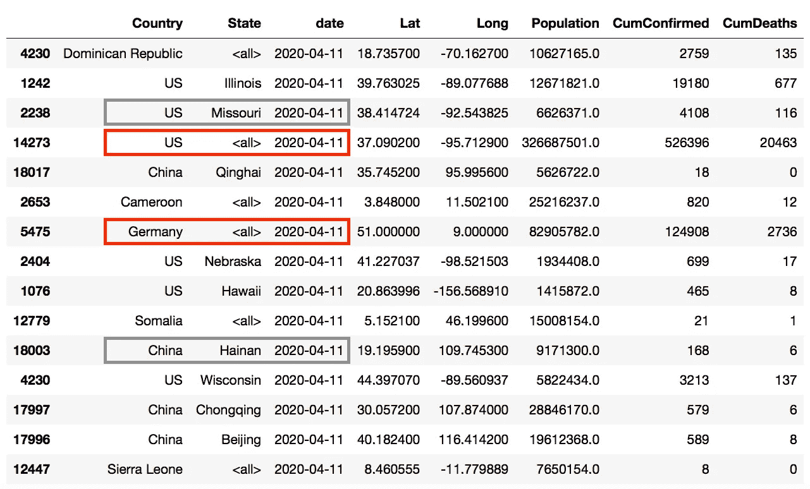

# 哪些国家的反应与新冠肺炎相似？机器学习提供了答案

> 原文：<https://towardsdatascience.com/which-countries-react-similar-to-covid-19-machine-learning-provides-the-answer-5971ec2f6f31?source=collection_archive---------12----------------------->

## 看看你的国家(或美国的州)和它的同行相比表现如何。了解聚类分析的实际应用——使用 UMAP 投影和 HDBSCAN。

*【2020-2019-04 更新:添加 GitHub 库，见故事底部】*

我经常想知道不同国家在冠状病毒病例统计方面有什么不同。往往只考虑绝对数字。因此，较小的国家(如瑞士、比利时)被忽略了。在这个故事中，我主要分析与人口规模相关的案例。截至今天(2020-04-16，来源 JHU)的**铁的事实是:**


每百万居民死于新冠肺炎的人数。人口规模至少为 100 万的所有国家、美国各州和中国各省的前 25 名。红色代表国家，灰色代表州和省。

纽约州在这份令人悲伤的名单中遥遥领先，紧随其后的是欧洲国家西班牙、比利时和意大利。在前 25 名中，中国只有一个省份。**湖北**(第 23 位)每百万死亡 56 人，约为纽约的十分之一。

提醒一下——将国家分成更小的区域总是会导致更多的极端值。对意大利来说，这将揭示出每百万人中有 1055 人死亡的伦巴第大区

> 但是动力呢？是不是有些国家反应比较早，有些国家比较晚？有没有一些模式？我们可以向其他国家学习吗？

为了回答这些问题，我采用了数据驱动的方法。 [**无监督学习**](https://en.wikipedia.org/wiki/Unsupervised_learning) 技术应该有助于获得一些新的洞察力。

这个故事分为以下四个部分:

1.  **数据源**
    所用数据源的描述。
2.  **疫情爆发后的病例数发展**
    众所周知的情节——更新并包括美国各州&中国各省。
3.  **特性工程**
    关于最终分析中要使用的特性的细节。
4.  **聚类分析**
    通过无监督学习进行国家间的比较。

# 1.数据源

## 案例统计

像许多其他人一样，我；))，对于案例统计，我依靠的是[约翰·霍普斯金大学](https://github.com/CSSEGISandData/COVID-19/tree/master/csse_covid_19_data/csse_covid_19_time_series)的 GitHub 知识库的数据。他们按国家和日期发布包括确诊病例、康复和死亡的时间序列。对于一些国家，如美国、加拿大、中国、澳大利亚，他们甚至更进一步，增加了地区甚至直辖市。

在这篇报道中，我们坚持使用国家数据。仅对于美国和中国，我还加载了单个州和省。

## 人口

人口规模取自三个不同的来源。国家一级的数字取自世界银行公开数据 API。还有一个 [Python 包](https://github.com/mwouts/world_bank_data)适合这个工作。

对于中国的省份，我找不到任何方便的 API。因此，我将维基百科上的[表复制到一个制表符分隔的文本文件中。一个定制的导入器脚本将这些乱七八糟的东西转换成了一个漂亮的熊猫数据帧。](https://en.wikipedia.org/wiki/Provinces_of_China#List_of_province-level_divisions)

美国各州的人口规模已经包含在死亡人口的美国时间序列文件中([*time _ series _ covid 19 _ deaths _ US . CSV*](https://github.com/CSSEGISandData/COVID-19/blob/master/csse_covid_19_data/csse_covid_19_time_series/time_series_covid19_deaths_US.csv)’)。这个文件是 JHU 数据库的一部分。

在连接了所有这些数据集之后，我得到了一个熊猫数据框架，包括了我需要的所有数据。以下命令提取 4 月 11 日的随机样本，排除非常小的国家(< 1 million):

```
data[(data.date == '2020-04-11') & (data.Population >= 1000000)] \
    .sample(15)
```



Random sample of the imported data. **每行代表一个国家在给定日期的州**(列‘date’)。对于美国和中国，也包括州/省级别的数据。彩色框代表国家数据(=红色)和地区数据(=灰色)。

# 2.爆发后的病例数发展

下面的图表是众所周知的。我添加这些图的主要原因是我对爆发日期的定义略有不同。在下一节描述“机器学习”特性时，我也会用到这个定义。看:

*   **x 轴**表示病毒爆发以来的**天数。然而，我们没有将疫情定义为病例数超过 100 的那一天，而是将其定义为病例数超过每百万居民 5 例的**日**。统计数据表明人口为 2000 万。**
*   **y 轴**显示累计的**确诊病例数，相对于对数轴上的人口规模**。


自新冠肺炎疫情爆发以来累计确诊病例数(百万分之五以上的一天)。仅显示人口规模至少为 1500 万的国家。

在欧洲国家中，西班牙领先。然而，所有这些国家在过去几周都放缓了脚步。就这些数字而言，美国作为一个整体，可以与欧洲相媲美。

中国和韩国在 3-4 周前拉平了曲线。与这些国家相比，日本的病例数稳步缓慢增长。

接下来，美国各州**的情况完全相同。我将 x 轴的下限限定为 10，以使图的右上部分清晰:**


自新冠肺炎疫情爆发以来累计确诊病例数(百万分之五以上的一天)。仅显示人口至少为 500 万的美国各州。

虽然一些州远低于全国平均水平(每百万 2000 例，如明尼苏达州为 300 例)，但纽约和新泽西已经达到每百万 8000-9000 例。所有的曲线都降低了对数轴上的速度，但在这个已经很高的水平上加倍数字是不同的…

# 3.特征工程

考虑到有限的数量和数据的异构性，在新冠肺炎数据集上应用机器学习方法并不简单:

*   首先，每个国家收集数据的方式非常不同。对病例有不同的定义，数据收集滞后，一些国家测试更多，等等。此外，死亡的原因也不尽相同。
*   第二，全球只有大约 200 个国家。此外，为了执行数据驱动的方法，没有确诊病例或确诊病例很少的国家不会增加这一分析的价值。

自疫情爆发以来，我们总共有大约 60 个国家有超过 3 周的数据。因此，我不得不把更多的精力放在手工制作有用的功能上，而不是完全自动化的方法。让我先解释两个术语，然后是特性本身:

## 定义

*   **疫情** :
    如上所述，我将疫情定义为病例数超过每百万居民 5 例的那一天。
*   **峰值** :
    峰值定义为最近 7 天的平滑平均值达到最高值的那一天。关于平滑的更多信息。

## 特征

我计算并用于以下聚类分析的特征是:

1.  **早期死亡率** :
    疫情发生 14 天后每周死亡人数除以
    疫情发生一周内确诊病例数。
2.  **10x**:
    从疫情爆发到确诊病例数乘以 10 所需的天数。实际上，这是从百万分之五到百万分之五十的时间段。
3.  **高峰死亡率** :
    高峰周死亡人数除以前 14 天的周确诊人数。
4.  **早期加速度** :
    如果 *deltaW0W1* 确诊病例从疫情爆发一周至之后一周的百分比增量，以及 *deltaW1W2* 疫情爆发后第 1 周至第 2 周的百分比增量，则加速度为:
    *Early Accel = deltaw1w 2/deltaw0w 1。*
5.  **电流加速度** :
    类似。如果 *deltaWt-2Wt* 从上周到本周确诊病例增加的百分比， *deltaWt-4Wt-2* 从当前前第 4 周到第 2 周确诊病例增加的百分比，则加速度为:
    *current Accel = deltaWt-2Wt/deltaWt-4Wt-2。*

加速度的定义听起来可能很复杂，但实际上它只是速度的变化。如果我们看到案例增加了 20%，然后又增加了 10%，那么加速度就是 1.10 / 1.20 = 0.92。因此，小于 1.0 的值是可以的。

## 为什么我用一个几何平均数来得到平滑的星期

我们的病例统计数据具有很强的**周季节性**，这是由周末较少进行测试这一事实造成的。因此，我们需要一个像[移动平均线](https://en.wikipedia.org/wiki/Moving_average#Simple_moving_average)这样的平滑器来解释这个事实。我用的是[几何平均](https://en.wikipedia.org/wiki/Geometric_mean)。这背后的基本原理是，我们处理一个指数序列。每个周期都加倍的数列，例如:

[25，50， **100** ，200，400]

得出的算术平均值是 155。相反，几何平均值是 100。正是我们想要的。下面是计算的代码片段:

```
def geometric_mean(values):
    return np.exp(np.mean(np.log(values)))def geometric_simple_moving_average(df, len=7):
    return df.apply(np.log).rolling(len).mean().apply(np.exp)
```

# 4.聚类分析

## 方法

我选择 HDBSCAN 的 UMAP 投影进行聚类分析有几个原因。首先，**数据不是对称的**，所以基于对称距离的线性方法宁愿失败。

就非线性聚类分析而言，如今 t-SNE 非常普遍。然而，SNE 霸王龙只保留了局部结构，而不是全局结构。相反，对 UMAP 来说，全球距离也是有意义的。这使得可视化对解释更有价值。

最后，但同样重要的是，我想表演一些新的东西。不是旧的 k-means，或者标准的层次结构等等。:)

**UMAP** 本身并不直接生成星团。它对新空间进行非线性投影。在这个新的投影中， [**HDBSCAN**](https://hdbscan.readthedocs.io/en/latest/how_hdbscan_works.html) 可以用来提取集群。

使用 UMAP 和 HDBSCAN 进行聚类分析的详细信息和 Python 代码可以在[UMAP-学习](https://umap-learn.readthedocs.io/en/latest/clustering.html)页面上找到。我计算了两个不同的投影。一个用于可视化( *embedding_for_plot* )，另一个( *embedding_for_hdbscan* )作为 hdbscan 聚类的预处理器:

```
import umap.umap_ as umap   # !pip install 'umap-learn==0.3.10'
import hdbscanembedding_for_plot = umap.UMAP(random_state=random_state) \
    .fit_transform(features)embedding_for_hdbscan = umap.UMAP( \
    random_state=random_state, min_dist=0.0, n_neighbors=10) \
    .fit_transform(features)cluster = hdbscan.HDBSCAN(min_samples=2, min_cluster_size=5) \
    .fit_predict(embedding_for_hdbscan)
```

## 为什么要进行两次分析？

我进行了两种不同的分析。第一个聚类分析只包括三个特征，对于疫情爆发后只有 2.5 周数据的国家来说效果很好。

第二个分析也使用曲线峰值的特征。对于每日病例仍在增加的国家，高峰将会移动。因此，结果也会改变。

## 1.爆发相似性和聚类分析

在第一次分析中，我使用了以下三个特征:

*   DaysTo10X
*   早期死亡率
*   早期加速

该算法将数据集分成大小相似的四个不同的簇。使用 UMAP 嵌入，数据可以很容易地在两个轴上可视化:


请记住，对于这种聚类，仅使用爆发后 2-3 周的数据。值得注意的是，西班牙在这里并不属于橙色组，该组包括意大利、比利时、纽约、德国、加拿大等。

为了深入挖掘，我创建了[小提琴图](https://en.wikipedia.org/wiki/Violin_plot)(类似于盒子图)。红色和橙色集群的早期死亡率都很高。然而，红色集群在爆发后达到快 10 倍(小“DaysTo10X”)。


## 2.总体相似性和聚类分析

在第二次分析中，我增加了两个特性，即:

*   峰值死亡率
*   电流传感器

现在 HDBSCAN 确定了 5 个集群:


在这些星团中，蓝色的那个鹤立鸡群。“蓝色等级”的国家在疫情爆发后花了更长时间才实现病例数 10 倍的增长，但它们现在在确诊病例中分享了相当高的增长速度(见“当前加速”)。


慢慢来，确定你的国家，做你自己的解释。聚类分析总是关于**发现新的关系和见解**。

大多数方法也有**随机成分**。这意味着，如果我们用不同的随机种子数进行相同的分析，结果可能会有所不同。通常不是很多，但也可能不是五个，而是四个或六个。

# 关于预测和预报的一点注记

这个故事不是直接关于预测和未来的场景。然而，识别相似的国家或州，以及它们的集群，可以帮助应用**监督学习**。

> 如果我们知道纽约和新泽西的表现与意大利和西班牙相似，但它们滞后 2 周，我们可以使用欧洲国家的最新历史来预测美国这些州的未来。

就机器学习术语而言，欧洲国家的最新数据起到了“标签”的作用。

# 贮藏室ˌ仓库

这个故事的所有代码都可以在 GitHub 上找到，参见:

[](https://github.com/ploner/coronavirus-clustering) [## ploner/冠状病毒-聚集

### 该资料库包括一个 Jupyter 笔记本，用于对冠状病毒病例进行聚类分析。结果和情节…

github.com](https://github.com/ploner/coronavirus-clustering) 

# 最后的想法

除了识别一些众所周知的集群，我还能够发现一些新的、意想不到的关系。此外，特别是使用 **Violin Plots** 的聚类分布可视化对从提取的聚类中获得更多信息有很大帮助。

最后，我会一直建议基于**周【几何】平均值**而不是每日病例统计数据做出关于冠状病毒的决定。这消除了周末效应，使每一个分析和解释更加稳定。

> 如果你喜欢这个故事，**你可能也会喜欢我在《走向数据科学》上发表的这两个中型故事**中的**一个。它们是关于新冠肺炎、**分析**和**数据驱动的 Web 应用开发**:**

[](/forget-daily-statistics-of-the-coronavirus-7e9bbb7349bd) [## 厌倦了被告知新冠肺炎方向每两天改变？

### 忘记每日统计，遵循正确的 KPI！

towardsdatascience.com](/forget-daily-statistics-of-the-coronavirus-7e9bbb7349bd) [](/visualise-covid-19-case-data-using-python-dash-and-plotly-e58feb34f70f) [## 使用 Python、Dash 和 Plotly 可视化新冠肺炎案例数据

### 立即创建您自己的仪表板 Web 应用程序！

towardsdatascience.com](/visualise-covid-19-case-data-using-python-dash-and-plotly-e58feb34f70f) 

***编者按:*** [*走向数据科学*](http://towardsdatascience.com/) *是一份以数据科学和机器学习研究为主的中型刊物。我们不是健康专家或流行病学家，本文的观点不应被解释为专业建议。想了解更多关于疫情冠状病毒的信息，可以点击* [*这里*](https://www.who.int/emergencies/diseases/novel-coronavirus-2019/situation-reports) *。*