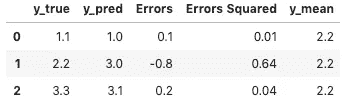
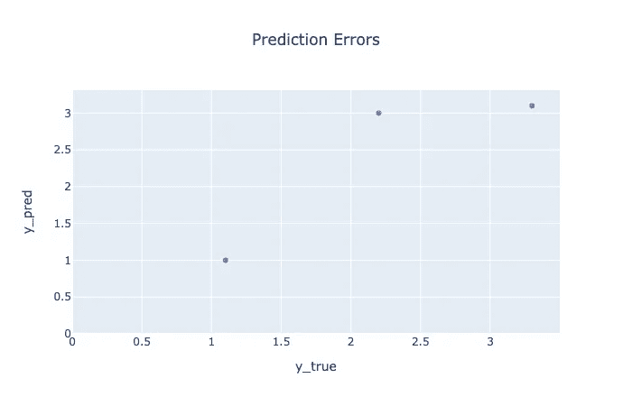

# 在机器学习回归问题中，应该使用哪种评估指标？

> 原文：<https://towardsdatascience.com/which-evaluation-metric-should-you-use-in-machine-learning-regression-problems-20cdaef258e?source=collection_archive---------1----------------------->

## r，RMSE 和梅

如果你像我一样，你可能在回归问题中使用了 R 平方(R)、均方根误差(RMSE)和平均绝对误差(MAE)评估指标，而没有仔细考虑它们。🤔

尽管它们都是通用的度量标准，但是在什么时候使用哪一个并不明显。写完这篇文章后，我有了一个新的最爱和一个新的计划来报道它们。😀

过一会儿我会和你分享这些结论。首先，我们将深入了解每个指标。您将了解每种方法在模型选择和报告方面的优缺点。我们开始吧！🚀


评估指标就像理解的桥梁。😀资料来源:pixabay.com

# R 平方

r 代表你的模型解释的方差比例。

r 是一个相对指标，因此您可以使用它来与基于相同数据训练的其他模型进行比较。你可以用它来大致了解一个模型的表现。

免责声明:本文不是对机器学习方法的回顾，但请确保您使用不同的数据进行训练、验证和测试。你总是想拿出一些你的模型没见过的数据来评估它的性能。此外，查看模型预测值与实际值的对比图，以了解模型与数据的吻合程度也是一个好主意。

让我们看看 R 是如何计算的。前进！➡️

## 公式和代码

这里有一种表达 R 的方法。

***1 - (SSE/SST)***

*SSE* 是误差平方和；实际值和预测值之差的平方和。

*SST* 是平方和的总和(有时显示为 TSS)；实际值和实际值平均值之间的平方差之和。

更多数学符号:

***1-(∑(y-ŷ)/∑(y-y̅))***

下面是代码的样子——改编自主要的 Python 机器学习库 [scikit-learn](https://github.com/scikit-learn/scikit-learn/blob/fd237278e/sklearn/metrics/_regression.py#L494) 。

```
numerator = ((y_true - y_pred) ** 2).sum()
denominator = ((y_true - np.average(y_true)) ** 2).sum()r2_score = 1 - (numerator / denominator)
```

## 用语言

1.  从实际 *y* 值中减去预测值
2.  计算结果的平方
3.  合计它们

这是分子。

1.  从每个实际 *y* 值中减去实际 *y* 值的平均值
2.  计算结果的平方
3.  合计它们

这是分母。

1 -分子/分母是 R。🎉

r 是 scikit-learn 回归问题的默认度量。如果您想显式地使用它，您可以导入它，然后像这样使用它:

```
from sklearn.metrics import r2_scorer2_score(y_true, y_pred)
```

## 解释

一个解释不存在方差的模型的 R 为 0。R 为 1 的模型可以解释所有的差异。分数越高越好。

然而，如果你的 R 在你的测试集上是 1，你可能在泄露信息，或者这个问题对你的模型来说很简单。👍

在某些领域，如社会科学，有许多因素影响人类行为。假设你有一个只有几个自变量的模型，它的 R 接近于 0.5。你的模型能够解释数据中一半的差异，这很好。😀

有可能 R 为负。当模型对数据的预测比输出值的平均值差时，就会出现负分。每次预测平均值都是无效模型。更多[见这里](https://stats.stackexchange.com/a/12991/198892)。

## 例子

假设您有以下小型玩具测试数据集:



在[这个 Jupyter 笔记本](https://github.com/discdiver/r2_rmse_mae)的 GitHub 上可以获得所有代码。

这是实际和预测的 *y* 值的曲线图。



模型的 R 为 0.71。模型解释了数据中 71%的差异。这还不算太糟糕，尽管我们想要更多的测试数据。😀

再举一个例子，假设 *y* 的真值是*【55，2，3】*。平均数是 20。对每个 *y* 值预测 20 会导致 R 为 0。

预测上述真实值*【1，2，2】*的模型得出 R 为-0.59。底线是，你可以做得比空模型差得多！事实上，你可以预测无限差，导致无限低的 R。😲

作为一个简短的旁白，让我们看看调整后的 R 和机器学习与统计。

## 调整后 R

[调整后的 R](https://en.wikipedia.org/wiki/Coefficient_of_determination#Adjusted_R2) 考虑了更多预测变量(特征)的增加。

只有当新的预测变量对模型性能的改善程度超过偶然情况下的预期时，调整后的 R 才会随着新的预测变量而增加。调整后的 R 有助于您专注于使用尽可能最节省的模型。😉

调整后的 R 在统计推断中比在机器学习中更常见。机器学习的主要 Python 库 Scikit-learn 甚至没有调整过的 R 度量。 [Statsmodels](https://www.statsmodels.org/stable/index.html) ，Python 的主统计库[做](https://www.statsmodels.org/stable/generated/statsmodels.regression.linear_model.RegressionResults.rsquared_adj.html#statsmodels.regression.linear_model.RegressionResults.rsquared_adj)。如果你想了解更多关于何时使用哪个 Python 库进行数据科学，我在这里写了一个指南[。](/which-python-data-science-package-should-i-use-when-e98c701364c)

知道特征列数( ***p*** )和观测数( ***n*** )就可以计算出调整后的 R2。代码如下:

```
adjusted_r2 = 1 — ((1 — r2) * (n — 1)) / ( n — p — 1)
```

*n-1* 为*自由度*。每当你听到这个词，你就知道你在统计领域。在机器学习中，我们通常最关心预测能力，因此 R 比调整后的 R 更受青睐。

关于统计学与机器学习的另一个注意事项:我们的重点是机器学习，所以预测而不是因果关系。r——以及我们将看到的其他指标，本身并没有说明任何因果关系。

## 结果

r 告诉你你的模型解释了多少方差。这很方便，因为任何回归问题的 R 将立即提供对模型执行情况的一些(有限的)理解。😀

r 是一个相对度量。现在让我们来看几个绝对指标。


资料来源:pixabay.com

# 均方根误差(RMSE)

RMSE 是一个非常常见的评估指标。它的范围可以是 0 到无穷大。值越低越好。为了简单起见，请记住它的名称中有 *error* 并且您希望错误很少。☝️

## 公式和代码

RMSE 可以这样表述:

***平均值的平方根 SSE***

我们看到了*上证* 中的 R 评分指标。它是误差平方和。实际值和预测值之差的平方和。

更多数学公式:

***(1/n *(∑(y-**))***)

在 Python 代码中:

```
np.sqrt(np.mean((y_true - y_pred) ** 2))
```

## 用语言

1.  从实际 *y* 值中减去预测值
2.  计算结果的平方
3.  合计它们
4.  取平均值
5.  求平方根

以下是如何使用 scikit-learn 中的函数获取 RMSE 的方法:

```
from sklearn.model_selection import mean_squared_errormean_squared_error(y_true, y_pred, squared=False)
```

从 scikit-learn 版本 0.22.0 开始，您可以使用`squared=False`参数。在此之前，你必须像这样自己求平方根:`np.sqrt(mean_squared_error(y_actual, y_predicted)`。☝️

## 解释

如果您想要，请使用 RMSE:

*   惩罚大错误
*   让结果与结果变量使用相同的单位
*   使用可以快速计算的损失函数进行验证

您可以使用没有*根*的均方误差(MSE ),但是单位不容易理解。只要取 MSE 的平方根，你就得到 RMSE。👍

在 [的这篇优秀文章](https://medium.com/u/5086e44692d2?source=post_page-----20cdaef258e--------------------------------)[中，JJ](https://medium.com/human-in-a-machine-world/mae-and-rmse-which-metric-is-better-e60ac3bde13d) 指出了 RMSE 的一些问题。即“*”RMSE 不一定随误差的方差而增加。RMSE 随着误差幅度的频率分布的变化而增加*

同样，RMSE 也不是那么容易解释的。这些单位可能看起来很熟悉，但是您正在消除差异。你不能说 RMSE 值为 10 就意味着你平均差了 10 个单位，尽管大多数人都是这么想的。至少，我以前是这样的。😉

## 例子

再次回到我们的示例数据集:


RMSE 是 0.48。实际 *y* 值的平均值为 2.2。总之，这些信息告诉我们，这个模型可能介于伟大和可怕之间。在没有更多背景的情况下，很难对这个 RMSE 统计做太多。😐

## 结果

对于评估来说，RMSE 是一个不完美的统计，但它非常普遍。如果你很在意惩罚大的错误，这是一个不错的选择。当超参数调整或批量训练深度神经网络时，这是一个很好的损失度量选择。


资料来源:pixabay.com

# 绝对平均误差

平均绝对误差(MAE)是误差绝对值的平均值。

## 公式和代码

让我们直接进入数学方程式:

*(1 / n) * (∑ |y - ŷ|)*

在代码中:

```
np.average(np.abs(y_true - y_pred))
```

## 用语言

1.  从实际 *y* 值中减去预测值
2.  取每个误差的绝对值
3.  合计它们
4.  取平均值

以下是如何使用 [scikit-learn](https://scikit-learn.org/stable/modules/generated/sklearn.metrics.mean_absolute_error.html) 函数获得 MAE:

```
from sklearn.model_selection import mean_absolute_errormean_absolute_error(y_actual, y_predicted, squared=False)
```

## 解释

MAE 在概念上是回归问题最简单的评估标准。它回答了这样一个问题，“你的预测平均偏差了多少？”

这些单位有直观的意义。是啊！🎉

例如，假设您正在预测房屋销售价格，而测试集中的平均实际销售价格是$500，000。10，000 美元的平均误差意味着该模型的预测误差平均为 10，000 美元。那还不错！😀

与 RMSE 分数不同，糟糕的预测不会导致不成比例的高 MAE 分数。

MAE 将总是比 RMSE 更接近于 0(或相同)。

请注意，计算 RMSE 作为具有训练循环的模型的优化度量比计算 MAE 更快。

## 例子

最后一次转向我们的示例数据集:


平均汇率为 0.37。这些预测与平均值 2.2 相差 0.37。我能很快理解这句话。😀

RMSE 是 0.48，而 R 是 0.71。

## 结果

MAE 是最简单的评估指标，也最容易解释。如果你不想让一些遥远的预测压倒许多接近的预测，这是一个很好的度量标准。如果你想惩罚那些离目标很远的预测，这不是一个好的选择。


资料来源:pixabay.com

# 包装

那么，您应该使用哪个指标呢？总的来说，建议你三个都报！🚀

r 让评估性能的人对您的模型的性能有一目了然的了解。这绝对值得报道。

RMSE 不太直观理解，但非常普遍。它惩罚了非常糟糕的预测。它也是优化模型一个很好的损失度量，因为它可以快速计算。这值得报道。

这篇文章让我对梅产生了新的敬意。理解并按比例对待所有预测误差是很简单的。我会在大多数回归问题评估中强调这一点。

不同意？在推特上告诉我。👍

如果您想了解分类问题的度量标准，我在这里写了相关内容。

我希望你喜欢这篇流行的 Python 数据科学包指南。如果你有，请在你最喜欢的社交媒体上分享，这样其他人也可以找到它。😀

我撰写关于 [Python](https://memorablepython.com) 、 [SQL](https://memorablesql.com) 、 [Docker](https://memorabledocker.com) 以及其他技术主题的文章。如果你对这些感兴趣，请注册我的[邮件列表，那里有很棒的数据科学资源](https://dataawesome.com)，点击这里阅读更多帮助你提高技能的内容。👍

[](https://www.dataawesome.com)

资料来源:pixabay.com

报道愉快！⚖️