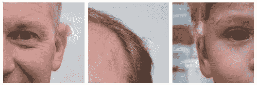
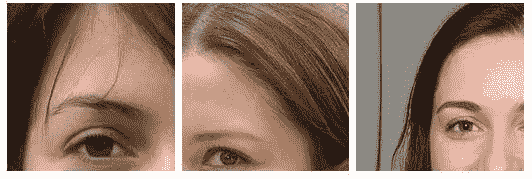
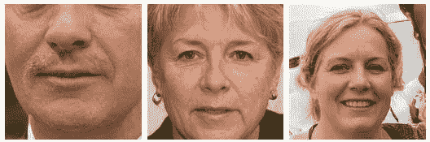
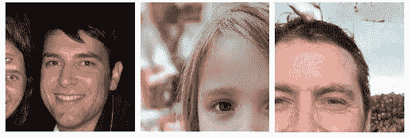
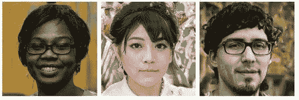
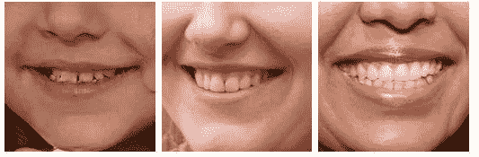
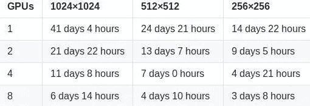
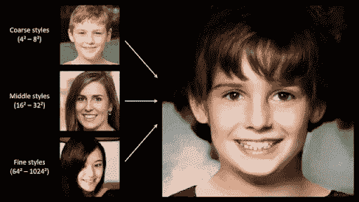

# 哪张脸是真的？应用 StyleGAN 来创造假的人

> 原文：<https://towardsdatascience.com/which-face-is-real-c63ce568efd5?source=collection_archive---------60----------------------->

生成模型旨在学习和理解数据集的真实分布，并使用无监督学习从中创建新数据。这些模型(如 StyleGAN)有好有坏，因为很难理解某些概率分布的复杂性。

为了绕过这些路障，[对抗性网络框架](https://pathmind.com/wiki/generative-adversarial-network-gan)被创建，由此生成模型与对手对抗:一个学习确定样本是来自模型分布还是数据分布的判别模型。

生成模型通过使随机噪声通过多层感知器来生成样本，而判别模型也是多层感知器。我们把这种情况称为对抗性网络。

介绍这个对抗性框架的论文可以在[这里](https://arxiv.org/pdf/1406.2661.pdf)找到，还有用于框架的[代码。](https://github.com/goodfeli/adversarial)

# 哪张脸是真的？

[哪张脸是真实的？](http://whichfaceisreal.com/index.php)是由华盛顿大学[的](https://www.washington.edu/)[杰文·韦斯特](https://www.jevinwest.org/)和[卡尔·博格斯特伦](https://octavia.zoology.washington.edu/)开发的，作为[呼叫扯淡项目](https://callingbullshit.org/)的一部分。

*“电脑不错，但你的视觉处理系统更好。如果你知道要找什么，你一眼就能认出这些假货——至少目前是这样。用于生成它们的硬件和软件将不断改进，人类在伪造和检测的军备竞赛中落后可能只需要几年时间。”—杰文·韦斯特和卡尔·博格斯特伦*

# 你如何区分这些图像？

差异主要体现在 6 个方面:

# 水渍

*   该算法产生的闪亮斑点看起来有点像旧照片上的水斑。



[水渍](http://www.whichfaceisreal.com/learn.html)

# 头发

*   不连续的发束、太直的头发或太多条纹将是生成头发时的常见问题。



[发](http://www.whichfaceisreal.com/learn.html)

# 不对称

*   一个常见的问题是不对称。通常框架会在左边采用一种风格，在右边采用另一种风格，或者在一边有一个旅行者风格的装饰，而在另一边没有。其他时候，框架会弯曲或参差不齐。此外，面部毛发不对称、左耳和右耳不同的耳环以及左右两侧不同形式的衣领或织物也可能存在。



[不对称](http://www.whichfaceisreal.com/learn.html)

# 背景问题

*   图像的背景可能表现为奇怪的状态，如模糊或畸形的物体。这是因为神经网络是在人脸上训练的，对图像的背景给予的强调较少。



[背景问题](http://www.whichfaceisreal.com/learn.html)

# 荧光渗色

*   荧光色有时会从背景渗入头发或面部。观察者可能会误认为这是有色头发。



[荧光出血](http://www.whichfaceisreal.com/learn.html)

# 牙齿（tooth 的复数）

*   牙齿也很难渲染，可能会呈现出奇怪的形状，不对称，或者对于那些可以识别牙齿的人来说，有时图像中会出现三颗门牙。



[牙齿](http://www.whichfaceisreal.com/learn.html)

# 测试 StyleGAN 算法

StyleGAN 的所有代码都在 [stylegan](https://github.com/NVlabs/stylegan) 库中开源。它给出了如何自己运行 styleGAN 算法的细节。因此，让我们开始分享一些基本的系统要求。

# 系统需求

*   Linux 和 Windows 都受支持，但是出于性能和兼容性的原因，我们强烈推荐 Linux。
*   64 位 Python 3.6 安装。我们建议使用 numpy 1.14.3 或更新版本的 Anaconda3。
*   支持 GPU 的 TensorFlow 1.10.0 或更新版本。
*   一个或多个至少 11GB DRAM 的高端 NVIDIA GPUs。我们推荐 8 特斯拉 V100 GPUs 的英伟达 DGX-1。
*   NVIDIA 驱动 391.35 或更新，CUDA 工具包 9.0 或更新，cuDNN 7.3.1 或更新。

在 [pretrained_example.py](https://github.com/NVlabs/stylegan/blob/master/pretrained_example.py) 中给出了一个尝试 styleGAN 预训练示例的最小示例。它按如下方式执行:

```
> python pretrained_example.py

Downloading https://drive.google.com/uc?id=1MEGjdvVpUsu1jB4zrXZN7Y4kBBOzizDQ .... done

Gs                              Params OutputShape WeightShape

---                             --- --- ---

latents_in                      - (?, 512) -

...

images_out                      - (?, 3, 1024, 1024) -

---                             --- --- ---

Total                           26219627

Once you execute ‘python pretrained_example.py’, type in ‘ls results’ to see the results.

> ls results

example.png # https://drive.google.com/uc?id=1UDLT_zb-rof9kKH0GwiJW_bS9MoZi8oP
```

# 准备用于训练的数据集

训练和评估脚本对存储为多分辨率 TFRecords 的数据集进行操作。每个数据集由一个目录表示，该目录包含不同分辨率的相同图像数据，以实现高效的流式传输。有一个单独的*。tfrecords 文件，如果数据集包含标签，它们也存储在一个单独的文件中。默认情况下，脚本期望在数据集/ <name>/ <name>- <resolution>找到数据集。tfrecords *。*目录可以通过编辑 [config.py](https://github.com/NVlabs/stylegan/blob/master/config.py) 来改变:</resolution></name></name>

```
result_dir = 'results'

data_dir = 'datasets'

cache_dir = 'cache'
```

要获取 FFHQ 数据集(datasets/ffhq)，请参考 [Flickr-Faces-HQ 库](https://github.com/NVlabs/ffhq-dataset)。

要获取 CelebA-HQ 数据集(datasets/celebahq)，请参考[渐进式 GAN 库](https://github.com/tkarras/progressive_growing_of_gans)。

要获得其他数据集，包括 LSUN，请查阅相应的项目页面。可以使用提供的 [dataset_tool.py](https://github.com/NVlabs/stylegan/blob/master/dataset_tool.py) 将数据集转换为多分辨率 TFRecords:

```
> python dataset_tool.py create_lsun datasets/lsun-bedroom-full ~/lsun/bedroom_lmdb --resolution 256

> python dataset_tool.py create_lsun_wide datasets/lsun-car-512x384 ~/lsun/car_lmdb --width 512 --height 384

> python dataset_tool.py create_lsun datasets/lsun-cat-full ~/lsun/cat_lmdb --resolution 256

> python dataset_tool.py create_cifar10 datasets/cifar10 ~/cifar10

> python dataset_tool.py create_from_images datasets/custom-dataset ~/custom-images
```

# 训练 StyleGAN 网络

建立数据集后，您可以按如下方式训练自己的 StyleGAN 网络:

1.  编辑 [train.py](https://github.com/NVlabs/stylegan/blob/master/train.py) 通过取消注释或编辑特定行来指定数据集和训练配置。
2.  使用 python train.py 运行训练脚本。
3.  结果被写入一个新创建的目录 results/ <id>- <description>。</description></id>
4.  培训可能需要几天(或几周)才能完成，具体取决于配置。

默认情况下，train.py 配置为使用 8 个 GPU*以 1024×1024 分辨率为 FFHQ 数据集训练最高质量的 StyleGAN(表 1 中的配置 F)。*

# 预期 StyleGAN 培训时间

下面你会发现 NVIDIA 报告的 train.py 脚本(在 stylegan 存储库中可用)在 Tesla V100 GPU 上针对 [FFHQ 数据集](https://github.com/NVlabs/ffhq-dataset)(在 stylegan 存储库中可用)的默认配置的预期训练时间。



[斯泰勒根训练时间](https://www.chrisplaysgames.com/gadgets/2019/02/26/training-at-home-and-in-the-cloud/)

# StyleGAN:将所有这些结合在一起

这款令人惊叹的应用背后的算法是英伟达的 **Tero Karras、Samuli Laine 和 Timo Aila** 的创意，并将其命名为 ***StyleGAN*** 。该算法是基于 Ian Goodfellow 及其同事对一般敌对网络(GAN)的早期研究。

***创成式模型有一个局限性，就是很难从照片上控制面部特征等特征。NVIDIA 的 StyleGAN 是对这一限制的修复。该模型允许用户调整可以控制照片差异的超参数。***

StyleGAN 通过在每个卷积层向图像添加*样式*来解决照片的可变性。这些风格代表一个人的照片的不同特征，例如面部特征、背景颜色、头发、皱纹等。该模型生成两个图像 A 和 B，然后通过从 A 中提取低级特征并从 B 中提取其余特征来组合它们。在每个级别，使用不同的特征(样式)来生成图像:

*   粗略风格(分辨率在 4 到 8 之间)——*姿势、头发、脸、形状*
*   中等风格(分辨率在 16 到 32 之间)——*五官、眼睛*
*   精细样式(分辨率在 64 到 1024 之间)- *颜色方案*



[英伟达的神经网络](https://earth-chronicles.com/science/nvidia-taught-artificial-intelligence-to-cross-peoples-photos.html)

你以前测试过 StyleGAN 吗？还是你第一次？请在下面的评论区告诉我们。对于任何技术或框架，我们总是从社区中寻找新的和创造性的方法。

# GANs 和 StyleGAN 的其他有用资源

*   关于 StyleGAN 和 [Tensorflow 实现的官方论文，请参见](https://github.com/NVlabs/stylegan)[这里的](https://arxiv.org/abs/1812.04948)。
*   见[此处](https://arxiv.org/abs/1912.04958)为官方论文或 StyleGAN2 和提高 StyleGAN 的图像质量，以及 [Tensorflow 实现。](https://github.com/NVlabs/stylegan2)
*   阅读我们关于对抗性人工智能的好处的博客。