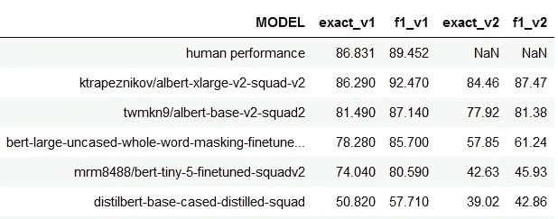

# 你应该使用哪种版本的 BERT 来完成你的 QA 任务？

> 原文：<https://towardsdatascience.com/which-flavor-of-bert-should-you-use-for-your-qa-task-6d6a0897fb24?source=collection_archive---------27----------------------->

## 问答用 BERT 模型的选择和基准测试指南


埃文·丹尼斯在 [Unsplash](https://unsplash.com?utm_source=medium&utm_medium=referral) 上的照片

由于大量的开源自然语言处理库、精选数据集和迁移学习的力量，制作智能聊天机器人从未如此简单。用 Transformers 库构建一个基本的问答功能可以像这样简单:

```
from transformers import pipeline# Context: a snippet from a Wikipedia article about Stan Lee
context = """
    Stan Lee[1] (born Stanley Martin Lieber /ˈliːbər/; December 28, 1922 - November 12, 2018) was an American comic book 
    writer, editor, publisher, and producer. He rose through the ranks of a family-run business to become Marvel Comics' 
    primary creative leader for two decades, leading its expansion from a small division of a publishing house to
    multimedia corporation that dominated the comics industry.
    """nlp = pipeline('question-answering')
result = nlp(context=context, question="Who is Stan Lee?")
```

这是输出结果:

```
{'score': 0.2854291316652837,
 'start': 95,
 'end': 159,
 'answer': 'an American comic book writer, editor, publisher, and producer.'}
```

嘣！有用！

然而，如此低的信心分数有点令人担忧。稍后，当我们谈到 BERT 检测不可能的问题和不相关的上下文的能力时，您会看到这是如何发挥作用的。

但是，花一些时间为您的任务选择正确的模型将确保您从对话代理那里获得尽可能好的开箱即用性能。您对语言模型和基准数据集的选择将决定您的聊天机器人的性能。

BERT(变压器的双向编码表示)模型在复杂的信息提取任务中表现非常好。他们不仅能捕捉单词的意思，还能捕捉上下文。在选择模型(或满足于默认选项)之前，您可能希望评估候选模型的准确性和资源(RAM 和 CPU 周期),以确保它确实符合您的预期。在本文中，您将看到我们如何使用[斯坦福问答数据集(SQuAD)](https://rajpurkar.github.io/SQuAD-explorer/) 对我们的 QA 模型进行基准测试。你可能想使用许多其他好的问答数据集，包括微软的 [NewsQA](https://www.microsoft.com/en-us/research/project/newsqa-dataset/) 、 [CommonsenseQA](https://www.tau-nlp.org/commonsenseqa) 、 [ComplexWebQA](https://www.tau-nlp.org/compwebq) 以及许多其他数据集。为了最大限度地提高应用程序的准确性，您需要选择一个基准数据集来代表您在应用程序中预期的问题、答案和上下文。

拥抱脸变形金刚库有一个庞大的预训练模型目录，用于各种任务:情感分析、文本摘要、释义，当然还有问题回答。我们从可用的[模型](https://huggingface.co/models?filter=question-answering)库中选择了几个候选问答模型。你瞧，他们中的许多人已经在阵容数据集中进行了微调。厉害！以下是我们将要评估的几个小队微调模型:

*   蒸馏车间
*   Bert-large-uncased-whole-word-masking-fine tuned-squad
*   ktrapeznikov/Albert-xlarge-v2-squad-v2
*   MRM 8488/Bert-tiny-5-fine tuned-squad v2
*   twmkn 9/艾伯特基地 v2 小队 2

我们用我们选择的模型对两个版本的 SQuAD(版本 1 和版本 2)进行了预测。它们之间的区别在于，SQuAD-v1 只包含可回答的问题，而 SQuAD-v2 也包含不可回答的问题。为了说明这一点，让我们看看下面来自 SQuAD-v2 数据集的示例。问题 2 的答案不可能从维基百科给出的上下文中得出:

> ***问题 1:*** *“诺曼底位于哪个国家？”*
> 
> ***问题 2:*** *“谁在 1000 年和 1100 年给诺曼底命名”*
> 
> ***上下文:*** *《诺曼人(Norman:Nourmands；法语:诺曼第人；拉丁语:Normanni)是在 10 世纪和 11 世纪把他们的名字给法国的诺曼底地区的人。他们是北欧海盗的后裔(“Norman”来源于“Norseman”)，这些来自丹麦、冰岛和挪威的袭击者和海盗在他们的首领罗洛的带领下，同意宣誓效忠西法兰克王国国王查理三世。通过几代人的同化和与本地法兰克人和罗马-高卢人的混合，他们的后代逐渐与西法兰克王国以加洛林文化为基础的文化融合。诺曼人独特的文化和种族身份最初出现在 10 世纪上半叶，并在随后的几个世纪中继续发展*

我们的理想模型应该能够很好地理解上下文，从而得出答案。

让我们开始吧！

要在 Transformers 中定义模型和标记器，我们可以使用自动类。在大多数情况下，Automodels 可以从模型名称中自动派生设置。我们只需要几行代码来设置它:

```
from tqdm import tqdm
from transformers import AutoTokenizer, AutoModelForQuestionAnsweringmodelname = 'bert-large-uncased-whole-word-masking-finetuned-squad'tokenizer = AutoTokenizer.from_pretrained(modelname)
model = AutoModelForQuestionAnswering.from_pretrained(modelname)
```

我们将使用人类水平的性能作为我们的准确性目标。小组排行榜为这项任务提供了人类水平的表现，即找到准确答案的准确率为 87%，f1 分数为 89%。

你可能会问，“他们怎么知道人类的表现是什么？”以及“他们在谈论什么人类？”那些斯坦福的研究人员很聪明。他们只是使用了标记小队数据集的相同众包人类。对于测试集中的每个问题，他们让多个人提供备选答案。对于人类评分，他们只留下其中一个答案，并使用他们用来评估机器模型的相同文本比较算法，检查它是否与其他任何答案匹配。这个“漏掉一个人”数据集的平均准确度决定了机器要争取的人类水平分数。

为了在我们的数据集上运行预测，首先我们必须将小队下载的文件转换成计算机可解释的特征。幸运的是，Transformers 库已经有了一套方便的函数来做这件事:

```
from transformers import squad_convert_examples_to_features
from transformers.data.processors.squad import SquadV2Processorprocessor = SquadV2Processor()
examples = processor.get_dev_examples(path)
features, dataset = squad_convert_examples_to_features(
    examples=examples,
    tokenizer=tokenizer,
    max_seq_length=512,
    doc_stride = 128,
    max_query_length=256,
    is_training=False,
    return_dataset='pt',
    threads=4, # number of CPU cores to use
)
```

我们将使用 PyTorch 及其 GPU 功能(可选)进行预测:

```
import torch
from torch.utils.data import DataLoader, SequentialSamplereval_sampler = SequentialSampler(dataset)
eval_dataloader = DataLoader(dataset, sampler=eval_sampler, batch_size=10)all_results = [] def to_list(tensor):
    return tensor.detach().cpu().tolist()for batch in tqdm(eval_dataloader):
    model.eval()
    batch = tuple(t.to(device) for t in batch) with torch.no_grad():
        inputs = {
            "input_ids": batch[0],
            "attention_mask": batch[1],
            "token_type_ids": batch[2]
        } example_indices = batch[3] outputs = model(**inputs)  # this is where the magic happens for i, example_index in enumerate(example_indices):
            eval_feature = features[example_index.item()]
            unique_id = int(eval_feature.unique_id)
```

重要的是，模型输入应该针对 DistilBERT 模型(如`distilbert-base-cased-distilled-squad`)进行调整。我们应该排除“token_type_ids”字段，因为与 BERT 或 ALBERT 相比，DistilBERT 实现有所不同，以避免脚本出错。其他一切都将保持不变。

最后，为了评估结果，我们可以应用 Transformers 库中的`squad_evaluate()`函数:

```
from transformers.data.metrics.squad_metrics import squad_evaluateresults = squad_evaluate(examples, 
                         predictions,
                         no_answer_probs=null_odds)
```

以下是由 squad_evaluate 生成的示例报告:

```
OrderedDict([('exact', 65.69527499368314),
             ('f1', 67.12954950681876),
             ('total', 11873),
             ('HasAns_exact', 62.48313090418353),
             ('HasAns_f1', 65.35579306586668),
             ('HasAns_total', 5928),
             ('NoAns_exact', 68.8982338099243),
             ('NoAns_f1', 68.8982338099243),
             ('NoAns_total', 5945),
             ('best_exact', 65.83003453213173),
             ('best_exact_thresh', -21.529870867729187),
             ('best_f1', 67.12954950681889),
             ('best_f1_thresh', -21.030719757080078)])
```

现在，让我们比较两个基准数据集(SQuAD-v1 和 SQuAD-v2)生成的预测的精确答案准确度分数(“精确”)和 f1 分数。所有模型在没有否定的数据集(SQuAD-v1)上都表现得更好，但我们确实有一个明显的赢家(`ktrapeznikov/albert-xlarge-v2-squad-v2`)。总的来说，它在两个数据集上都表现得更好。另一个好消息是，我们为这个模型生成的报告与作者发布的[报告](https://huggingface.co/ktrapeznikov/albert-xlarge-v2-squad-v2)完全匹配。精确度和 f1 与人类水平的性能稍有差距，但对于像 SQuAD 这样具有挑战性的数据集来说，这仍然是一个很好的结果。



表 1:v1 和 v2 组 5 个模型的准确度分数

我们将在下表中比较 SQuAD-v2 预测的完整报告。看起来`ktrapeznikov/albert-xlarge-v2-squad-v2`在两个任务上做得几乎一样好:(1)识别可回答问题的正确答案，以及(2)剔除可回答问题。有趣的是，`bert-large-uncased-whole-word-masking-finetuned-squad`在第一项任务(可回答的问题)中提供了一个显著(大约 5%)的预测准确性提升，但在第二项任务中完全失败。


表 2:不可能的问题的单独准确度分数

我们可以通过调整最佳 f1 分数的零阈值来优化模型，以更好地识别无法回答的问题。记住，最佳 f1 阈值是由 squad_evaluate 函数(`best_f1_thresh`)计算的输出之一。下面是当我们应用来自 SQuAD-v2 报告的`best_f1_thresh`时，SQuAD-v2 的预测指标是如何变化的:


表 3:调整后的准确度分数

虽然这种调整有助于模型更准确地识别无法回答的问题，但这是以牺牲已回答问题的准确性为代价的。这种权衡应该在您的应用程序环境中仔细考虑。

让我们用变形金刚 QA 管道，带着自己的几个问题，试驾三款最好的车型。我们从维基百科一篇关于计算语言学的文章中挑选了下面这段话作为一个看不见的例子:

```
context = '''
Computational linguistics is often grouped within the field of artificial intelligence 
but was present before the development of artificial intelligence.
Computational linguistics originated with efforts in the United States in the 1950s to use computers to automatically translate texts from foreign languages, particularly Russian scientific journals, into English.[3] Since computers can make arithmetic (systematic) calculations much faster and more accurately than humans, it was thought to be only a short matter of time before they could also begin to process language.[4] Computational and quantitative methods are also used historically in the attempted reconstruction of earlier forms of modern languages and sub-grouping modern languages into language families.
Earlier methods, such as lexicostatistics and glottochronology, have been proven to be premature and inaccurate. 
However, recent interdisciplinary studies that borrow concepts from biological studies, especially gene mapping, have proved to produce more sophisticated analytical tools and more reliable results.[5]
'''
questions=['When was computational linguistics invented?',
          'Which problems computational linguistics is trying to solve?',
          'Which methods existed before the emergence of computational linguistics ?',
          'Who invented computational linguistics?',
          'Who invented gene mapping?']
```

请注意，根据给定的上下文，最后两个问题是不可能回答的。以下是我们从测试的每个模型中获得的结果:

```
Model: bert-large-uncased-whole-word-masking-finetuned-squad
-----------------
Question: When was computational linguistics invented?
Answer: 1950s (confidence score 0.7105585285134239)

Question: Which problems computational linguistics is trying to solve?
Answer: earlier forms of modern languages and sub-grouping modern languages into language families. (confidence score 0.034796690637104444)

Question: What methods existed before the emergence of computational linguistics?
Answer: lexicostatistics and glottochronology, (confidence score 0.8949566496998465)

Question: Who invented computational linguistics?
Answer: United States (confidence score 0.5333964470000865)

Question: Who invented gene mapping?
Answer: biological studies, (confidence score 0.02638426599066701)

Model: ktrapeznikov/albert-xlarge-v2-squad-v2
-----------------
Question: When was computational linguistics invented?
Answer: 1950s (confidence score 0.6412413898187204)

Question: Which problems computational linguistics is trying to solve?
Answer: translate texts from foreign languages, (confidence score 0.1307672173261354)

Question: What methods existed before the emergence of computational linguistics?
Answer:  (confidence score 0.6308010582306451)

Question: Who invented computational linguistics?
Answer:  (confidence score 0.9748902345310917)

Question: Who invented gene mapping?
Answer:  (confidence score 0.9988990117797236)

Model: mrm8488/bert-tiny-5-finetuned-squadv2
-----------------
Question: When was computational linguistics invented?
Answer: 1950s (confidence score 0.5100432430158293)

Question: Which problems computational linguistics is trying to solve?
Answer: artificial intelligence. (confidence score 0.03275686739784334)

Question: What methods existed before the emergence of computational linguistics?
Answer:  (confidence score 0.06689302592967117)

Question: Who invented computational linguistics?
Answer:  (confidence score 0.05630986208743849)

Question: Who invented gene mapping?
Answer:  (confidence score 0.8440988190788303)

Model: twmkn9/albert-base-v2-squad2
-----------------
Question: When was computational linguistics invented?
Answer: 1950s (confidence score 0.630521506320747)

Question: Which problems computational linguistics is trying to solve?
Answer:  (confidence score 0.5901262729978356)

Question: What methods existed before the emergence of computational linguistics?
Answer:  (confidence score 0.2787252009804586)

Question: Who invented computational linguistics?
Answer:  (confidence score 0.9395531361082305)

Question: Who invented gene mapping?
Answer:  (confidence score 0.9998772777192002)

Model: distilbert-base-cased-distilled-squad
-----------------
Question: When was computational linguistics invented?
Answer: 1950s (confidence score 0.7759537003546768)

Question: Which problems computational linguistics is trying to solve?
Answer: gene mapping, (confidence score 0.4235580072416312)

Question: What methods existed before the emergence of computational linguistics?
Answer: lexicostatistics and glottochronology, (confidence score 0.8573431178602817)

Question: Who invented computational linguistics?
Answer: computers (confidence score 0.7313878935375229)

Question: Who invented gene mapping?
Answer: biological studies, (confidence score 0.4788379586462099)
```

如您所见，很难根据单个数据点来评估模型，因为结果遍布整个地图。虽然每个模型都给出了第一个问题的正确答案(“计算语言学是什么时候发明的？”)，其他问题被证明更难。这意味着，即使我们最好的模型也可能需要在自定义数据集上再次微调，以进一步改进。

# 带走:

*   开源预训练(和微调！)模型可以启动你的自然语言处理项目。
*   在做任何事情之前，如果可能的话，试着复制作者报告的原始结果。
*   对你的模型进行准确性基准测试。即使是在完全相同的数据集上进行微调的模型，其性能也可能大不相同。