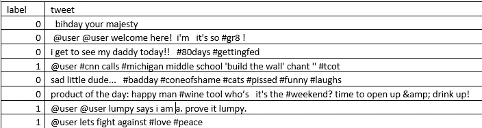
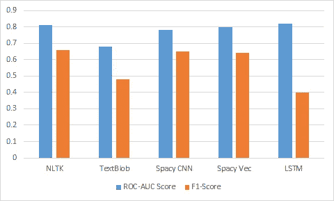

# 哪个是最好的 NLP 库？

> 原文：<https://towardsdatascience.com/which-is-the-best-nlp-d7965c71ec5f?source=collection_archive---------27----------------------->

## 通用 NLP 库的实时评估(带代码片段)

艾拉·迪恩在 [Unsplash](https://unsplash.com?utm_source=medium&utm_medium=referral) 上的照片

自从我开始从事 NLP(自然语言处理)工作以来，我一直想知道哪一个是最好的 NLP 库，可以满足我们大多数常见的 NLP 需求。虽然确实不存在一刀切的做法，库的选择将取决于手头的任务，但我仍然很好奇，如果不同的库针对一个非常简单的任务进行基准测试，它们会如何进行比较。

考虑到这一点，我戴上开发人员的帽子，开始使用各种库编写 python 代码，并针对一个非常常见的任务对它们进行评估。为了简单起见，我决定使用 Twitter 文本分类问题进行评估。今天最常见的 NLP 库是 NLTK、Spacy、WordBlob、Gensim，当然还有使用 LSTM(长短期记忆)或 GRU(门控循环单元)细胞的深度神经网络架构。

# 问题陈述

我使用的数据集由一组 Twitter 消息组成。一些推文被贴上了种族主义的标签，而另一些则没有。这是一个经典的基于监督学习的二分类问题。我们的工作是基于不同的库创建模型，并使用它们将以前未见过的文本分类为种族主义或非种族主义。

以下是一些可用的推文:

标签 1 表示该推文是种族主义的，标签 0 表示不是。

为了简洁起见，我将只关注代码的关键部分。完整代码，请随意访问我的 GitHub [机器学习](https://github.com/rahulbtchrya/MachineLearning)库。因为我已经清理了数据集并执行了 EDA(探索性数据分析),所以我也不会在这里讨论这些细节。

这里我将重点介绍五个不同的库— *NLTK* 、 *WordBlob* 、CNN 的 *Spacy、*document vectors*的 *Spacy，以及最后一个具有*双向 LSTM* 单元的深度神经网络模型。**

我将使用 [ROC-AUC](https://scikit-learn.org/stable/modules/generated/sklearn.metrics.roc_auc_score.html) 得分和[F1-得分](https://scikit-learn.org/stable/modules/generated/sklearn.metrics.f1_score.html)作为我的评估指标。

所以让我们开始吧。

# **NLTK**

让我们从 [NLTK](https://www.nltk.org/) 包开始。在这里，我们使用 NLTK 库对 tweets 进行标记化和词条化，使用 [Gensim 的](https://pypi.org/project/gensim/) *Word2Vec* 模型创建单词向量。最后使用 *XGBoost 分类器*模型进行训练和推理。下面是包含代码相关部分的代码片段

> 使用这种技术，我能够获得 ROC-AUC 分数为 **0.8** 和 F1 分数为 **0.68**

# 文本 Blob

TextBlob 是一个初学者友好的 NLP 库，提供了很多很酷的特性。它还提供了内置的文本分类器。然而，我发现 TextBlob 比我用过的其他库要慢很多。

出于我们的目的，我们将使用 TextBlob 的内置 *DecisionTreeClassifier* 。下面是代码片段:

> 使用这种技术，我能够得到 ROC-AUC 分数为 **0.68** 和 F1 分数为 **0.46**

# CNN 的空间

Spacy 是 NLP 最受欢迎和使用最广泛的库之一，提供了非常强大的特性。它提供了一个名为 *textcat* 的内置文本分类器，可以作为默认的管道组件使用。 *textcat* 组件支持 *BOW* (文字袋)、S *imple-CNN* (卷积神经网络)和 *Ensemble* 架构。

在我们的例子中，我们将使用*简单 cnn* 架构。

> 在这种情况下，我的 ROC-AUC 得分为 **0.78** ，F1 得分为 **0.66**

# 文档向量空间

在这个例子中，我们将继续使用 Spacy，但不是使用它的内置文本分类器，而是使用 Spacy 来生成*文档向量*，然后将这些向量提供给 XGBoost 分类器。让我们看看这是否能提高我们的分数。

> 这里我们得到的 ROC-AUC 分数为 **0.8** 和 F1-分数为 **0.64**

# 具有 LSTM 细胞的深度神经网络

最后，我们将使用双向 LSTM 细胞创建一个神经网络模型。我们将使用 TensorFlow 的 [Keras](https://keras.io/) 库，并使用它的特性，如标记化和序列填充

> 这里我们得到 ROC-AUC 分数为 **0.82** 和 F1 分数为 **0.41**

# 结论

现在让我们来比较一下分数

模型的 ROC_AUC 得分非常相似。看看 F1 的分数，似乎 NLTK 和 Spacy 最适合这份工作。然而，使用各种优化技术和超参数调整，尤其是基于 LSTM 的模型，绝对有可能进一步改进模型。

以上所有例子的完整代码都可以在我的 GitHub [机器学习](https://github.com/rahulbtchrya/MachineLearning)库中找到。

经过预先训练的模特最近引起了很大的轰动。随着最近 OpenAI 的 GPT3 的发布，兴奋程度达到了历史最高水平。我很好奇**他们**会如何执行我们简单的文本分类任务。

这就是我接下来要尝试的。请继续关注这个空间，了解更多信息。