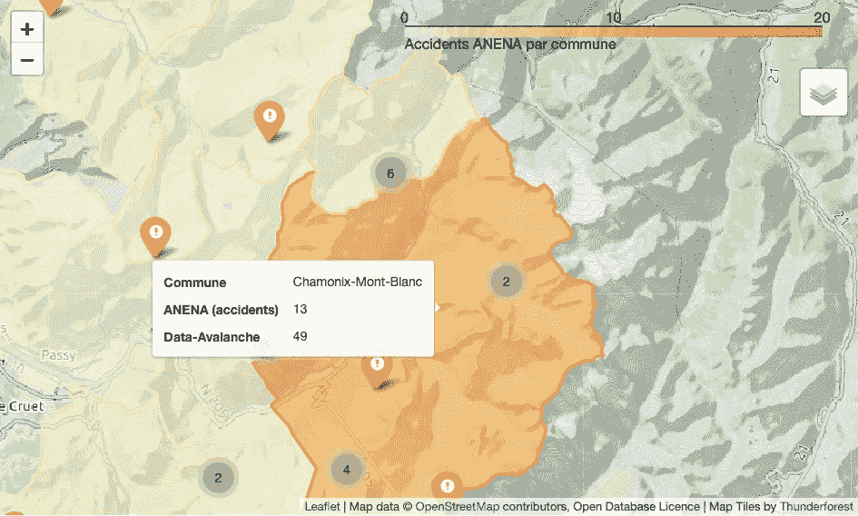
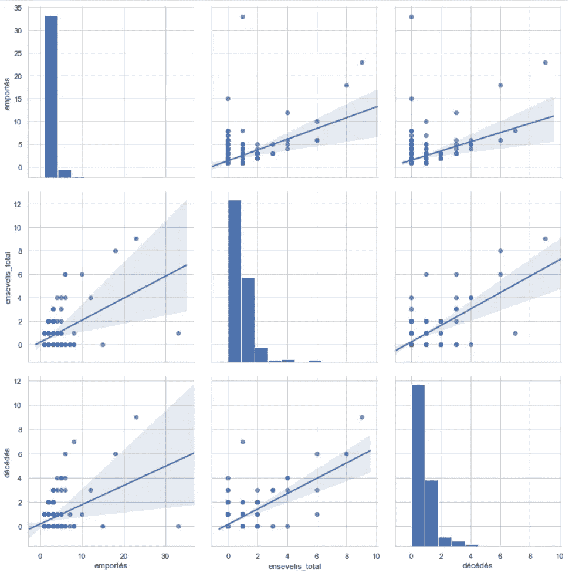
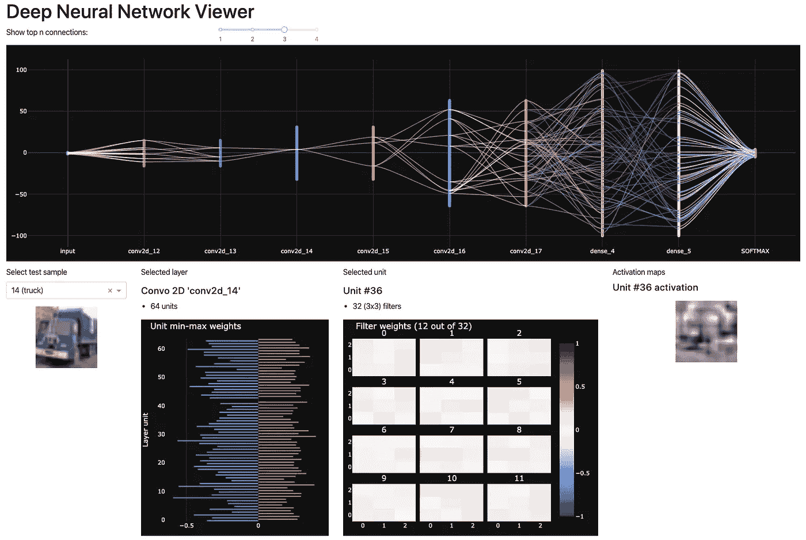

# 我应该为我的 Python 仪表板使用哪个库？

> 原文：<https://towardsdatascience.com/which-library-should-i-use-for-my-dashboard-c432726a52bf?source=collection_archive---------11----------------------->

## 从笔记本中的早期原型，到生产

谈到数据可视化，有许多可能的工具 Matplotlib、Plotly、Bokeh…哪一个适合我在笔记本电脑中的短期目标，哪一个是长期生产中的好选择？生产是什么意思？

现在你已经有了一个很好的机器学习模型，或者你已经完成了一些数据挖掘或分析，你需要呈现和推广这个惊人的工作。最初，您可能会重复使用一些笔记本来制作一些图表……但很快，同事或客户就会要求访问数据，或者要求其他视图或参数。你该怎么办？应该使用哪些工具和库？对于我工作的所有阶段，有没有一个适合所有人的解决方案？

数据可视化的范围非常广泛，从用简单的图表显示数据到包含在报告中，再到复杂的交互式仪表板。第一个是任何了解 Excel 的人都可以接触到的，而后者更像是一个软件产品，可能需要完整的软件开发周期和方法。

在这两种极端情况之间，数据科学家面临许多并非微不足道的选择。这篇文章提供了这个过程中会遇到的一些问题，以及一些提示和答案。选择的起点是 Jupiter 笔记本中的 Python，目标是生产中的 Web 仪表板。


到目标 [Pixabax](https://www.pexels.com/fr-fr/photo/amusement-brouiller-but-centre-d-une-cible-262438/)

# 我需要哪个图表类型的库？

获得正确的图表类型始终是我们考虑的第一个问题。

你对数据可视化有一个很棒的新想法，你的老板喜欢旭日图，但是这对于你正在使用的图表库可行吗？

Python 中的主流开源图表库 [Matplotlib](https://matplotlib.org/gallery/index.html) 与 [Seaborn](https://seaborn.pydata.org/examples/index.html) 、 [Plotly](https://plotly.com/python/plotly-fundamentals/) 、 [Bokeh](https://docs.bokeh.org/en/latest/docs/gallery.html) ，或多或少支持同一组图表类型。它们还支持像素矩阵，允许像显示单词云这样的扩展。

以下是从 word cloud Python 库文档中绘制 Word Cloud 的示例:

```
import numpy as np
import matplotlib.pyplot as plt
from wordcloud import WordCloud
​
text = "square"
x, y = np.ogrid[:300, :300]
​
mask = (x - 150) ** 2 + (y - 150) ** 2 > 130 ** 2
mask = 255 * mask.astype(int)
​
wc = WordCloud(background_color="white", repeat=True, mask=mask)
wc.generate(text)
​
plt.axis("off")
plt.imshow(wc, interpolation="bilinear")
plt.show()
```

## 网络图

网络图是一个特定的类别，上面列出的库本身并不处理它。用于网络的主要 Python 库是 [NetworkX](https://networkx.github.io/)) 。默认情况下，NetworkX 使用 Matplotlib 作为绘图的后端。Graphviz (Pygraphviz)是事实上的标准图形绘制库，可以与 NetworkX 耦合。用相当多的几行代码，你也可以用 Plotly 来画 graph⁴.NetworkX 和散景的整合也是 documented⁵.

## 地理图

地理位置信息和地图也是数据可视化的一个特定子领域。绘制地图面临许多挑战，其中包括:

*   处理大而复杂的轮廓(例如国家边界)
*   根据缩放显示更多或更少的信息，这也称为细节层次。这种影响同时也影响了图形的可读性，以及转化为加载延迟和内存占用的复杂性
*   地理坐标的处理，即从非欧几里得空间到 2D 欧几里得空间的单个或多个投影(例如，具有给定 UTM 区的 UTM 的经纬度)
*   多种文件格式的信息可用性，即使存在事实上的标准，如 GeoJSON 和 Shape-file

根据所选的绘图库，您可能需要做少量或大量的预处理。处理地理坐标的常见开源库是 [Proj](https://proj.org/) ，以及 [GDAL](https://gdal.org/) ，用于处理文件格式以及从格式或坐标到其他上下文的转换。

Matplotlib 不直接支持绘制地图，它依赖于像素矩阵(光栅图像),如 gallery⁶.中所述但这是一个 *pis-aller* ，你不希望这样做，但如果你的唯一目标是一个静态图像。

Plotly 正在演示基于 [Mapbox](https://www.mapbox.com/) 的 plots⁷地图。许多功能是可用的，但至少有一个功能是缺失的，即散点图中细节层次的管理。

Bokeh 对地图有一些支持，包括谷歌 maps⁸的集成，但它似乎很粗糙。



带有区域(等高线)、标记簇、悬停信息的地图，由作者用 leav 创建

[leaf](https://github.com/python-visualization/folium)是包装[leaf](https://leafletjs.com)Javascript 库的 Python 库。传单用于许多合作和商业网站，例如[开放街道地图](http://www.openstreetmap.org)。Folium 在开放数据上绘制地图非常有效。

地理数据操作的开源参考是来自 OSGeo 的 [QGIS](https://qgis.org) 。这是一个桌面应用程序，但它包括一个 Python 控制台，也可以直接使用 Pyqgis API⁹.

## 数据帧

Pandas 及其数据框架是 Python 中数据科学的必备工具。对图表创建和仪表板有什么影响？

一方面，熊猫数据帧和系列有一个情节 API。默认情况下，它依赖 Matplotlib 作为后端。然而，Plotly 作为熊猫的图形后端是可用的⁰.Github 项目也支持散景。

另一方面，熊猫图可能不符合您的要求，您想知道除了使用列和系列作为向量之外，如何在图中使用数据框架。Plotly Express 具有这种支持面向列的数据的能力。

## 最后一招，d3.js

如果这些库和它们的扩展都不能处理你正在寻找的图表，那么你可以切换到 [d3.js](https://d3js.org/) ，它是浏览器的基本图表库。这意味着你将离开 Python 的世界，进入 Javascript 的领域。可能性和定制是巨大的，如示例图库所示。然而，您将需要处理其他库中提供的图形的许多方面:轴、图例、交互性…



用 Matplotly 和 Seaborn 设计的散布矩阵

# 如何构建包含多个图表的视图？

在 dataviz 的设计中，图表的布局或组成需要多个图表来显示一些特性。你可能已经喜欢上了 Matplotlib 的支线剧情的优缺点，从奇怪的命令开始，比如“` plt.subplot(1，2，1)`”或者更奇怪的等价命令“` plt.subplot(121)`”。如果这足以实现您的目标，我还是建议使用替代的、更简洁的“PLT . subplots()”API，它返回一个数字和一个轴数组。无论如何，你可能会感到不仅交互性受到限制(这将在下一节中讨论)，而且布局功能也受到限制。

## 布局的增强

Matplotlib 允许不均匀的宽度和高度，使用调用 Figure.add_subplots 方法，如"`fig.add_subplot(3, 1, (1, 2))`"制作一个跨越图形⁴.上 2/3 的子图 Seaborn 引入了一个增强功能，即散射矩阵⁵.

Plotly 允许类似的能力，包括不均匀的子图。然而，我发现 API 相当有限。例如，不能设置子图标题的字体大小或共享图例。Bokeh 在⁶.也有类似能力

Plotly，Express API，更进一步，用边缘概率图作为直方图或⁷，还有一个同步的概览-详细图表，称为“范围滑块⁸".”这将我们引向图形的交互性，这将在下一节中详细介绍。

## 前进的道路

但是如果这些布局助手不足以达到我的目的呢？可能的答案有很多，从 Plotly Dash 解决方案到完整的 HTML 布局或使用 d3.js 的 SVG 定制设计。

Plotly Dash 提出了一个中间解决方案，在这个方案中，你可以坚持使用 Python，但是可以生成一些比绘图库更复杂、更具交互性的仪表板。尽管如此，它要求你有一些基本的 HTML 知识，并且迟早会深入到层叠样式表(CSS)中。



使用 Dash、Plotly 和 Dash-Bootstrap-Components 的仪表板布局和几个绘图和 HTML 元素

# 我如何与我的图表互动？

你对图表非常满意，但它看起来非常静态，甚至没有缩放！

交互性是如此多不同的东西。它从缩放和平移等常见操作开始。下一步是同步图表:在共享一个轴的几个图表上同时应用缩放和平移。你也可能对两幅图上的同步选择感兴趣，也称为刷图(例如在散景⁹).)Matplolib 对所有的渲染引擎都有这样的交互性，但是在笔记本⁰.中然而，有一个基于 Matplotlib 的解决方案， [**mpld3**](https://github.com/mpld3/mpld3) 正在处理这个问题，并可能提供您需要的一切。然而，趋势是使用更新的库，如 Plotly 或 Bokeh，它们在笔记本中“开箱即用”。

然后是动态注释。它们包括从鼠标位于标记上时的悬停信息到线条图高亮显示。关于 hover，无论使用什么库(带 Mpld3 和插件的 Matplotlib，Plotly，Bokeh ),都意味着在每个标记上附加一个 HTML 文档 div，可能还有一些 CSS。


2D 特征平面图中 MNIST 数字(784 像素)的 UMAP 投影散景图，带有包含原始图像作者的悬停信息

更复杂的交互与过滤或查询数据有关。当过滤器修改范围时，它可以接近缩放功能(例如:时间序列的每日/每周/每月选择器)，或者一系列方面的选择器，或者甚至更复杂的关联。选择器在 Plotly 中作为自定义控件提供，在 Bokeh 中作为小部件提供。

常见的绘图库提供了基本的交互功能，直到创建一些小部件，但是，对于高级布局，我建议直接切换到 Plotly Dash，它更加通用。

# 我的 dataviz 仪表盘渲染流畅吗？

仪表板越复杂或数据越大，处理的时间就越长，因此呈现的时间也就越长。等待几秒钟来查看静态图可能没问题。当图形与小部件和控件交互时，等待超过 1 秒是不允许的。

如果流动性消失了，你有四个主要的解决方案，并且越来越复杂:

*   用更少的绘图和控件简化仪表板。这可能没问题，但是你应该首先考虑为什么需要这样的复杂性？
*   简化数据，即显示更少的数据或更小的粒度。这可以在特征和准确性之间提供良好的折衷。这将导致下一个解决方案…
*   离线预处理数据，以预组装仪表板中显示的数据。这可能意味着存储新的序列或新的表，最终导致与数据管理相关的其他问题。最后，您将进行更多的数据工程，并且可能会因为两个数据、太多的表而陷入死胡同。这个死胡同的解决方案是更多的数据工程和…
*   专用服务器中的在线处理和 API 的设计。

一个带有 API 的服务器不是你首先想到的，但是你最终会比你想象的更快地处理这个软件项目。预测比拖延更好，直到没有其他解决方案，项目的最后期限快到了。

定义 API 通常涉及几个团队和技能:数据科学家定义为什么，数据工程师定义什么，基础设施工程师定义如何，包括性能、安全性、持久性和完整性。

Plotly Dash 允许初始 API，因为它是基于 Flask 框架的。参见 Dash 文档，了解与 Flask 应用程序的集成，Flask 应用程序定义了自定义 Flask 路由，可提供数据，即 API。仍然没有适当的 API 访问管理，包括身份验证。在后一方面，Dash 是非常有限的⁴.

# 在开发 dataviz 的过程中，我感觉自己很快/很慢/不知道

开发和发布需要你付出多少努力？

一些工具是有效的，它们提供了预期的结果，但是效率不高，要得到结果需要花费大量的时间。例如，d3.js 被认为是一个非常强大和完整的数据可视化和图表库，但同时，它需要处理许多在更高抽象的库中默认可用的东西。

生产力不仅来自于使用正确的抽象级别，还来自于一个易于使用且有良好文档记录的 API。我想说，调查的 Python 图表库没有一个是容易掌握的。

Matplotlib 的 API 在处理轴、格式(标签)时相当复杂，它并不总是一致的，而且相当多余。例如，参见上面关于“` plt.subplot()`”的注释。这不是唯一的例子，例如，有一个子例程“` plt.xlabel()`”相当于 Axes 对象上的方法“` ax.set_xlabel()`”。

Plotly 的 API 并不是更好，首先，您必须在两个 API 集之间进行选择:Express 集，它非常简单但有限，主要针对数据帧；以及图形对象集，它更完整，是 Express 集的补充，但没有 Express 中的一些高级功能。然后你将不得不处理那些对我来说很难理解的文件。使用 Plotly 网站内部或网络搜索引擎进行搜索很少会找到您要找的 API。您可能必须处理 JSON 中底层数据模型的文档。

Bokeh API 可能更精简，文档也更好，但是有一些奇怪的东西，比如绘制折线图和相关标记的两个单独的指令。

## 我真的需要一个漂亮的 web 应用程序，我应该害怕它吗？

您的仪表板是成功的，将作为产品在您的组织内部部署，供客户使用，甚至直接在互联网上公开。

作为一名数据科学家，您缺少处理这些问题和获得软件专家帮助的技能。然而，你会被问到这个开发的努力和范围是什么。这在很大程度上取决于产品化的途径、在那里使用的框架，以及到目前为止您一直使用的框架。

# 使用(部分)当前框架投入生产

Plotly 独立图形可以导出为静态 HTML。散景提供了一些嵌入⁵.的方案带有 Mpld3 的 Matplotlib 有一个 HTML 输出⁷.然而，这个解决方案是针对插图而不是仪表板的。

Plotly Dash 在某些情况下可能会作为主要的 Web 应用程序或嵌入式小工具投入生产。如前所述，在进入在线生产之前，您需要检查系统的安全性。关于安全性，作为一名数据设计人员，您主要需要检查您只公开了想要的数据，而不是更多。


显示巴黎地铁交通的网络和地理互动图 [Data-Publica](http://labs.data-publica.com/ratp/)

## 使用单页应用程序投入生产

今天，我们使用的大多数 Web 应用程序都基于一种称为单页应用程序(SPA)的模式:应用程序在 Web 浏览器中加载一次，然后通过一些异步 API 与服务器进行交互，而无需重新加载网页。这就是我们所有人现在对一个好的 Web 应用程序的期望。

SPA 有两个独立的组件:浏览器端的 Javascript 应用程序，带有 Angular 或 React.js 之类的框架；服务器端的应用程序或服务，可以用许多框架和语言编写:Java、C#、PHP、Javascript……甚至 Python。

Dash 已经做了一部分。事实上，Dash 正在使用领先的浏览器端框架 React.js，并且在服务器端基于 Flask 和 Python。但是如上所述，你可能会达到一些极限。

除了通过 Dash 的转换，Plotly 和 Bokeh 还有另一个优势:它们在 Javascript 中也可以作为 [Plotly JS](https://plotly.com/javascript/) (和一个 React.js 包装器包装器⁶)， [Bokeh JS](https://docs.bokeh.org/en/latest/docs/dev_guide/bokehjs.html) 。事实上，Python 版本的 Plotly 是 Javascript 的包装器。这意味着给定 Python 中基于 Plotly、Dash 或 Bokeh 的一些绘图或仪表板，大多数概念和图表属性可以在等效的 Javascript 实现中重用。

# 结论

在这篇文章中，我们已经为数据可视化仪表板铺平了道路，从笔记本中的实验，一直到生产。我们已经看到，传统的绘图库 Matplotlib 仍然具有强大的功能，并且通常是 NetworkX 和 Pandas Dataframe 等专用库的默认后端。但 Matplolib 在集成和交互性等方面也有所落后。学习另一个框架可能是一个很好的投资，会帮助你走向生产。

提出了两种可选的框架:Plotly 和 Bokeh。两者都带来了价值，因为它们比 Matplotlib 更现代。在将仪表板投入生产时，它们都有一个领先的优势:它们基于 Javascript 绘图框架，并且大部分绘图 Python 代码可以直接翻译成 Javascript 等价物。

在走向生产的道路上，Plotly 还有另一个优势:它与 Dash 集成，Dash 是一个框架，用于在坚持使用 Python 的同时将简单的仪表板开发为单页应用程序。所需的 Javascript，包括 React 组件，以及服务器 API 都由 Dash 平滑生成。

我们还看到，作为一名数据科学家或数据可视化设计者，您应该预见诸如交互性之类的需求，以及它们可能导致开发 API 来提供数据的含义。

在“ [Plotly Dash 或 React.js + Plotly.js](/plotly-dash-or-react-js-plotly-js-b491b3615512) ”中，并排比较显示了将 Dash 应用程序移植到 React.js 中的 Javascript 应用程序所需的内容，其中 Plotly.js 用于 dataviz，并由 Python 中的 Web API 提供服务。

参考

*   [1] Word clouds 带 Matplotlib 和 *word_cloud* 库，[https://a mueller . github . io/Word _ cloud/auto _ examples/single _ Word . html](https://amueller.github.io/word_cloud/auto_examples/single_word.html#sphx-glr-auto-examples-single-word-py)
*   [2] NetworkX graph plot，[https://NetworkX . github . io/documentation/stable/auto _ examples/index . html # basic](https://networkx.github.io/documentation/stable/auto_examples/index.html#basic)
*   [3] NetworkX with GraphViz，[https://NetworkX . github . io/documentation/stable/auto _ examples/pygraphviz/plot _ pygraphviz _ draw . html](https://networkx.github.io/documentation/stable/auto_examples/pygraphviz/plot_pygraphviz_draw.html)
*   [4] Plotly with NetworkX，【https://plotly.com/python/network-graphs/ 
*   [5] Bokeh 和 NetworkX，[https://docs . Bokeh . org/en/latest/docs/user _ guide/graph . html # NetworkX-integration](https://docs.bokeh.org/en/latest/docs/user_guide/graph.html#networkx-integration)
*   [6] Matplotlib 绘制地图，[https://matplotlib.org/basemap/users/examples.html](https://matplotlib.org/basemap/users/examples.html)
*   [7]阴谋地和地图[https://plotly.com/python/maps/](https://plotly.com/python/maps/)
*   [8]散景和地图，[https://docs.bokeh.org/en/latest/docs/user_guide/geo.html](https://docs.bokeh.org/en/latest/docs/user_guide/geo.html)
*   [9] Pyqgis API，[https://docs . qgis . org/3.10/fr/docs/Pyqgis _ developer _ cookbook/](https://docs.qgis.org/3.10/fr/docs/pyqgis_developer_cookbook/)
*   【10】剧情如同熊猫后端，[https://plotly.com/python/pandas-backend/](https://plotly.com/python/pandas-backend/)
*   [11]散景像熊猫后端，[https://github.com/PatrikHlobil/Pandas-Bokeh](https://github.com/PatrikHlobil/Pandas-Bokeh)
*   [12] Plotly 表示支持面向列的数据[https://plotly.com/python/wide-form/](https://plotly.com/python/wide-form/)
*   [13] D3.js 图库[https://observablehq.com/@d3/gallery](https://observablehq.com/@d3/gallery)
*   [14]关于图形布局的 Maplitlib 文档，[https://matplotlib . org/API/_ as _ gen/matplotlib . figure . html # matplotlib . figure . figure](https://matplotlib.org/api/_as_gen/matplotlib.figure.Figure.html#matplotlib.figure.Figure)
*   [15]希博恩散布矩阵，[https://seaborn.pydata.org/examples/scatterplot_matrix.html](https://seaborn.pydata.org/examples/scatterplot_matrix.html)
*   [16]散景布局，[https://docs . Bokeh . org/en/latest/docs/user _ guide/layout . html](https://docs.bokeh.org/en/latest/docs/user_guide/layout.html)
*   [17]情节地边际情节，[https://plotly.com/python/marginal-plots/](https://plotly.com/python/marginal-plots/)
*   [18] Plotly 的范围滑块，[https://Plotly . com/python/time-series/# time-series-with-range-slider](https://plotly.com/python/time-series/#time-series-with-range-slider)
*   [19]散景刷屏，[https://docs . Bokeh . org/en/latest/docs/user _ guide/quick start . html # linked-panning-and-brushing](https://docs.bokeh.org/en/latest/docs/user_guide/quickstart.html#linked-panning-and-brushing)
*   [20] Matplotlib 交互性，[https://matplotlib.org/users/interactive_guide.html](https://matplotlib.org/users/interactive_guide.html)
*   [21]阴谋地控制着，[https://plotly.com/python/#controls](https://plotly.com/python/#controls)
*   [22] Bokeh widgets，[https://docs . Bokeh . org/en/latest/docs/user _ guide/interaction/widgets . html](https://docs.bokeh.org/en/latest/docs/user_guide/interaction/widgets.html)
*   [23]阴谋地破折号整合，[https://dash.plotly.com/integrating-dash](https://dash.plotly.com/integrating-dash)
*   [24]阴谋破折号认证，参见[https://dash.plotly.com/authentication](https://dash.plotly.com/authentication)
*   [25]散景整合，[https://docs . Bokeh . org/en/latest/docs/user _ guide/embed . html # user guide-embed](https://docs.bokeh.org/en/latest/docs/user_guide/embed.html#userguide-embed)
*   [26] Plotly JS React wrapper，[https://plotly.com/javascript/react/](https://plotly.com/javascript/react/)
*   [27] Mpl3D 快速入门，[https://mpld3.github.io/quickstart.html](https://mpld3.github.io/quickstart.html)