# 你戴的是哪个面具？基于张量流和树莓 Pi 的人脸类型检测

> 原文：<https://towardsdatascience.com/which-mask-are-you-wearing-face-mask-type-detection-with-tensorflow-and-raspberry-pi-1c7004641f1?source=collection_archive---------23----------------------->

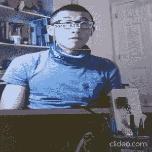

使用右下角显示的 Raspberry Pi 4 进行实时人脸检测。(图片由作者提供)

我如何使用 TensorFlow 和 Raspberry Pi 构建一个实时面罩类型检测器来判断一个人是否戴着面罩以及他们戴的是什么类型的面罩

我使用的代码和 Google Colab 笔记本在 GitHub 上有[。](https://github.com/wangyifan411/Face-Mask-Type-Detector)

# 动机

强制戴口罩的规定在世界各地的公共场合变得越来越普遍。越来越多的科学证据支持戴口罩对减少病毒传播的有效性[ [2](https://science.sciencemag.org/content/early/2020/05/27/science.abc6197?utm_campaign=SciMag&utm_source=JHubbard&utm_medium=Facebook) 、 [3](https://www.preprints.org/manuscript/202004.0203/v1?fbclid=IwAR0XQTr11EM2n3xGsxmR1FGLNnjYLZgaysxyVMgRQOjkgRdT7knoGPir4NE) ]。然而，我们也看到了一些对口罩的反弹，给执行规则的人带来了危险。在美国的一些地方，他们经常是商店的雇员，和其他人一样容易受到伤害。那么我们能让 AI 派上用场吗？

这激发了这项工作，以开发一个深度学习模型，该模型可以检测一个人是否戴着面罩，以及这个人戴着什么类型的面罩。口罩的类型与口罩的有效性有关[ [4](https://www.nytimes.com/interactive/2020/health/coronavirus-best-face-masks.html) ]。该模型有可能被部署在当地超市或学校建筑中，以控制自动门，该自动门只对戴口罩的人开放。

当我完成 Coursera 上的[深度学习专业时，我认为这是一个获得一些深度学习项目实践经验的绝佳机会，人脸面具检测是一个非常相关的话题。这篇文章主要关注从数据收集到建模训练(使用 TensorFlow 对象检测 API 和 Google Colab)以及在移动设备上部署(一个 Raspberry Pi 4)的开发流程。这不是一个循序渐进的教程，但我可以给你指出有用的资源，并提供一些设计自己的项目的技巧。](https://www.coursera.org/specializations/deep-learning)

# **数据收集**

这是一个重要但经常被忽视的步骤。俗话说“垃圾进，垃圾出”，用于训练的数据应该与目标具有相似的分布，即**网络摄像头**捕捉到的真实生活中带面具和不带面具的人脸。来自视频源的图像通常受相机质量和不同光线设置的影响。因此，我们的数据集不仅在不同性别、年龄组、种族、戴眼镜和不戴眼镜的人脸方面，而且在图像背景方面都应该是多样化的。

我决定用自制布套、外科口罩、n95 口罩和无口罩 4 个类(口罩类型)来训练模型。相应的标签有:

*   自制的
*   外科的
*   n95
*   空的

这些图片是从 Google images 和 Upslash 上收集的。我发现批量下载图片的 chrome 插件 [Fatkun](https://chrome.google.com/webstore/detail/fatkun-batch-download-ima/nnjjahlikiabnchcpehcpkdeckfgnohf?hl=en) 非常有用。但是，应该仔细选择图像，以确保数据集的质量和多样性。对于多少张图片才算足够，没有很好答案。对于一个小模型，我试着为每个类保存大约 200 张图片，它们应该代表模型可能遇到的子类。示例如下所示:

*   自制的

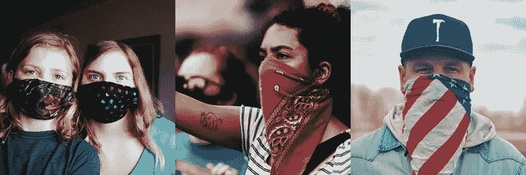

自制面具，包括布面具或覆盖物。请注意，有些口罩覆盖整个颈部。(图片来自 Upslash。从左至右依次为[莎朗·麦卡琴](https://unsplash.com/@sharonmccutcheon)、[来源](https://unsplash.com/photos/bEDh-PxXZ0c)；[洛根·韦弗](https://unsplash.com/@lgnwvr)，[来源](https://unsplash.com/photos/qQ_MidV6yfs)；[札克血管](https://unsplash.com/@zvessels55)，[来源](https://unsplash.com/photos/NuK_3ds2lWs)

*   外科的

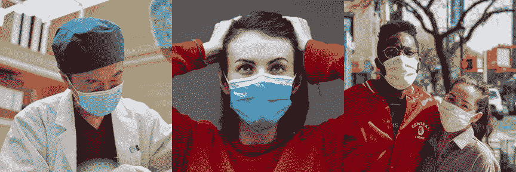

不同颜色的外科口罩。(图片来自 Upslash。从左至右依次为 [H 肖](https://unsplash.com/@hikeshaw)、[来源](https://unsplash.com/photos/XeylIhk5lDU)； [engin akyurt](https://unsplash.com/@enginakyurt) ，[来源](https://unsplash.com/photos/AS-ksEGPa2c)；[朱里安万](https://unsplash.com/@julianwan)，[来源](https://unsplash.com/photos/DWaC44FUV5o)

*   n95

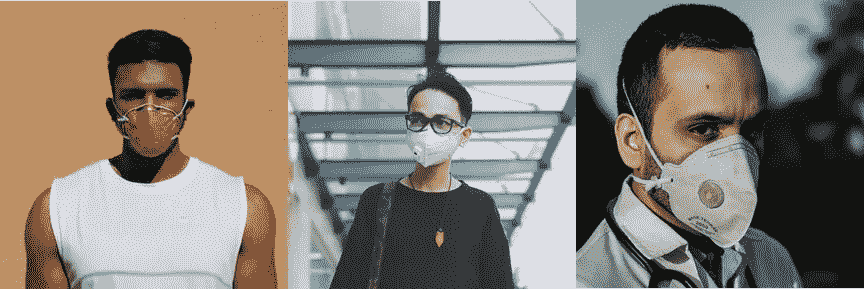

不同形状和颜色的 N95 口罩。肖像和侧面都包括在内。(图片来自 Upslash。从左至右依次为[汉德罗沙曼](https://unsplash.com/@agiantexplorer)、[来源](https://unsplash.com/photos/b2iQ-ukXlpo)； [Hiep Duong](https://unsplash.com/@duongdaihiep123) ，[来源](https://unsplash.com/photos/YLwzxM8Ssgs)；[阿什坎·弗鲁扎尼](https://unsplash.com/@ashkfor121)，[来源](https://unsplash.com/photos/IXSgwfBGnCg)

*   空的

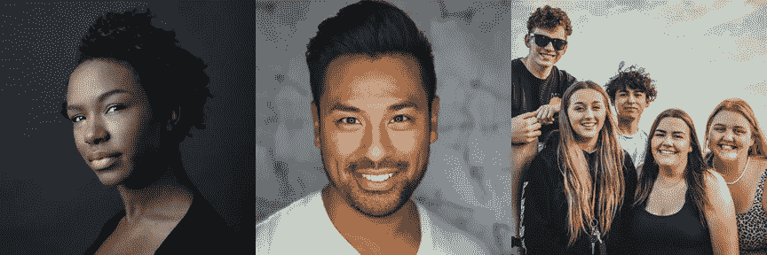

不同性别，不同年龄段，不同种族，不同背景的裸照。(图片来自 Upslash。从左至右由[大卫托德麦卡蒂](https://unsplash.com/@hoppingfrogstudios)、[来源](https://unsplash.com/photos/40Qn27ZVuH0)；[约瑟夫·冈萨雷斯](https://unsplash.com/@miracletwentyone)，[来源](https://unsplash.com/photos/iFgRcqHznqg)；[蒂姆·莫斯霍尔德](https://unsplash.com/@timmossholder)，[来源](https://unsplash.com/@timmossholder)

每节课我分别收集了 247，197，184，255 张图片，总共用了~5 个小时，期间我见过那么多带面具的脸。不幸的是，戴着外科口罩和 n95 口罩的人的照片很难找到，尤其是在 3 月(疫情早期)，我在搜索他们的时候。这些图像大多来自东亚国家或卫生工作者的库存照片。

# 建模培训

我用我的 Windows 10 笔记本电脑进行了数据预处理、测试，并将模型转换为 TensorFlow lite 版本。对于模型训练，我用的是 Google Colab 配合 Google 提供的免费 GPU。

使用 [TensorFlow 对象检测 API](https://github.com/tensorflow/models/tree/master/research/object_detection) 训练对象检测模型可分为以下主要步骤:

1.  设置 TensorFlow 环境和工作空间

这一步可能很棘手，因为对象检测 API 还不可用于最新的 TensorFlow 版本 2.x，因此需要 TensorFlow 1.x。如果您想在本地 PC 上利用 CUDA 内核进行加速，可以使用 TensorFlow 的 GPU 版本。我发现这两个教程非常有用:

 [## TensorFlow 对象检测 API 教程- TensorFlow 对象检测 API 教程文档

### 重要说明:本教程适用于 TensorFlow 1.14，它(在撰写本教程时)是最新的…

tensor flow-object-detection-API-tutorial . readthedocs . io](https://tensorflow-object-detection-api-tutorial.readthedocs.io/en/latest/index.html) [](https://pythonprogramming.net/introduction-use-tensorflow-object-detection-api-tutorial/) [## Python 编程教程

### 大家好，欢迎收看关于 TensorFlow 对象检测 API 的迷你系列和介绍。该 API 可用于…

pythonprogramming.net](https://pythonprogramming.net/introduction-use-tensorflow-object-detection-api-tutorial/) 

Stackoverflow 上的一些搜索可以修复 bug，帮助你让 TensorFlow 运行起来。在 conda 环境中工作可以节省很多管理混乱的依赖关系的工作。另外，在安装特定版本的 Python、TensorFlow 或 CUDA 之前，不要忘记检查[配置兼容性](https://www.tensorflow.org/install/source_windows#tested_build_configurations)。

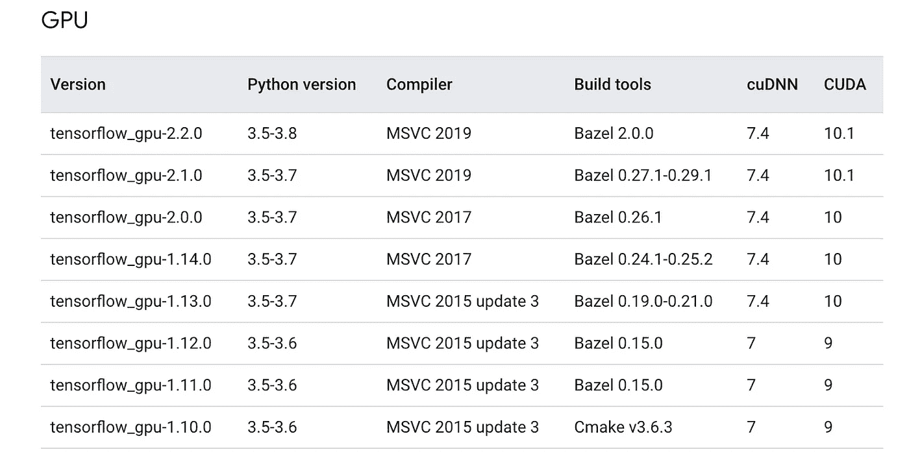

TensorFlow GPU、Python 和 CUDA 的兼容配置(图片来自 [TensorFlow](https://www.tensorflow.org/install/source_windows#tested_build_configurations) )

我的笔记本电脑和 Google Drive 上的工作区都有以下目录结构:

```
TensorFlow
├─ models
│   ├─ official
│   ├─ research
│   ├─ samples
│   └─ tutorials
└─ workspace
    ├─ preprocessing
    ├─ annotations
    ├─ images
    │   ├─ test
    │   └─ train
    ├─ pre-trained-model
    ├─ training
    └─ trained-inference-graphs
       ├─ output_inference_graph_mobile.pb
       └─ TFLite_model
```

2.预处理用于训练的图像

首先，图像需要标注标签。你可能会注意到，上面的一些图像有不止一个人戴着口罩，一些图像有复杂的背景。在这些面具周围放置锚框有助于模型通过关注框内的局部区域并提取特定特征来更快地学习。这个过程相当乏味，我花了大约 4 个小时来标记大约 800 张图片，并且我使用了一个叫做 [LabelImg](https://github.com/tzutalin/labelImg) 的 Python 包。本质上，我所做的是在人们的面具周围画出方框(如果他们没有戴面具，在他们眼睛下方和脖子上方的区域)，并将每个方框与一个标签相关联。

接下来，数据集以 9 比 1 的比例分成训练集和测试集。我没有设置验证集，因为这只是一个原型模型，但在机器学习中这样做总是一个好的做法。

3.创建标注图和张量流记录

TensorFlow 读入保存在`label_map.pbtxt`中的标签映射，这是类标签到整数值的映射。在这种情况下，该文件类似于:

```
item {
    id: 1
    name: 'homemade'
}item {
    id: 2
    name: 'surgical'
}item {
    id: 3
    name: 'n95'
}item {
    id: 4
    name: 'bare'
}
```

注释需要转换为 TFRecord 文件，如`test.record`和`train.record`。

4.选择模型并开始训练

深度学习模型有数百万个参数，从头开始训练它们通常需要大量数据，而我们这里没有这些数据。一种有用的技术是转移学习，它采用在其他图像集上训练的预训练模型，并在新的任务中重用它([这里显示的一个例子](https://www.tensorflow.org/tutorials/images/transfer_learning))。大多数参数是固定的，而顶层中的一些参数针对新任务进行了微调。

因为我想在计算能力有限的移动设备上使用该模型，所以速度是重中之重。在 [TensorFlow 的检测模型 zoo](https://github.com/tensorflow/models/blob/master/research/object_detection/g3doc/detection_model_zoo.md) 的表格中可以找到一组预先训练好的模型。我选择了一个轻量级的型号，`ssd_mobilenet_v2_coco` [ [5](https://arxiv.org/abs/1512.02325) ]，来平衡速度和精度之间的权衡。

我试着在我的笔记本电脑和谷歌实验室上训练这个模型。如果你没有超快的 GPU，我肯定会推荐你使用 Colab。在我的笔记本电脑上用 GeForce MX250 GPU 训练这样一个小模型大约 20K 步需要大约 10 个小时，在 Colab 上需要大约 2 个小时。速度提高了 5 倍，同时我可以在笔记本电脑上做其他事情。用于培训的 Colab 笔记本可以在[这个 GitHub 库](https://github.com/wangyifan411/Face-Mask-Type-Detector)上找到。

关于 TensorFlow 的一个很酷的事情是，你可以在训练期间使用 TensorBoard 监控指标(损失和准确性)。正如你所看到的，损失逐渐减少并趋于平稳，我决定不再等待，并在 20K 步后停止训练。另一个很酷的特点是你可以随时从你停止的地方继续训练。

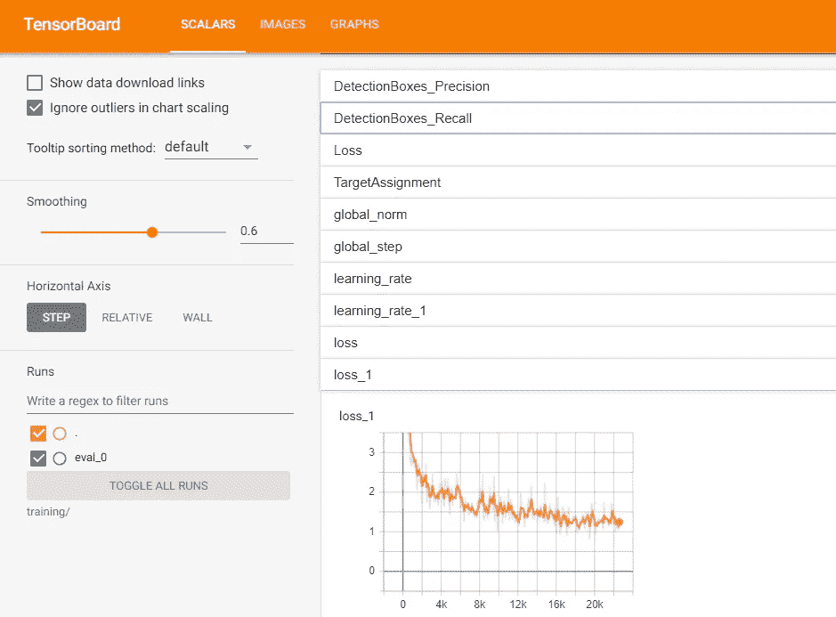

TensorBoard 示例。(图片由作者提供)

5.导出模型并测试它

该模型被导出到冻结的推理图中。可以通过运行`model_test_webcam.py`来测试。

最初，我没有包括无面具(裸露)脸的类，因为我认为模型不会在脸上画锚框，这表明这个人没有戴面具。结果证明我错了。它没有学习裸露面部的任何特征，并将一张脸识别为自制的面具。因此，我用一个新的类和裸面数据集重新训练了模型。我从这个过程中学到的是数据集设计的重要性，模型只能学习你让它学习的东西。最初快速建立模型，然后迭代也是明智的。

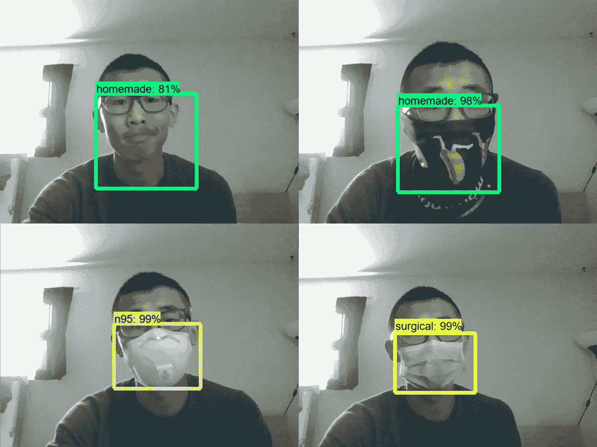

没有“裸”类的初始模型的分类结果。(图片由作者提供)

我在来自互联网(不在训练/测试集中)和一个朋友的更多图片上验证了新模型。现在它可以识别裸露的面孔了！

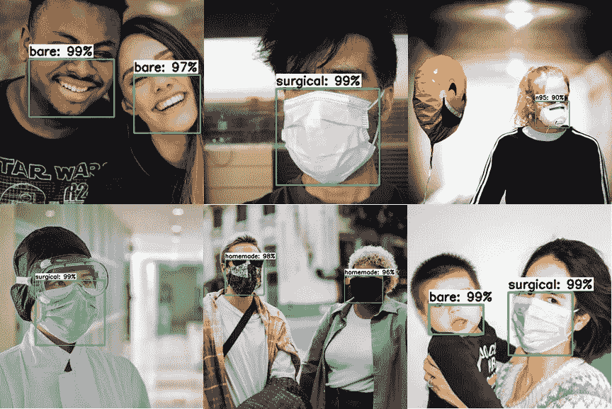

来自 Upslash 的用于模型验证的图像。(在最上面一行，从左至右，图片由[娜塔莉亚·巴罗斯](https://unsplash.com/@nataliacsb)、[来源](https://unsplash.com/photos/3TnUCHoqMHM)； [](https://unsplash.com/@miracletwentyone) [按下特征](https://unsplash.com/@pressfeatures)，[来源](https://unsplash.com/photos/S_8rGErVlH4)；[杰克逊煨](https://unsplash.com/@simmerdownjpg)，[来源](https://unsplash.com/photos/eOmWOSclN8E)。在最下面一行，从左到右，图片由 [H Shaw](https://unsplash.com/@hikeshaw) 、[source](https://unsplash.com/photos/UhOIDLhhIcI)； [](https://unsplash.com/@miracletwentyone) [内森·杜姆劳](https://unsplash.com/@nate_dumlao)[出处](https://unsplash.com/photos/JhrY9cwogzo)；[布莱恩·万根海姆](https://unsplash.com/@brianisalive)，[来源](https://unsplash.com/photos/wCqiHkjX1ZU)

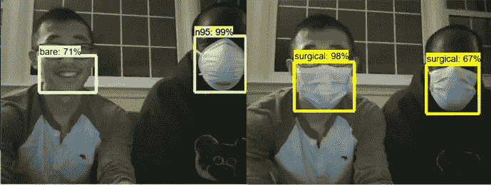

和一个朋友在弱光下测试。所有口罩都贴上了正确的标签！(图片由作者提供)

6.将模型导出到 Raspberry Pi

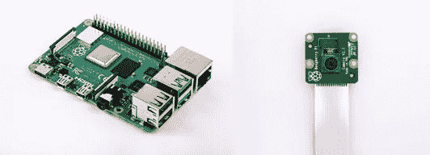

Raspberry Pi 4 和一个摄像头模块(图片由 [Raspberrypi](http://www.raspberrypi.org) 拍摄，来源: [pi 4](https://www.raspberrypi.org/products/raspberry-pi-4-model-b/) ，[摄像头模块 v2](https://www.raspberrypi.org/products/camera-module-v2/)

Raspberry Pi 是一款信用卡大小的迷你电脑，价格非常实惠(第四代售价约 35 美元)。有了 TensorFlow 的支持，它是部署模型的完美移动设备。除了树莓派，相机模块(约 30 美元)需要单独购买。

出于计算速度和隐私的原因， [TensorFlow Lite 模型](https://www.tensorflow.org/lite/guide)需要用于移动设备，如 Raspberry Pi。本教程介绍了如何在 Window PC 上将经过训练的张量流推理图转换为精简模型，并在 Raspberry Pi 上运行:

[](https://github.com/EdjeElectronics/TensorFlow-Lite-Object-Detection-on-Android-and-Raspberry-Pi) [## edjee electronics/tensor flow-Lite-Android-and-Raspberry-Pi 上的对象检测

### 本指南展示了如何训练 TensorFlow Lite 对象检测模型，并在 Android、Raspberry Pi 和

github.com](https://github.com/EdjeElectronics/TensorFlow-Lite-Object-Detection-on-Android-and-Raspberry-Pi) 

最后，是玩模型的时候了！

最后的结果显示在开始的 GIF 和下面的图片中。整体模型性能似乎很好。然而，即使我选择了轻型 SSD Mobilenet，每秒 2.5 帧(FPS)也不算太差，但也不是很快。通过选择固态硬盘或量化模型，可以进一步加速。

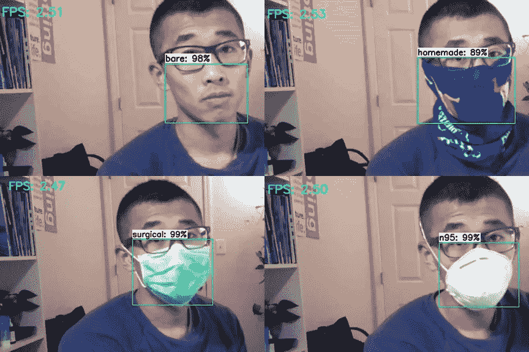

树莓派相机的测试图像。(图片由作者提供)

# 结论和要点

在我自己建立了一个对象检测模型之后，我发现构建一个深度学习项目绝对不仅仅是参数调整和设计神经网络架构。

最乏味和耗时的部分是收集和预处理数据。设置 TensorFlow 环境也很棘手，随着 TensorFlow 变得更加自动化，这一问题有望在不久的将来得到解决。主要要点是:

*   现实生活中的数据是复杂的。我们应该选择每个班级的代表形象
*   当我们有一个小的数据集时，迁移学习是有用的
*   我们应该坚持快速原型化和迭代改进模型的指导方针
*   最后，毫无疑问，在公共场所戴口罩，不管是哪种口罩

感谢阅读，保持健康！

# 参考

[1] [沙佩尔，B. (2020 年 5 月 28 日)。“不戴口罩——禁止入内，”科莫说，他允许商家坚持戴口罩。*NPR*](https://www.npr.org/sections/coronavirus-live-updates/2020/05/28/864241210/no-mask-no-entry-cuomo-says-as-he-allows-businesses-to-insist-on-face-coverings)

[2] [Prather，A. K .等人(2020 年 5 月 27 日)。减少新型冠状病毒的传播。*理科*](https://science.sciencemag.org/content/early/2020/05/27/science.abc6197?utm_campaign=SciMag&utm_source=JHubbard&utm_medium=Facebook)

[3]霍华德，j；黄；李；Tufekci，z；兹迪马尔诉；范德韦斯特休伊曾；冯·代尔夫特；价格，A 弗里德曼；唐；唐五世；沃森；Bax，C.E 谢赫河；Questier，f；埃尔南德斯博士；褚来福；拉米雷斯；《反对新冠肺炎的面具:证据回顾》。*预印本* **2020** ，202004 02 03(doi:10.20944/Preprints 202004.0203 . v1)。

[4] [帕克-波普等人(2020 年 4 月 17 日)。冠状病毒:你应该戴哪种口罩？。*《纽约时报》*](https://www.nytimes.com/interactive/2020/health/coronavirus-best-face-masks.html)

[5] [刘，w，安盖洛夫，d，尔汉，d，塞格迪，c，里德，s，傅，C. Y，&伯格，A. C. SSD:单次多盒探测器。arXiv 2016。 *arXiv 预印本 arXiv:1512.02325* 。](https://arxiv.org/abs/1512.02325)