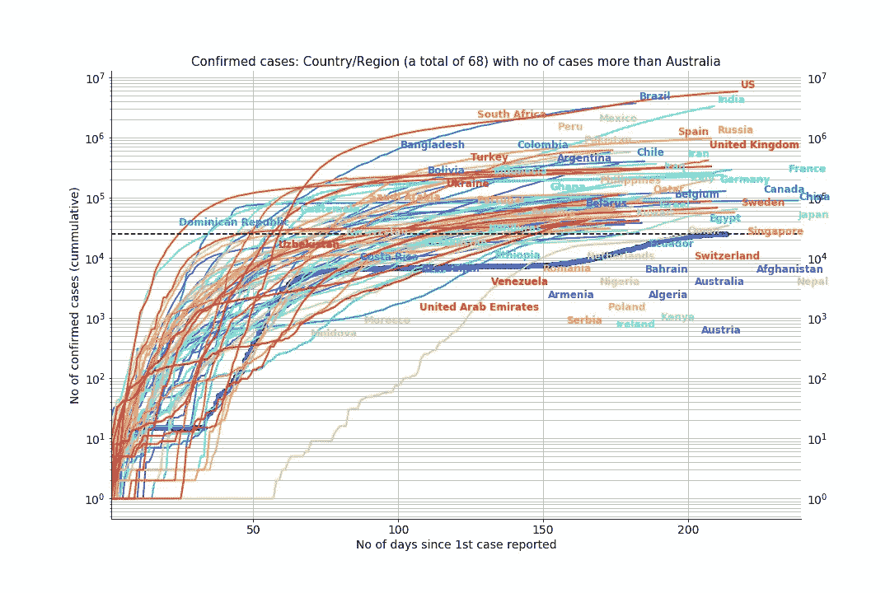
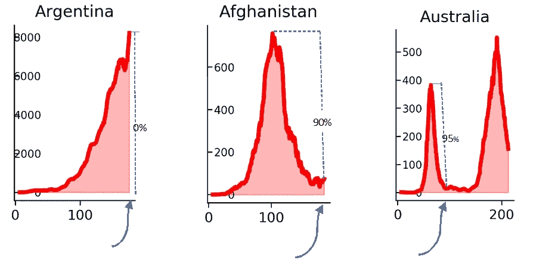
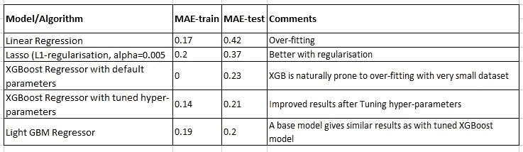
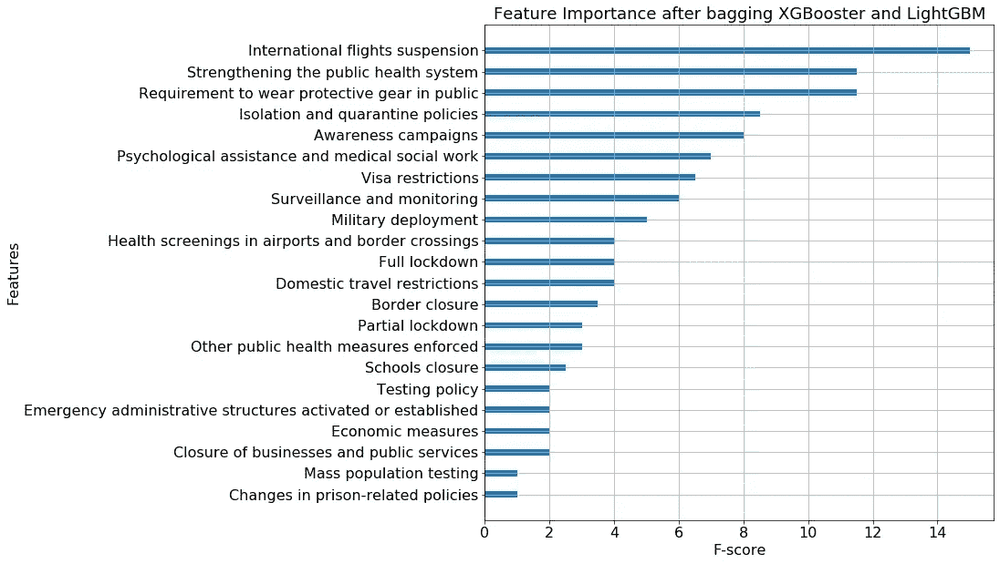
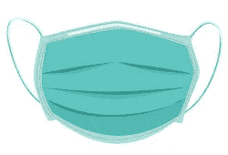

# 哪些措施对控制新冠肺炎更有效？

> 原文：<https://towardsdatascience.com/which-measures-are-more-effective-in-controlling-covid-19-f85cf0951b2b?source=collection_archive---------47----------------------->

## 国际航班、隔离和面部遮盖是最有效的措施


图片来源:freepik

作者:吉塔·达斯和凯瑟琳·洛佩斯

自 2020 年 1 月以来的 8 个月里，新冠肺炎让整个世界天翻地覆；不同的国家和政府使用不同类型的措施来拉平曲线。

在我们的[上一篇文章](/a-quick-look-at-the-timing-of-measures-for-covid-19-db53e2e5a987)中，我们研究了确诊病例(累计)比澳大利亚多的国家，很明显，越早采取措施，它们在控制疾病传播方面的影响就越大。如下图 1 所示，截至 2020 年 8 月 28 日，有 68 个国家的确诊累积病例多于澳大利亚。



图 1: 68 个国家的确诊(累积)病例数超过澳大利亚

# 本研究中的数据和国家

我们在这项研究中使用了来自人道主义数据交换(HDE)的以下两个数据集。一个[数据集](https://data.humdata.org/dataset/novel-coronavirus-2019-ncov-cases)包含全球受新冠肺炎影响的人数，另一个[数据集](http://data.humdata.org/)追踪 HDE 获得的强制措施。在包括澳大利亚在内的 69 个国家中，有两个国家因缺乏测量数据而被排除在外，因此本研究中总共使用了 67 个国家的 33 项测量，测量列表如下:

```
'Additional health/documents requirements upon arrival', 'Amendments to funeral and burial regulations', 'Awareness campaigns', 'Border checks', 'Border closure', 'Changes in prison-related policies', 'Checkpoints within the country', 'Closure of businesses and public services', 'Curfews', 'Domestic travel restrictions', 'Economic measures', 'Emergency administrative structures activated or established', 'Full lockdown', 'General recommendations', 'Health screenings in airports and border crossings', 'Humanitarian exemptions', 'International flights suspension', 'Isolation and quarantine policies', 'Limit product imports/exports', 'Limit public gatherings', 'Lockdown of refugee/idp camps or other minorities', 'Mass population testing', 'Military deployment', 'Other public health measures enforced', 'Partial lockdown', 'Psychological assistance and medical social work', 'Requirement to wear protective gear in public', 'Schools closure', 'State of emergency declared', 'Strengthening the public health system', 'Surveillance and monitoring', 'Testing policy', 'Visa restrictions'
```

根据一个国家使用的每项具体措施的时间，33 项措施的比例为[0，1]。从一个国家报告第一例病例的那一天起，如果没有使用某项措施，则该措施记录为 0。一个国家越早采取一项措施，该具体措施的数值就越高(越接近 1)。

为了衡量不同国家采用的每项措施的时间效果，这些国家大致分为三类:

*   A 型国家的病例数量仍在增长，尚未达到峰值。例如，阿根廷如图 2(左)所示。
*   B 型国家已经达到顶峰，曲线正在下降。比如图 2(中)所示的阿富汗。
*   C 类国家已经经历了第一波，并达到了第二波的顶峰，第二波可能低于或高于第一波，如图 2(右)所示的澳大利亚。



图 2:说明 3 种峰值模式的国家示例

为了评估与每日病例减少相关的措施的有效性，我们使用了一个衍生变量“减少百分比”,该变量是通过基于每日曲线的 30 天滚动平均值找出峰值和谷值的差异来计算的。选择 30 天滚动范围是为了避免过多的本地最大值和本地最小值。对于 A 类国家，减少百分比为 0，因为它们在第一条曲线中尚未达到峰值。对于类型 B，减少百分比是根据从峰值到最近一天的减少来计算的，因为他们还没有开始第二条曲线。例如，对于阿富汗，计算为 90%。对于正在经历第二波的 C 类国家，下降百分比是指在第二波之前从第一个高峰到第一个低谷的下降。鉴于措施可以停止和重新实施，很难确定撤销和重新实施措施的确切日期。因此，我们仅使用与第一波相关的缩减值。澳大利亚有 95%的减排百分比，尽管它正处于平抑第二波的过程中。

# 衡量强制措施有效性的重要特征

我们使用三种回归算法，以线性回归为基线来衡量特征的重要性。该矩阵由本研究中列出的所有国家和 33 项措施组成，其中一个目标变量是上述减排百分比。使用的 3 种算法是:

*   套索:

```
**Linear Regression** is the simplest and most widely used statistical technique for predictive modelling where we have a number of input variables and one target variable. In Lasso both 
variable selection and regularisation (L1-type) are used to achieve better prediction accuracy.
```

*   XGBoost(有和没有超参数调整):

```
**XGBoost** is a decision-tree-based ensemble machine learning algorithm that is known for its speed and performance. By tuning the hyper-parameters of the model, we can achieve better prediction accuracy.
```

*   LightGBM(使用默认参数):

```
**LightGBM** is relatively new in the market that uses similar implementation to XGBoost but with a little different tree structure. It is faster in training time.
```

带有超参数调整的 XGBoost 和带有缺省参数的 LightGBM)产生了非常相似的结果。数据集被分成训练(80%)和测试数据(20%)，大于训练误差的测试误差表示过拟合。最小绝对误差(MAE)用于评估训练集和测试集中的模型性能。结果如下表 1 所示。



*表 1: 3 三种模型的 MAE 与线性回归基线的比较*

在 33 个度量中，我们根据 XGBoost 和 LightGBM 的平均值，用正 F 值来衡量特性的重要性。下面的图 3 显示了从高到低排列的特征重要性。



图 3:具有高特性重要性的排名靠前的特性

# 有哪些措施比其他措施更有效？

基于我们袋装模型的结果，很明显:

## **第一。国际航班暂停**


图片来源:freepik

被列为控制感染传播的最有效措施。这与许多流行病学家的观点一致，即尽早停止国际航班，尤其是来自震中的航班，对于控制新冠肺炎至关重要。许多国家成功地有效使用了这一措施。

## 第二。R 要求在公共场合佩戴护具& **加强公共卫生体系**



图片来源:freepik

排名第二。一个良好的公共卫生保健系统可以帮助发现和支持受感染病人的康复；在公共场合戴**口罩**能有效防止疾病传播。这在大多数控制了新冠肺炎病毒传播的亚洲国家是显而易见的。

## **三号。隔离和检疫政策&宣传活动**


图片来源:freepik

在有效性方面名列第三。这证明，隔离和接触者追踪对于在社区中遏制疾病极其重要，许多国家已经在曲线抑制的结果中看到了证据。

有趣的是，诸如**全面封锁、边境关闭、学校关闭&测试政策**等措施并不像上面讨论的措施那样高效。用来自 67 个国家的 33 种不同衡量标准的数据总结我们的研究，我们发现:

> “国际航班、戴口罩和隔离是最有效的措施”

*欢迎随时访问*[*GitHub repo*](https://github.com/gitadas/Covid19_FeatureImportance)*，欢迎您的反馈和意见。*