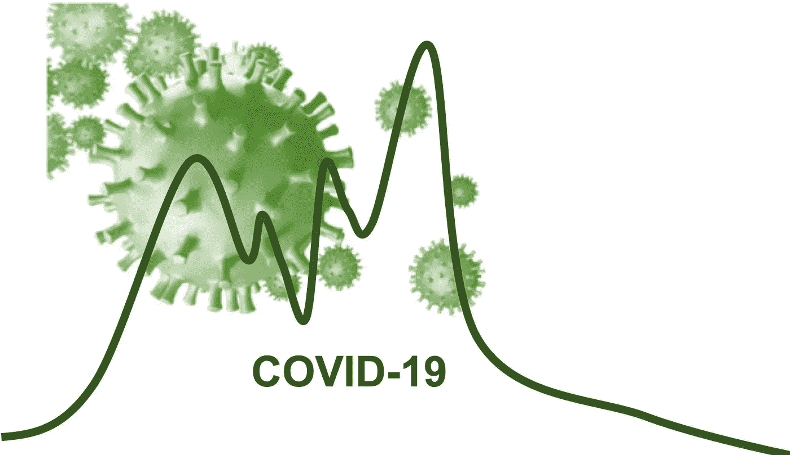
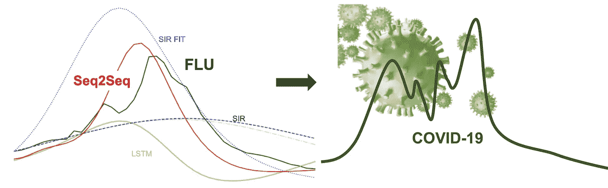
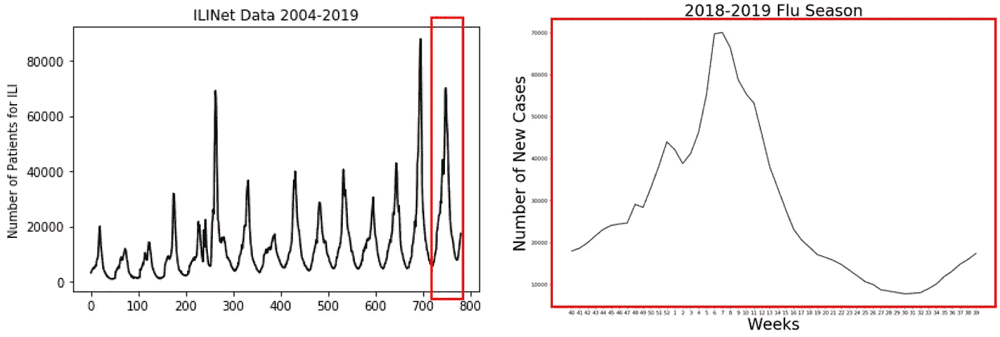
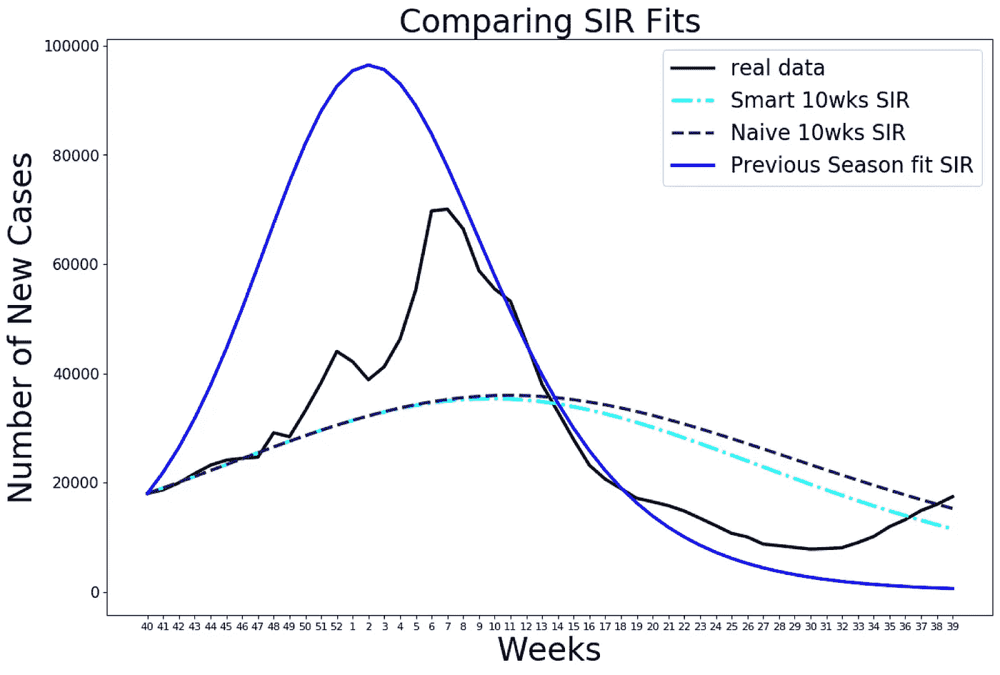
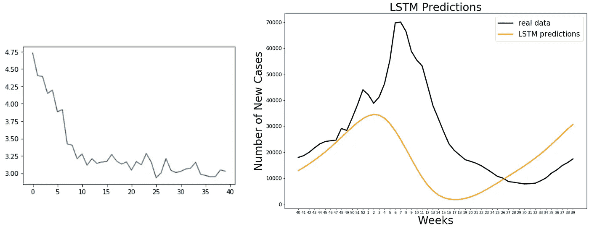
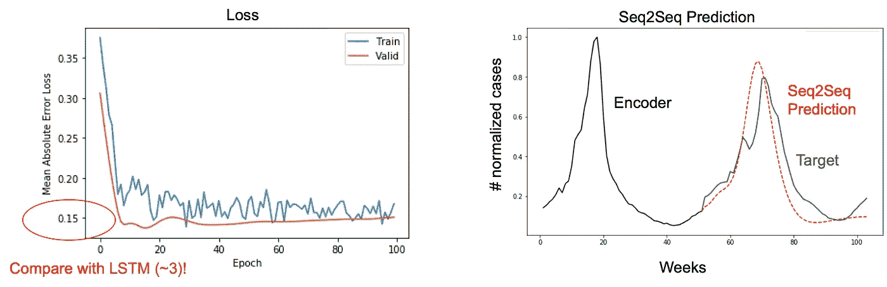
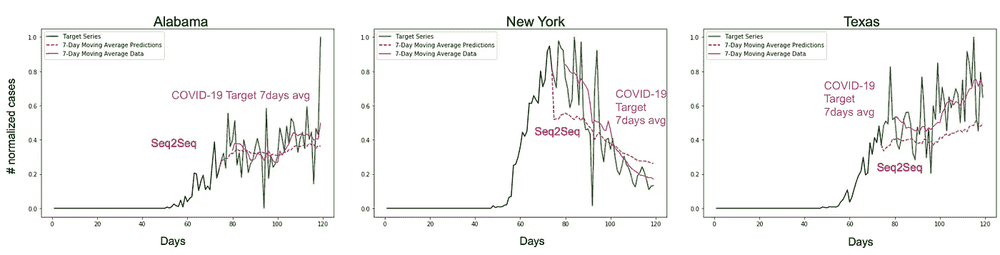
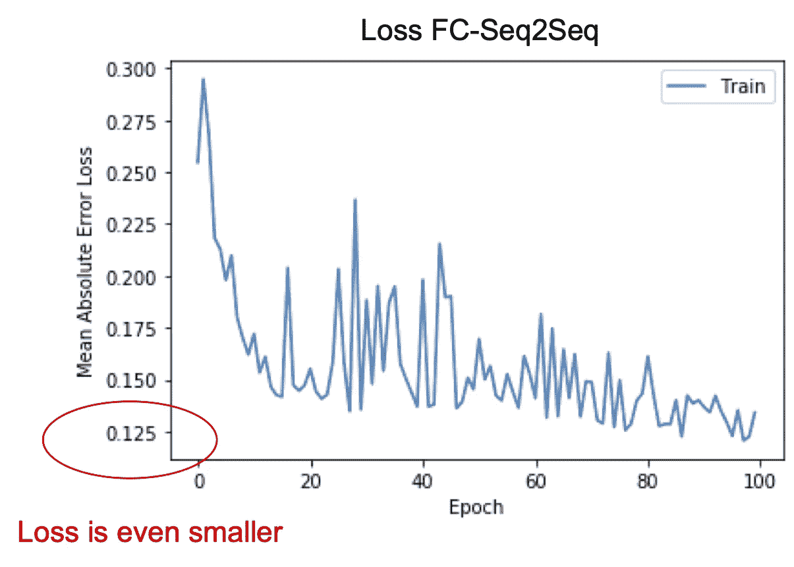
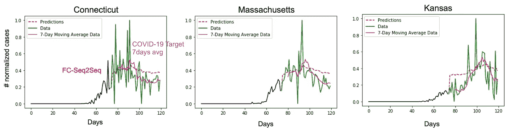

# 疫情预测使用哪些模型？

> 原文：<https://towardsdatascience.com/which-models-to-use-for-epidemic-prediction-25b22932c4ca?source=collection_archive---------32----------------------->

## *比较预测流感和新冠肺炎病例的数据驱动方法和基于模型的方法*

由[艾琳·斯塔福德](https://medium.com/@erinestafford)和[伊莱·什利泽曼](https://medium.com/@shlizee)



来源: [frankundfrei](https://pixabay.com/users/frankundfrei-638998/) ，via [pixabay](https://pixabay.com/illustrations/covid-19-coronavirus-corona-virus-4996393/) (CC0)

在新冠肺炎时代，准确预测流行病的长期和短期演变的需要已经变得很明显。我们建议将**传统的****方法，如易感染病恢复模型(SIR)与**新兴的** **数据驱动**模型进行比较，包括用于时间序列预测的递归神经网络(RNN)。我们在更稳健的流感数据上比较了这些方法，然后检验了它们在新冠肺炎数据上的应用。**

**我们的研究结果表明:( I)通常使用的基于模型的方法(即，基于模型的方法)和基于数据驱动的方法(即，不提供对流感数据的准确的长期预测，需要不断更新才能更加准确。(二)我们将**数据驱动** **Seq2Seq RNN** 模型确定为短期和长期预测最有前途的数据驱动方法。由于流行病遵循相似的模式，我们建议根据*流感*数据训练的 **Seq2Seq 可以用作新冠肺炎**的*模型*。这种模型只需要“少量”的再训练(几个样本)来提供预测。**

****

**右来源: [frankundfrei](https://pixabay.com/users/frankundfrei-638998/) ，via [pixabay](https://pixabay.com/illustrations/covid-19-coronavirus-corona-virus-4996393/) (CC0)**

**代码文件可从[https://github.com/shlizee/Seq2SeqEpidemics](https://github.com/shlizee/Seq2SeqEpidemics)获得**

## **流感数据**

**疾控中心有监测系统跟踪流感的季节性传播。一个这样的网络是美国门诊流感样疾病监测网络(ILINet)。每周，ILINET 中的门诊医疗保健提供者按年龄组报告患有**流感样疾病(ILI)的患者人数。** ILINet 提供国家、州和地区级别的数据，以及按人口加权和未加权的 ILI 访问量百分比。**我们将关注每周病例数的国家级数据。****

**绘制数据图，我们可以看到流感流行遵循类似的模式。此外，我们可以看到，我们正在处理的时间序列显示每年的季节模式。为了使数据更容易处理，我们将格式更改为季节性的(即查看以第 14 周(4 月的第一周)为中心的每个年度周期)。**

****

**来自 ILINet 的流感数据。右图:2018-19 流感季节用于评估模型的病例数**

```
> python3 fludata.py
```

## **使用基于模型的 SIR 进行预测**

**SIR 模型是一个常微分方程(ODEs)系统，传统上用于研究流行病的动力学。在这个模型中，人群被分为三组: **S** 易感， **I** 感染，和 **R** 未感染。该模型的流程图如下所示。**

****

**易感者以β速率感染，感染后以γ速率恢复。为了使用 SIR 模型进行预测，我们必须优化模型的参数以拟合数据。我们优化的参数包括:(I)初始易感人群的百分比(ii) β:感染率(iii) γ:恢复率。**

**首先，我们来看看基于**上一季**的预测。我们优化模型参数**以适应前一季**，然后使用这些参数**运行下一季**的模型，并将结果与下一季的真实数据进行比较。**

**接下来，我们看看 SIR 模型如何仅从 10 个数据点(蓝色虚线)中做出预测**。**我们将通过两种方式做到这一点:(I)拟合上一个赛季，并使用这些参数作为优化的起点: **Smart SIR。****(二)利用一个普遍的出发点:**天真的先生。******

********

****上季流感病例的 SIR 模型预测****

```
****>** python3 SIRfludata.py**
```

****结果告诉我们，前一季拟合 SIR 曲线的形状似乎最接近真实数据，然而，它不能很好地预测峰值，并且曲线的初始段仍然非常不同。总的来说，我们看到 SIR 模型即使根据以前的数据进行了更新，也没有捕捉到流行病演变的重要特征，并表明 ***数据驱动的*方法可以改善预测**。****

## ******用香草 LSTM 做预测******

****对于时间序列数据(例如，我们在这里考虑的每日病例的流行病数据)，一种常用的预测策略是递归神经网络(RNNs)。可以提供稳健预测的特定类型的 rnn 是 LSTMs(长短期记忆单元)。LSTMs 能够识别时间序列数据中的时间模式，然后用于预测。我们的实现遵循 PyTorch [3]中 LSTM 的时间序列预测教程。****

****我们执行几个预处理步骤。(I)我们将 LSTM 的数据标准化;( ii)创建输入-输出序列来训练我们创建元组的模型。这些元组将包含 52 周的数据作为输入，下一周的数据作为输出。每个输入序列中有 52 个数据点，有一个标签，是下一个数据点。****

```
**> python3 LSTMfludata.py**
```

****现在我们构建模型。我们在之前创建的输入/输出序列上训练模型，即，我们在整个训练数据上滑动 52 个数据点(一个季节)的窗口，一次一个步骤，并预测下一个点。然后我们计算预测值和地面真实值之间的 L1 损失。看起来模型收敛了(尽管注意损失(左图)相当高)，我们检查了下一季度的预测(右图)。****

********

****左:失去 LSTM 预言。右图:LSTM 预测(橙色)与真实数据(黑色)的对比。****

******事实证明，香草 LSTM 的表现比 SIR 更差！**此外，来自 LSTM 的预测不太可靠，经过训练后往往会产生不同的结果。然而，在某些情况下，结果和先生一样准确，值得注意的是，在许多试验中，LSTM 倾向于在季末抓住新案件的上升。****

## ****Seq2Seq 模型****

****Seq2Seq 型号使用 RNN 编码器和解码器将一个序列转换为另一个序列。尽管这通常用于语言处理，但它也适用于时间序列预测，参见[4]。该模型的实现改编自时间序列预测 Seq2Seq [5]和[1，2]。****

```
**> python3 Seq2Seqfludata.py**
```

********

****左:Seq2Seq 预测丢失。右图:Seq2Seq 解码器预测(红色虚线)和目标 flu 真实数据(绿色)的比较。****

****我们设置了 Se2Seq 来执行与“上赛季 fit SIR”和“LSTM”中类似的预测。我们将编码器的输入设置为前一季(“编码系列”52 周—黑色)，并训练解码器的输出来预测当前季的 52 周(“目标系列”52 周—绿色)。我们在之前的所有赛季中训练模型，并将最后一个赛季留给测试。Seq2Seq 的预测用红色标记。****

********

****实际数据(黑色)预测中所有方法的比较。Seq2Seq(红色)提供了被检查模型中的最佳预测。****

****正如上面的对比图所示，Seq2Seq 预测在预测疫情峰值、峰值周和曲线的整体形状方面**明显优于 SIR 和 LSTM**，似乎接近真实数据曲线，几乎是真实数据曲线的平滑版本。****

## ****Seq2Seq 在新冠肺炎疫情预测中的应用****

****由于在流感数据上使用 Seq2Seq 的结果很有希望，我们很想看看 Seq2Seq 模型如何预测**新冠肺炎**。本应用程序使用的数据来自 Kaggle[6]上的新冠肺炎全球预测挑战。这些数据包括国家、州、县一级的确诊病例和死亡病例，以及每个地区的人口。我们将关注美国的数据，并通过实验解决两个主要问题:****

1.  ****使用 Seq2Seq 预测每个州最近 45 天的流行病数据(病例数),对其他州进行训练。这将决定新冠肺炎数据驱动预测的**准确性**。****
2.  ****我们询问针对流感培训的 **Seq2Seq 是否可以用作新冠肺炎**的一种‘基于模型’的方法。通过这种设置，我们探索了在类似于新冠肺炎的流行病上训练 Seq2Seq 是否是用于精确预测的基于混合数据模型的方法。****

## ******1。使用 Seq2Seq 按状态预测最近 45 天的疫情******

****对于此应用程序，我们训练一个 Seq2Seq 神经网络，使用流行病的开始作为输入来预测流行病的最后 45 天。我们预测 3 个示例状态(并在其他 47 个状态上训练)。每日预测以红色显示，并与绿色目标进行比较。****

```
**> python3 Seq2SeqCovid19_45days.py**
```

********

****Seq2Seq 预测(红色，与洋红色的最佳对比:7 天移动平均线)新冠肺炎过去 45 天的预测，适用于 3 个州:阿拉巴马州、纽约州和得克萨斯州。****

****我们能够很好地把握整体趋势！我们没有捕捉到数据中的峰值，很多时候是由于数据输入系统的日期造成的。值得注意的是，我们并不期望预测这些。为了进一步测试预测的准确性，我们查看每天更新的移动平均线(比较预测-红色和品红色-7 天移动平均线目标)[7]。正如可以看到的，我们得到了所有三个检查状态令人印象深刻的准确性。****

## ****2.流感数据是否给了我们一个更好的 Seq2Seq 模型用于新冠肺炎？****

****对于这个应用程序，我们**首先在**流感**上训练** Seq2Seq，然后**重新训练**它来预测**新冠肺炎(**我们将这样的模型标记为 **FC-Seq2Seq)** 。特别是，我们针对流感在所有州进行训练，然后根据新冠肺炎的数据只在 3 个州进行重新训练。通过遵循这样的协议，我们的目标是获得基于模型的新冠肺炎方法，该方法通过少量的重新训练提供准确的预测。****

```
> python3 FCSeq2Seq.py
```

****

**丢失重新训练的 FC-Seq2Seq。**

**我们观察到 FC-Seq2Seq 的丢失是所有检测模型中最小的。这表明，在我们检查的所有设置中，该设置获得了最高的精度，并且它使用最少的数据进行训练(即，只有 3 个状态的数据)。通过检查下图中 47 个状态中的其他状态(红色)的预测，并与 7 天移动平均新冠肺炎数据(品红色)进行比较，预测的准确性是显而易见的。引用的代码可用于生成剩余 44 个状态的预测。**

****

**新冠肺炎案例的 FC-Seq2Seq 预测(红色，与洋红色的最佳对比:7 天移动平均值)。**

**因此，我们建议，这种做法将有助于重新训练 Seq2Seq 流感模型对早期 COVID 爆发进行预测。**

# **结论**

**我们对流行病预测方法的分析表明，Seq2Seq RNN 是一种可靠的流行病预测方法。在流感数据预测方面，Seq2Seq 优于 SIR 和 LSTM，并为新冠肺炎展示了有希望的结果。此外，对流感进行训练的 Seq2Seq 模型能够对新冠肺炎数据进行准确预测，几乎不需要重新训练。我们建议使用 **Seq2Seq 模型，并与中的**进行比较，预测新冠肺炎目前的病例数和死亡数。接下来，我们计划研究 Seq2Seq 以阐明和预测缓解策略的效果[8]。**

# **参考**

**[1]苏，k .，& Shlizerman，E. (2019)。序列对序列递归神经网络可解释性的降维方法。arXiv 预印本 arXiv:1905.12176**

**[2]苏，k，刘，x .，，施利兹曼，E. (2020).预测和聚类:基于无监督骨架的动作识别。IEEE/CVF 计算机视觉和模式识别会议论文集(第 9631-9640 页)。**

**[3][https://stack abuse . com/time-series-prediction-using-lstm-with-py torch-in-python/](https://stackabuse.com/time-series-prediction-using-lstm-with-pytorch-in-python/)**

**[4][https://blog . keras . io/a-ten-minute-introduction-to-sequence-to-sequence-learning-in-keras . html](https://blog.keras.io/a-ten-minute-introduction-to-sequence-to-sequence-learning-in-keras.html)**

**[5][https://github . com/jeddy 92/time series _ seq 2 seq/blob/master/notebooks/TS _ seq 2 seq _ intro . ipynb](https://github.com/JEddy92/TimeSeries_Seq2Seq/blob/master/notebooks/TS_Seq2Seq_Intro.ipynb)**

**[6][https://www . ka ggle . com/c/covid 19-global-forecasting-week-5/data？select=test.csv](https://www.kaggle.com/c/covid19-global-forecasting-week-5/data?select=test.csv)**

**[7][https://machine learning mastery . com/moving-average-smoothing-for-time-series-forecasting-python/](https://machinelearningmastery.com/moving-average-smoothing-for-time-series-forecasting-python/)**

**[8][https://wallet hub . com/edu/冠状病毒限制最少的州/73818/](https://wallethub.com/edu/states-with-the-fewest-coronavirus-restrictions/73818/)**