# 哪一个是你的波动率——常数、局部还是随机？

> 原文：<https://towardsdatascience.com/which-one-is-your-volatility-constant-local-or-stochastic-61508ef560c1?source=collection_archive---------16----------------------->

## 利用赫斯顿模型分析欧元对美元的走势

金融学中有三种主要的波动率模型:常数波动率、局部波动率和随机波动率模型。

在 1987 年股市崩盘之前，建立在几何布朗运动(GBM)基础上的 Black-Scholes (B-S)模型是占主导地位的模型，该模型具有**常数波动率**和漂移。在这个模型中，股票价格是随机性的唯一来源，可以用收益分布为对数正态的标的股票进行套期保值。在 B-S 模型中，股票价格 S 由以下随机微分方程(SDE)描述，其中 W 是标准布朗运动:

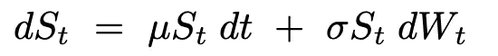

其中μ(回报率、漂移或无风险率)和σ(波动率)为常数。

上述随机微分方程(SDE)具有以下解析解(根据 it0 的解释):

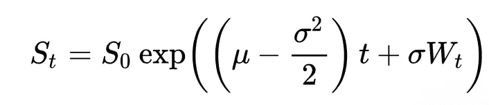

1987 年股灾之后，“skew”这个词过去指的是幸福或好事发生时，现在的意思完全不同了:“skew”表示非常小和非常大的回报比正态分布所暗示的更经常实现。因此，交易者开始为波动性较高的特别低的执行期权定价(查看 1987 年前后隐含的 vol 曲线)。不同期权的供给和需求也在波动曲线的形成中发挥了重要作用。

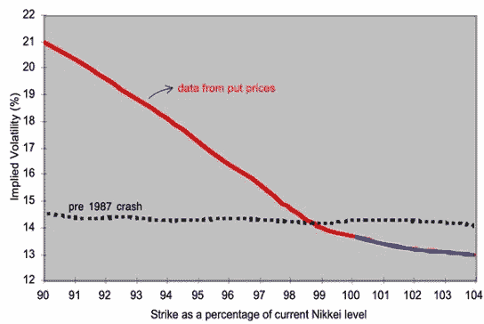

局部波动率(LV)模型实际上是 B-S 模型的简单扩展，它解决了将偏度纳入定价模型的需要，因此意味着非正态分布。在 LV 模型中，基础资产的波动率(称为“瞬时波动率”)被建模为时间 t 和基础资产的时间 t 值的确定性函数:

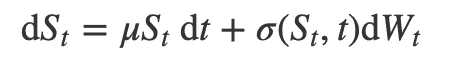

这是一个非常直观的公式，只要想到*波动性可以被视为资产本身*。例如，VIX 指数是一个实时市场指数，代表市场对 S & P 500 指数期权价格输入的 30 天前瞻性波动的预期，可以通过衍生品交易。看看 VIX 指数的不稳定性:

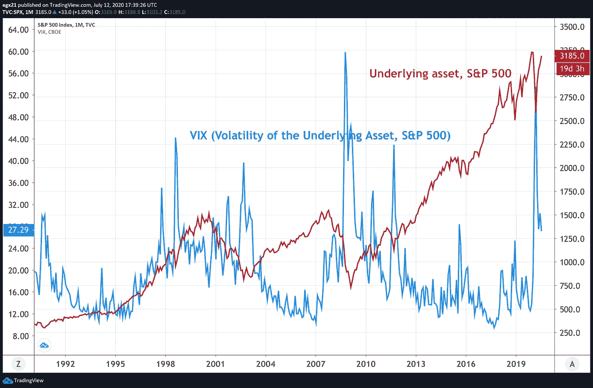

VIX 标准普尔 500 指数的走势及其波动性

隐含波动率曲面可以转化为 LV 曲面，这就是 Dupire LV 模型的标定。Dupire (1994 年)表明，存在一个模型可以匹配市场上的期权报价，并且有一个明确的公式来说明如何根据观察到的期权价格构建这个模型，假设它们可以在连续的执行和到期日之间进行插值。(当时，杜皮尔实际上并不认为局部波动是实际波动演化的现实模型。)

由于资产价格由单个布朗运动驱动，每个收益都是由现金和基础资产组成的独特的自我融资复制投资组合的结果，也就是说，它的价格是唯一地定义为复制投资组合的初始值(市场完整性)的*。完整的好处是写在 S 上的衍生品可以完美对冲。虽然 BS 和 LV 模型是完整的，但随机波动率模型却不是。另一方面，虽然从理论角度来看，市场完全性非常方便，但它不一定是金融市场的现实属性，因为我们都可以处理衍生品，对吗？*

不管怎样？如果我们比较隐含波动率表面和局部波动率表面，我们可以看到拟合相当好。实际上，与 B-S 模型不同，LV 模型在拟合隐含波动率的无套利面方面非常好，有时甚至是完美的，即通过 Dupire 公式的“微笑”。

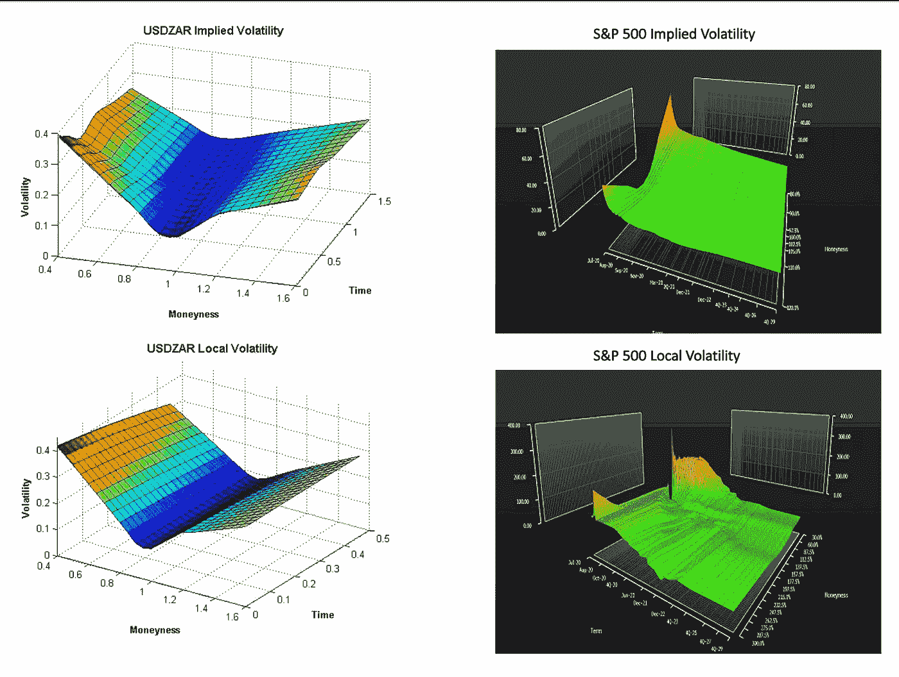

资料来源:左图:南非指数和外汇期权的隐含和局部波动表面，风险和金融管理期刊，ISSN 1911–8074。右边的图表:彭博

然而，LV 模型有一个主要的缺陷:该模型只使用今天的价格，而没有对它们在一段时间内的行为做出假设！尽管它符合今天的微笑值，但该模型在长期到期时给出了几乎不变的微笑，导致未来微笑变平(即未来没有微笑)！多么荒谬！因此导致不合理的偏斜动态，低估了波动率的波动性。这是非常不现实的，特别是对于依赖向前微笑的奇异期权，如克利凯期权和其他向前开始期权。

此外，LV 型号在提供稳定性方面并不差，它们可能需要频繁地重新校准，例如每小时一次！！

尽管如此，通过对局部波动价格进行一些调整，特别是向模型中添加一些跳跃以捕捉股票价格过程的复杂动态，这些模型可以用于对几种障碍期权进行定价。

作为 LV 模型的升级/替代，**随机波动率** (SV)模型可以产生更真实的远期波动率表面，其中微笑几乎是自相似的，相比之下，LV 模型使远期波动率曲线变平并消除微笑。LV 模型假设未来的偏斜将是我们今天在本地 vol 中看到的正向偏斜，而 SV 模型假设未来的偏斜与今天的偏斜相似。这就是为什么 SV 模型很可能高估期权，而 LV 和 BS 模型往往低估期权。

在 SV 模型中，资产价格及其波动性都被假设为随机过程，并且可以随时间而变化，因此它给出了更真实的波动微笑动态。在 20 世纪 80 年代末由 Hull 和 White 提出的 SV 模型中，基础的波动性被建模为某个辅助过程的确定性函数，该过程通常被建模为扩散。

最著名和最重要的随机波动模型是赫斯顿模型。它是一个双因素模型，并假设股票价格和瞬时波动性具有不同的动态。

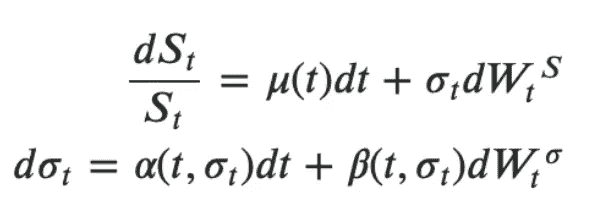

作为一个超级简单的例子，下面的代码显示了一个简单的应用赫斯顿模型对欧元兑美元，以寻找货币路径在 1 米，2M 和 3 米的时间。

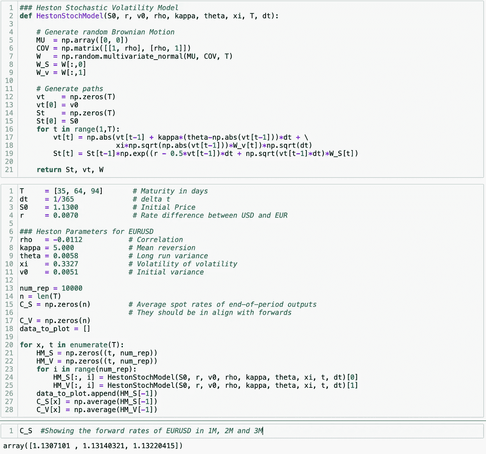

如果您将结果与下面的彭博远期报价进行比较，您会发现我们的结果与下面给出的报价非常吻合。

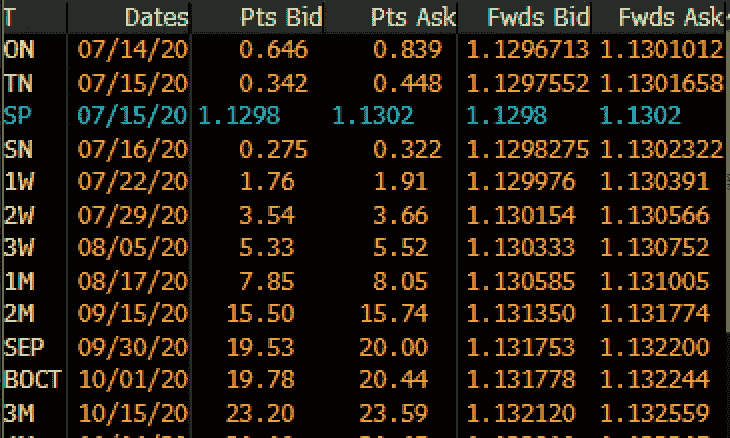

此外，现在我们有了每个模拟中的货币路径，我们可以基于这些路径为我们的奇异期权定价(下图)。

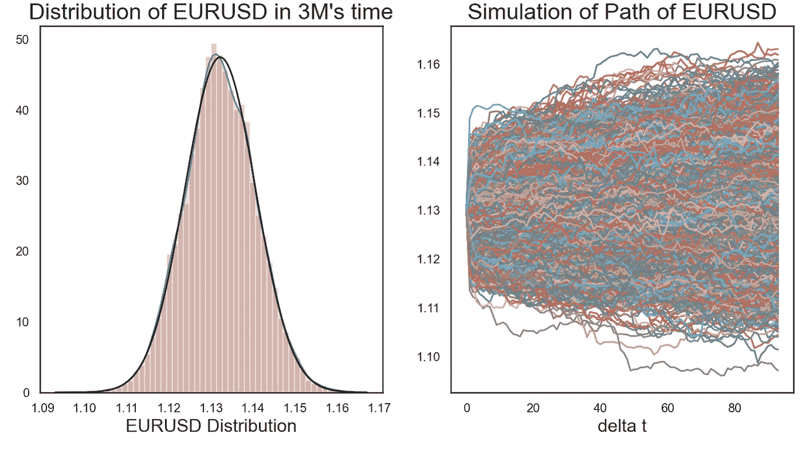

在上面的例子中，赫斯顿模型参数是通过对市场观察到的欧式期权隐含波动率微笑进行校准而确定的(下图给出了表面)。好吧，我承认我实际上没有使用繁琐的公式来计算它们，而是直接从彭博获得重新校准的参数以节省时间:)

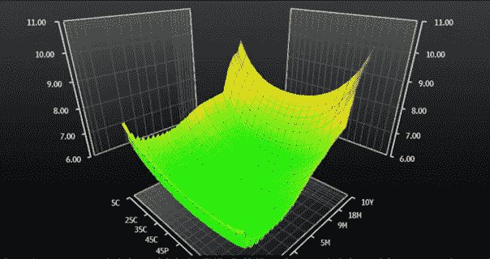

市场观察到的欧元兑美元欧洲期权隐含波动率表面(来源:彭博)

SV 模型可以产生丰富的点-体积动态，例如大的负短期正向偏斜或大的正向微笑曲率。然而，它们也有一些缺点。它们比本地 vol 模型更难校准，这就是为什么我直接从 Bloomnberg 获取它们，它们有时可能不会对短期期权表现出足够的微笑。对于只依赖于最终分布的产品，波动率表面的拟合可能很差。SV 模型中的套期保值比率也强烈依赖于参数，因此它们对参数的变化很敏感。更简单的模型甚至可以做得更好，因为它的参数可以更有效和更稳健地校准，而对冲误差可以得到“平均”。

还有其他模型可以克服这些缺点。其中之一是局部随机波动率(LSV)模型，该模型试图获得局部和随机波动率模型的积极方面:它们将波动率建模为时间 t 和基础资产 S 与附加随机过程的函数。还有路径依赖波动率(PDV)模型，它试图结合 LV 和 SV 的优势，试图适应市场微笑，同时产生各种各样的联合现货-vol 动态。

另一种方法是使用 ARCH/GARCH 模型。尽管 ARCH/GARCH 代表股票收益的离散时间模型，而 SV 模型是连续时间模型，但股票收益的离散时间模型在计量经济学文献中吸引了相当多的注意力，并提供了稳健的结果。ARCH/GARCH 可以捕捉尾部风险、波动聚类和相关性，而不需要相关性。

总而言之，可以得出结论，没有“对”的模式，只有“合适”的模式。你对 vol 型号的选择取决于你打算用它做什么。例如，如果你想给奇异期权定价，就选择 SV 模型。对于不太复杂和奇特的产品，本地 vol 模型可以表现得更好。