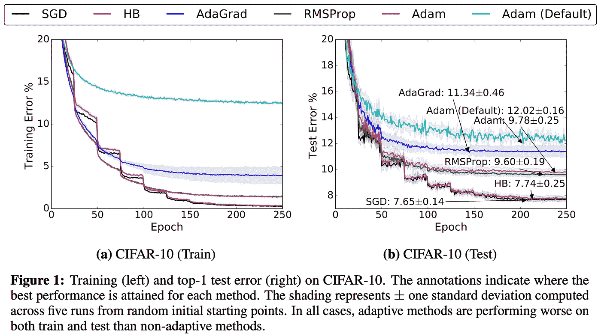
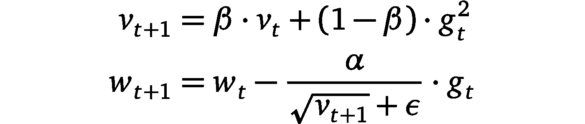
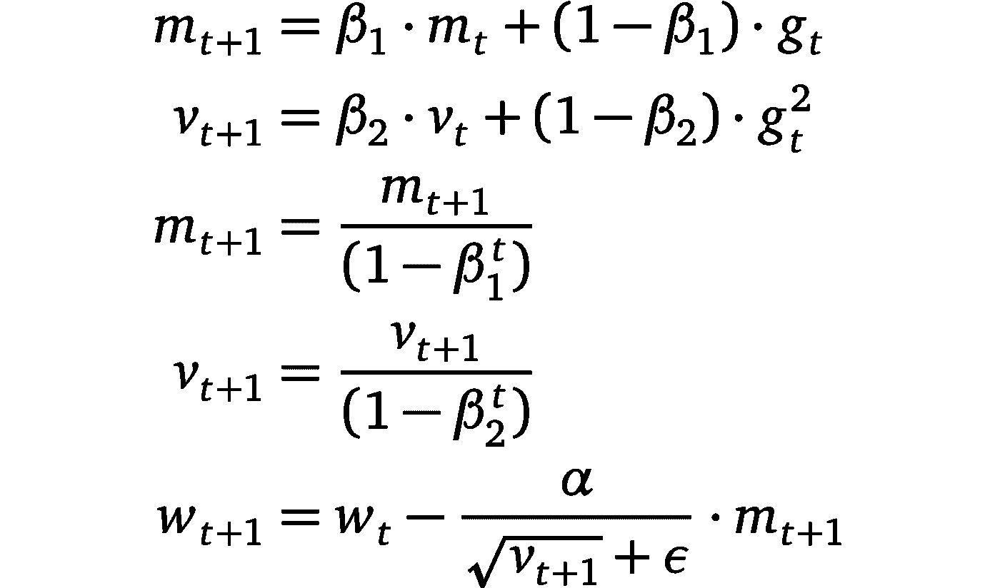
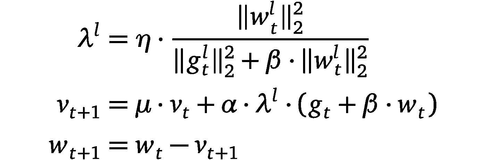
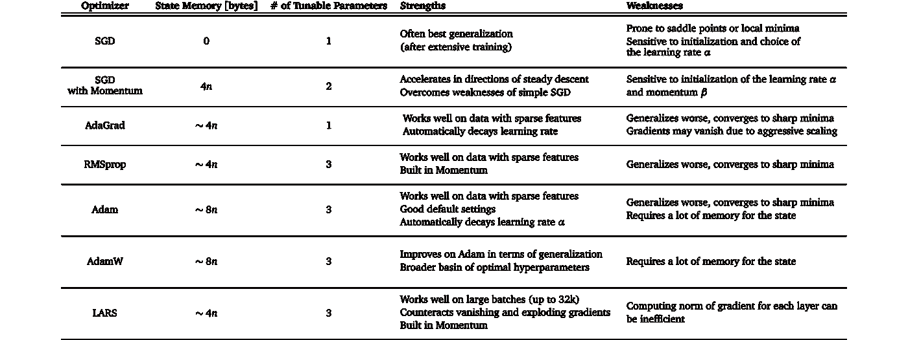

# 我应该在我的机器学习项目中使用哪个优化器？

> 原文：<https://towardsdatascience.com/which-optimizer-should-i-use-in-my-machine-learning-project-5f694c5fc280?source=collection_archive---------41----------------------->

图片来自[pexels.com](https://www.pexels.com/photo/coding-computer-data-depth-of-field-577585/)

## 为您的项目选择合适的优化器的指南。

**这篇文章概括了计算机视觉、自然语言处理和机器学习中常用的优化器。此外，您将发现一个基于三个问题的指南，以帮助您为下一个机器学习项目选择正确的优化器。**

**TL；DR:**
1)找一篇相关的研究论文，从使用相同的优化器开始。
2)查阅**表 1** 并将数据集的属性与不同优化器的优缺点进行比较。根据可用的资源调整你的选择。

# **简介**

为您的机器学习项目选择一个好的优化器可能会非常困难。流行的深度学习库，如 [PyTorch](https://pytorch.org/) 或 [TensorFLow](http://tensorflow.org) 提供了不同优化器的广泛选择——每一个都有自己的优点和缺点。**然而，** **挑选错误的优化器会对你的机器学习模型的性能产生实质性的负面影响**【1】【2】。这使得优化器成为构建、测试和部署机器学习模型过程中的关键设计选择。

图摘自[2] ( [链接](https://papers.nips.cc/paper/7003-the-marginal-value-of-adaptive-gradient-methods-in-machine-learning))。它显示了根据优化器的不同，模型性能可能会有很大的不同。

选择优化器的问题是，由于[没有免费的午餐定理](https://en.wikipedia.org/wiki/No_free_lunch_theorem)，没有一个优化器可以统治所有优化器；事实上，优化器的性能高度依赖于设置。因此，出现的核心问题是:

> 哪个优化器最适合我项目的特点？

以下文章旨在作为回答上述问题的指南。它分为两个主要段落:在第一部分，我将向您简要介绍最常用的优化器。在第二部分，我将为您提供一个为您的项目选择最佳优化器的三步计划。

# **常用优化器**

深度学习中几乎所有流行的优化器都是基于梯度下降的。这意味着他们重复估计给定损失函数 L 的斜率，并在相反的方向上移动参数(因此朝着*假定的*全局最小值向下攀升)。这种优化器最简单的例子可能是自 20 世纪 50 年代以来一直使用的随机梯度下降(或 SGD)[3]。在 2010 年代，AdaGrad 或 Adam [4][1]等自适应梯度方法的使用变得越来越流行。然而，最近的趋势表明，部分研究团体倾向于使用 SGD 而不是自适应梯度方法，例如参见[2]和[5]。此外，深度学习的当前挑战带来了新的 SGD 变体，如 LARS 或 LAMB [6][7]。例如，Google Research 在他们最近的一篇论文中使用 LARS 训练了一个强大的自我监督模型[8]。

下一节将介绍最流行的优化程序。如果您已经熟悉这些概念，请前往第 ***节如何选择正确的优化器*** 。

我们将使用下面的符号:用 **w** 表示参数，用 **g** 表示模型的梯度。此外，让 **α** 为每个优化器的全局学习速率，让 **t** 为时间步长。

**随机梯度下降(SGD)【9】**

随机梯度下降(SGD)的更新规则[9]。

在 SGD 中，优化器根据小批量估计最陡下降的方向，并朝这个方向前进一步。因为步长是固定的，SGD 会很快陷入平稳状态或局部极小值。

**带动量的 SGD【10】:**

用动量更新 SGD 规则( [PyTorch](https://pytorch.org/docs/stable/optim.html) ，2020 年 7 月 20 日)。

其中**T21β<1。利用动量，SGD 在恒定下降的方向上加速(这就是为什么它也被称为“重球法”)。这种加速有助于模型摆脱停滞状态，使其不易陷入局部极小值。**

**阿达格拉德(2011，[4])**

更新 AdaGrad [4]的规则。

AdaGrad 是利用自适应学习速率的首批成功方法之一(因此得名)。AdaGrad 基于梯度平方之和的倒数的平方根来缩放每个参数的学习速率。该过程放大稀疏梯度方向，这又允许在这些方向上更大的步长。结果是:AdaGrad 在具有稀疏特征的场景中可以更快地收敛。

**RMSprop (2012，[11])**

更新 RMSprop [11]的规则。

RMSprop 是一个未发布的优化器，在过去几年中[被过度使用。这个想法类似于 AdaGrad，但是梯度的重新缩放没有那么激进:梯度平方的总和被梯度平方的移动平均值所代替。RMSprop 通常与 momentum 一起使用，可以理解为 Rprop 对小批量设置的适应。](https://medium.com/@karpathy/a-peek-at-trends-in-machine-learning-ab8a1085a106)

**亚当(2014，[1])**

更新 Adam [1]的规则。

Adam 将 AdaGrad、RMSprop 和 momentum 方法合二为一。步长的方向由梯度的移动平均来确定，步长大小近似为全局步长大小的上限。此外，类似于 RMSprop，梯度的每个维度被重新缩放。Adam 和 RMSprop(或 AdaGrad)之间的一个关键区别是，力矩估计值 **m** 和 **v** 的偏差被校正为零。众所周知，Adam 通过很少的超参数调整实现了良好的性能。

**AdamW (2017，[17])**

AdamW [17]的更新规则。

Loshchilov 和 Hutter [17]确定了自适应梯度法中 L2 正则化和权重下降的不等价性，并假设这种不等价性限制了 Adams 的性能。然后，他们提出将权重衰减与学习速率分离。实验结果表明，AdamW 比 Adam 具有更好的泛化性能，并且 AdamW 的最优超参数范围更广。

**LARS (2017，[6])**

更新 LARS [6]的规则。

LARS 是 SGD 的一个扩展，它具有适应每层学习速率的动量。它最近引起了研究界的关注。原因是由于可用数据量的稳步增长，机器学习模型的分布式训练已经普及。结果是批量开始增长。然而，这导致训练期间的不稳定性。Yang 等人[6]认为，这些不稳定性源于某些层的梯度范数和重量范数之间的不平衡。因此，他们提出了一种优化器，可以根据“信任”参数η < 1 and the inverse norm of the gradient for that layer.

# **来调整每一层的学习速率。如何选择正确的优化器？**

如上所述，为机器学习问题选择正确的优化器可能很难。更具体地说，没有万能的解决方案，必须根据手头的具体问题仔细选择优化器。在下一节中，我将提出在决定使用某个优化器之前应该问自己的三个问题。

> **在与您相似的数据集和任务上，有哪些最新的成果？使用了哪些优化器，为什么？**

如果你正在使用新颖的机器学习方法，很可能会有一篇或多篇可靠的论文涉及类似的问题或处理类似的数据。该论文的作者经常进行广泛的交叉验证，并且只报告最成功的配置。尝试理解他们选择优化器的理由。

***举例:*** *说你要训练一个生成性对抗网络(GAN)对一组图像进行超分辨率。经过一些研究，你偶然发现了这篇论文，在这篇论文中，研究人员使用 Adam 优化器解决了完全相同的问题。Wilson 等人[2]认为，训练 GANs 并不对应于解决优化问题，Adam 可能非常适合这种情况。因此，在这种情况下，Adam 是优化器的一个好选择。*

> **您的数据集有哪些特征可以发挥某些优化器的优势？如果有，是哪些，怎么做？**

**表 1** 显示了不同优化器及其优缺点的概述。尝试找到一个与您的数据集、培训设置和项目目标的特征相匹配的优化器。

某些优化器在具有稀疏特征的数据上表现得非常好[13]，而其他优化器在将模型应用于之前未见过的数据时可能表现得更好[14]。一些优化器在大批量的情况下工作得很好[6]，而另一些优化器会收敛到尖锐的极小值，但泛化能力很差[15]。

表 1:流行优化器的总结，突出了它们的优点和缺点。列状态内存表示优化器所需的字节数，这是梯度所需内存的补充。这里，n 是机器学习模型的参数数量。例如，没有动量的 SGD 将只需要存储器来存储梯度，但是具有动量的 SGD 也需要存储梯度的移动平均值。

***例如:*** *对于你当前工作的一个项目，你必须将用户的书面反馈分为正面反馈和负面反馈。你考虑使用单词袋作为你的机器学习模型的输入特征。由于这些特征可能非常稀疏，您决定采用自适应梯度方法。但是你想用哪个呢？查阅* ***表 1*** *，可以看到 AdaGrad 具有自适应梯度方法中最少的可调参数。看到项目的有限时间框架，您选择 AdaGrad 作为优化器。*

> 你的项目资源是什么？

项目可用的资源对选择哪个优化器也有影响。计算限制或内存约束，以及项目的时间框架可以缩小可行选择的范围。再次查看**表 1** ，您可以看到每个优化器的不同内存需求和可调参数数量。这些信息可以帮助您估计您的设置是否支持优化程序所需的资源。

***例如:*** *您在业余时间从事一个项目，希望在家用计算机上的图像数据集上训练一个自我监督的模型(例如 SimCLR [16])。对于像 SimCLR 这样的模型，性能随着批量的增加而提高。所以，你要尽可能的节省内存，以便大批量的做训练。您选择一个没有动量的简单随机梯度下降作为您的优化器，因为与其他优化器相比，它需要最少的额外内存来存储状态。*

**结论**

尝试所有可能的优化器来为一个项目找到最好的并不总是可能的。在这篇博文中，我概述了最流行的优化器的更新规则、优点、缺点和要求。此外，我列出了三个问题，以指导您做出明智的决定，为您的机器学习项目使用哪个优化器。

作为一个经验法则:如果你有资源找到一个好的学习进度计划，SGD with momentum 是一个可靠的选择。如果你需要快速的结果，而不需要大范围的过度调整，那么倾向于自适应梯度方法。

我希望这篇博客文章可以作为一个有帮助的方向，我可以帮助他们做出正确的优化选择。

我对反馈持开放态度，如果你有任何建议，请在评论中告诉我！

Philipp Wirth
机器学习工程师
lightly.ai

**变更日志:**

*   2020 年 12 月 17 日:增加了 AdamW。

[1]: Kingma，D. P. & Ba，J. (2014)，“亚当:一种随机优化的方法”，引用 arxiv:1412.6980 评论:在 2015 年圣地亚哥第三届国际学习表示会议上作为会议论文发表。

[2]: Wilson，Ashia C .等，“自适应梯度方法在机器学习中的边际价值。”*ArXiv*ABS/1705.08292(2017):n . PAG。

[3]:罗宾斯，赫伯特；门罗萨顿。随机近似法。安。数学。统计学家。22 (1951 年)，第 3 号，第 400-407 页。doi:10.1214/aoms/1177729586。[https://projecteuclid.org/euclid.aoms/1177729586](https://projecteuclid.org/euclid.aoms/1177729586)

[4]:杜池，J. CHazan，e .和 Singer，Y. (2011)，“在线学习和随机优化的自适应次梯度方法。”， *J .马赫。学习。第*号决议**第 12** 号决议，2121–2159 年。

[5]:凯斯卡尔、尼蒂什·希里什和理查德·索谢尔。"通过从 Adam 切换到 SGD 来提高泛化性能."*ArXiv*ABS/1712.07628(2017):n . PAG。

[6]:尤，杨等(2017)“卷积网络的大批量训练。” *arXiv:计算机视觉与模式识别* (2017): n. pag。

[7]:尤，杨等《面向深度学习的大批量优化:76 分钟训练 BERT》 *arXiv:学习* (2020): n. pag。

[8]: Grill，Jean-Bastien 等人，“引导你自己的潜能:自我监督学习的新方法”abs/2006.07733 (2020): n. pag。

[9]: Bharath，b .，Borkar，V.S.《随机近似算法:概述和最近趋势》。*贞花* **24，**425–452(1999)。[https://doi.org/10.1007/BF02823149](https://doi.org/10.1007/BF02823149)

[10]戴维·鲁梅尔哈特、杰弗里·欣顿和罗纳德·威廉斯。1988.通过反向传播误差学习表征。神经计算:研究基础。麻省理工学院出版社，剑桥，马萨诸塞州，美国，696–699。

[11]:t .蒂勒曼和 g .辛顿，2012 年。第 6.5 讲-rmsprop:将梯度除以其最近大小的移动平均值。 *COURSERA:机器学习的神经网络*， *4* (2)，第 26–31 页。

[12]: C .莱迪格*等人*。，“使用生成式对抗网络的照片级单幅图像超分辨率”， *2017 年 IEEE 计算机视觉和模式识别大会(CVPR)* ，檀香山，HI，2017，PP . 105–114，doi: 10.1109/CVPR.2017.19

[13]: *约翰·杜奇、埃拉德·哈赞和约拉姆·辛格。2011.在线学习和随机优化的自适应次梯度方法。j .马赫。学习。第 12 号决议，无效(2011 年 1 月 2 日)，2121 年至 2159 年。*

[14]: *莫里茨·哈特、本杰明·雷希特和约拉姆·辛格。2016.训练更快，推广更好:随机梯度下降的稳定性。《第 33 届国际机器学习会议论文集——第 48 卷》(ICML'16)。JMLR.org，1225-1234 年。*

[15]: Keskar，Nitish Shirish 等，“关于深度学习的大批量训练:泛化差距和尖锐极小值。”*ArXiv*ABS/1609.04836(2017):n . PAG。

[16]:陈，丁等:“视觉表征对比学习的一个简单框架”abs/2002.05709 (2020): n. pag。

[17]: Loshchilov 和 Hutter“解耦权重衰减正则化”*ArXiv*ABS/1711.05101(2017)