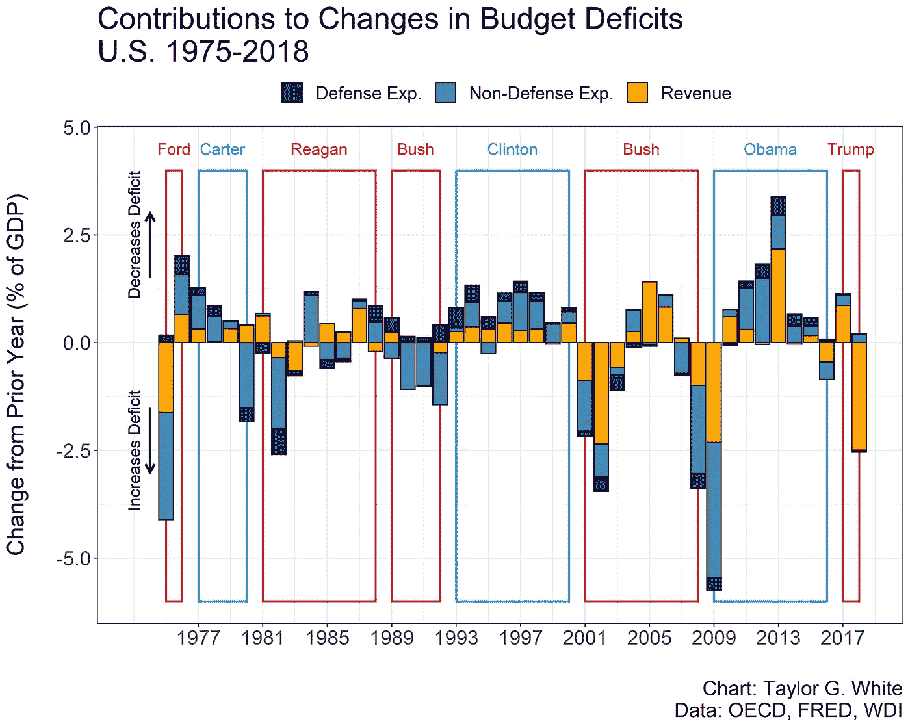
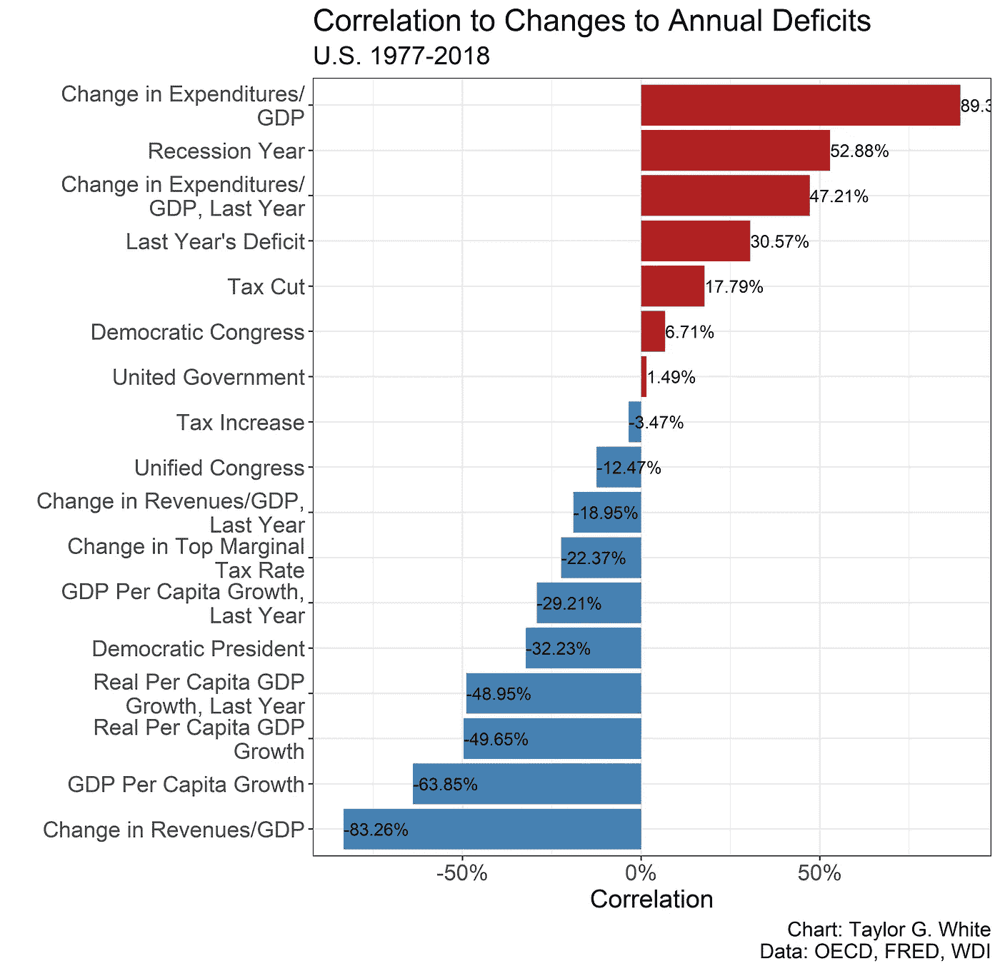
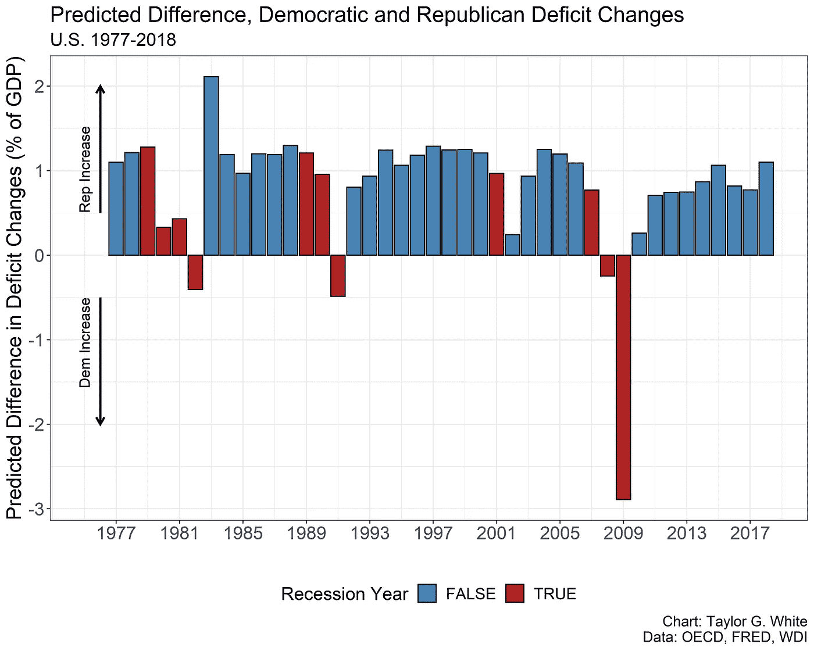

# 哪个政党增加了更多的赤字？

> 原文：<https://towardsdatascience.com/which-party-adds-more-to-deficits-a6422c6b00d7?source=collection_archive---------3----------------------->

## 提示:是共和党

## 减税本身不会带来回报

布什和特朗普政府都认为，“减税会为自己买单”，因为他们都在上任后不久通过了大幅减税。[数据](https://www.taxpolicycenter.org/sites/default/files/briefing-book/taxes_and_the_economy_1.pdf)表明这种逻辑是错误的，因为美国的税率不够高，不足以在减税时产生重大的行为变化，而且典型的减税幅度也不足以产生立竿见影的效果。减税并没有刺激经济增长从而增加收入，反而只是增加了预算赤字。

围绕税收和预算赤字的讨论往往会在每个选举季重新开启，因为共和党人甚至一些[民主党人](https://www.nbcnews.com/politics/2020-election/pete-buttigieg-calls-deficit-reduction-swiping-bernie-sanders-n1133206)担心巨额赤字和不断增长的国债。

虽然共和党人经常声称他们在财政上更负责任，但我的研究表明并非如此。与民主党总统相比，共和党执政期间每年的赤字(占 GDP 的百分比)估计会增加 0.75%至 1.2%。这一结果控制了经济条件，解释了年度赤字变化的 75%。

## 是什么导致了赤字？

当年度收入低于支出，政府被迫通过发行债务向投资者借钱时，就出现了赤字，就像你我从银行或信用卡借钱一样。国家债务是累积赤字的结果——当我们向国家信用卡收费的速度快于我们偿还本金的速度。

下图显示了每年赤字的年度变化，也就是说，与前一年相比，赤字增加或减少了多少。蓝色部分显示的是国防和非国防支出占 GDP 百分比的变化(乘以负一)，因此支出的*减少*将大于零。黄色显示的是收入占 GDP 百分比的变化。当棒线总和小于零时，这意味着赤字比前一年增加了。

这张图表显示了由于收入减少或支出增加，或者两者兼而有之，赤字发生了多大的变化。例如，在克林顿执政期间，随着支出减少和收入增加，赤字持续下降。

乔治·w·布什政府经历了两次衰退，一次是任期开始时的轻微衰退，另一次是从 2007 年末到 2009 年初的大衰退。请注意，2002 年收入的减少与 2009 年一样显著。这主要不是因为人们赚的钱少了，交的税也少了——这是一项重大的减税措施，减少了收入。类似地，[川普减税](https://en.wikipedia.org/wiki/Tax_Cuts_and_Jobs_Act_of_2017)的影响在 2018 年显而易见，因为收入下降甚至比 2008-2009 年大衰退期间还要多。

## 赤字和经济周期

上图中还有另一种模式——这是一种周期性模式，赤字连续几年增加，然后连续几年减少。这是因为在经济疲软和衰退期间，赤字往往会增加，而当经济好转时，赤字往往会减少。这是因为[自动稳定器](https://www.investopedia.com/terms/a/automaticstabilizer.asp)，当人们和企业赚钱少的时候减少他们的纳税额，当政府伸出援手的时候增加支出的政策。

经济不景气时，政府还有其他选择。例如，布什政府和奥巴马政府都通过了一揽子刺激计划，包括减税和增加支出。这两项法律都旨在通过把钱放到人们手中来刺激经济——这是一项大多数经济学家都认为是好事的反周期政策。

然而，在经济良好的时候运行赤字，正如美国目前的状况，被称为[顺周期政策](https://www.ft.com/content/73f5d578-4ac9-11e7-a3f4-c742b9791d43)，许多经济学家认为这不太理想。这似乎是共和党总统比民主党总统更典型的模式。

## 比较共和党和民主党的赤字政策

为了对民主党和共和党的赤字政策进行公平的比较，我们必须考虑每位总统在任时的经济状况。有可能一方运气不好，在经济衰退时期有更多的条款，这将使它看起来更挥霍无度。

有一些统计方法可以让人们估算出执政的政党对赤字变化的影响，同时考虑到对赤字也有影响的其他变量。这样的分析可以在[这里](https://github.com/tgwhite/Public_Policy/blob/master/Projects/Taxes%20vs.%20Deficits/(2)_analyze_US_fiscal_data.r)找到。

第一步是了解哪些变量本身与赤字有关。下图显示了这些结果的示例。红色条显示与赤字增加相关的变量(相关性越大，影响越大)，蓝色条显示与赤字减少相关的变量。

不出所料，经济增长往往会减少赤字，因为增长改善了税收征管，降低了对额外政府支出的需求。令人惊讶的是，即使在很高的水平上，民主党总统也与赤字减少有关，相关性为-32%(通常，在任何方向上 0.25 或以上的相关性被认为是社会科学中的*东西*)。与典型的最高边际税率上调相比，这对赤字的影响更大。

也就是说，重要的是要记住，当转向更复杂的多变量分析(估计许多变量对赤字的独立影响)时，出现在像这张相关图这样的单变量分析中的变量之间的关联经常会发生变化(或完全消失)。

经过十几次反复，我开发了一个统计模型，控制了经济条件，并估计了共和党在总统任期内的独立影响。最终模型包括直观的变量:去年的赤字，去年的人均 GDP 增长，今年的人均 GDP 增长，以及总统的政党。这个模型包含了可变经济增长和总统政党之间的相互作用。例如，它可以估计今年和去年增长不佳对赤字的影响，还可以估计共和党和民主党在经济景气或不景气时期应对赤字的差异。它还估计了两党预算赤字变化的总体差异。

总体而言，该模型解释了近四分之三的预算赤字年度变化。下图显示了模型预测的赤字变化与实际情况的对比。

这项分析有两个有趣的发现。首先，即使样本量相对较小，该模型也能够发现民主党和共和党总统之间相当大的、具有统计意义的差异，共和党每年增加 0.97% (p 值<0.01%) more to deficits on average *。*这种效应对于异常值也是稳健的，因为中值赤字变化的差异为 1.23% (p 值为 0.01%)。

其次，民主党总统往往比共和党总统有更积极的反周期政策。这种效应很大程度上受到这样一个事实的影响，即克林顿和奥巴马在经济形势好的时候都减少赤字，而奥巴马在经济形势不好的时候大幅增加赤字。它还受到特朗普等共和党人在经济强劲时增加赤字的影响。

使用这个模型，我们可以显示民主党和共和党政策的效果，控制经济条件。我们可以让它预测每个政党的赤字变化，保持所有经济条件不变，然后找出差异。下图显示了这些差异。大于零的值表明，鉴于当年的经济状况，预计共和党人将增加赤字，小于零的值表明，鉴于当年的经济状况，预计民主党人将增加赤字。这项分析展示了这样一种情景:如果民主党人和共和党人每年都控制总统职位，他们之间的情况会有什么不同。

总体而言，预计共和党人大多数时候会增加赤字。我的解释是，共和党人热衷于减税，但他们在削减开支方面并不成功。不过，在一些情况下，预计民主党会比共和党增加更多的赤字。红色的条柱显示那一年的部分时间正式出现了衰退。总体而言，红色柱线往往低于蓝色柱线，因为民主党人倾向于通过增加赤字来更积极地应对糟糕的经济状况。这种效应受到奥巴马反周期政策的严重影响，一般来说，由于经济衰退的严重性，这一年在分析中往往是一个异常值。从分析中去除那一年并不影响总体结论，即共和党总体上增加了更多的赤字(事实上，点估计增加了)，它只是减少了互动效应。

## 结论

最终结果很简单:共和党总统比民主党总统增加了更多的赤字。

在选举季节，人们会说很多废话，而学者们根本没有足够的时间来进行一项同行评审的研究，以便及时解决政客们的说法。该分析试图使用[透明的数据和方法](https://github.com/tgwhite/Public_Policy/tree/master/Projects/Taxes%20vs.%20Deficits)实时解决此类问题，这些数据和方法可以被其他人验证和复制。