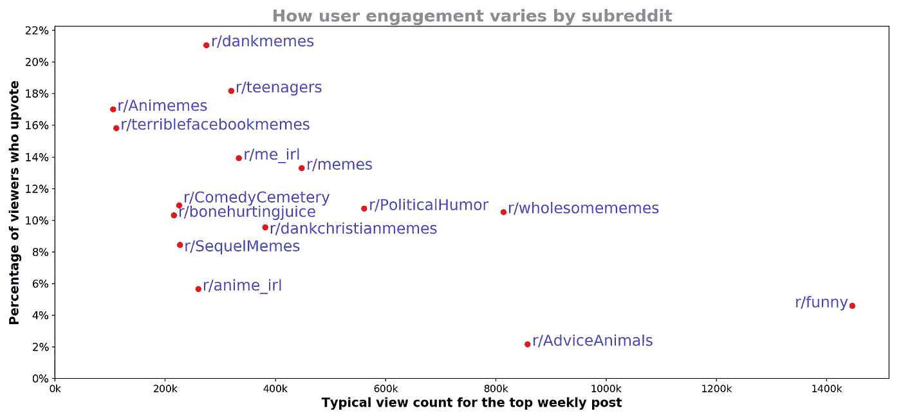
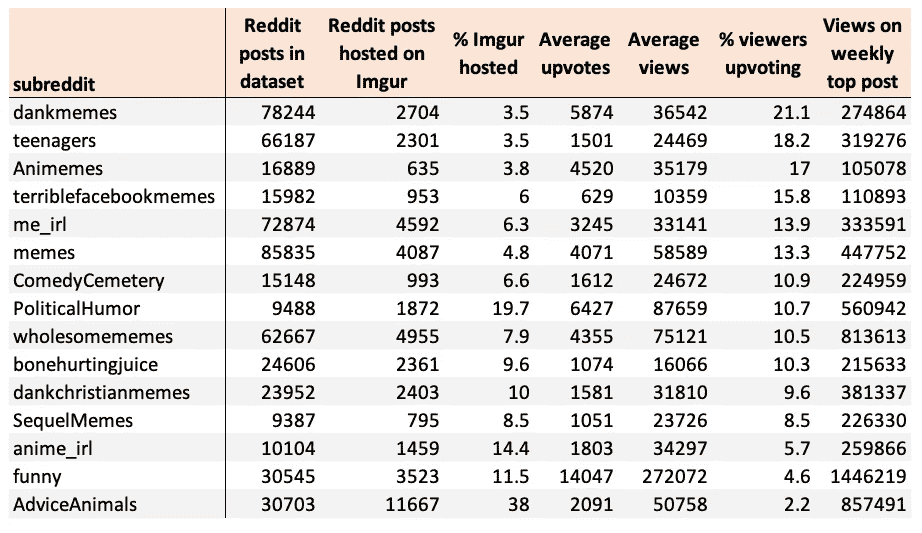
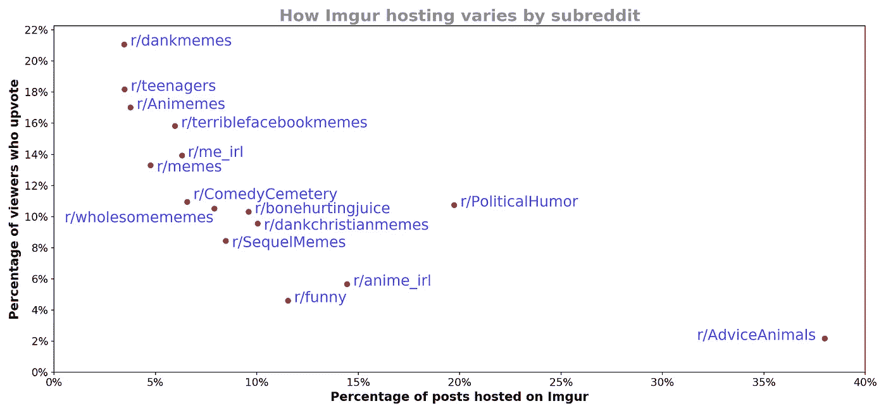

# 哪个分支得票最多？

> 原文：<https://towardsdatascience.com/which-subreddit-upvotes-the-most-18ab20567e25?source=collection_archive---------68----------------------->

## 结合 Reddit 和 Imgur Python APIs 来确定用户参与度在子编辑之间如何变化

作者图。这些值是基于 2018 年发布到 Reddit & Imgur 的约 45，000 张图片的估计值。方法和结果详述如下。

本文将解释如何通过合并两个独立的数据集来计算上述结果；一个来自[*Reddit API*](https://www.reddit.com/dev/api)*，另一个来自*[*Imgur API*](https://api.imgur.com/)*。*

大多数社交媒体平台不会公开透露每条帖子的浏览量。 [Reddit](http://reddit.com/) 也是一样的，但是有一个简单的漏洞可以让我们估计浏览量:

1.  许多 Reddit 帖子都是图片
2.  这些图片的一个子集被托管在不同的网站上 [Imgur](https://imgur.com/)
3.  Imgur 显示视图计数

使用这两个网站的 API，我们可以估计 Reddit 帖子的浏览量。

## Reddit 上的快速背景

Reddit 被分成多个社区，称为**子社区**。Reddit 的货币是**upvots**；用户给帖子的投票越多，它的排名就越高。将这些信息与我们从 Imgur 获得的浏览量进行交叉引用，可以得到每个子编辑上投票的浏览者的百分比。

## 如何使用 API 收集数据

下面的代码片段演示了如何使用[Python Reddit API Wrapper(PRAW)](https://praw.readthedocs.io/en/latest/)和 [Imgur Python API](https://github.com/Imgur/imgurpython) 来收集每个帖子的元数据。注意，要让第 6 行& 13 起作用，您需要通过在这里注册 Reddit API 的[和在这里注册 Imgur API](https://www.reddit.com/prefs/apps) 的[来获得凭证。](https://api.imgur.com/#registerapp)

使用 Reddit & Imgur APIs 的 web 抓取初学者指南

## 1 年的网页抓取结果

这是我离开一个网络搜索器(整个 2018 年)收集几十个专注于分享模因的子编辑的热门帖子数据后的发现。*(这些子编辑并没有得到我的认可，甚至没有被我查看过，我只是搜索了最流行的 meme 子编辑，并将其添加到我的 web scraper 代码中)。*

2018 年，这些子主题上的热门帖子的网络抓取结果

有趣的是，似乎倾向于更频繁使用 Imgur 的子街道也倾向于那些不经常投票的子街道:

作者图。这些值是基于 2018 年发布到 Reddit 的约 550，000 张图片的估计值。

## **警告/假设**

这些结果是基于一些主要假设的估计值:

*   我假设 Imgur 上的浏览量是查看该帖子的 Reddit 用户的数量…这并不是在所有情况下都是正确的。Reddit 用户可以发布一个链接，链接到几个月前添加到 Imgur 的一张图片，这意味着估计的% Reddit 用户投票率会比实际情况低。
*   我假设 Imgur 和 Reddit APIs 以相同的频率更新；如果不是这种情况，它将在估计中引入一个微小的误差。
*   我假设 Reddit 上的每个视图都被 Imgur 注册为视图；如果不是这种情况，它可能会引入一个重大的估计误差。

## 获取数据集和后续步骤

Imgur 上的 45，000 个 Reddit 帖子的数据集在这里:

 [## reddit 和 imgur 发布数据集

### Imgur 上托管的 Reddit 上的 meme 帖子的元数据

www.kaggle.com](https://www.kaggle.com/gmorinan/reddit-and-imgur-meme-metadata-combined) 

现在我们有了一种估计迷因浏览量的方法，我们可以将这与[迷因图像识别系统](/meme-vision-framework-e90a9a7a4187)结合起来，找到最受欢迎的迷因模板。我将在下一篇文章中更详细地讨论这个问题。