# 在新冠肺炎疫情的纽约市，哪些地铁站对通勤有风险？

> 原文：<https://towardsdatascience.com/which-subway-stations-are-risky-for-commute-in-new-york-city-amidst-the-covid-19-pandemic-a9c5e18dce39?source=collection_archive---------74----------------------->

## 冠状病毒及其对纽约市居民通勤模式的影响

***编者按:*** [*走向数据科学*](http://towardsdatascience.com/) *是一份以数据科学和机器学习研究为主的中型刊物。我们不是健康专家或流行病学家，本文的观点不应被解释为专业建议。想了解更多关于疫情冠状病毒的信息，可以点击* [*这里*](https://www.who.int/emergencies/diseases/novel-coronavirus-2019/situation-reports) *。*

我们与日常通勤有着独特的联系，无论是出租车、公交车、地铁，还是我们的私人汽车和自行车。在病毒爆发期间，我们不得不以不同方式改变常规。虽然疫情带来了一些挑战，但我们确实有一些方法来应对它！在这篇博客中，我们将深入探究纽约市目前正在发生的事情，并发现我们的日常通勤是否安全。

# 1.你在纽约的日常通勤有多安全？

超过 383，770 例冠状病毒病例和 30，244 例死亡，纽约市成为世界上冠状病毒感染最严重的城市。居住在 302 平方英里土地上的 800 多万纽约人使得公共交通在日常通勤中的作用变得非常重要。事实上，它与美国其他城市的不同之处在于其较低的个人汽车拥有率和明显较高的公共交通使用率！

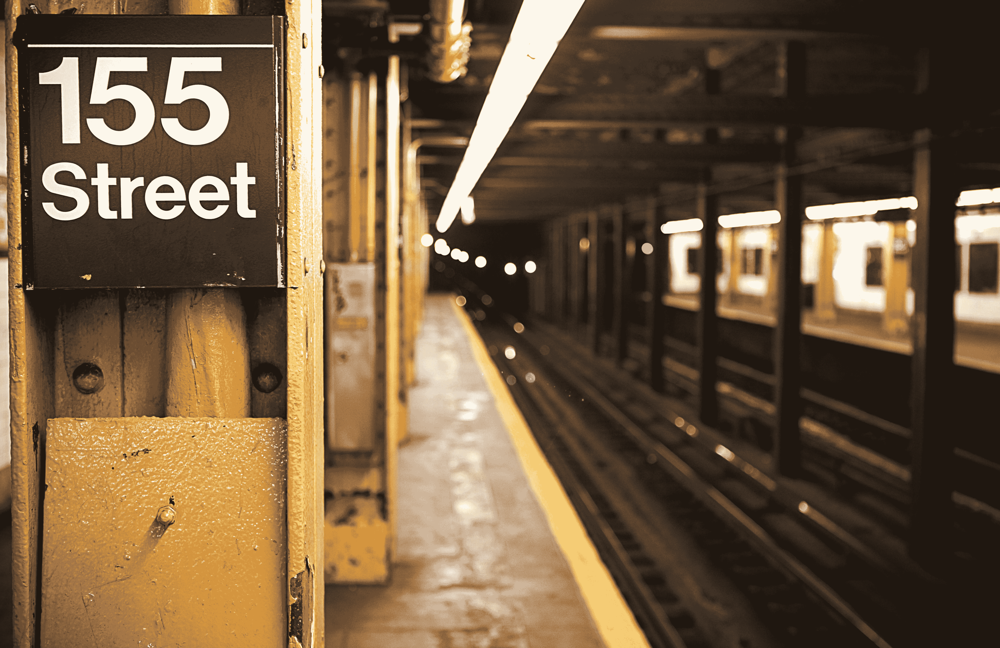

图片由 Unsplash 上的 [@renolaithienne](https://unsplash.com/@renolaithienne) 提供

纽约地铁一直是纽约人的主要交通选择。运营纽约大部分交通系统的 MTA 大都会运输署报告称，截至 2013 年，地铁客流量高达 17 亿人次！与城市公交车的 8.03 亿相比，这是一个巨大的数字。

现在来看目前的情况，由于冠状病毒，地铁使用率明显下降。但是，像医生，基本服务人员和其他人，谁仍然负担不起个人通勤和依赖地铁呢？他们面临的风险最大，但他们的选择有限。

在接下来的章节中，我们将了解如何利用数据让纽约人的日常通勤更加安全！

# 2.让数据说话

纽约市卫生部门每日公布邮编等级为 [**的 covid 病例，此处**](https://github.com/nychealth/coronavirus-data) 。让我们试着在地图上画出来，看看纽约市的病例是如何随着时间的推移而增加的。

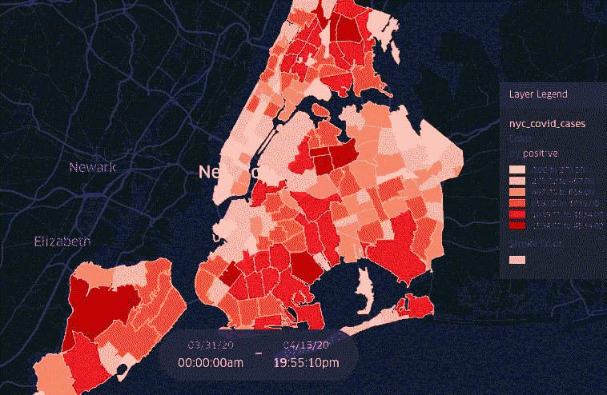

纽约市不同地区的 covid 19 例增长

以下是目前的情况:

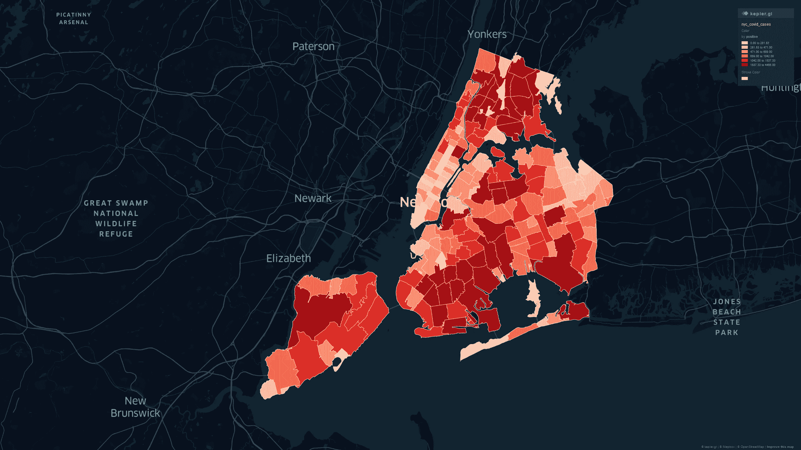

纽约市目前的 Covid 19 病例

就阳性病例总数而言，以下是 5 个受打击最严重的地区:

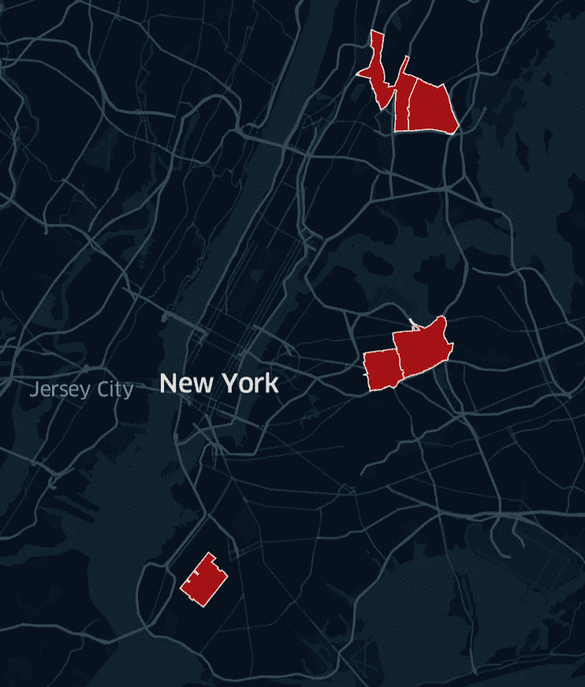

五大受灾最严重的地区。

> *电晕(相当巧合！)，有 241，940 例，似乎是目前受影响最严重的地区，其次是布朗克斯区、皇后区、布鲁克林区和东布朗克斯区。*

现在，我们如何知道纽约地铁通勤者的日常运动模式？MTA 每周提供这些数据，可以在 [**这里**](http://web.mta.info/developers/turnstile.html) 找到。这为我们提供了每个车站在 4 小时间隔内的进出总数。我们可以通过将进站和出站的人数相加得到每个车站的总人数。让我们标出一些最繁忙的车站。

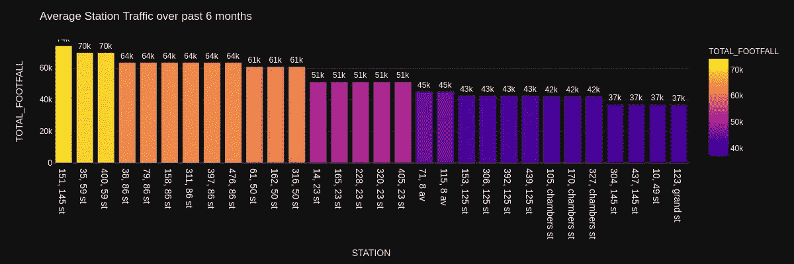

纽约最繁忙的地铁站

我们还可以通过找到平均客流量来找到前 5 个最繁忙的车站。绘制一段时间内的总客流量，我们得到这样的结果:

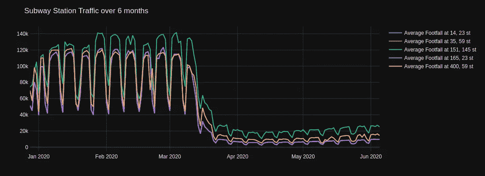

纽约五大最繁忙的车站——客流量随时间变化

平均每天约有 66k 人出行，151-145 ST 站最繁忙，其次是 59st 站和 23st 站。

但是，在 covid 爆发后，哪些车站出现了最大的每周通勤人数增长？对于这一点，让我们将数据限制在 3 月 22 日之后，因为大约在这个时候，纽约市州长要求所有非必要的企业关闭，居民留在家中。

为了实现这一点，我们首先找到每周的总客流量。在此之后，每个车站的客流量变化可以通过简单地减去第一周和最后一周的客流量而得到。

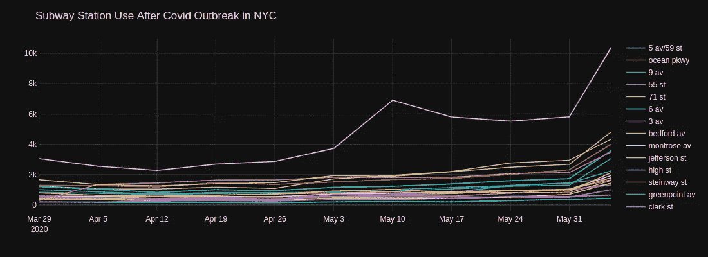

封锁后客流量增加的车站。

结果还挺有意思的！从 3 月 23 日起，在总共 240 个站点中，有 20 个站点的每周平均流量有所增加。在这些车站，大约有 1000 多人在封锁开始后出行。

> ***在这 20 个站点中，增长最快的 3 个站点是联合大道、贝德福德大道和长木大道***

你可以用这个条形图看到这 20 个车站的客流量的增加。

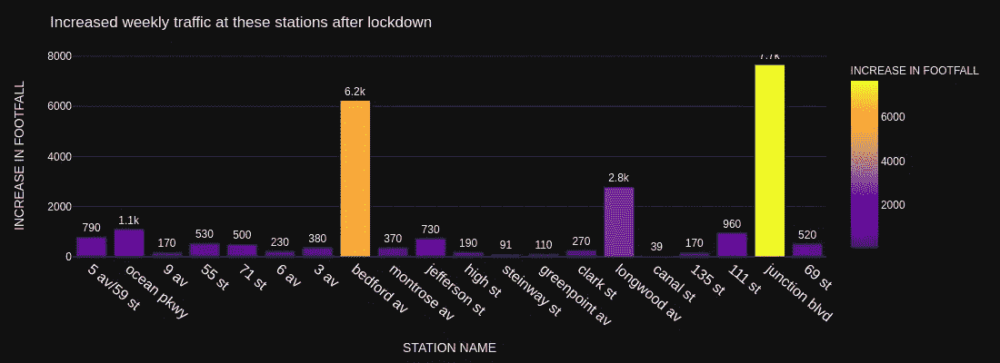

锁定后客流量增加的车站的对比图

对于大多数地铁站来说，使用这些地铁的人数有所减少，这是很自然的。现在，让我们看看如何将这与冠状病毒爆发联系起来，以找出有风险的站点。

# 3.哪些站有风险？

结合一个地区的冠状病毒病例和地铁站的总客流量，我们可以将风险因素与每个地铁站相关联。

为了简单起见，让我们考虑在一个车站的风险与它所在的邮政编码的冠状病毒阳性病例总数和在任何给定的一天在该车站的旅客总数成比例。

对于冠状病毒病例的总数，我们考虑该站位于哪个邮政编码。虽然这不是一个很好的方法来获得一个站点的这个数字，但是我们必须使用受可用数据粒度限制的 zip。你可以在我的另一个博客中找到更多关于为什么邮政编码不好的信息。

 [## 为什么您不应该使用邮政编码进行超本地和最后一英里分析

### 邮政编码和区域边界忽略了它们内部属性的细微差别！

towardsdatascience.com](/why-you-shouldnt-use-zip-codes-for-your-hyperlocal-last-mile-analysis-3b9f8613bcc1) 

因此，我们可以说一个车站的总客流量和总阳性病例数的乘积给出了相关的风险。由于这些数字在不同的标度上，我们在乘法之前将它们归一化。

因此，我们的车站风险公式看起来像这样:

*其中 NORM 是时间窗口 t 中的最小-最大标准化值*

经过一些地理空间的沉重负担，我们得到了一天的站风险。我们可以在这里看到同样的形象化:

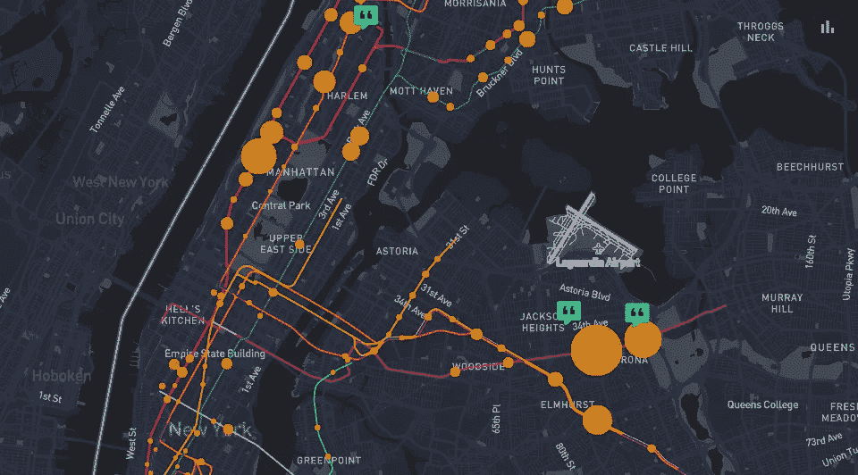

由此，我们实际上可以看到随着时间的推移，前 5 大风险站是什么。

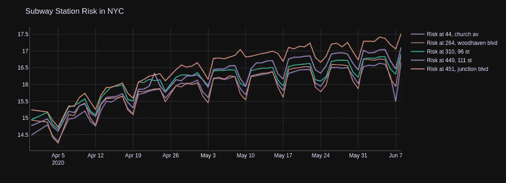

五大风险站—随时间演变

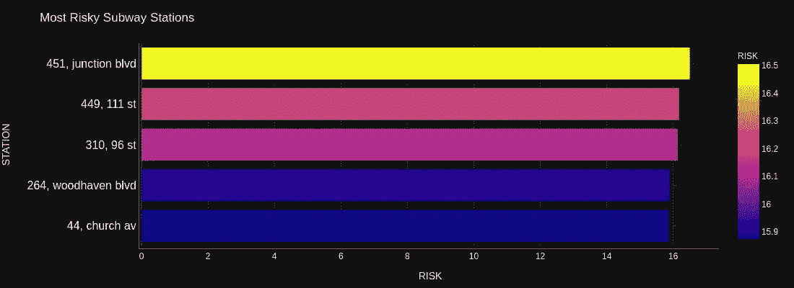

五大风险站—比较

> 如果我们考虑今天，最危险的车站是 451，联合大道和 111 街的 449。

这些站点在其邻近地区有最大的病毒爆发以及最大的流量增长，自 3 月 22 日以来流量一直在增加。

> ***你可以在这里找到上面分析的代码:*** [***笔记本***](https://colab.research.google.com/drive/1vFLzK__popWXO6Kr-SUTlP5-cBbadqB4?usp=sharing) ***。*要发现其他站的风险，看一看控制台** [**这里**](https://nyc-subway.locale.ai/analysis/public/Static-Analysis-Z3GC32D6UJYR57SDRQ5D) **。**

# 结论

理解运动模式能以惊人的不同方式帮助我们。此外，对正在发生的事情的可见性给了我们探索未知的信心。在疫情，每天的通勤模式不仅可以更好地规划基本服务，还可以更好地了解周围发生的事情。所以，让我们收集一些数据，想想在这段困难时期我们能做些什么！

*原载于 2020 年 6 月 29 日*[*https://blog . locale . ai*](https://blog.locale.ai/which-subway-stations-to-avoid-in-new-york-city-amidst-the-covid-19-pandemic/)*。*