# 哪个翻译？

> 原文：<https://towardsdatascience.com/which-translator-870bae18f3bf?source=collection_archive---------46----------------------->

## 用数据科学研究村上春树译者的风格

阿尔瓦·普拉特在 [Unsplash](https://unsplash.com/s/photos/reading-japan?utm_source=unsplash&utm_medium=referral&utm_content=creditCopyText) 上拍摄的照片

作为一个狂热的小说读者，我经常想知道译者的风格对翻译小说的影响。尤其是，我一直对村上春树的作品很好奇。他用日语写作，有三个主要的英语翻译:阿尔弗雷德·伯恩鲍姆、杰伊·鲁宾和菲利普·加布里埃尔。我读过的有多少是村上的，有多少是译者的？不同的译者对原作有不同的理解吗？鉴于日语和英语之间的语言鸿沟，这在我看来很有可能。这肯定是村上的主要译者之一杰伊·鲁宾在[《纽约客》](https://www.newyorker.com/books/page-turner/lost-in-translation)中给出的观点:

*“当你读村上春树的时候，你在读我，至少百分之九十五的时候，”*

村上的大部分作品只有一个译本，因此很难直接比较译者的风格。然而，一个例外是《发条鸟编年史》的第一章。主要翻译是杰伊·鲁宾，但它也作为短篇小说出现在《大象消失》中，这次由阿尔弗雷德·伯恩鲍姆翻译。这是两个译本。

首先是鲁宾:

> 电话铃响的时候，我正在厨房里煮着一锅意大利面，一边吹着口哨一边听着调频广播，播放罗西尼的《偷喜鹊》序曲，这一定是煮意大利面的完美音乐

然后由伯恩鲍姆:

> “那个女人打电话来的时候，我正在厨房做意大利面。再过一会儿，意大利面就做好了；我在那里，伴随着调频收音机，吹着罗西尼的《La Gazza Ladra》的前奏曲。完美的意大利面烹饪音乐。”

总体感觉是一样的，但是有一些非常明显的差异，即使是在这个简短的摘录中。译者在选词、句子结构甚至时态上做出了不同的决定。

这些差异能让机器学习模型预测村上作品样本的译者吗？如果是这样的话，这种模式的特征是否可以用来洞察译者的风格？这就是我想要知道的。本文概述了项目期间的主要步骤和决策，但代码也可以在这里找到。

# 数据准备

与许多数据科学项目一样，最初的挑战是收集和准备数据。我有许多不同数字格式(epub、pdf、docx)的村上的书，第一步是用 python 将这些不同的文件读入标准化的文本文件。epub 格式是最具挑战性的，在反复试验之后，我发现[这种方法](https://medium.com/@zazazakaria18/turn-your-ebook-to-text-with-python-in-seconds-2a1e42804913)在使用 EbookLib 和 BeautifulSoup 包时效果很好。

一旦书籍装载完毕，下一步可能就不那么典型了。对于给定的数据集，什么样的数据点通常是非常清楚的。预测房价时可能是一栋房子，预测推特情绪时可能是一条推特。对于这个项目，不太清楚使用什么。一种选择可能是将一个章节视为一个数据点。然而，对于一个只有七本书的数据集，我总共只有大约两百个章节。当对任何具有多种特征的数据集执行机器学习时，我们通常需要几千个数据点。

另一个考虑因素是样本的大小。在区分译者时，我们可能希望使用一些特征，如使用的副词数量或独特单词的范围。为了使这些类型的特征具有可比性，每个文本样本的大小应该相同。不幸的是，章节、句子和段落的长度可能会有很大差异，因此很难进行比较，而根据书籍的格式，即使是页面的长度也可能有所不同。因此，我决定将书中的文本分成长度约为 1000 个字符的文本块。实际的组块长度大小不一，因为它们在句号处被分开，以避免组块包含部分句子。然后，可以更有把握地将生成的任何计数特征归一化为 1000 个字符的文本块的等价物，从而可以使用该特征来比较文本块。

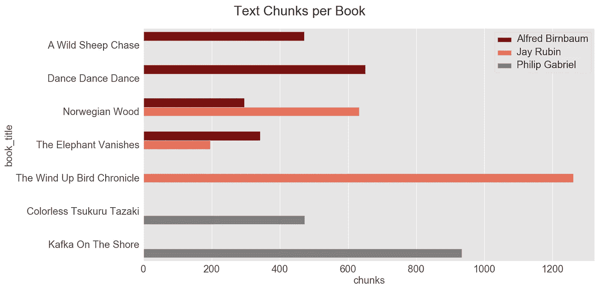

显示每本书文本量的条形图，由译者用颜色编码。请注意,《挪威的森林》的某些章节可以由两位译者翻译，而《大象消失》是一部短篇小说集，不同的故事由不同的译者翻译。

# 特征工程

设计合适的功能对项目至关重要。特色需要与翻译风格相关，而不是书籍的整体内容或主题。字符、位置或主题等特征在预测特定文本时非常有用。然而，它们很可能与潜在的故事有关，而不是在翻译过程中做出的任何决定。

我发现构建在高性能空间库之上的 [textacy](https://pypi.org/project/textacy/) 库在生成合适的特性方面非常有用。每个文本块首先被转换成空间文档，然后可以生成文本的各种基本度量。这些是像句子的数量，独特的词的数量和单音节词的数量。这些特征似乎有助于区分译者。一个译者可能喜欢更长的句子，或者另一个译者可能使用更广泛的词汇。

用 textacy 做词性分析也很简单。因此，对于文本块中的每个单词，我们可以生成一个标签——动词、代词、形容词等等。不同词性的计数似乎也有助于区分译者。

译者会对某些常用词有偏好吗？我对每位译者进行了一次单词包分析，然后列出了最常用的单词，每种情况下都标准化为该译者使用的单词总数。不出所料，像“the”和“and”这样的词非常常见。像“他”、“她”和“曾经”这样的词也经常被使用，而且译者之间的使用频率也有所不同。我把这些作为特征添加进来，因为它们看起来很普通，与一本书的主题无关，但可能与译者的风格有关。稍后我会回到这个假设！

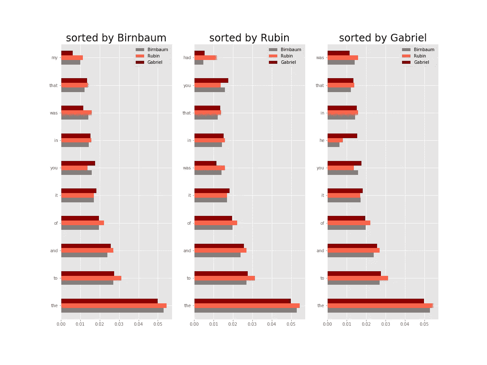

每个译者最常用的 10 个单词的相对频率。

也许一个特定的译者也可能对某些形容词或副词有偏好。我查看了每位译者最常用的副词和形容词，并再次选择了几个看起来足够通用的词，它们可能是译者的指示，而不是潜在的故事，例如像“好”或“小”这样的词。

使用情感分析来区分译者似乎有潜在的风险，因为文本的情感可能与故事本身相关联，任何译者都希望准确地翻译原文的整体情感。尽管如此，我还是使用 [VADER](https://pypi.org/project/vaderSentiment/) 软件包生成了情绪得分，该软件包给出了积极、消极和中性情绪的分值，总计为 1。

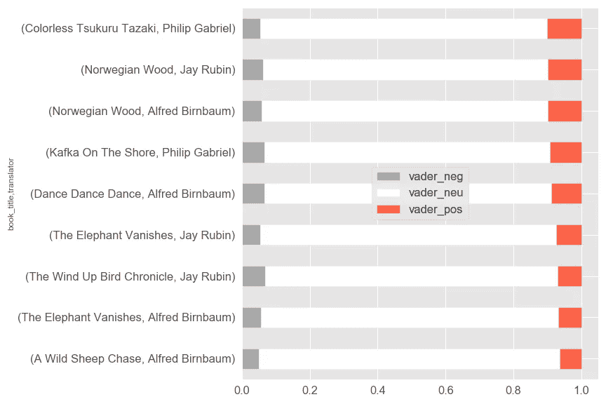

每本书/译者组合的 VADER 情绪得分堆积条形图。

在这一点上，如果给我更多的时间，我会理想地建立起我的翻译风格的领域知识，或者更好的是，与专家讨论，试图产生一些更有针对性的功能。然而，我已经有了 90 个特性，我很好奇它们是否足以构建一个工作模型。

# 特征组合建模

现在我有了一些有趣的特性，我可以尝试预测给定文本块的译者。从仅使用 textacy 基本计数的简单逻辑回归模型开始，我添加了额外的特征组，每次都重新运行建模，以了解每种类型的特征对预测准确性的影响。

用随机改组对数据集进行训练/测试分割。模型超参数进行网格搜索，交叉验证的准确性用于衡量每个模型的预测成功，以及混淆矩阵和 ROC AUC 评分。

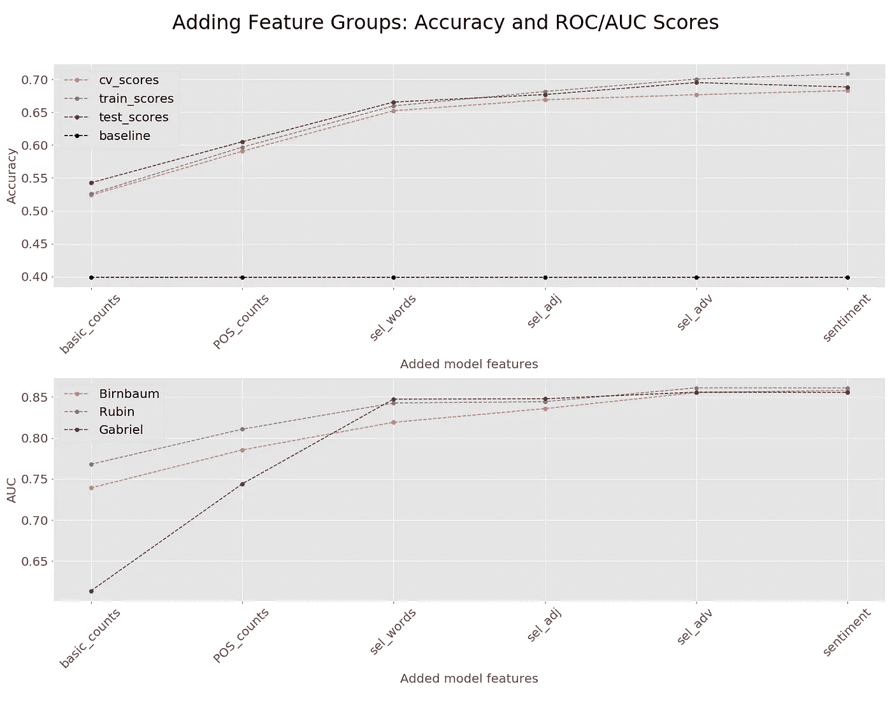

特征数量不断增加的模型的交叉验证准确性得分和 ROC AUC 值。

我惊喜地看到，即使功能有限，简单的逻辑回归模型的得分也远远高于 0.40 的基线准确度(即，比默认选择最常见的翻译器要好)。

我们可以看到，基本的文本计数和词性计数对准确性有很大的贡献。当我们看到 ROC-AUC 分数提高时，单个单词计数对预测 Philip Gabriel 翻译特别有益。一些特定副词和形容词的数量也略微提高了预测能力。另一方面，增加 VADER 情感分数并没有显著提高准确性，事实上，在测试集上产生了较低的准确性。因此，我放弃了对它们的进一步分析。

总的来说，这是一个非常积极的结果，意味着我可以继续第二个目标，从模型特征中获得译者风格的洞察力。然而，在此之前，我想尝试其他可能产生更准确预测的机器学习算法。

# 比较机器学习算法

有许多潜在的模型可以使用，一般来说，在没有测试的情况下，很难说哪种模型在给定的任务中表现更好。测试和比较了几种替代模型，从相对简单的算法(如 KNN 算法)到更复杂的集成方法和神经网络。

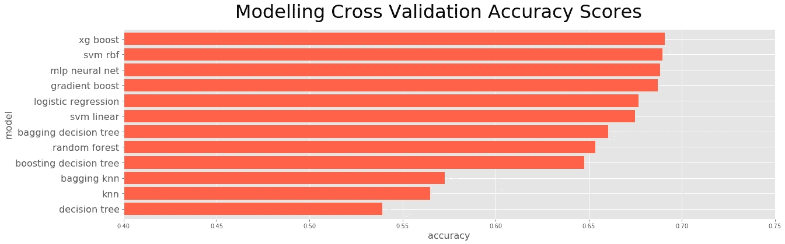

各种建模算法的交叉验证精度，每种算法都具有相同的输入特征。

从一开始，我的目标就是生成一个准确的预测模型**并且**能够解释预测是如何做出的。增压，SVM 和多层感知器神经网络都产生了比逻辑回归更高的预测精度。然而，它们通常不太容易解释。因此，使用逻辑回归模型继续进行进一步的分析和解释。

# 调查最有信心的预测

也许这个项目最具启发性的阶段是审查每个译者最有把握预测的文本块以及模型特征。由此我可以开始对译者风格的差异有所了解。

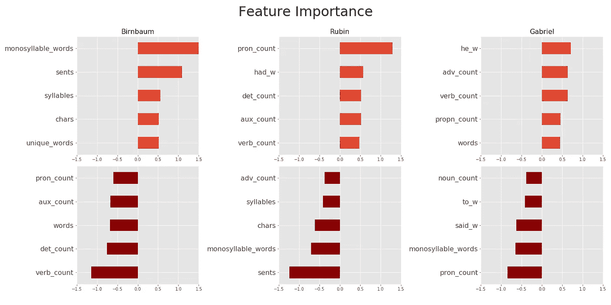

使用逻辑回归模型的每个译者的功能重要性条形图。

上图显示了逻辑回归模型中预测每个译者优于其他译者的最重要的特征。具有浅红色的正面特征和深红色的负面特征。由此我们可以说，一般来说，翻译风格有以下特点:

Birnbaum :单音节词多|句子短|动词少

**鲁宾**:更长的句子|更多的代词|更多地使用‘had’这个词

更少的代词|更多的动词|更多地使用“他”这个词

下图有助于总结每个译者最有把握预测的文本块的一些关键特征的值。

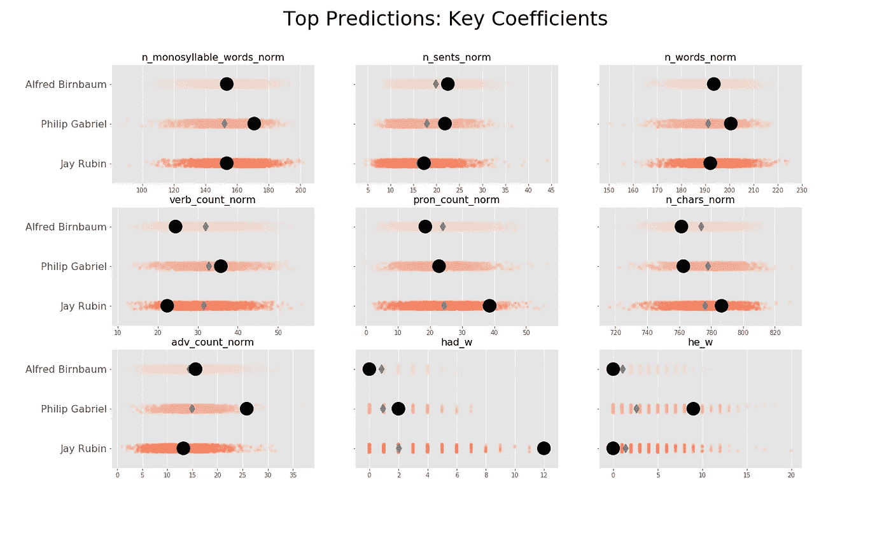

由黑点指示的每个翻译者的预测文本样本的分析。红色条带显示了每个翻译人员的这些功能的趋势。

我为每个译者选择了最有把握的预测(通常概率> 95%)，以观察这些文本块的实际特征如何比较。在图中，我们可以看到一些关键预测值的完整分布为红色条带。灰色菱形表示给定翻译者的意思。黑点显示了每种情况下最有把握预测的块的值。有趣的是，我们可以看到单词“had”是 Jay Rubin 的强预测词，而单词“he”是 Philip Gabriel 的强预测词。

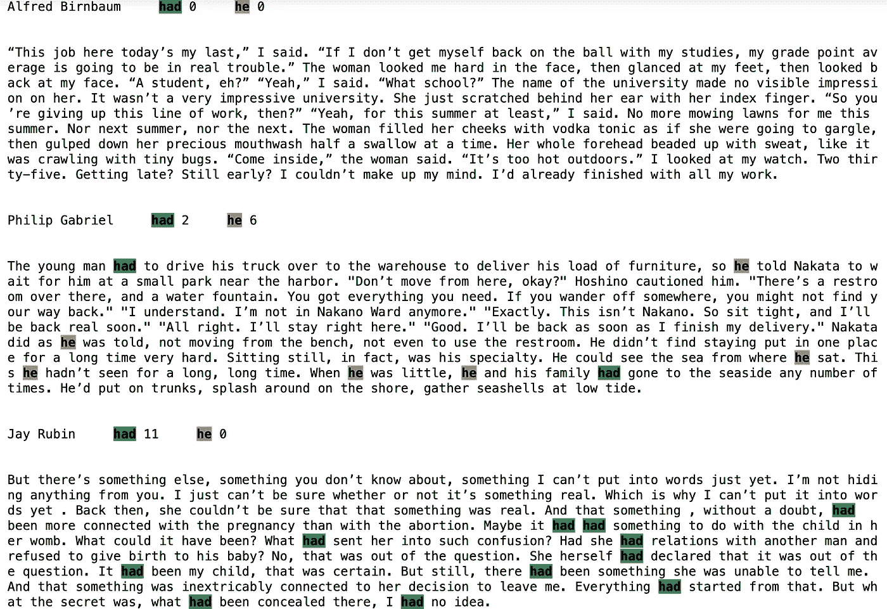

突出显示单词“had”和“he”的每个译者的最佳预测文本样本。

通过在上面的强预测样本中突出显示这些单词，我们可以看到加布里埃尔文本是以第三人称写的，而伯恩鲍姆和鲁宾都是以第一人称写的。鲁宾的文本主要是过去完成时，而其他两个主要是简单的过去时。这两种差异似乎更可能与原文有关，而不是译者的任何决定。

# 删除特征后重新建模

更深入地研究文本，我们发现加布里埃尔翻译的小说《海边的卡夫卡》是用第三人称写的，而村上的许多其他小说都是用第一人称写的。因此，该模型更有可能使用“他”这个词的频率来预测小说，而不是译者的风格选择。鲁宾翻译的《发条鸟编年史》(The Wind-Up Bird Chronicle)也是如此，该书包含大量过去完成时的文本，因此，模型很可能再次使用单词“had”的频率来预测小说，而不是译者的风格。

因此，在没有与单词“had”和“he”的频率相关的特征的情况下，重新运行逻辑回归模型。

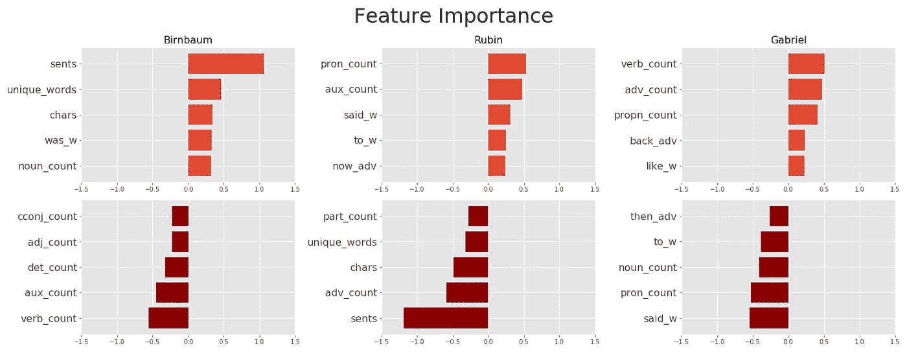

使用逻辑回归模型的每个译者的功能重要性条形图。这次去掉了“有”和“他”的特征。

通过这个调整后的模型，我们可以更好地描述翻译风格:

Birnbaum :更短的句子|更少的动词|更多独特的单词

**鲁宾**:更长的句子|更多的代词|更少的副词

**加百列**:少用单词‘表示’|少用代词|多用动词

与故事本身相关的特征的这个问题部分是由于最初的随机训练/测试分裂而出现的，该分裂在测试模型时采用每本书的一些部分来训练模型，并且采用来自同一本书的其他部分。我们可以通过把完整的书放在一边作为测试集，并在剩余的书上进行训练来避免这个问题。

# 用新的训练/测试分割重新建模

因此，作为对建模方法的最终确认，我使用非随机训练/测试分割重新运行了逻辑回归建模(仍然删除了“had”和“he”计数特征)。

我有《挪威的森林》的几章和《发条鸟编年史》的一章，这本书被翻译了两次，一次是杰伊·鲁宾，另一次是阿尔弗雷德·伯恩鲍姆。这提供了一个很好的控制测试集，因为原始的日语文本是相同的，唯一的区别是翻译。

这个测试运行了两个版本。首先，在训练集中使用所有三个译者的剩余书籍，但是在测试集中仅使用上面概述的来自伯恩鲍姆和鲁宾的文本。

这次的基线精度是 0.50。在这种情况下，交叉验证的准确性不太相关，重点是测试集准确性得分 0.55。幸运的是，该模型仍然能够击败基线(尽管差距较小)，并证实了使用可用特征预测译者是可能的。下面显示的区别特征包括 Gabriel，即使他不在测试集中，因为他包括在训练集中:

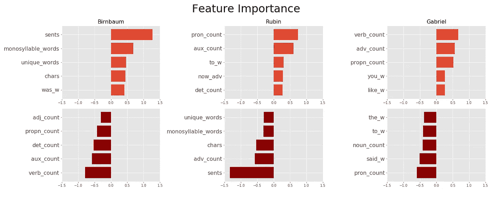

使用逻辑回归模型和新的训练/测试分割的每个翻译者的特征重要性条形图

现在我们有:

Birnbaum :更短的句子|更少的动词|更多独特的单词

鲁宾:较长的句子|较多的代词|较少的副词

**加布里埃尔**:少用单词‘表示’|少用代词|多用动词

由于测试集只有两个翻译人员，Birnbaum 和 Rubin，我运行了第二个版本，在训练集中也只有这两个翻译人员。由于不再有假阳性 Gabriel 预测，测试准确度在 0.67 处显著提高。

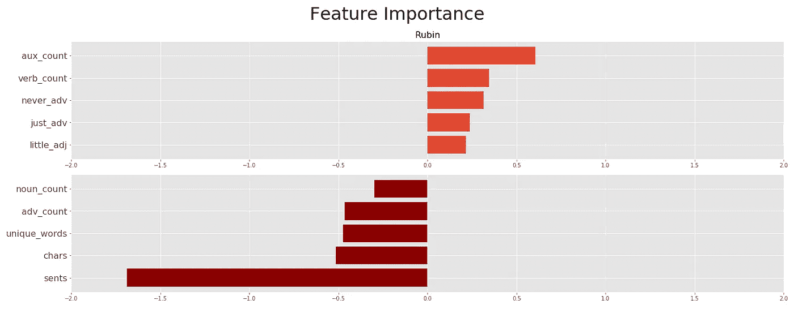

使用逻辑回归模型的每个翻译者的特征重要性的条形图，以及仅使用 2 个翻译者的新的训练/测试分割。

因为只有 2 个目标类别，所以模型中只有一个功能集，如上所示，那些预测 Rubin 而不是 Birnbaum 的:

**如宾**:较长的句子|较多的助词|较少的字|较少的独字

# 我们发现了什么？

首先，通过随机训练/测试分割，所有测试的模型都能够预测测试数据集的翻译者，其准确度远高于基线分数(即，优于默认选择最常见的翻译者)。然而，可能很难知道模型是在预测一本书还是它的译者。

这引出了一个重要的教训，在这种情况下，随机的训练/测试分割不是最好的方法。通过查看模型对每个类别的最有信心的预测以及模型中功能的重要性，很明显，一些功能可能会预测一本书，而不是它的译者。通过使用一个只包含相同原文重复翻译的测试集，我可以确定模型的预测只基于译者的选择。幸运的是，以这种方式生成的模型仍然能够做得很好，特别是当它只在测试集中由两位译者翻译的其他文本上进行训练时。

那么翻译风格的实际差异呢？从这个最终模型中，我们可以说鲁宾倾向于使用比伯恩鲍姆更长的句子，以及更多的助词和更少的独特词。要确定 Gabriel 的翻译与众不同还有点困难，但从早期的随机训练/测试分裂训练模型来看，他似乎比其他人使用更多的动词和副词，更少的代词。

这个项目仅仅触及了这种分析的可能性。当然可以生成更多定制的功能，甚至可以利用原始的日语文本来帮助开发基线信息，以便与译文进行比较。

我当然喜欢第一次看这个话题，我希望你也觉得有趣！使用的所有代码都可以在 [GitHub](https://github.com/steven-mcdonald/murakami_translators) 上获得。如果您有任何意见或建议，请随时联系我们。