# 谁是数据科学家？

> 原文：<https://towardsdatascience.com/who-are-data-scientists-c5a4f09fdb4c?source=collection_archive---------42----------------------->

## 使用 Stackoverflow 调查了解数据科学

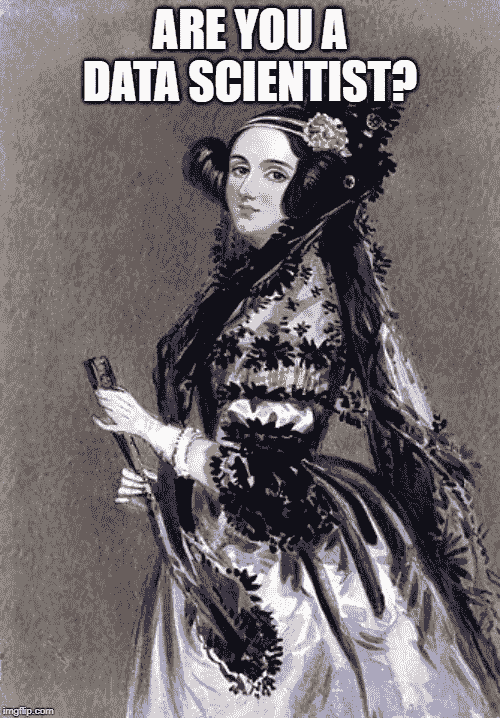

阿达·洛芙莱斯跟随 CRISP-DM [ [公共领域](https://en.wikipedia.org/wiki/File:Ada_Lovelace_portrait.jpg)

# 介绍

作为一个希望在我的工作中引入更多数据科学的人，我觉得观察那些已经在这个领域中的人的特征会很有趣——看看这些特征是否与其他开发人员不同。

Stackoverflow 用户调查是获取包括数据科学家在内的各种开发人员详细信息的绝佳资源。我的分析基于 2019 年的调查结果，共有 88，883 份回复。

# 谁是典型的程序员？

我想看看谁是典型的程序员。它们的属性是什么？我们能以任何方式概括它们吗？更进一步，我们能不能确定一个典型的数据科学家。

首先，我查看了最常见的问题和答案。对于一个问题，最常见的回答是“是”或者“你把编程作为一种爱好吗？”。大约 80%的受访者这样回答。

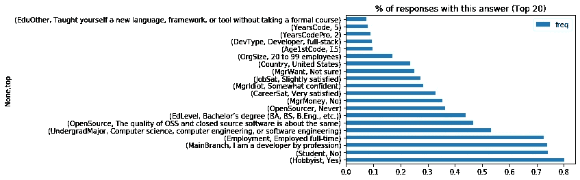

[图片由作者提供]

并不是所有的问题都可以进行如此简单的分析，因为许多问题允许多重答案。例如，给了回答者一长串可供选择的编程语言，外加一个输入其他语言的框。一旦我删除了这些信息，我发现 JavaScript 成了最流行的语言(几乎有 60，000 个用户)。

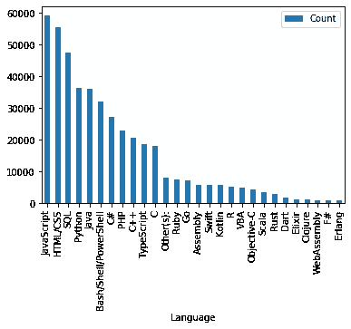

[图片由作者提供]

虽然这些单个响应的统计数据很有趣，但我觉得定义典型编码者的最佳方式是查看所有响应，并找到所有答案的最常见组合。

需要注意的是，虽然大多数答案是分类值或分组值，但有四个问题允许连续的数值。为了处理这些，我为四个四分位数创建了存储桶(即每个存储桶覆盖 25%的值范围)。

很明显，这种方法将反应分成许多非常小的片段。我发现，根据这个定义，最常见的一组答案只出现了 15 次……而这 15 个人只回答了 4 个问题。

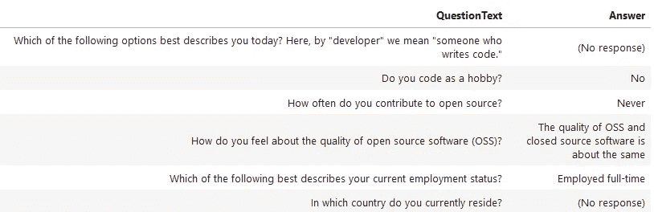

典型的编码员回应—其他未显示的回答全部“(无回应)”[图片由作者提供]

也许到目前为止我们所能说的就是开发人员是独特的个体，并不都是一样的！

使用相同的方法，但只关注数据科学家，没有明确的“赢家”出现，因为所有答案的组合只出现一次。数据科学家更是独一无二！:-)

# 是什么让数据科学家脱颖而出？

不再只看典型的反应。接下来，我想看看我们是否能确定一些明显使数据科学家不同于其他开发人员的属性。我们能根据这些属性预测哪些开发人员是数据科学家吗？

我想把这个建模成机器学习分类。首先，我需要一个目标变量来训练我们的模型。“DevType”问题似乎是这个问题的关键，但是首先我们需要从这个多答案字段中提取不同的角色。“数据科学家或机器学习工程师”是最准确描述我们目标群体的价值观。通过这种方法，我们可以说 6，460 名受访者是数据科学家。

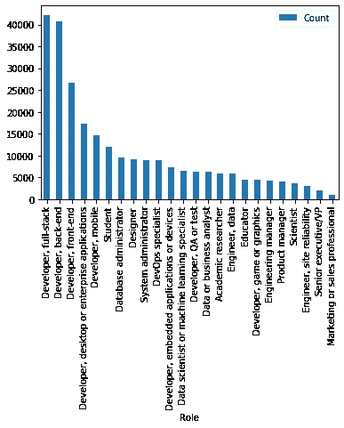

[图片由作者提供]

下一步是准备数据，包括:

*   删除对预测没有帮助的无关字段
*   将分类值转换为数值
*   删除缺少值的行
*   缩放特征，以便它们在我们的模型中具有相同的权重

之后，是时候训练和测试我的模型了。我选取了三种分类算法进行评估:朴素贝叶斯、Ada Boost 和梯度 Boost。当我比较这三种算法的结果时，有一些有趣的结果:

*   朴素贝叶斯通常表现不佳，除了在消除假阴性(召回)方面——不到 2%的数据科学家没有正确分类
*   Ada 增强和梯度增强彼此表现相似；两者都有 93%的准确率，同时在消除假阳性(精确度)方面做得一般，在消除假阴性(召回)方面做得很差

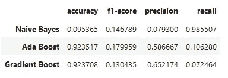

[图片由作者提供]

总的来说，我觉得 Ada Boost 算法给出了最令人鼓舞的结果。整体的准确性很好，并且它在精确度和召回率上达到了最小最差的平衡(由 f1 分数表示)，但是这个模型当然还有很大的改进空间！

# 数据科学具有包容性吗？

我的最后一个问题是，数据科学是否是一个包容性的领域？或者更确切地说，它是否比其他编码学科在 it 从业者中表现出更大的多样性。少数群体在数据科学中有更好的代表性吗？

我决定关注多样性的三个主要表现——种族、性和性别——并排除任何没有回答这些问题的回答。我们可以很快看到，编码总体上是由白人异性恋男性主导的…

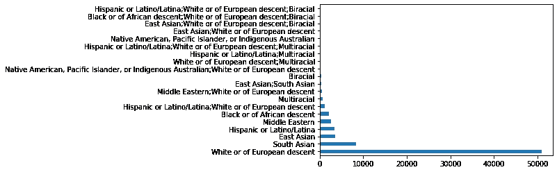

按种族划分的开发者数量[图片由作者提供]

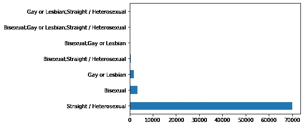

按性别统计的开发人员数量[图片按作者]

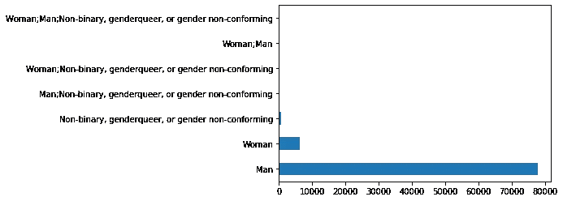

按性别统计的开发者人数[图片由作者提供]

与前面的问题一样，我们使用“数据科学家或机器学习专家”的角色来划分我们的数据。创建了多样性小组来记录性别、性和种族的各种组合。多样性分数也是通过计算一个人不属于优势群体的三个维度的总数来计算的。

观察多元化团队的分布，我们可以看到数据科学家团队中有 218 个团队，而其他开发人员团队中有 550 个团队。当您考虑到数据科学家群体要小得多时，平均而言，这意味着两位数据科学家来自不同多元化群体的可能性超过四倍(24 比 109)。

现在看看多样性得分，我们发现得分每增加一分，数据科学家的比例就会增加。例如，44%的数据科学家不是白人异性恋男性，而其他所有开发人员中只有 40%不是

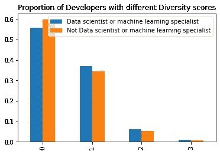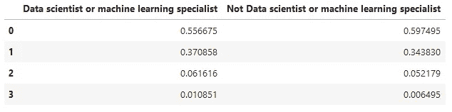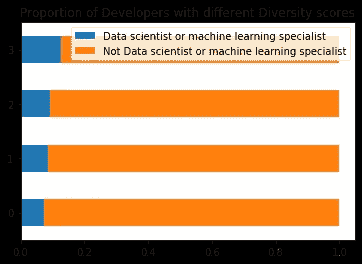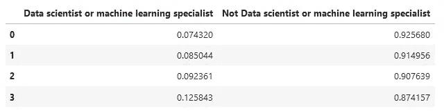

[图片由作者提供]

# 结论

1.  编码者实际上并不完全相同。没有一组答案经常出现。事实上，如果我们只看数据科学家，我们会发现没有一组答案会出现超过一次！
2.  数据科学家和其他开发人员没有什么不同。或者至少还不足以让我们根据他们的其他回答，自信地预测哪些开发人员是数据科学家(目前还没有！)
3.  数据科学比其他开发角色更加多样化。不是很多，但有一个可测量的差异。

完整的代码和分析可以在这里找到[https://github.com/deacona/stackoverflow2019](https://github.com/deacona/stackoverflow2019)

感谢阅读！